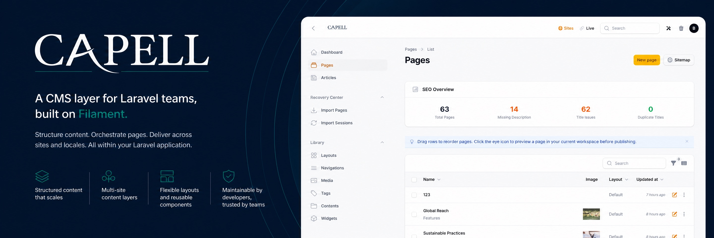
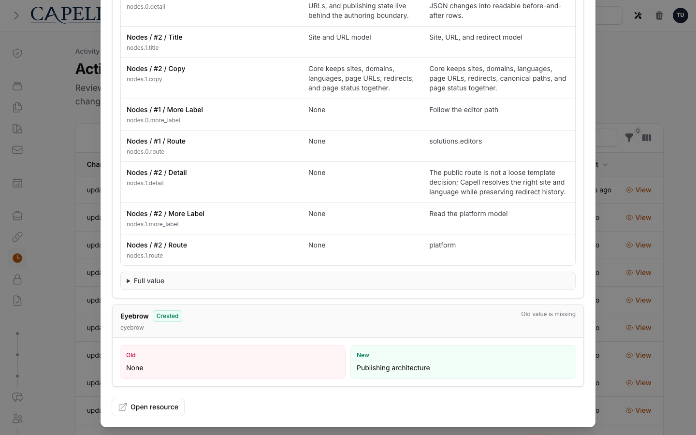
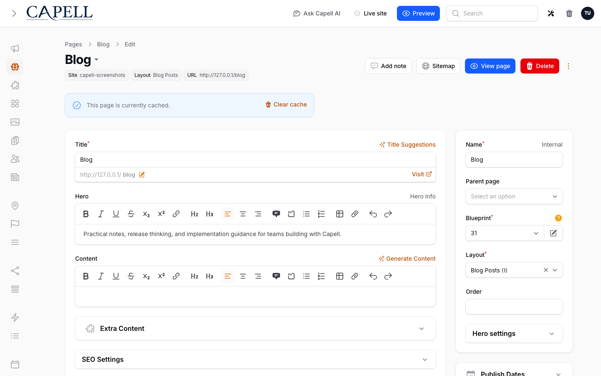

# Capell CMS



[](https://github.com/capell-app/capell/tags)
[](https://github.com/capell-app/capell/actions/workflows/test-full.yml)
[](https://github.com/capell-app/capell/actions/workflows/code-quality-and-styling.yml)
[](https://app.codecov.io/gh/capell-app/capell)
<br>
[](https://github.com/capell-app/capell/actions/workflows/code-quality-and-styling.yml)
[](https://github.com/capell-app/capell/actions/workflows/code-quality-and-styling.yml)
[](https://github.com/capell-app/capell/actions/workflows/code-quality-and-styling.yml)
[](https://www.php.net/releases/8.4/en.php)
[](#requirements)
[](https://docs.capell.app)

**Capell is a Laravel CMS built on Filament for teams whose application needs more than a few editable pages.** It gives editors a structured page workspace while developers keep the public frontend, deployment, and application architecture inside Laravel.

Choose Capell when repeated page types, layouts, URLs, publishing rules, and editor workflows should be defined once and improved in one place. Choose WordPress, Statamic, Craft, or a dedicated headless CMS when its ecosystem, file model, hosted workflow, or delivery API is the better fit. Capell is not a hosted CMS and does not ship a public content-delivery API.

[Try the guided demo](https://capell.app/demo) · [Follow the verified quickstart](docs/getting-started/quickstart.md) · [Build a page](docs/getting-started/building-pages.md) · [Read the fit guide](docs/getting-started/why-capell.md)

## Why teams choose Capell

| Outcome                          | What ships                                                                                                 | Important boundary                                                            |
| -------------------------------- | ---------------------------------------------------------------------------------------------------------- | ----------------------------------------------------------------------------- |
| Recover page content confidently | Append-only page revision history, readable diffs, rollback preview, validated roll back, and roll forward | Standard recovery is page-scoped; it is not a database or media backup        |
| Upgrade visibly                  | Dry-run planning, recorded upgrade steps, diagnostics, and step rollback where the step declares it safe   | Infrastructure and database rollback still belong to the deployed application |
| Keep the frontend yours          | Laravel routing and render integration for Blade, Livewire, Inertia, Vue, or a custom stack                | Capell renders through the Laravel application; there is no delivery API      |
| Extend without patching Core     | Composer packages, manifests, registries, health checks, install and uninstall lifecycles                  | Package maturity and removal impact must be reviewed before adoption          |



The standard Admin history surface records page changes and supports page-only recovery. The optional Publishing Studio package adds broader editorial workspaces, assignments, approvals, and release workflows; those are not presented as foundation features.

## See the product before installing

The [guided demo](https://capell.app/demo) explains its reset and read-only boundaries before sending you to the shared environment. For a source-level evaluation, these current captures show the foundation workflow:

| Organise and publish pages                                                                | Edit structured page content                                                                                           |
| ----------------------------------------------------------------------------------------- | ---------------------------------------------------------------------------------------------------------------------- |
|  |  |

Continue with [Create your first page](docs/getting-started/create-your-first-page.md) for the full field-by-field journey.

## Verified quickstart

Start from a fresh supported Laravel application. The installer adds the selected foundation packages, runs each package lifecycle, creates the first site and administrator, generates frontend assets, synchronises permissions, and finishes only when its required health summary passes.

```bash
composer create-project laravel/laravel capell-site
cd capell-site

# Configure APP_URL and a supported database in .env first.
composer require capell-app/installer
php artisan capell:install --demo
```

The guided command asks for the site URL and first administrator. A successful run ends with `All checks passed` followed by `Installation complete`. If a required step fails, the command exits non-zero and does not print the success message.

Then run the application using your normal Laravel development workflow and open:

- `/admin` to sign in with the administrator created during installation;
- `/` to inspect the seeded public page;
- **Pages** in Admin to make and publish the first change.

Do not run `filament:install --panels` before requiring Capell: the installer brings in and configures the selected Admin package. See the [Quickstart](docs/getting-started/quickstart.md) for SQLite and queue setup, expected prompts, health checks, and first-run recovery.

## Theme it

Installed themes use one Admin path: **Theme Library → Customize → Preview → Apply**. Preview a change against real content before making it active, and keep theme presentation in the Laravel application rather than in page records.

Read [Theme Library](docs/admin/theme-library.md) to operate installed themes or [Creating custom themes](docs/packages/creating-custom-themes.md) to own the Blade, assets, settings, and compatibility contract yourself. Marketplace themes are only installable when their listing states a released distribution path and compatible Capell line.

## Extend it deliberately

The public foundation is split into five packages:

Foundation packages install from public Packagist repositories. Paid marketplace packages require authenticated Composer access and an active entitlement.

| Package     | Composer name            | Responsibility                                                                                                                             |
| ----------- | ------------------------ | ------------------------------------------------------------------------------------------------------------------------------------------ |
| Core        | `capell-app/core`        | Sites, languages, pages, URLs, layouts, themes, media, translations, settings, revision history, upgrade foundations, and registries       |
| Admin       | `capell-app/admin`       | Filament resources, editor workflows, page recovery UI, settings, users, diagnostics, and admin extension points                           |
| Frontend    | `capell-app/frontend`    | Public routing, site context, themes, [typed resources](packages/frontend/docs/frontend-resources.md), render hooks, and response delivery |
| Installer   | `capell-app/installer`   | Guided browser and CLI installation, health review, and installer cleanup                                                                  |
| Marketplace | `capell-app/marketplace` | Extension discovery, install authorisation, and package acquisition contracts                                                              |

Optional features arrive as Laravel packages. Before installing one, verify its distribution channel, maturity, supported Capell/Laravel/Filament versions, data access, migrations, support terms, and removal path. The [package catalogue](docs/packages/catalog.md) distinguishes foundation contracts from optional package documentation; a source-only or Labs entry is not a promise that a public Composer package is available.

Package authors should start with the [extension-point chooser](docs/packages/extension-point-chooser.md) and [package authoring guide](docs/packages/README.md). Capell packages extend registries and lifecycle contracts instead of patching host classes.

## Operate it

Preview upgrades before applying them:

```bash
php artisan capell:upgrade --dry-run
php artisan capell:upgrade
php artisan capell:doctor
```

Rollback is available only for recorded upgrade steps that implement a safe rollback:

```bash
php artisan capell:rollback --step=<step-id> --dry-run
php artisan capell:rollback --step=<step-id> --force
```

Backups are a separate operational contract. Configure database and media backups, offsite retention, monitoring, and scratch restores in the host application; then use Capell's backup health and restore tooling to verify that configuration. Page history does not recover a lost database or media store.

Read these before production:

- [Upgrading and rollback](docs/operations/upgrading.md)
- [Database and media backups](docs/operations/backups.md)
- [Site health](docs/operations/site-health.md)
- [Lockdown and break-glass access](docs/operations/lockdown.md)
- [Export and exit](docs/operations/export-and-exit.md)

## Requirements

| Tool     | Supported versions                                                  |
| -------- | ------------------------------------------------------------------- |
| PHP      | 8.4+                                                                |
| Laravel  | 12.41.1+ in the 12.x line or Laravel 13.x                           |
| Filament | 5.6.8+ (`~5.6.8`)                                                   |
| Database | MySQL 8+, MariaDB 10.3+, SQLite, or the configured Laravel database |
| Node.js  | 20+                                                                 |
| Composer | 2.7+                                                                |
| Runtime  | PHP-FPM or Laravel Octane (Swoole, RoadRunner, or FrankenPHP)       |

Required PHP extensions and writable paths are listed in the [Install guide](docs/getting-started/install.md). The shipped product line is 1.x; use the latest compatible tag rather than a branch name in customer applications.

For the shipped 1.x line, each minor receives security fixes for 24 months from its release date, and the latest 1.x minor is always supported. See the [security policy](SECURITY.md) and [Core support policy](packages/core/README.md#requirements-and-support-policy) for the exact contract.

## Pricing, support, security, and licence

- [Current pricing and commercial availability](https://capell.app/pricing)
- [Support boundaries](https://capell.app/support)
- [Security policy](SECURITY.md)
- [Capell licence](LICENSE.md)

Commercial facts live on the Capell website so this README does not preserve stale prices, package counts, discounts, or checkout claims. Public source and Packagist availability do not change the Capell licence.

Capell is commercial software (`"license": "proprietary"`) with public foundation source and Composer distribution. Public visibility does not change the Capell licence. See [LICENSE.md](LICENSE.md) for the full terms.

## Contributing to this repository

This source monorepo contains the five foundation packages and their release-contract tests. It is not the package name installed into customer applications.

```bash
composer test
composer lint
composer analyze
composer preflight
```

See [CONTRIBUTING.md](CONTRIBUTING.md) for repository setup, Docker harness use, path repositories, release checks, and pull-request expectations.
