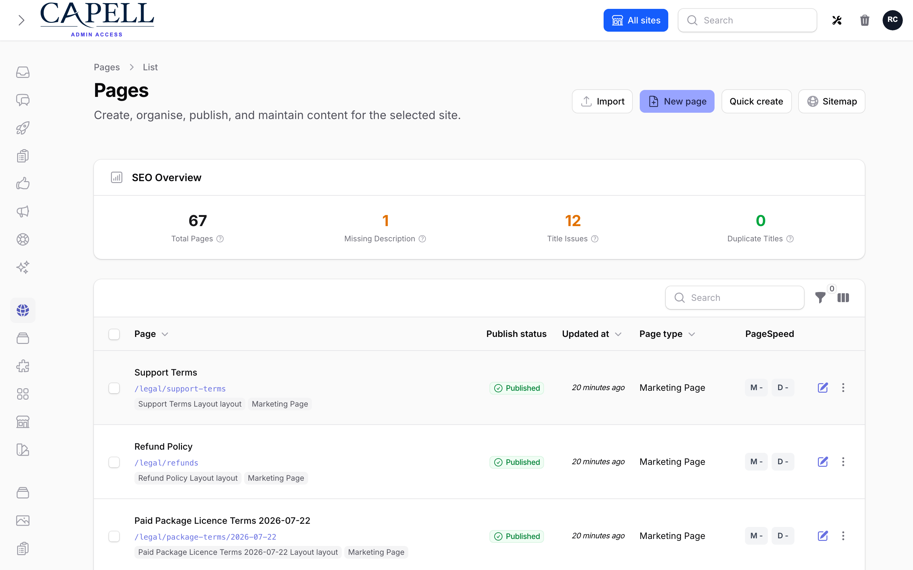
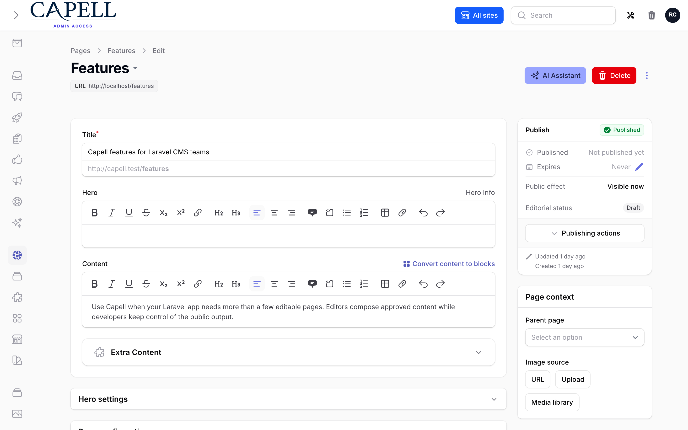
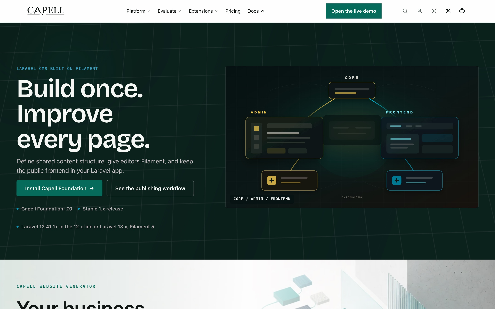

# Capell CMS


[](https://github.com/capell-app/capell/tags)
[](https://github.com/capell-app/capell/actions/workflows/test-full.yml)
[](https://app.codecov.io/gh/capell-app/capell)
[](https://www.php.net/releases/8.4/en.php)
[](#requirements)

**The first editable page is easy. Capell solves what comes next.**

Capell is an open-source CMS for Laravel, built on Filament. A Page model and
Filament resource are quick; the long-term work is reusable page blueprints,
preview through the real theme, URL history, revision comparison, validated
recovery and repeatable upgrades.

Capell Foundation turns that recurring work into one maintained,
MIT-licensed contract. Editors preview, publish and recover pages in Filament;
the Laravel application renders them with Blade, Livewire, Inertia, Vue.js or
its own stack.

Install it into an existing Laravel application with two commands:

```bash
composer require capell-app/installer
php artisan capell:install
```

[Open the guided demo](https://capell.app/demo) · [Decide if Capell fits](docs/getting-started/why-capell.md) · [Follow the verified quickstart](docs/getting-started/quickstart.md)

Capell is not a hosted CMS and does not ship a public content-delivery API. Your pages render inside your Laravel application through Blade, Livewire, Inertia, Vue, or your own stack.

## From the first screen to a maintained CMS

Custom Filament resources are a good fit for a few stable records. Capell earns
its place when Pages, URLs, previews, history, upgrades and extensions need one
maintained contract.

| Recurring CMS work | Custom Laravel and Filament build | With Capell Foundation |
| --- | --- | --- |
| Page families | Design fields, forms, URLs, redirects and templates again for every new family. | Define one blueprint and URL contract, then let the application render every page of that type. |
| Preview | Build and maintain a second rendering path that can drift from the public site. | Preview unsaved content through the application's real theme and templates. |
| Recovery | Decide how revisions, comparison, conflicts and restore should work after an editor needs them. | Compare any saved Page version, validate the target, then roll backward or forward without erasing history. |
| Upgrades | Maintain project-specific migration notes, health checks and recovery steps. | Run repeatable install and upgrade commands with durable logs, diagnostics and declared rollback rules. |
| Extension | Accumulate application glue or patch the CMS whenever the project grows. | Add Composer packages through typed extension points instead of changing core. |

## See it running a real site

These captures show Capell administering [capell.app](https://capell.app) — the Capell website is itself a Capell site, so what you see below is the product managing real production pages.



| Editing a page                                                                                                           | What visitors see                                                                                             |
| ------------------------------------------------------------------------------------------------------------------------ | ------------------------------------------------------------------------------------------------------------- |
|  |  |

The [guided demo](https://capell.app/demo) explains its reset and read-only boundaries before sending you to the shared environment. Continue with [Create your first page](docs/getting-started/create-your-first-page.md) for the full field-by-field journey.

## Grow through packages, not core patches

Capell keeps Foundation lean and grows through packages, so the CMS can expand
with the application instead of arriving as a monolith. The free core stands
on its own; optional packages add focused capabilities when the project earns
the need for them. [Browse the current feature catalogue](https://capell.app/features).

Optional capabilities arrive as Laravel packages you add when the work needs them. Before installing one, verify its distribution channel, maturity, supported Capell/Laravel/Filament versions, data access, migrations, support terms, and removal path — the [package catalogue](docs/packages/catalog.md) distinguishes foundation contracts from optional package documentation, and the live [extensions directory](https://capell.app/extensions) is the authority for what is currently installable.

Package authors should start with the [extension-point chooser](docs/packages/extension-point-chooser.md) and [package authoring guide](docs/packages/README.md). Capell packages extend registries and lifecycle contracts instead of patching host classes.

## Built as a standard Laravel package

There is no separate runtime and no parallel framework to learn. Capell is plain Laravel — Eloquent models, Actions, events, queues, and Filament resources — developed in this open monorepo and published to Packagist as ordinary Composer packages.

Page schemas are defined by **blueprints**: define a page type's fields once, then extend the schema per project instead of writing another bespoke resource. Underneath is a slim, strictly typed and well-tested core. Filament editing and public rendering stay completely separate, while new capabilities plug in through normal Laravel packages instead of core patches.

Capell Foundation is MIT-licensed and installs from public Packagist repositories without a Capell account. Paid marketplace packages remain commercially licensed and use separate commercial terms and entitlement-scoped Composer access; the [licensing page](https://capell.app/licensing) explains the split.

The public foundation is five packages:

| Package     | Composer name            | Responsibility                                                                                                                             |
| ----------- | ------------------------ | ------------------------------------------------------------------------------------------------------------------------------------------ |
| Core        | `capell-app/core`        | Sites, languages, pages, URLs, layouts, themes, media, translations, settings, revision history, upgrade foundations, and registries       |
| Admin       | `capell-app/admin`       | Filament resources, editor workflows, page recovery UI, settings, users, diagnostics, and admin extension points                           |
| Frontend    | `capell-app/frontend`    | Public routing, site context, themes, [typed resources](packages/frontend/docs/frontend-resources.md), render hooks, and response delivery |
| Installer   | `capell-app/installer`   | Guided browser and CLI installation, health review, and installer cleanup                                                                  |
| Marketplace | `capell-app/marketplace` | Extension discovery, install authorisation, and package acquisition contracts                                                              |

## Verified quickstart

Start from a fresh supported Laravel application. The installer adds the selected foundation packages, runs each package lifecycle, creates the first site and administrator, generates frontend assets, synchronises permissions, and finishes only when its required health summary passes.

```bash
composer create-project laravel/laravel capell-site
cd capell-site

# Configure APP_URL and a supported database in .env first.
composer require capell-app/installer
php artisan capell:install --demo
```

The guided command asks for the site URL and first administrator. A successful run ends with `All checks passed` followed by `Installation complete`. If a required step fails, the command exits non-zero and does not print the success message.

The canonical installation entry point for an existing Laravel application is `capell-app/installer`. The `capell-app/capell` package is the supported, version-aligned foundation aggregate for the Core, Admin, Frontend, Installer, and Marketplace code line; it does not replace the guided Installer workflow.

Then run the application using your normal Laravel development workflow and open:

- `/admin` to sign in with the administrator created during installation;
- `/` to inspect the seeded public page;
- **Pages** in Admin to make and publish the first change.

Do not run `filament:install --panels` before requiring Capell: the installer brings in and configures the selected Admin package. See the [Quickstart](docs/getting-started/quickstart.md) for SQLite and queue setup, expected prompts, health checks, and first-run recovery.

### Capell Membership install

An active Capell Membership organisation can request a short-lived private Composer command from its Capell account. Run the generated commands in the Laravel application, then use the same Installer flow:

```bash
composer config repositories.capell composer https://capell.app/composer
composer config bearer.capell.app <short-lived-token>
composer require capell-app/capell
php artisan capell:install
```

`capell-app/capell` is the root aggregate for the aligned Core, Admin, Frontend, Installer, and Marketplace code line. Marketplace then authorises the Membership catalogue for the connected organisation. The token is scoped, expires within 30 minutes, and is redacted from account serialization. Do not paste it into tickets, logs, source control, or shared shell history; request a new command when it expires.

## Theme it

Installed themes use one Admin path: **Theme Library → Customize → Preview → Apply**. Preview a change against real content before making it active, and keep theme presentation in the Laravel application rather than in page records.

Read [Theme Library](docs/admin/theme-library.md) to operate installed themes or [Creating custom themes](docs/packages/creating-custom-themes.md) to own the Blade, assets, settings, and compatibility contract yourself. Marketplace themes are only installable when their listing states a released distribution path and compatible Capell line; the [theme gallery](https://capell.app/extensions/themes) shows what each ships on the public web.

## Operate it

Preview upgrades before applying them:

```bash
php artisan capell:upgrade --dry-run
php artisan capell:upgrade
php artisan capell:doctor
```

Rollback is available only for recorded upgrade steps that implement a safe rollback:

```bash
php artisan capell:rollback --step=<step-id> --dry-run
php artisan capell:rollback --step=<step-id> --force
```

Backups are a separate operational contract. Configure database and media backups, offsite retention, monitoring, and scratch restores in the host application; then use Capell's backup health and restore tooling to verify that configuration. Page history does not recover a lost database or media store.

Read these before production:

- [Upgrading and rollback](docs/operations/upgrading.md)
- [Database and media backups](docs/operations/backups.md)
- [Site health](docs/operations/site-health.md)
- [Lockdown and break-glass access](docs/operations/lockdown.md)
- [Export and exit](docs/operations/export-and-exit.md)

## Requirements

| Tool     | Supported versions                                            |
| -------- | ------------------------------------------------------------- |
| PHP      | 8.4+                                                          |
| Laravel  | 13.x                                                          |
| Filament | 5.7.6+ (`^5.7.6`)                                             |
| Database | MySQL 8+, MariaDB 10.5+, PostgreSQL, or SQLite                |
| Node.js  | 20+                                                           |
| Composer | 2.7+                                                          |
| Runtime  | PHP-FPM or Laravel Octane (Swoole, RoadRunner, or FrankenPHP) |

Required PHP extensions and writable paths are listed in the [Install guide](docs/getting-started/install.md). The shipped product line is 1.x; use the latest compatible tag rather than a branch name in customer applications.

For the shipped 1.x line, each minor receives security fixes for 24 months from its release date, and the latest 1.x minor is always supported. See the [security policy](SECURITY.md) and [Core support policy](packages/core/README.md#requirements-and-support-policy) for the exact contract.

## Pricing, support, security, and licence

- [Current pricing and commercial availability](https://capell.app/pricing)
- [Licensing and package access](https://capell.app/licensing)
- [Support boundaries](https://capell.app/support)
- [Security policy](SECURITY.md)
- [MIT licence](LICENSE.md)

Commercial facts live on the Capell website so this README does not preserve stale prices, package counts, discounts, or checkout claims. Capell Foundation is MIT-licensed. Paid marketplace packages remain commercially licensed under their separate terms; public visibility never grants protected package access. See [LICENSE.md](LICENSE.md) for the Foundation terms.

## Contributing to this repository

[](https://github.com/capell-app/capell/actions/workflows/code-quality-and-styling.yml)
[](https://github.com/capell-app/capell/actions/workflows/code-quality-and-styling.yml)
[](https://github.com/capell-app/capell/actions/workflows/code-quality-and-styling.yml)
[](https://github.com/capell-app/capell/actions/workflows/code-quality-and-styling.yml)

This source monorepo contains the five foundation packages and their release-contract tests. It is not the package name installed into customer applications.

```bash
composer test
composer lint
composer analyze
composer preflight
```

See [CONTRIBUTING.md](CONTRIBUTING.md) for repository setup, Docker harness use, path repositories, release checks, and pull-request expectations.
