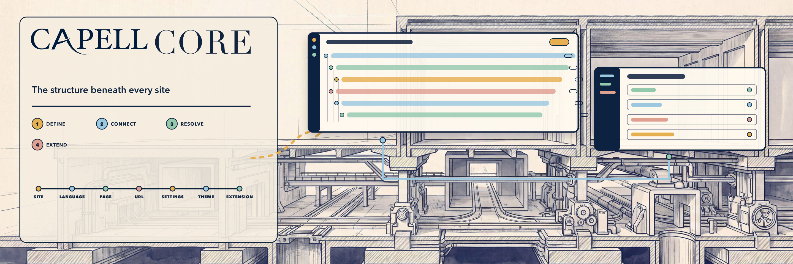

# Foundation artwork sources

The Core artwork is the first proof of the architectural-cutaway Foundation campaign. A text-free technical engraving generated with Capell's Nano Banana workflow supplies environmental depth. The real wordmark, serif `CORE` lockup, typography, labels, journey rail, annotations, and pastel product wireframes are deterministic SVG overlays.



The Core renderer uses:

- `backgrounds/core-engraving.jpg`, the committed 4K, 21:9 text-free engraving source;
- `capell-logo.svg`, vendored from the real Capell wordmark source;
- `packages/core/docs/images/screenshots/core-page-structure.png`, as the factual reference for the deterministic hierarchy trace;
- `packages/core/docs/images/screenshots/core-settings-backed-configuration-dark.png`, as the factual reference for the deterministic settings trace.

The generated layer contains no text, logo, UI, claims, badges, or watermark. It was generated with `gemini-3-pro-image-preview` at 4K and 21:9 using this prompt:

> Create a premium editorial architectural technical engraving for a software campaign environment. Very wide panoramic foundation cutaway beneath a modular site, showing connected empty rooms, layered structural slabs, bridges, rails, portals, conduits, switchyard mechanisms, precise machinery and deep foundations. Warm ivory technical paper with monochrome deep navy ink, fine cross-hatching, restrained ink wash, subtle paper grain, axonometric architectural plate, dimensional and richly observed rather than photorealistic or flat vector. Keep the upper-left calm with generous paper negative space for a later brand lockup. Include two calm, blank architectural bays across the centre-right where later graphic overlays can sit. Build a stable horizontal foundation across the lower half with clear left-to-right circulation and silhouettes readable at thumbnail scale. Environment and material artwork only. All surfaces and panels blank and abstract. Absolutely no text, letters, numbers, pseudo-writing, typographic marks, labels, logos, wordmarks, interface UI, screens displaying content, signage, badges, claims, people, or watermark.

Rebuild and verify the Core proof with:

```bash
node artwork/foundation-series/render-core.js
node artwork/foundation-series/verify-core.js
```

The output is a separately composed 2880×960 README hero and 800×500 marketplace card. Both are stripped, progressive sRGB JPEGs. The renderer uses ImageMagick to prepare the committed engraving for safe SVG embedding and final JPEG export, with `rsvg-convert` for SVG rasterization.

The remaining Admin, Frontend, Installer, and Marketplace assets stay on the previous atmospheric renderer until the Core campaign language is reviewed. Their generated backgrounds remain temporary inputs for that legacy path:

- **Admin:** a strong vertical navy architectural spine with orderly shelves and open work planes.
- **Frontend:** multiple request lanes passing through translucent gates into a bright right-hand destination.
- **Installer:** a calm stepped route through checkpoint frames into an open final platform.
- **Marketplace:** a catalogue field, central evaluation plinth, and navy track toward an amber queue zone.

Run `bash artwork/foundation-series/render.sh` from the repository root to rebuild the Core proof plus the eight legacy package assets.
