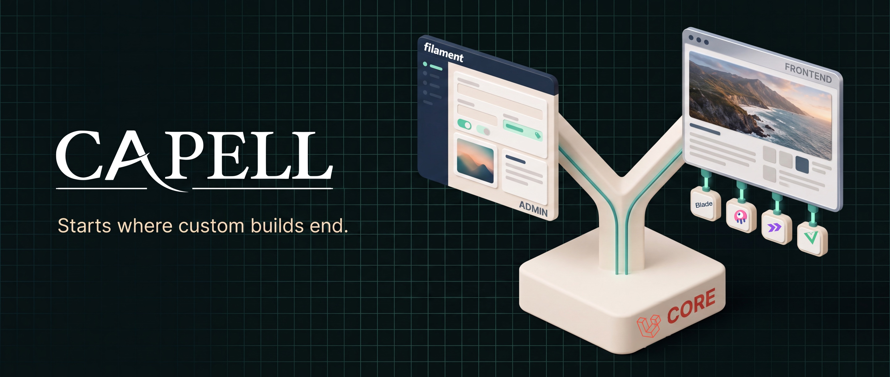

# Root README banner recipe

The root [README](../../README.md) hero at `docs/images/capell-readme-hero.jpg` (2880×1222,
progressive JPEG, quality 86) is a Nano Banana Pro composition on the dark drafting-grid
language, generated and composited with the process below. Keep the exported file smaller
than the asset it replaces.

## Generation

Run [readme-banner-generate.py](readme-banner-generate.py) (Gemini
`gemini-3-pro-image-preview`, aspect 21:9, size 4K; requires `GEMINI_API_KEY` and Homebrew
`rsvg-convert`) with [readme-banner-prompt.txt](readme-banner-prompt.txt) and these
reference images, in order:

1. the capell.app hero artwork as the 3D style reference (its cream background is
   explicitly overridden — the banner background is `#071312` with a `#16302A` grid);
2. the Laravel logomark (solid filled ribbon — the model reliably draws it hollow, which
   the compositing pass corrects);
3. the Filament wordmark;
4. the canonical Capell wordmark, navy and white, rasterized from `capell-logo.svg` at
   1600px (the script does this itself).

## Compositing pass (the part that actually matters)

Per this directory's standing rule, model-redrawn branding never reaches a committed
asset. After generation, erase the model's rendition of every mark and composite the real
artwork over the erased regions:

- the white Capell wordmark (rasterized from `capell-logo.svg` with its navy swapped to
  white);
- the debossed Laravel mark on the Core plinth (from the canonical solid-red SVG);
- the white Filament wordmark in the admin panel's sidebar brand slot;
- the four stack tiles under the frontend window: Blade lettering plus the Livewire,
  Inertia, and Vue marks rasterized from their official SVGs and rotated to sit on the
  tile faces.

## Export

Downscale the 6336×2688 master to 2880×1222 and export progressive JPEG at quality 86.

## Provenance

The 2026-08-06 masters (`banner-v4-final3.png` is the approved final), prompt iterations,
generation script, and reference set are preserved outside the repository at
`~/Clients/Capell/artwork/readme-banner-2026-08/`. This recipe was reconstructed on
2026-08-08 from those surviving artifacts after the original session's files were lost
uncommitted.
