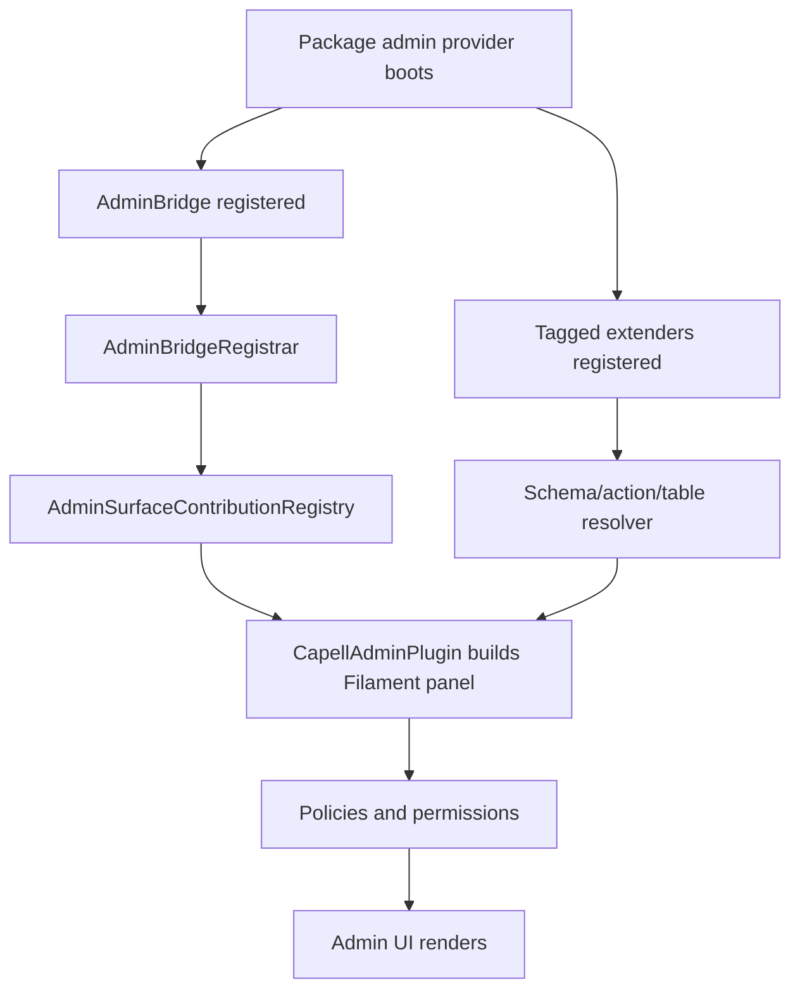

# Debugging Admin Extensions


Use this when an admin resource, page, widget, field, action, setting, or Extensions page contribution does not appear.

## Admin Resolution Flow



Most admin bugs are either missing registration, stale cache, wrong tag, or permission denial.

## First Checks

```bash
php artisan optimize:clear
php artisan capell:admin-clear-cache
php artisan capell:admin-cache-configurators
php artisan capell:admin-cache-widgets
php artisan capell:admin-install
```

Use only the commands present in `php artisan list capell`.

## Symptom Table

| Symptom                               | Likely cause                                                           | Check                                           | Fix                                                                                                                       |
| ------------------------------------- | ---------------------------------------------------------------------- | ----------------------------------------------- | ------------------------------------------------------------------------------------------------------------------------- |
| Page/resource missing from navigation | Not registered or permission denied                                    | AdminBridge registration and user permissions   | Register through `AdminBridgeRegistrar` and rerun admin install when permissions changed.                                 |
| Form field missing                    | Wrong schema extender tag/hook or stale configurator cache             | Extender class, `supports()`, and tag constant  | Tag with `PageSchemaExtender::TAG`, `SiteSchemaExtender::TAG`, `LayoutSchemaExtender::TAG`, or `UserSchemaExtender::TAG`. |
| Header action missing                 | Wrong action extender for the surface                                  | Page/site/resource resolver                     | Use `PageHeaderActionExtender`, `SiteHeaderActionExtender`, or `ResourceHeaderActionExtender`.                            |
| Table query unchanged                 | Extender modifies the wrong query or returns a new builder incorrectly | `PageTableExtender::modifyQuery()` test         | Return the modified builder and cover the query with a fixture.                                                           |
| Extensions page alert missing         | Extender not tagged or package unavailable                             | `ExtensionsPageExtender::TAG` and package state | Tag the extender and force package installed in tests.                                                                    |
| Settings tab missing                  | Settings class/schema/metadata missing                                 | `SettingsSchemaRegistry`                        | Register settings class, schema, and metadata.                                                                            |
| Works for super admin only            | Policy/permission missing for role                                     | Role permissions and policy methods             | Seed/register package permissions and test allowed/denied roles.                                                          |

## Test Recipes

### Bridge Registration

```php
it('registers package admin bridge', function (): void {
    CapellCore::forcePackageInstalled('capell-app/example');

    expect(CapellAdmin::getAdminBridgeRegistry()->classes('capell-app/example'))
        ->toContain(ExampleAdminBridge::class);
});
```

### Schema Extender

```php
it('adds the package field to the page form', function (): void {
    $extenders = collect(app()->tagged(PageSchemaExtender::TAG));

    expect($extenders)
        ->toContain(fn (PageSchemaExtender $extender): bool => $extender instanceof ExamplePageSchemaExtender);
});
```

### Permission Boundary

```php
it('hides the package page from users without permission', function (): void {
    $this->actingAs($editor);

    livewire(ExamplePackagePage::class)
        ->assertForbidden();
});
```

## Rules

- Use translations for labels and notifications.
- Keep package behavior in Actions; Filament pages should orchestrate.
- Test the direct registry/tag where possible, then add one Filament render test for the user-facing surface.
- Do not register admin UI from frontend providers.

## Next

- [Admin extensions](../packages/admin-extensions.md)
- [Schema hooks](../../packages/admin/docs/schemas/hooks.md)
- [Extension point API reference](../packages/extension-point-api-reference.md)
