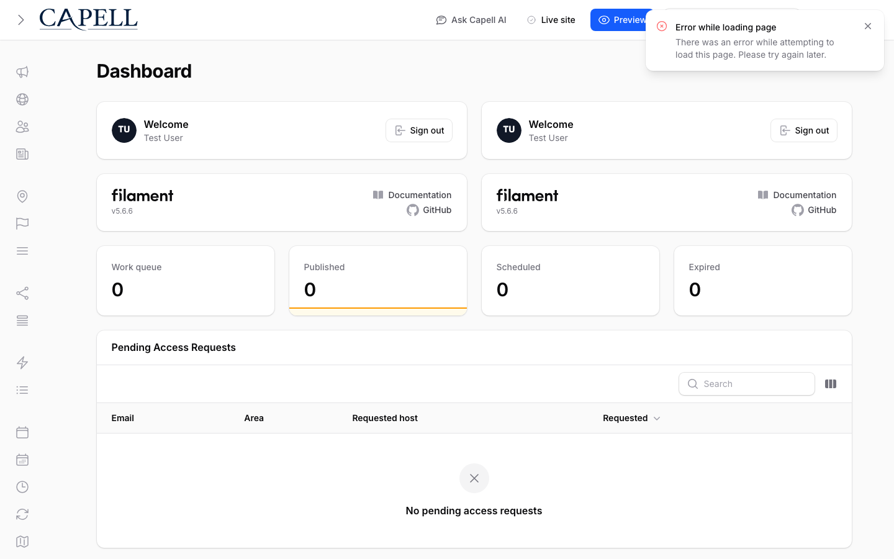

# Admin



Capell Admin is the Filament surface for editing and operating Capell sites. It owns the dashboard, pages, sites, languages, layouts, themes, media, users, roles, settings, extension pages, and package-owned admin screens.

> **Who's this for?** Editors using the Filament admin, and the developers who configure it. Managing content, media, users, and settings.

Status: `Available` · Package: `capell-app/admin`

## What To Use

| Need                                                  | Use                                                                                                                        |
| ----------------------------------------------------- | -------------------------------------------------------------------------------------------------------------------------- |
| Add the panel to an app                               | `php artisan filament:install --panels`, then `php artisan capell:admin-setup` or `php artisan capell:install`.            |
| Change `/admin`                                       | Laravel route/domain config around the Filament panel; keep installer and lockdown access in mind.                         |
| Add a package settings screen                         | `SettingsSchemaRegistry::register()` and `registerSettingsClass()`.                                                        |
| Add admin resources, pages, widgets, or configurators | `AdminBridge` plus `AdminBridgeRegistrar`, or `CapellAdmin::contributeToAdminSurface(...)` for small direct contributions. |
| Add page/site/user form fields                        | Tagged schema extenders such as `PageSchemaExtender::TAG`, `SiteSchemaExtender::TAG`, or `UserSchemaExtender::TAG`.        |
| Add header tools                                      | Tag an `AdminToolItem` with `AdminToolItem::TAG`.                                                                          |
| Add user menu actions                                 | `CapellAdmin::registerUserMenuItem(...)`.                                                                                  |
| Add content widgets                                   | `CapellAdmin::registerWidget(...)` or `CapellAdmin::registerDiscoverableWidgets(...)`.                                     |
| Add lifecycle callbacks                               | `CapellCore::subscriberManager()->subscribe(...)` or `AdminEventRegistry`.                                                 |

## Core Screens

| Screen              | Purpose                                                                                      |
| ------------------- | -------------------------------------------------------------------------------------------- |
| Dashboard           | Health, publishing work, and recent content; role-aware widgets.                             |
| Pages               | The page tree and edit flow; URLs, layouts, publishing dates, preview, duplicate, export.    |
| Sites and languages | Domains and language records; default site/language state and locale-aware editing.          |
| Layouts and themes  | Records that connect page content to frontend presentation.                                  |
| Media               | Uploads and metadata; focal points, localized alt text, and crop/preview.                    |
| Settings            | Core, Admin, Frontend, package, dashboard, and theme settings.                               |
| Extensions          | Installed package state and settings pages; Marketplace alert when Marketplace is installed. |
| Site Health         | Read-only checks for public traffic readiness.                                               |
| Recovery            | Import/export shell; execution belongs to `capell-app/migration-assistant` when installed.   |
| Lockdown            | Emergency frontend lock-down and break-glass admin access.                                   |

## Read Next

| Need                                   | Read                                                                    |
| -------------------------------------- | ----------------------------------------------------------------------- |
| Tour the admin screens                 | [Admin interface](interface.md)                                         |
| Manage users, roles, and access        | [Users and roles](users-and-roles.md)                                   |
| Keep admin accounts secure             | [Account security](account-security.md)                                 |
| Install or repair the admin panel      | [Admin setup](setup.md)                                                 |
| Understand the admin domain model      | [Admin domain](admin-domain.md)                                         |
| Register package admin surfaces        | [Admin bridges](admin-bridges.md)                                       |
| Debug missing admin extension surfaces | [Debugging admin extensions](debugging-admin-extensions.md)             |
| Customize your dashboard               | [Customize your dashboard](dashboard-customize.md)                      |
| Understand the dashboard widget system | [Dashboard widgets](dashboard-widgets.md)                               |
| Register a dashboard Filament widget   | [Register a dashboard Filament widget](dashboard-widget-development.md) |
| Work with media records                | [Media management](media-management.md)                                 |
| Manage installed themes                | [Theme Library](theme-library.md)                                       |
| Generate theme images from the admin   | [Generated theme images](generated-theme-images.md)                     |
| Recover from broken admin state        | [Recovery Center](recovery.md)                                          |

## Extension Rules

- Keep business rules in Actions. Filament resources, pages, tables, widgets, and Livewire components should delegate.
- Put visible strings in translations, including labels introduced by package extenders.
- Prefer an `AdminBridge` when a package contributes several surfaces. It keeps package boot code small and central.
- Use `AdminSurfaceContributionData` for pages, resources, widgets, configurators, schema extenders, and panel extenders.
- Use backed enums implementing `HasLabel` for option sets; do not bury option arrays in resources.
- Admin-only data must not leak into public frontend output. In-page authoring is a post-load authenticated admin feature, not public HTML.

## Common Package Contributions

```php
use Capell\Admin\Contracts\Bridges\AdminBridge;
use Capell\Admin\Data\Bridges\AdminBridgeContextData;
use Capell\Admin\Support\Bridges\AdminBridgeRegistrar;

final class BlogAdminBridge implements AdminBridge
{
    public function register(AdminBridgeRegistrar $registrar, AdminBridgeContextData $context): void
    {
        $registrar->resource(BlogPostResource::class, group: 'content', name: 'blog-posts');
        $registrar->widget(RecentPostsWidget::class);
        $registrar->settingsClass('blog', BlogSettings::class);
        $registrar->settingsSchema('blog', BlogSettingsSchema::class);
    }
}
```

Register the bridge from the package service provider:

```php
CapellAdmin::registerAdminBridge('capell-app/blog', BlogAdminBridge::class);
```

## Optional Admin Features

| Feature                                     | Package                          |
| ------------------------------------------- | -------------------------------- |
| Article resources                           | `capell-app/blog`                |
| Visual content sections                     | `capell-app/content-sections`    |
| Navigation manager                          | `capell-app/navigation`          |
| Publishing approvals and scheduled workflow | `capell-app/publishing-studio`   |
| Recovery execution                          | `capell-app/migration-assistant` |
| AI media tools                              | `capell-app/media-ai`            |

Optional package feature docs live with the package that owns the feature. See [Approved packages](../packages/catalog.md) for the wider package list.
