# Admin Interface

Capell Admin is the working surface for editors, administrators, and developers who manage structured websites. This guide explains the main screens, what each one is responsible for, and where optional packages extend the workflow.

## Dashboard

The dashboard is the first screen after sign-in. It can show setup health, content activity, cache state, work queues, package state, and diagnostics depending on role and installed packages.

Use the site switcher to change the active site context. Many resources, settings, and widgets are site-aware.

Example: an editor responsible for two sites can switch from the primary marketing site to a microsite before creating pages, uploading media, or changing settings. Package widgets can add focused status cards without changing the core dashboard.

## Pages

Pages is the main editorial surface. It lets teams create, edit, reorder, preview, publish, move, duplicate, and delete pages in the selected site.

Core page editing covers the page tree position, type, title, slug, publishing state, content fields, media, and settings. Optional packages can add fields, tabs, actions, and publishing rules.

The page form starts with the content context: site, parent page, internal name, title, slug, and URL preview.

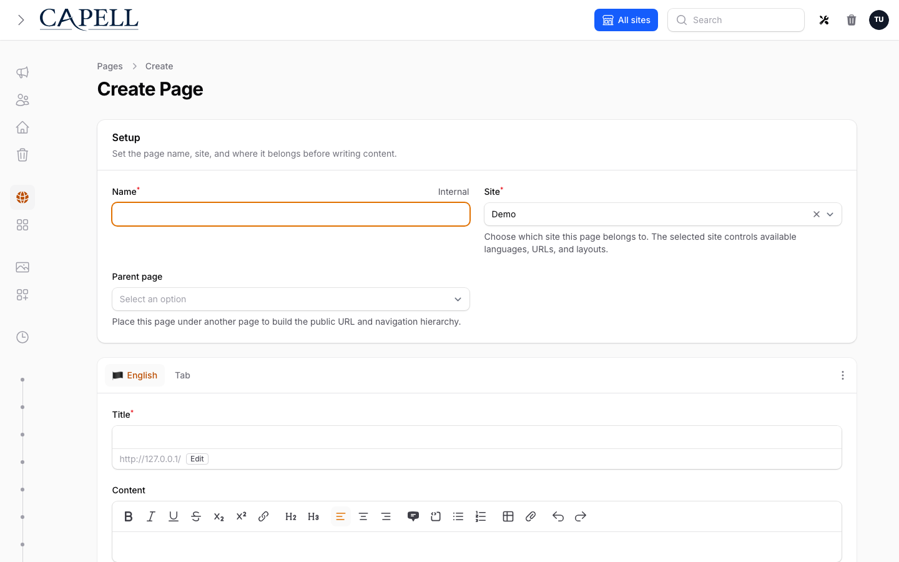

For a normal `/about/team` page, choose the current site, select `About` as the parent page, set the title to `Team`, and keep the generated slug as `team`. Capell uses that tree position to build the public URL and can create redirect records when a published page later moves.

Content stays in the page editor unless a package registers richer fields or section builders.

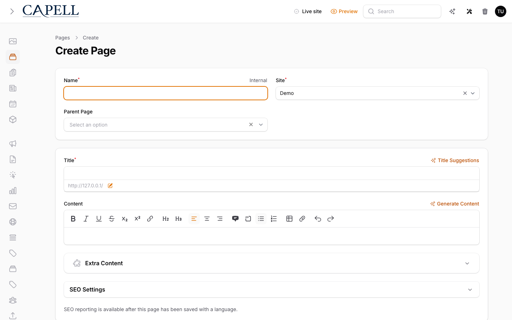

Start with [Create your first page](../getting-started/create-your-first-page.md) when you need the full authoring flow.

## Sites And Languages

Sites define the public web properties managed in the installation. Languages define the locale set used for URLs, labels, and translated content.

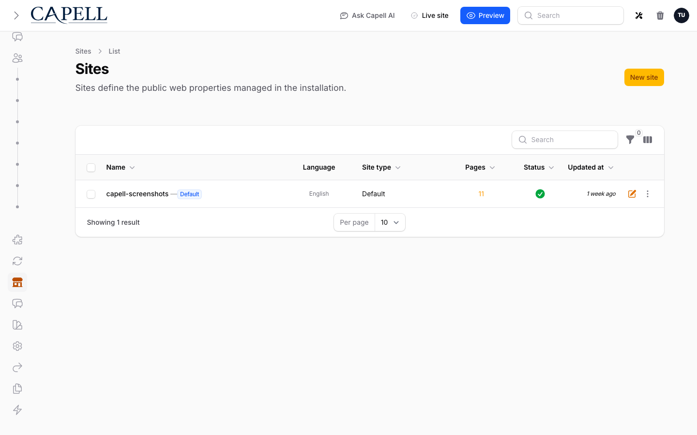

Use these screens when you need to:

- add or change domains
- control which languages exist for a site
- manage default pages and site relationships

Site records expose the operational details that public resolution depends on: domains, language scope, related sites, contact information, branding, and default page choices.

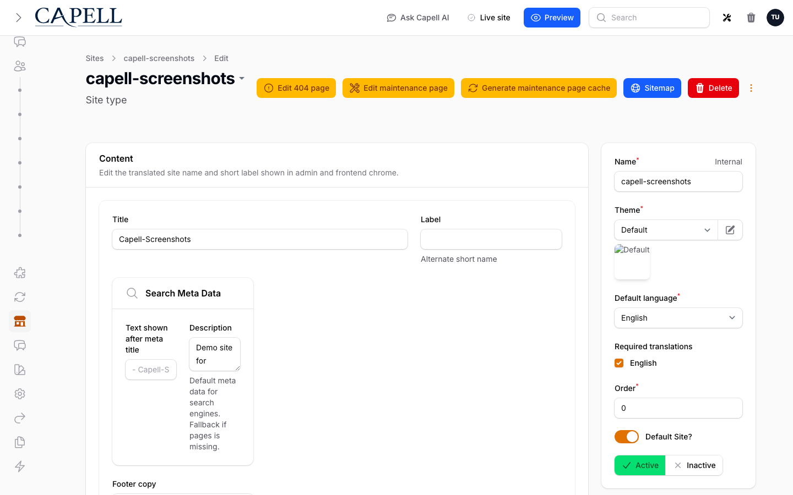

## Layouts And Themes

Layouts connect page records to frontend rendering. Themes hold presentation records used by the frontend surface and by theme-aware packages.

The normal Admin package provides the core management screens. The optional [Layout Builder package](https://docs.capell.app/packages/layout-builder) owns its richer layout editor, fixtures, and screenshot evidence.

Example: a site owner can review installed themes, inspect diagnostics, customize brand settings, preview against a real page, then apply the theme globally or to selected sites. The [Theme Library](theme-library.md) page covers that flow end to end.

## Media

Media manages uploaded files and their metadata.

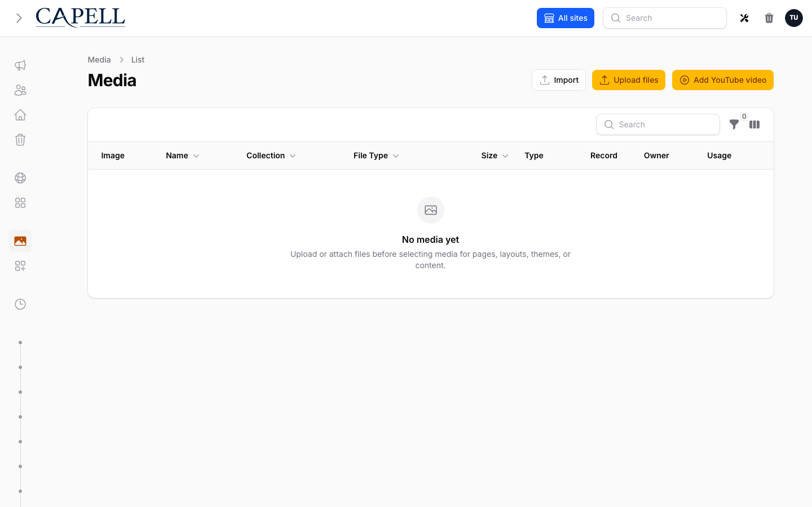

The default backend uses Spatie MediaLibrary through Capell media contracts. If the Media Library package is installed, the editor workflow stays similar while the [backend changes](../development/configuration.md#core-config).

## Settings

Settings is the core Capell settings surface. Admin, Frontend, Marketplace, and optional packages expose their own settings or control pages from the Extensions area.

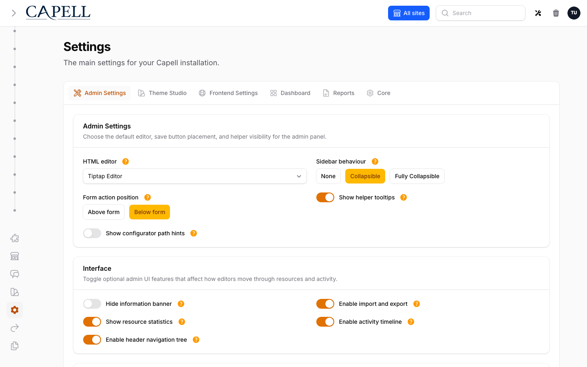

Use the [settings registry](../../packages/admin/docs/settings-schema-registry.md) and a package-owned extension page instead of adding package fields to the core Settings screen.

Example: site-wide branding belongs on the Site record, while package-specific controls belong to the package settings page registered through the settings registry. That keeps the core Settings surface readable as more packages are installed.

## Extensions And Marketplace

Extensions is the admin surface for installed package state, package settings/control pages, and optional Marketplace connection alerts. Local enable, disable, uninstall, and bulk package lifecycle actions stay on the installed Extensions surface.

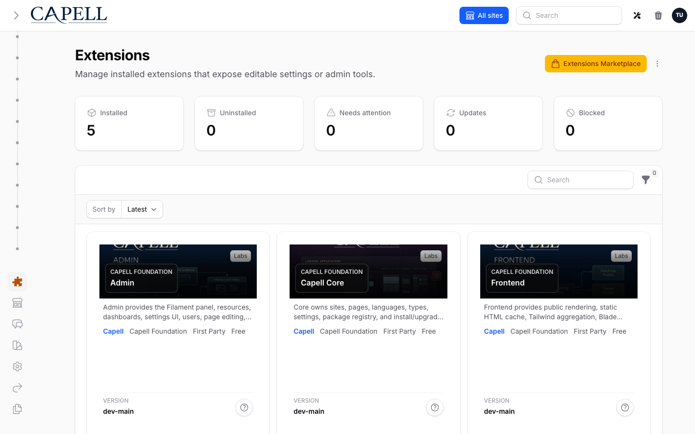

[Marketplace](../../packages/marketplace/docs/overview.md) browsing, account connection, licence activation, diagnostics, heartbeat checks, and install authorization are available only when `capell-app/marketplace` is installed and enabled.

## Reports

Reports collect admin-only diagnostics that help teams find publishing, content, URL, cache, navigation, permission, and install issues before they affect public delivery. Report visibility can be changed per role from Settings, but that only controls navigation; page access still depends on permissions.

Publishing Readiness shows launch-focused page checks such as missing required translations, missing or disabled URLs, missing blueprint or layout dependencies, and publish-window warnings. It links editors back to the affected page when Capell can safely provide an edit URL.

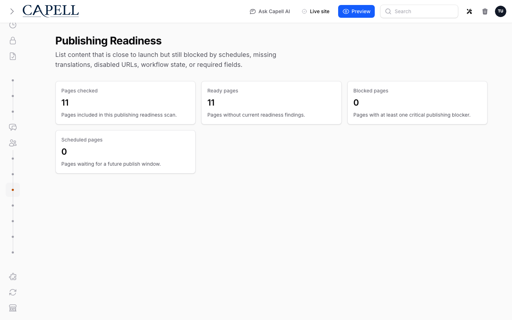

## Site Health

Site Health is the operations view for public delivery. It checks cache status, public-output safety, static generation state, optimizer readiness, queues, failed jobs, server config, and writable paths.

Use it before a production launch, after deployments that change frontend output, and after enabling packages that affect cache, themes, queues, or generated assets. Red checks are release blockers unless the team has made an explicit operational exception.

## Recovery Center

The [Recovery Center](recovery.md) is the shell for import-session and recovery workflows. Admin owns the UI surface, while the `capell-app/migration-assistant` package owns the real export, import, and rollback implementation.

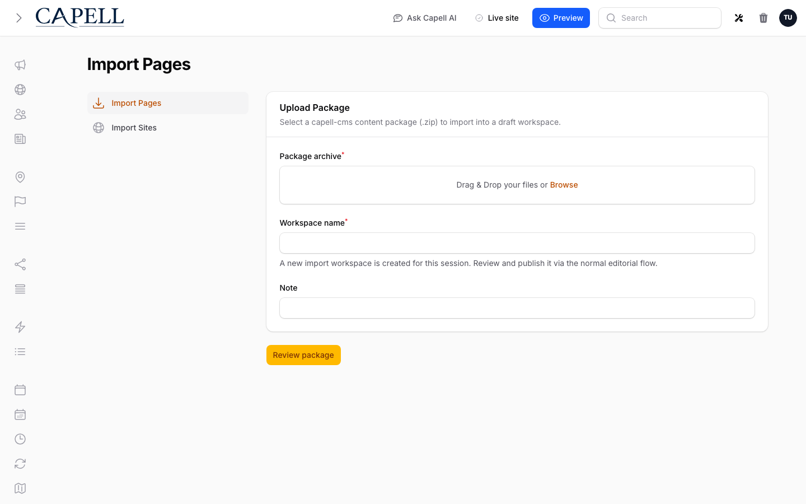

## Users And Permissions

Users, roles, and permissions are managed through Admin. Permissions are tied to the registered resources, pages, and package features available in the installation.

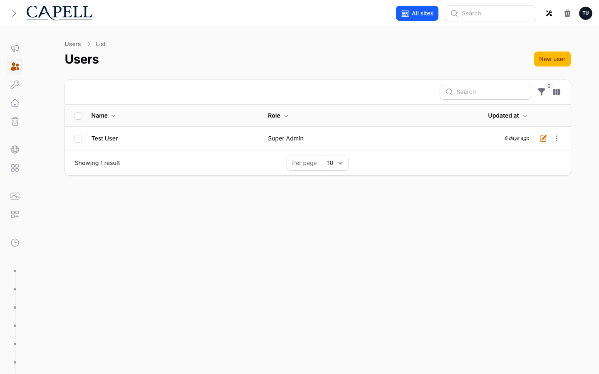

## Activity And Sitemap

Activity gives administrators a readable audit trail for record changes, including nested before-and-after details where supported.

The Sitemap page gives editors and developers a site-level view of the public page structure before handing the result to a dedicated sitemap package or frontend route.

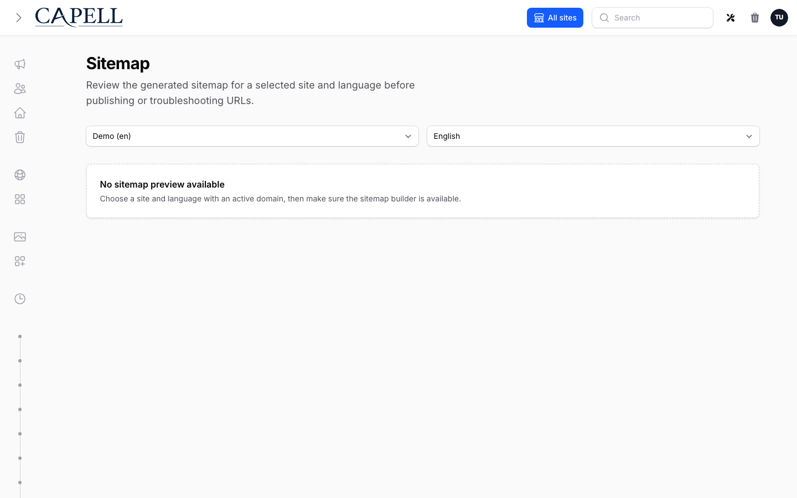

## Quick Reference

| Need                                | Screen              |
| ----------------------------------- | ------------------- |
| Create or edit structured content   | Pages               |
| Change domain or locale structure   | Sites and Languages |
| Manage files                        | Media               |
| Adjust core configuration           | Settings            |
| Adjust package-backed configuration | Extensions          |
| Review package install intent       | Marketplace         |
| Review publishing and site health   | Reports             |
| Review import or recovery work      | Recovery Center     |
