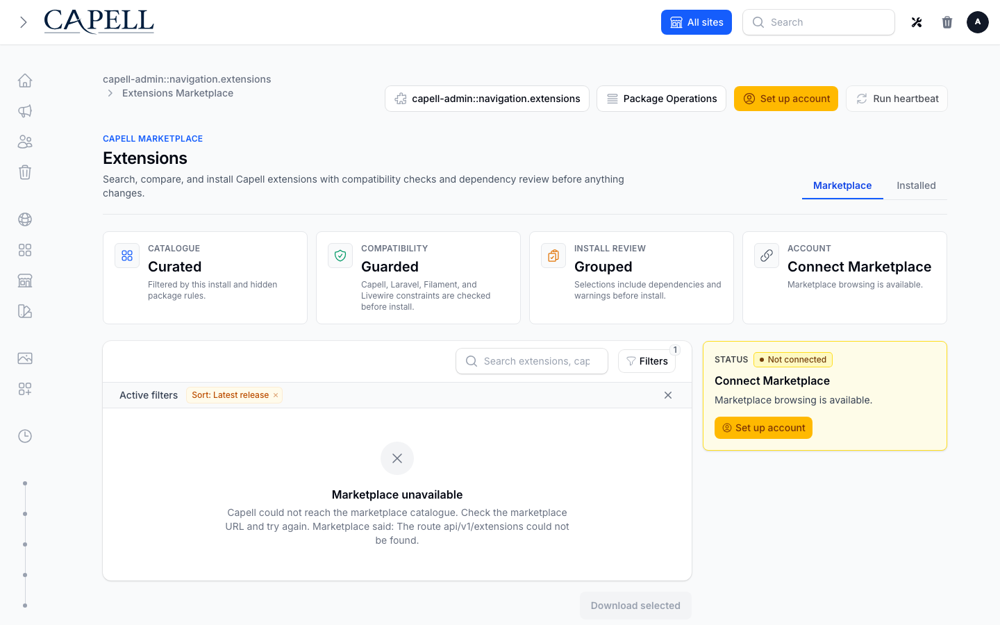

# Marketplace In Admin

Marketplace is the extension acquisition and lifecycle surface in Capell admin. Access depends on the Marketplace and Extensions permissions assigned to the signed-in user.

## Browse And Review

Open **Marketplace** from the System navigation. Search and filter the catalogue, open an extension for its compatibility, documentation, licence, trial, or suite details, then select it for review.

The review shows direct and dependent packages, maturity, entitlement, declared operational impact, price, beta acknowledgement, and the host readiness summary. Nothing is installed until the confirmation is submitted. A `ManualOnly` host shows install instructions instead of an automation control.

## Install And Activate

An automated install is queued and reports live package progress. Keep the review open to watch stages, or leave it and use **Package Operations**. Theme installs may finish with an **Activate** next step; installing package files does not silently change the active theme.

Activation-required extensions ask for the server-defined licence key. Raw keys and remote exception details are not displayed in diagnostics.

## Updates

An installed extension can expose a one-click update when a compatible release is available. The Extensions dashboard also supports bulk updates, while configured automatic updates use the same queued operation, preflight, health-check, notification, and recovery contracts. Protected updates remain tied to current purchase or membership access.

## Uninstall And Delete

Uninstall runs the extension-owned teardown before Composer removes package files. Review dependent extensions first. Deleting extension-owned data is an explicit, separate choice and may be irreversible. If cancellation arrives after lifecycle or Composer work, Package Operations explains the partial state and correct recovery action.

## Purchases, Licences, Trials, And Suites

**Purchases and licences** shows Marketplace purchases returned by the latest heartbeat, installed paid extensions, access expiry, renewal, and support links. Suite detail lists required member packages. Savings are shown only when Marketplace supplies every member quote in the same currency. Trial terms are server-supplied and never invented by the client.

## Package Operations

Package Operations is always available from Extensions and Marketplace. It groups active, failed, succeeded, resolved, and all attempts. Each attempt shows translated status and failure classification, live progress, deployment evidence, a timeline, and redacted diagnostics.

- **Cancel** requests a safe stop. Composer or lifecycle work already completed may not be reversible.
- **Retry** creates a new linked attempt after the underlying problem is fixed.
- **Mark resolved** acknowledges that no further operator action is needed; it does not alter package files.
- **Copy diagnostics** copies the redacted diagnostic bundle for support.

Use [Marketplace hosting](../operations/marketplace-hosting.md) for readiness remediation and [Debugging Marketplace](../operations/debugging-marketplace.md) for recovery procedures.
