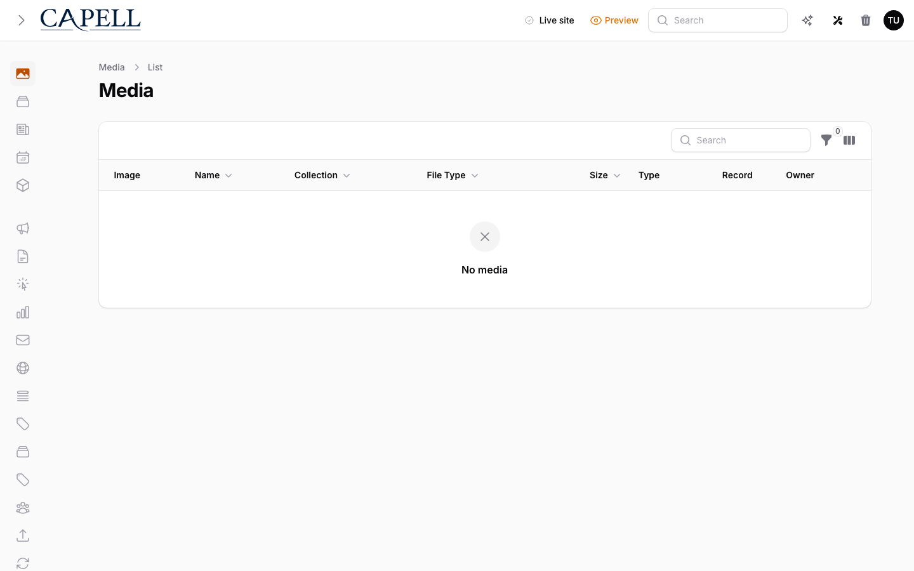

# Media management

Manage images and files for your sites from **Media** in the admin sidebar.

## Upload a file
1. Open **Media**.
2. Click the create/upload action and choose a file.
3. Save. The file is now available to attach to pages and components.

## Add alt text and captions (per language)
1. Open a media item.
2. Use the language tabs to pick a locale.
3. Fill **Alt text** (a short description of the image), and optionally caption and credit.
4. Mark an image **decorative** only when it adds no information — this leaves the alt text empty on purpose so screen readers skip it.
5. Save.

## Set a focal point or crop
- When the active [media backend](../development/configuration.md#core-config) supports it, open the item and drag the focal point so automatic crops keep the important part of the image in frame. (The backend is set by `CAPELL_MEDIA_BACKEND`; the default backend may not expose cropping.)

## AI Media Tools

When media AI tools are installed, media actions can inspect or improve images from the same admin workflow. Keep those tools package-owned; the default media surface should still work without them.

## Replace or delete a file
- Replacing a file keeps its record and metadata while swapping the underlying file.
- Deleting media removes it from the library. Check where an image is used before deleting, because pages referencing it will lose the image.

## Limits
- Allowed file types and size limits come from your media configuration and host upload limits (`upload_max_filesize`, `post_max_size`). Ask your developer if an upload is rejected.

## How it works (developers)
Localized media metadata (alt text, captions, credits, decorative flag) is stored on the shared polymorphic `translations` table in the translation `meta` JSON column. The active backend is resolved from `capell.media.backend` (`CAPELL_MEDIA_BACKEND`, default `spatie`). Render media in Blade with `<x-capell::media>` so output stays on the public-safety contract.
