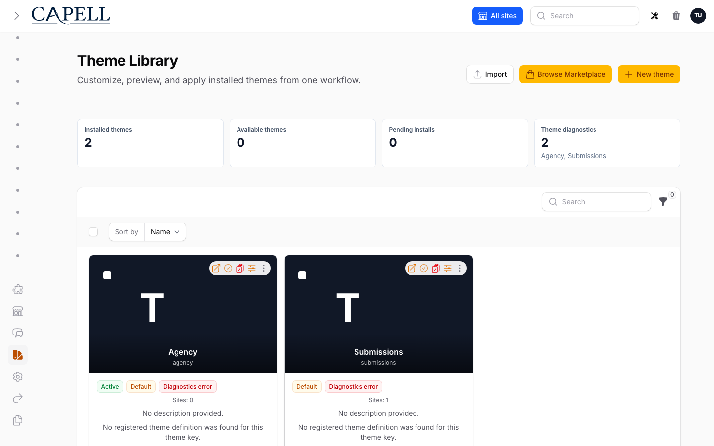

# Theme Library

The admin theme workflow is **Theme Library -> Customize -> Preview -> Apply**. It replaces the generic theme-record editing habit with one owner/admin flow for installed theme instances, catalogue/local definitions, pending installs, and diagnostics.



## What The Page Shows

| Section          | Source                                                                          | What admins do                                                                                           |
| ---------------- | ------------------------------------------------------------------------------- | -------------------------------------------------------------------------------------------------------- |
| Installed themes | `themes` records plus registered package definitions                            | Customize, preview, and apply a theme instance.                                                          |
| Available themes | registered `ThemeDefinitionData` entries without a matching `themes.key` record | Create the missing installed theme instance from the unified **Add theme** slide-over.                   |
| Pending installs | Marketplace install intents when the Marketplace table exists                   | See that a theme install is still waiting for Composer/deployment work.                                  |
| Diagnostics      | `ValidateThemeDefinitionAction` output                                          | Find missing renderer, preset, section, asset, preview image, and parent-theme problems before applying. |

The installed themes table is a normal Filament table with compact columns for preview, name/description, active preset, site usage, status, diagnostics, and actions. Diagnostics are shown as a clickable badge; errors block **Apply theme** but do not expand noisy details into the row.

Theme table images prefer package definition data. The admin card image fallback order is:

1. theme media image
2. `admin.editor.image`
3. generated admin image
4. `ThemeDefinitionData::previewImage`
5. initials fallback

## Add Themes

Use **Add theme** for all new theme entry points:

- **Add my own theme** creates a custom installed theme record.
- **Create from installed package** creates a theme from a registered package/local `ThemeDefinitionData`.
- **Search marketplace** is reserved for Marketplace installs when that package is present.

When you create a theme from a package definition, the first preset is automatically selected as the active preset, so the theme can be customized, previewed, and applied immediately. Creating a theme does not make it the global default; you still use **Apply theme** to activate it. Themes with diagnostics errors stay blocked until the missing parent, renderer, or preset problem is fixed.

## Customize

Use **Customize** on an installed theme. The slide-over is a guided editor with sections on the left and a sticky sandboxed iframe preview on the right. The preview is built from unsaved form state and only persists when the admin explicitly saves.

Core sections in the editor:

- **Quick setup**: Select the active preset and configure basic editor options.
- **Brand**: Logo, colours, and brand settings used across the theme.
- **Header**: Navigation, logo placement, and header styling options.
- **Page surface**: Main content area background and spacing configuration.
- **Footer**: Footer layout, text, and styling options.
- **Assets**: Where the theme's compiled CSS/JS is loaded from.
- **Advanced**: Custom CSS and other advanced customizations.

## Preview

Use **Preview** to see how the theme (and selected preset) will look on your site before saving or applying it. You choose a site, page, and preset to preview.

The preview is an authenticated admin surface—only logged-in admins can access preview links, and site-scoped admins can only preview sites assigned to them. The preview does not include admin labels or editing tools, so you see the theme as live visitors will.

Once satisfied, you can return to customize, change the preset, and preview again—or proceed to **Apply** when ready.

## Apply

Use **Apply theme** to make a theme live across your site(s). Choose whether to apply the theme to all sites (as the global default) or to specific sites.

Applying a theme makes it live for the selected sites and clears the relevant caches automatically. The change takes effect immediately—visitors will see the new theme on their next page load.

| Scope          | Effect                                                                                    |
| -------------- | ----------------------------------------------------------------------------------------- |
| Global default | Make this theme the default for all sites. Only site admins with global permissions can use this. |
| Selected sites | Apply this theme to only the selected sites. Other sites keep their current theme.        |

Site-scoped admins can only apply themes to sites they manage.


## How it works (developers)

### Customize storage and sections

The customize editor is structured around the theme's metadata schema. Storage keys are:

- Quick setup: `admin.editor.*` (active preset in `meta.editor.preset.active`)
- Brand: `meta.editor.brand.*`
- Header: `meta.editor.header.*`
- Page surface: `meta.editor.surface.*`
- Footer: `meta.editor.footer.*`
- Assets: `meta.editor.assets.paths` and `meta.editor.assets.buildPath`
- Advanced: `meta.editor.advanced.*` for custom CSS and other advanced settings

Blueprint/default/status groups exist in the schema but are not exposed in the main workflow. They can be used in advanced/admin areas for maintainers who need direct schema access.

### Preview generation and signing

Preview URLs are generated by `CreateThemePreviewUrlAction` and signed through the admin preview route. When a preset is selected, the URL includes a `ThemePreviewSigner` token that resolves only inside the theme runtime for the preview request, allowing preset changes to be checked before saving/applying broadly.

### Apply and caching

`SetActiveThemeForSitesAction` handles both global default and per-site activation. Cache invalidation is managed by:

- `ThemeObserver`: Invalidates frontend surrogate keys for affected sites when the theme is changed.
- `SiteObserver`: Flushes site/theme relation caches and emits frontend surrogate invalidation when a site's theme assignment changes.

## Diagnostics

Run diagnostics from the UI or the command line:

```bash
php artisan capell:themes:validate
php artisan capell:themes:validate default
```

Diagnostics check:

- package definition registration
- installed `themes.key` match
- `themeKey` consistency
- renderer registration
- parent/extends chain
- standard section coverage
- declared frontend assets
- preset availability
- preview image metadata

Warnings mean the theme may still be previewable, but the package author should fix the manifest/registration before release. Errors mean the theme should not be applied until the missing definition or renderer contract is fixed.

## Public Safety

Theme library changes must not change the public-output safety contract. Anonymous/public HTML must not include admin labels, package internals, field paths, model IDs, signed editor URLs, or authoring scripts.

Runtime reads the selected theme, active preset, brand profile, and package definition server-side. Public output receives ordinary frontend HTML and token CSS only.

## Next

- [Generated theme images](generated-theme-images.md)
- [Creating custom themes](../packages/creating-custom-themes.md)
