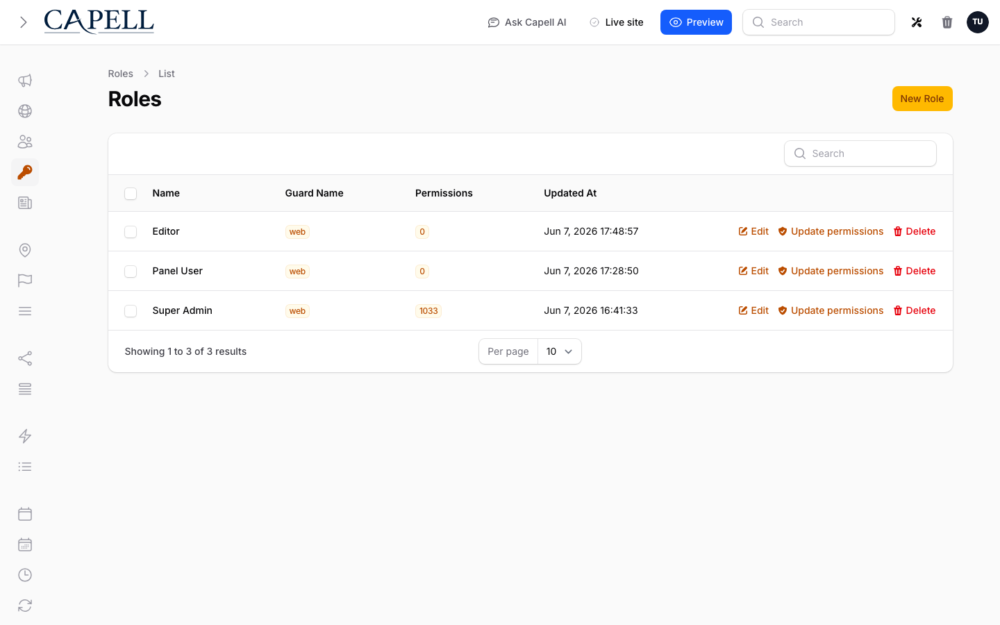

# Users and roles

Manage who can sign in to the admin and what they can do. Capell uses **site-scoped roles**: a person can have one set of permissions on Site A and a different set on Site B.

## Add a user
1. Open **Users** in the admin sidebar.
2. Click the create action.
3. Fill **Name**, **Email**, and set a **Password** (and **Password confirmation**).
4. Assign one or more **Roles**.
5. Save. The user can now sign in to `/admin`.

## Change a user's password
1. Open **Users** and edit the user.
2. Enter a new **Password** and **Password confirmation**.
3. Save. (Passwords are stored hashed; you cannot read an existing password back.)

## Manage roles
- Open **Roles** to create roles and choose the permissions each role grants.
- Assign roles to a user from the user's edit screen (**Roles** field), or per site from the **Manage site permissions** action on a site's edit page (see below).

## Give someone access to one specific site
Roles are scoped per site. To make someone an editor on just one site:
1. Open **Sites** and edit the target site.
2. Click **Manage site permissions**.
3. Add the user and assign their role for this site.

The same person can hold a different role on each site, or none.

## Restrict a page type to certain roles
On a page type's configurator tab you can choose which roles may see and edit pages of that type. Users without one of the listed roles cannot access those pages.

## Offboard someone
- Remove their roles to revoke access while keeping their account, or
- Delete the user from the **Users** list to remove the account entirely.

## Notes
- Approval workflows (submit → review → approve) are provided by the optional `capell-app/publishing-studio` package, not by core.
- For the underlying RBAC model (Spatie teams, policies, page-type restrictions) see the developer guide: [permissions and approval](../../packages/admin/docs/permissions-and-approval.md).
