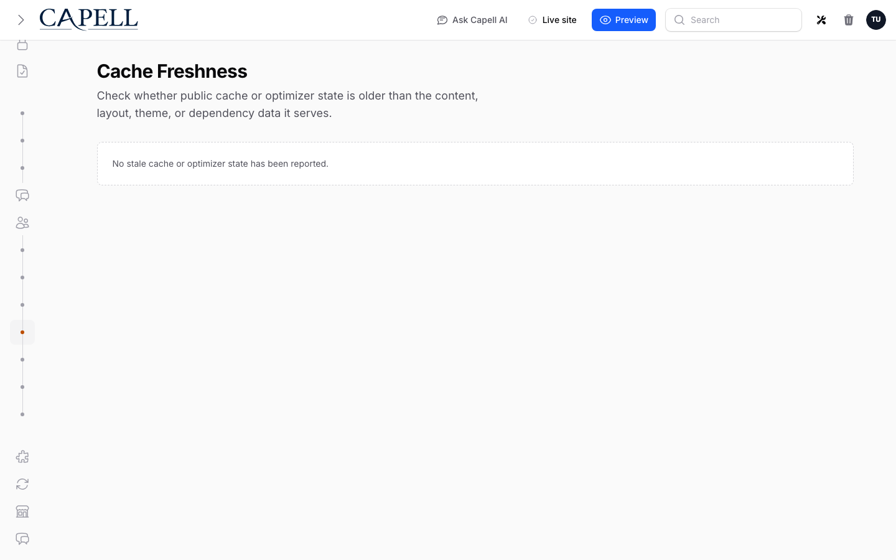

# Page Cache Architecture



Capell's frontend cache is split into three decoupled layers. This document explains why the split exists, what each layer stores, how keys are generated, how invalidation works, and how the layers compose at runtime.

---

## The problem with a monolithic listing cache

The old `getPages()` cached a full `Collection<Page>` — models with all eager-loaded relations — keyed by every parameter including the current pagination page number. This meant:

- **Pagination multiplication.** A listing with 10 items per page and 5 pages created 5 separate cache entries, each containing a full collection of fully-hydrated models. Page 1 and page 2 both stored their own copies of `translation`, `pageUrl`, `type`, `image`, and any other loaded relations — duplicated across entries.
- **Invalidation was all-or-nothing.** There was no way to invalidate one page's cache entry without flushing everything, because the listing cache and the individual model cache were the same thing.
- **Post-cache relation re-queries.** `loadPage()` cached only the bare model, then called `loadMissing()` outside the cache callback, so every request re-queried translation, pageUrl, layout, and pageUrls even on a warm cache hit.

---

## Three-layer architecture

```
Request
  │
  ▼
PageLoader::getPages()
  │
  ├─[1]─ PageListingCache ──► array<int> ordered IDs  (no relations, no full models)
  │          │
  │          └─ PHP slice for current pagination page
  │
  ├─[2]─ PageHydrator ──────► Collection<Page>
  │          │
  │          └─ resolves each ID via PageModelCache
  │                   │
  │                   └─[3]─ PageModelCache ──► one canonical Page model per (type, id, siteId, languageId)
  │                                             (translation, pageUrl, type, image, layout, pageUrls all embedded)
  │
  └─ post-hydration extras (parent, children, children_count, creator) — see below
```

### Authoring Safety

The page cache is public infrastructure. Treat every cached HTML file as something that might be served to an anonymous visitor, a normal signed-in user, an admin, a crawler, or a static export.

Do not render in-page authoring HTML, scripts, attributes, selectors, model IDs, field paths, labels, permissions, or signed editor URLs into Blade or theme output. Frontend Authoring decorates the page only after load, and only from an authenticated admin beacon response. Cache invalidation still uses the recorded model-to-URL map, but the cached file itself stays plain public HTML.

`PublicHtmlSafetyInspector` is a final guard before public cache storage. If rendered HTML contains explicit authoring markers, `PageCache` refuses to write the file and `HtmlCacheMiddleware` returns the response as `private, no-store` with `X-Frontend-Cache: BYPASS`. This is a safety net, not a replacement for keeping authoring concerns out of frontend rendering.

### Layer 1 — `PageListingCache`

**What it stores:** `int[]` — an ordered array of page IDs matching a listing specification.

**What it does NOT store:** models, relations, translated fields, or the pagination page number. Pagination is applied in PHP by slicing the array after it comes out of the cache.

**Why this matters:** A listing with 5 pagination pages now has exactly one cache entry — the ordered ID array. Pages 1–5 all read from the same entry and slice their own window. Adding a new page to the listing only requires incrementing the generation counter (see Invalidation below), not rebuilding five separate full-model collections.

**Cache key:** Built from `PageListingSpec::toCacheKey()` (language, site, type, ordering, parent, typeKey, morphModel, optionalLanguage, limit, and an optional caller-supplied suffix), then versioned with a generation counter:

```
page-ids-{languageId}-{siteId}-ordering-latest-gen-{N}
```

The generation counter `N` is stored separately under `listing-gen-{siteId}-{languageId}`.

---

### Layer 2 — `PageModelCache`

**What it stores:** one fully-hydrated `Page` (or any `Pageable` subtype) per `(type, id, siteId, languageId)`. The cached model includes all relations that are needed for both listing display and single-page rendering (the _canonical relation set_).

**Canonical relation set:**

| Relation              | Notes                                           |
| --------------------- | ----------------------------------------------- |
| `translation`         | filtered to `languageId`                        |
| `pageUrl`             | primary URL for `languageId`, with `siteDomain` |
| `pageUrls`            | all language URLs, for hreflang                 |
| `pageUrls.siteDomain` |                                                 |
| `type`                |                                                 |
| `image`               |                                                 |
| `layout.theme`        | needed for single-page rendering                |

**Transient relations** are injected after cache retrieval and are never serialised into the cache entry:

- `site` — injected from the already-cached `Site` object
- `translation->language` — injected from the already-cached `Language` object
- `pageUrl->language` — same
- `pageUrls[*]->siteDomain` — resolved from `$site->siteDomains` by language ID

**Cache key:**

```
page-model-{ClassBasename}-{id}-site-{siteId}-lang-{languageId}
```

Example: `page-model-Page-42-site-1-lang-3`

**Why one entry per language?** Because `translation` is language-specific. An alternative would be to cache the model once without a language-specific translation and resolve translation separately, but that would require a second cache lookup per model on every request.

---

### Layer 3 — `PageHydrator`

**What it does:** accepts `int[]` of ordered IDs and returns a `Collection<Page>` in the same order, by resolving each ID through `PageModelCache`. IDs that resolve to `null` (deleted, unpublished, or inaccessible pages) are silently dropped.

**Post-hydration extras:** Relations not in the canonical set are loaded after the Collection is assembled, in batch:

| Extra            | When loaded               | How                                                                                                                                                                                   |
| ---------------- | ------------------------- | ------------------------------------------------------------------------------------------------------------------------------------------------------------------------------------- |
| `parent`         | `withParent: true`        | Each parent ID is resolved from `PageModelCache` — parents are themselves canonical model cache entries, so there is no N+1 and no duplicated parent data in the child's cache entry. |
| `children`       | `withChildren: true`      | `$collection->load(['children' => ...publishedDate()])`                                                                                                                               |
| `children_count` | `withChildrenCount: true` | `$collection->loadCount(...)`                                                                                                                                                         |
| `creator`        | `withDate: true`          | `$collection->load('creator')`                                                                                                                                                        |

**Why are parents not embedded in the child's canonical cache?** If parent data were embedded, updating a parent's title would require finding and invalidating every child's cache entry. By resolving parents from their own `PageModelCache` entry, updating a parent invalidates exactly one cache entry. All children that load that parent pick up the fresh copy on the next request.

---

## How a paginated listing request flows

```
getPages(language: $lang, site: $site, limit: 10, paginationPage: 2, ordering: Latest)
│
├─ Build PageListingSpec (no paginationPage — it is not part of the spec)
│
├─ PageListingCache::getIds($spec, $idLoader)
│      ├─ read generation counter for (siteId, languageId) → N
│      ├─ compute final key: "page-ids-3-1-ordering-latest-gen-N"
│      ├─ HIT → return int[]
│      └─ MISS → run $idLoader:
│              SELECT id FROM pages
│                JOIN page_translations ON language_id = 3
│                JOIN page_urls ON language_id = 3
│                JOIN types ON ...
│               WHERE site_id = 1 AND published_at <= now()
│               ORDER BY published_at DESC
│              → [42, 17, 93, 8, 55, 31, 77, 14, 29, 66, ...]
│              → cached as int[]
│
├─ PHP slice for page 2: array_slice($allIds, 10, 10) → [31, 77, 14, 29, 66, ...]
│
├─ PageHydrator::hydrate([31, 77, 14, 29, 66, ...])
│      │
│      └─ for each ID:
│             PageModelCache::get(Page::class, 31, $site, $lang)
│                 ├─ HIT → return cached model (with translation, pageUrl, type, etc.)
│                 └─ MISS → SELECT * FROM pages WHERE id = 31
│                            eager load canonical relations
│                            cache result
│                            return model
│
└─ LengthAwarePaginator(items: Collection, total: count($allIds), perPage: 10, page: 2)
```

Note that the total item count for the paginator comes for free from `count($allIds)` on the cached ID array — no additional `COUNT(*)` query.

---

## How a single-page request flows

```
PageLoader::loadPage(type: 'page', id: 42, site: $site, language: $lang)
│
└─ PageModelCache::get('page', 42, $site, $lang)
       ├─ HIT → canonical model with all relations already loaded
       └─ MISS → query + eager load + cache
```

The same cache entry is used whether a model was loaded as part of a listing (via `PageHydrator`) or directly (via `loadPage()`). There is only one copy.

---

## Cache invalidation

### Listing invalidation — generation counter

Each `(siteId, languageId)` pair has a generation counter stored under `listing-gen-{siteId}-{languageId}`.

When any `Pageable` for that site+language is created, updated, or deleted, `PageListingCache::invalidateListings($siteId, $languageId)` increments the counter. The next listing request for that site+language computes a new final key (`...-gen-{N+1}`), misses the cache, and re-queries the database for fresh IDs.

The old entries (`...-gen-{N}`) are never explicitly deleted. They are abandoned in place and expire at their natural TTL. This approach is driver-agnostic — it works with file, database, Redis, and Memcached stores.

```
generation = 3
listing key = "page-ids-3-1-ordering-latest-gen-3"   ← current

page updated → generation bumped to 4

listing key = "page-ids-3-1-ordering-latest-gen-4"   ← new, misses cache
old key     = "page-ids-3-1-ordering-latest-gen-3"   ← orphaned, expires at TTL
```

### Model invalidation — key deletion

When a `Pageable` is saved or deleted, `PageCacheInvalidator::onSaved($model)` iterates over the model's `translations` relation and calls `PageModelCache::invalidate($type, $id, $siteId, $languageId)` for every language. Each call runs `CapellCore::removeCacheKey()` on the deterministic key, so the next request for that model re-queries and re-warms the cache.

```
PageCacheInvalidator::onSaved($page)
  │
  ├─ for each translation (language_id: 1):
  │      PageModelCache::invalidate('page', 42, siteId: 1, languageId: 1)
  │      PageListingCache::invalidateListings(siteId: 1, languageId: 1)
  │
  └─ for each translation (language_id: 3):
         PageModelCache::invalidate('page', 42, siteId: 1, languageId: 3)
         PageListingCache::invalidateListings(siteId: 1, languageId: 3)
```

---

## Key classes

| Class                  | Namespace                       | Purpose                                                                              |
| ---------------------- | ------------------------------- | ------------------------------------------------------------------------------------ |
| `PageListingSpec`      | `Capell\Frontend\Data`          | DTO — all listing filter params except pagination. Produces deterministic cache key. |
| `PageListingCache`     | `Capell\Frontend\Support\Cache` | Reads/writes ordered `int[]` ID lists. Manages generation counters.                  |
| `PageModelCache`       | `Capell\Frontend\Support\Cache` | Reads/writes one canonical full model per (type, id, site, language).                |
| `PageHydrator`         | `Capell\Frontend\Support\Cache` | Converts `int[]` IDs to `Collection<Page>`. Merges post-hydration extras.            |
| `PageCacheInvalidator` | `Capell\Frontend\Support\Cache` | Orchestrates model + listing invalidation on save/delete.                            |
| `CacheEnum` (Frontend) | `Capell\Frontend\Enums`         | `pageIds()`, `pageModel()`, `listingGeneration()` — all cache key generation.        |

All three cache services are bound as singletons and use the `HasCache` trait for normalisation, TTL, sentinel handling, and per-request local caching.

---

## Special cases

### `modifyQuery` and cache isolation

`getPages()` accepts a `?Closure $modifyQuery` that modifies the ID query. Because the closure is not part of the listing spec, two calls with identical specs but different closures would collide on the same listing cache entry.

Callers that pass `modifyQuery` **must** also pass a unique `cacheKeyPrepend` (feeds `PageListingSpec::$cacheKeySuffix`). Without it, cache correctness is not guaranteed.

### `optionalLanguage`

When `optionalLanguage: true`, the ID query uses `LanguagesOrderScope` instead of a strict `language_id` filter, and the spec key includes `optional-lang`. `PageModelCache` uses the same languageId for its key, so the hydrated models' `translation` may be in a fallback language — this is the intended behaviour.

### `useCache: false`

Passing `useCache: false` to `getPages()` bypasses both `PageListingCache` and `PageModelCache`. The ID query runs directly and models are loaded from the database. This is intended for admin previews and situations where stale data must not be shown.
