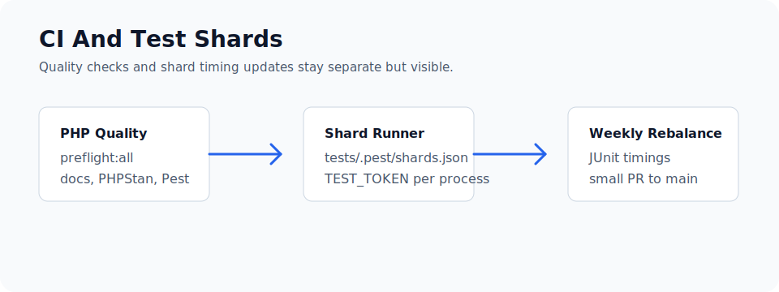

# CI And Test Shards

Capell's CI keeps two separate concerns visible: code quality checks run in the PHP Quality workflow, and Pest shard timing maintenance runs from a scheduled workflow that opens small rebalance pull requests.



## Pest Shards

`composer test:preflight` runs `scripts/run-pest-shards.php`. The runner partitions test files using `tests/.pest/shards.json`, then starts each shard as a Pest process with its own `TEST_TOKEN`.

Shard weights are maintained by `composer run test:shards:balance`, which runs `scripts/update-pest-shard-timings.php`. That script gathers per-file JUnit durations and rewrites `tests/.pest/shards.json` with repo-relative file timings. `scripts/patch-pest-shards.php` keeps the manifest available after Composer autoload refreshes.

The `.github/workflows/update-pest-shards.yml` workflow runs weekly and on demand. When timings change, it commits only `tests/.pest/shards.json` and opens a PR against `1.x`.

## Composer Refresh For Screenshot Fixtures

Composer install and autoload refresh matter for screenshot and docs checks because generated Filament/admin fixtures depend on package discovery and Testbench state. CI runs Composer validation and dependency install before quality checks so package providers, screenshot fixtures, and generated docs state use the current lock file rather than stale vendor metadata.

## Local Checks

Use the narrowest command while changing code:

```bash
vendor/bin/pest packages/frontend/tests/Unit/Cache --configuration=phpunit.xml
```

Before a finished branch, use:

```bash
composer preflight:all
```

`preflight:all` applies repository-wide Rector transformations and Pint formatting automatically, then runs Prettier in check mode. It also runs documentation checks, the root-doc guard, PHPStan baseline growth protection, and the sharded Pest preflight. Review and commit any generated changes before pushing; CI asserts that the command leaves a clean checkout, so uncommitted transformations still fail the build.

To apply Rector, Pint, and Prettier changes before rerunning the same checks, use:

```bash
composer preflight:fix
```

## Next

- [Development commands](commands.md)
- [Docs ownership rules](docs-ownership.md)
