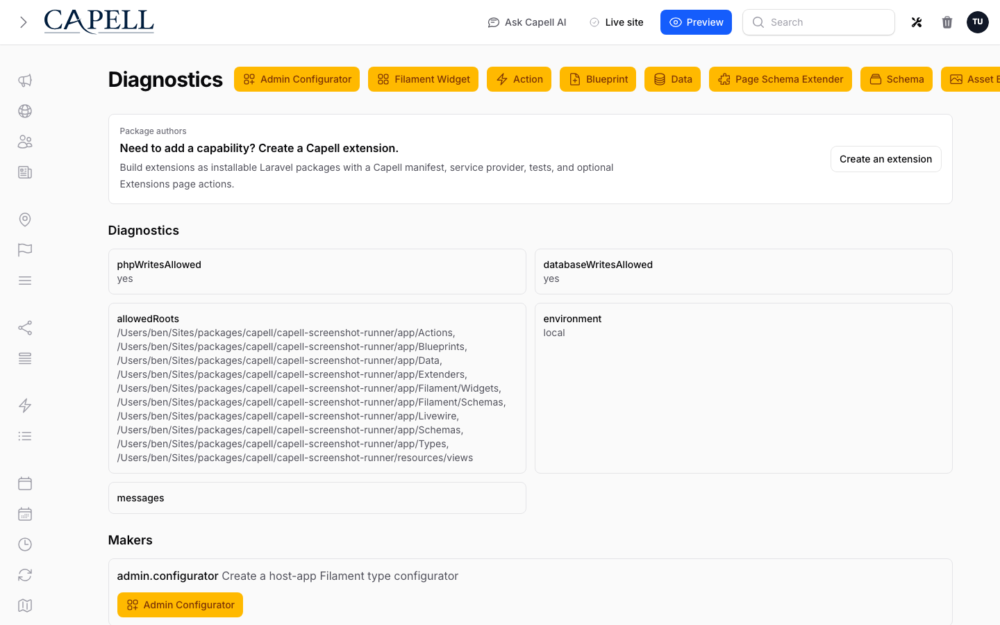

# Diagnostics



Capell developer tools are registry-backed. Packages register makers with
`Capell\Core\Contracts\Makers\MakerRegistryInterface`; the CLI, Filament page,
and form affordances all use the same preview and run flow.

## Safety

Configure maker writes in `config/capell.php`:

- `diagnostics.php_writes`: `disabled`, `local_only`, or `enabled`.
- `diagnostics.database_writes`: `disabled`, `local_only`, or `enabled`.
- `diagnostics.readonly_preview`: keeps UI actions in preview mode.
- `diagnostics.allowed_roots`: absolute roots makers may write to.
- `diagnostics.editor_url_template`: optional external editor URL.

Editor templates can use `{path}`:

```env
CAPELL_DEVELOPER_TOOLS_EDITOR_URL_TEMPLATE=vscode://file/{path}
CAPELL_DEVELOPER_TOOLS_EDITOR_URL_TEMPLATE=phpstorm://open?file={path}
```

## Registering A Maker

```php
use Capell\Core\Contracts\Makers\MakerRegistryInterface;
use Vendor\Package\Support\Makers\CustomMaker;

$this->callAfterResolving(MakerRegistryInterface::class, function (MakerRegistryInterface $registry): void {
    $registry->register(app(CustomMaker::class));
});
```

## Included Makers

Core registers makers for actions, data objects, page schema extenders, core
schemas, page types, page Blade components, page Livewire components, and asset
Blade components. Admin registers makers for host-app schemas and custom
Filament content blocks. [ContentSections](../packages/content-sections.md) registers `content-sections.widget` when installed.

## Admin UI

The Diagnostics Filament page lists registered makers, current safety
configuration, and registry diagnostics for schemas, components, and blocks.
Schema selectors can create host-app schemas by copying a selected source or by
falling back to a valid generated schema. Component selectors show source-flow
diagnostics and can opt into maker actions where a resource wants that workflow.

## Custom Widgets

`admin.filament-widget` creates a widget class in `app/Filament/Widgets`.
Host-app widgets are auto-discovered from that namespace and can be made
available to the content builder after `php artisan capell:admin-cache-widgets`.

## Next

- [Development](index.md)
- [Command index](commands.md)
