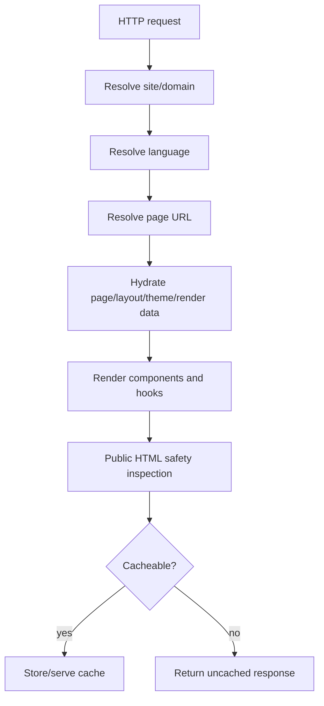

# Debugging Public Output

Use this when a public page renders the wrong HTML, leaks internal state, misses package output, bypasses cache, or serves stale content.

## Public Render Flow



Public Blade receives prepared data. If a Blade view queries the database or lazy-loads a relationship, treat it as a performance and safety bug.

## First Checks

```bash
php artisan optimize:clear
php artisan route:list
php artisan list capell
```

When static HTML cache is installed:

```bash
php artisan capell:html-cache:clear
php artisan queue:work
```

## Safety Scan

Fetch the page as an anonymous user and search for internal markers:

```bash
curl -s https://example.test/ > /tmp/capell-page.html
rg "filament|signed|field_path|data-capell|model_id|permission|editor|authoring" /tmp/capell-page.html
```

Expected result: no matches for admin/editor/internal markers. Public copy can naturally contain words like "editor" only when it is real content, not authoring state.

Frontend resource diagnostics follow the same rule. Admin-only overlays are fetched after load from authenticated admin routes; public cached HTML must not contain overlay markup, signed admin URLs, package names, model IDs, field paths, or debug payload data.

## Symptom Table

| Symptom                             | Likely cause                                                | Check                                                       | Fix                                                             |
| ----------------------------------- | ----------------------------------------------------------- | ----------------------------------------------------------- | --------------------------------------------------------------- |
| Package output missing              | Render hook/component not registered or unsupported context | `RenderHookRegistry`, component registry, package provider  | Register from frontend provider and test anonymous rendering.   |
| Package route returns page fallback | Path not reserved before frontend fallback                  | `php artisan route:list` and `ReservedFrontendPathRegistry` | Reserve exact path or prefix in frontend provider.              |
| Cache bypass header appears         | Unsafe HTML inspector found internal output                 | Response headers and safety scan                            | Remove authoring/admin state from public output.                |
| Stale page content                  | Queue/cache invalidation/static cache issue                 | Queue worker, cache driver, page cache directory            | Register invalidation dependency and run workers.               |
| Public Blade triggers queries       | View reads models/relationships directly                    | Laravel query log or tests with lazy loading prevention     | Hydrate data in controller/action/view component before render. |
| CSS missing in package output       | Tailwind source/import not registered                       | `TailwindAssetsRegistry::toReport()`                        | Register package source/import and rebuild assets.              |

## Test Recipes

### Anonymous Safety

```php
it('does not expose authoring markers to anonymous visitors', function (): void {
    $response = $this->get('/example-page');

    $response->assertOk();

    expect($response->getContent())
        ->not->toContain('data-capell-editor')
        ->not->toContain('field_path')
        ->not->toContain('filament')
        ->not->toContain('signed');
});
```

### Render Hook

```php
it('renders the package hook with public data only', function (): void {
    app(RenderHookRegistry::class)->register(RenderHookLocation::BodyStart, fn (): string => '<p>Public notice</p>');

    $this->get('/example-page')
        ->assertOk()
        ->assertSee('Public notice', false);
});
```

### No Lazy View Queries

```php
it('renders public page from hydrated data', function (): void {
    Model::preventLazyLoading();

    $this->get('/example-page')->assertOk();
});
```

## Next

- [Public HTML safety contract](public-html-safety.md)
- [Frontend extensions](../packages/frontend-extensions.md)
- [Frontend testing](../../packages/frontend/docs/testing-frontend.md)
