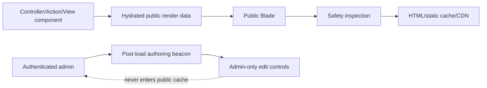

# Public HTML Safety Contract


Public Capell pages must look like ordinary public HTML to every non-admin visitor.

This applies to anonymous users, signed-in non-admin users, crawlers, cached HTML, static exports, previews served outside the admin, and CDN copies.

## Gold Standard

A safe public response has these properties:

- the HTML can be served unchanged to anonymous visitors, signed-in non-admin users, admins, crawlers, static exports, and CDN cache;
- admin editing controls are added only after page load by an authenticated admin beacon response;
- public Blade receives prepared data and does not discover editor state on its own;
- cacheable HTML does not contain anything that would help a visitor infer the editor, schema, package, or admin URL structure.



## Never Expose

Public HTML must not contain:

- authoring controls, editor scripts, or admin toolbar markup;
- model IDs, field paths, permissions, package names, or internal selectors;
- signed Filament editor URLs;
- editable markers or data attributes that reveal admin structure;
- hidden admin-only labels or diagnostics;
- lazy-loaded database state from public Blade views.

In-page authoring is a post-load admin feature. The public page loads normally, then an authenticated admin beacon may add edit controls for that admin session only.

## Where To Enforce It

| Area         | Rule                                                                                 |
| ------------ | ------------------------------------------------------------------------------------ |
| Public Blade | Receive hydrated render data. Do not query models or lazy-load relationships.        |
| Render hooks | Add only safe public markup. Do not output authoring selectors or package internals. |
| Page cache   | Refuse to cache unsafe responses. Treat bypass headers as a bug to fix.              |
| Themes       | Keep theme output public. Admin editing controls belong in frontend-authoring.       |
| Packages     | Test anonymous and non-admin output when the package renders public HTML.            |

## Safe And Unsafe Examples

Safe:

```blade
<article>
    <h1>{{ $pageTitle }}</h1>
    <div>{{ $summary }}</div>
</article>
```

Unsafe:

```blade
<article
    data-capell-editor="page"
    data-model-id="{{ $page->id }}"
    data-field-path="content.hero.title"
>
    <a href="{{ $signedEditorUrl }}">Edit</a>
    {{ $page->title }}
</article>
```

The unsafe example leaks model identity, field paths, editor selectors, and a signed admin URL into public HTML. It is unsafe even if the element is visually hidden.

## Debugging Checklist

Fetch the page as an anonymous user:

```bash
curl -s https://example.test/ > /tmp/capell-public.html
rg "filament|signed|field_path|data-capell|model_id|permission|authoring" /tmp/capell-public.html
```

Then check cache behavior:

```bash
curl -I https://example.test/
```

If the response bypasses cache because unsafe HTML was detected, fix the render path rather than forcing cache.

## Test Checklist

For rendering, cache, theme, beacon, or public package changes, test both presence and absence:

- expected public content is present;
- authoring controls are absent for anonymous users;
- admin URLs, model IDs, field paths, permissions, and selectors are absent;
- cached/static HTML matches the anonymous-safe output;
- public Blade does not rely on relationship fallback queries.

## Test Recipes

```php
it('serves anonymous-safe public html', function (): void {
    $response = $this->get('/example-page');

    $response->assertOk();

    expect($response->getContent())
        ->not->toContain('data-capell-editor')
        ->not->toContain('field_path')
        ->not->toContain('filament')
        ->not->toContain('signed');
});
```

```php
it('does not lazy load relationships while rendering public pages', function (): void {
    Model::preventLazyLoading();

    $this->get('/example-page')->assertOk();
});
```

```php
it('keeps cached html identical to anonymous-safe output', function (): void {
    $first = $this->get('/example-page')->getContent();
    $second = $this->get('/example-page')->getContent();

    expect($second)->toBe($first)
        ->and($second)->not->toContain('data-capell-editor');
});
```

## Next

- [Frontend](index.md)
- [Debugging public output](debugging-public-output.md)
- [Frontend testing](../../packages/frontend/docs/testing-frontend.md)
- [Package testing](../packages/testing-packages.md)
