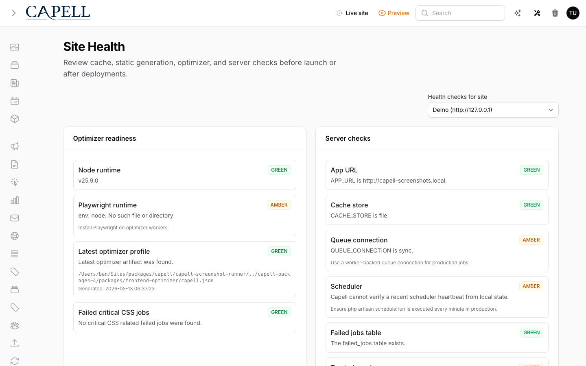

# Widget And Fragment Targets



A widget can expose interaction triggers that open another experience when the visitor acts. Targets render lazily through encrypted public routes, so the page never ships the target content or its internals up front.

## Interaction Targets

Widgets can expose interaction triggers through `data.__capell.interactions` or type defaults in `LayoutWidgetDefinitionData::$defaultInteractionTriggers`.

Supported target types:

| Target          | Use                                                                    |
| --------------- | ---------------------------------------------------------------------- |
| `widget`        | Render a registered widget through the lazy widget endpoint.           |
| `fragment`      | Render an encrypted Layout Builder block fragment.                     |
| `url`           | Link to a safe URL.                                                    |
| `public_action` | Use a safe fallback URL unless a package renders the action elsewhere. |

Supported behaviours for lazy targets are `modal`, `slide_over`, `inline_reveal`, and `replace_region`.

Widget targets render through `/_capell/widgets/{reference}`. The reference is encrypted JSON containing the widget type and data. The public trigger does not expose the widget type, component name, package name, target content, model IDs, field paths, or editor metadata.

Use a widget target when the visitor is opening a separate experience, such as a video player, form, gallery, quote calculator, or comparison panel. Use a Layout Builder fragment target when the visitor is loading a public block fragment from the current layout.

## Example: Button Opens A Video Widget

The editor-facing shape for a trigger that opens a video in a modal looks like this:

```php
[
    'label' => 'Watch tour',
    'icon' => 'heroicon-o-play-circle',
    'style' => 'primary',
    'target_type' => 'widget',
    'behavior' => 'modal',
    'modal_size' => 'lg',
    'target_widget' => [
        [
            'type' => 'video-player',
            'data' => [
                'title' => 'Product tour',
                'video_url' => 'https://example.com/product-tour.mp4',
            ],
        ],
    ],
]
```

The public page renders a safe trigger and an encrypted lazy widget URL. It does not render the target widget content until the visitor clicks.

Fragment targets render through `/_fragments/{reference}` with the same encrypted-reference rules.

## Public Output Rules

Widget HTML and interaction placeholders must not expose:

- admin/editor controls;
- model IDs;
- field paths;
- block keys;
- component names;
- package namespaces;
- signed URLs;
- raw target widget data.

Use [Public HTML safety](public-html-safety.md), [Presentation delivery](../../packages/frontend/docs/presentation-delivery.md), and [Frontend extensions](../packages/frontend-extensions.md) when changing widget rendering.

## Next

- [Frontend widgets](widgets.md)
- [Widget registration](widget-registration.md)
- [Widget state](widget-state.md)
- [Capell Interactions](../getting-started/capell-interactions.md)
