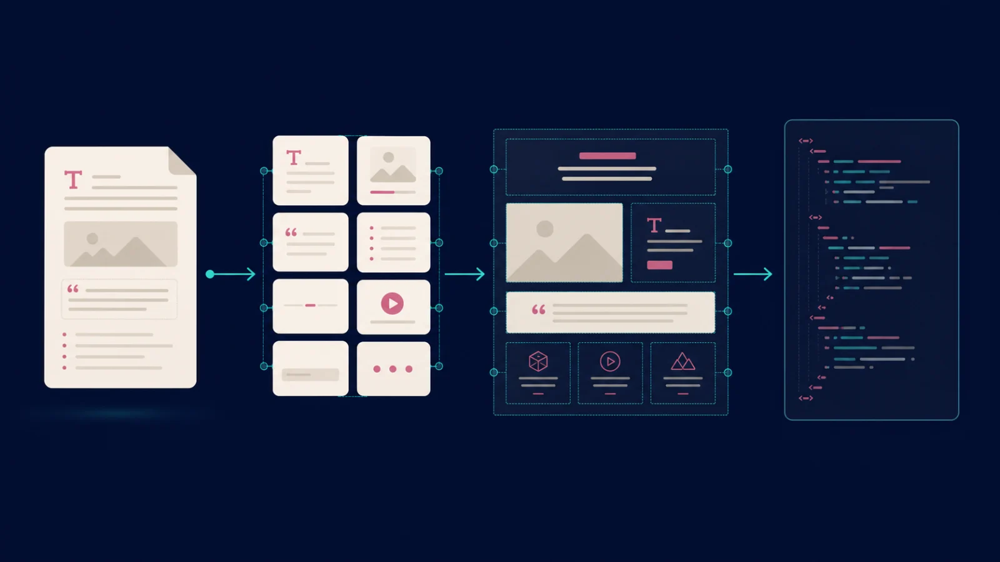
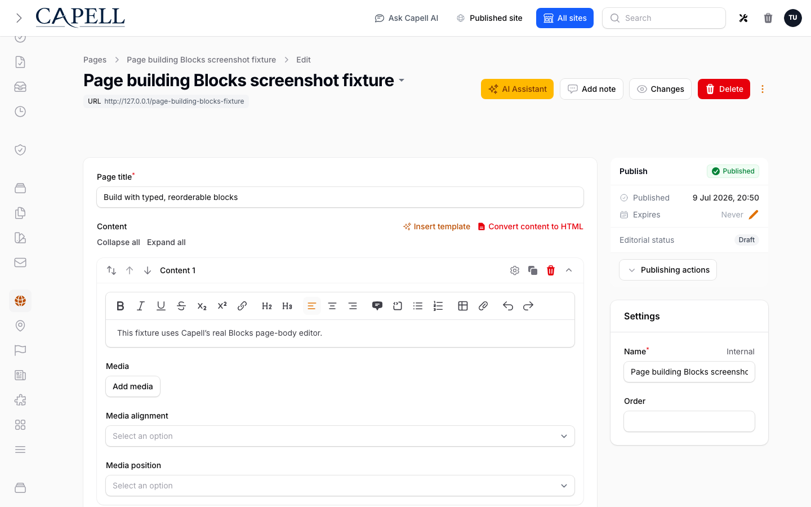
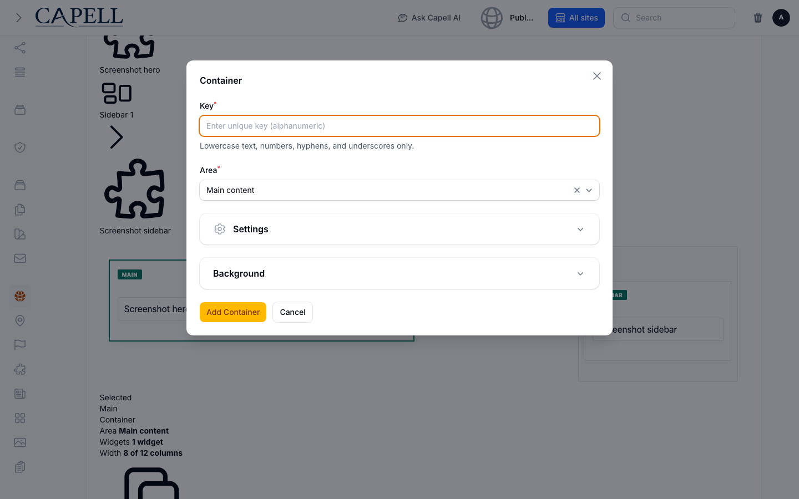
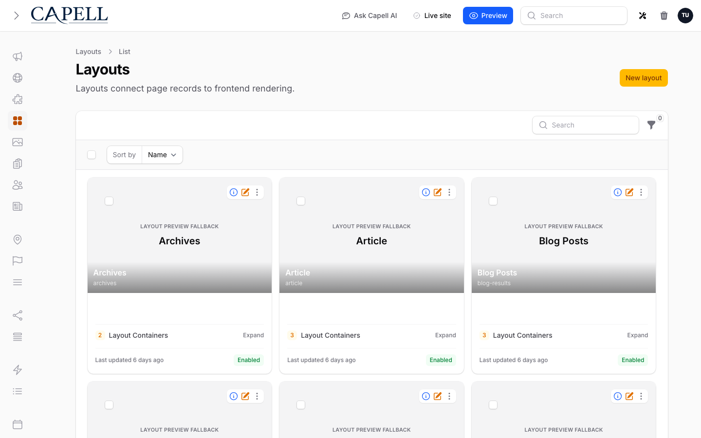

# Build a page

Start with the smallest page-building path that gives editors what they need. Move from HTML to blocks when the page body needs typed, reorderable units; move to Layout Builder when the page needs approved section composition; use a custom Blade layout only when the page is genuinely bespoke.

A page does not have a direct `view_file` override. Give one page a custom Blade implementation by assigning it a dedicated layout with `master_file` and, where needed, `layout_file`. A widget can use its own `view_file`.

The diagram is an explanatory illustration, not a product screenshot. The screenshots below show real Capell admin surfaces.

## Choose the scope before the tool

| Scope     | Controls                                                                | Use it for                                                            |
| --------- | ----------------------------------------------------------------------- | --------------------------------------------------------------------- |
| Page      | Content, `content_structure_override`, and its assigned layout          | One page that needs different authored content or a different layout. |
| Page type | Default content structure and shared page editing rules                 | A repeatable class of pages that should begin in HTML or blocks.      |
| Layout    | Shared containers, layout composition, `master_file`, and `layout_file` | Pages that share section architecture or a public shell.              |
| Widget    | Reusable rendered unit, its content, assets, and optional `view_file`   | A repeatable piece of a layout, such as a hero, card grid, or CTA.    |

The page type supplies the default. A page can opt out for its own body with `content_structure_override`; leave that unset when the page should continue to follow its type. Layout Builder then composes the assigned layout as `page -> layout -> containers -> widgets -> widget assets`.

## 1. Basic HTML content

Use HTML content for ordinary prose: headings, paragraphs, lists, links, and a page body that does not need editor-managed modules. It is the normal starting point for a simple About, policy, or contact page.

_The standard page content editor. Its rich-text body is the smallest authoring surface for ordinary prose._

Set the page type's content structure to HTML when that is the normal shape for pages of that type. An editor can use the page's content mode control when one page needs a different shape; Capell records that as `content_structure_override`, rather than changing the type for every page.

Use the [Create your first page](create-your-first-page.md) guide for the basic page workflow. Keep public rendering on the normal frontend path: templates receive prepared page data and should not query models or lazy-load relationships.

## 2. Structured content blocks

Move to blocks when a page body needs typed, reorderable units. The page type can default to blocks, while `content_structure_override` lets one page stay in HTML or switch to blocks without changing every page of that type.

Blocks are a body-authoring choice, not a replacement for a page layout. Use the package-owned [Block Library documentation](https://docs.capell.app/packages/block-library) for available block types and custom block implementation details.

_The Blocks page-body editor on a page whose `content_structure_override` is Blocks. Each visible item is a typed content block; the editor can add, configure, clone, and reorder those items without opening Layout Builder._

## 3. Layout Builder widgets

Use Layout Builder when the page needs approved section composition: named regions, reusable widgets, and widget assets arranged as a layout. It is appropriate when the page needs a hero plus a main area, sidebar, proof strip, or a repeatable campaign structure.

_The Layout Builder composition canvas: the selected Main container and Sidebar container are visible behind the real container form. An assigned layout holds named containers, and containers hold reusable widgets._

_The Add Widget modal opens in the context of the selected container, so editors compose from approved widget definitions rather than arbitrary page markup._

The layout is shared by every page assigned to it. Create or clone a layout before making a change that should not affect other pages. Each widget owns its reusable content and any widget assets it needs; the layout owns placement and container settings.

For package installation, widget definitions, containers, assets, and extension details, use the package-owned [Layout Builder documentation](https://docs.capell.app/packages/layout-builder). Do not duplicate its implementation API in a page guide.

_The Layouts list is the shared-composition boundary. A page assignment chooses a layout; editing that layout can affect every assigned page._

## 4. Custom Blade rendering

Use a custom Blade layout when a page is genuinely bespoke: a design cannot be expressed safely by the approved containers and widgets, or it needs a dedicated public shell. This remains inside Capell's normal public response path, including its prepared render context and caching rules; do not add a parallel public controller or route just to render one page.

Create a dedicated layout in the admin and assign it only to that page. Set its developer-facing layout metadata in the layout's **Files** section:

- `master_file` selects the Blade view for the page body.
- `layout_file` selects the outer document shell that receives the rendered body slot.
- A widget's `view_file` can override that widget's view when the widget, rather than the whole page, needs a bespoke rendering.

There is no page-level `view_file`. A page does not have a direct `view_file` override; assigning a dedicated layout with `master_file` and `layout_file` is the supported per-page route to full Blade control.

Keep these views public-safe. Blade should use hydrated data prepared by Capell; do not run queries, call `loadMissing()`, or reach back into package state from a public view. Do not expose authoring IDs, field paths, selectors, package internals, permissions, or signed preview URLs. See the [public HTML safety contract](../frontend/public-html-safety.md) before changing public output.

## A practical default

Start every new page with HTML unless the content itself needs structured blocks. Add Layout Builder when the team needs reusable section composition. Reach for a dedicated Blade layout only after the page cannot be expressed as a safe layout and widget composition. That keeps page content simple, shared structure reusable, and bespoke code isolated to the layout that needs it.

## Read next

- [Create your first page](create-your-first-page.md) for the page editor workflow.
- [Block Library](https://docs.capell.app/packages/block-library) for block definitions and package details.
- [Layout Builder](https://docs.capell.app/packages/layout-builder) for containers, widgets, and assets.
- [Frontend](../frontend/index.md) for public rendering and theme boundaries.
