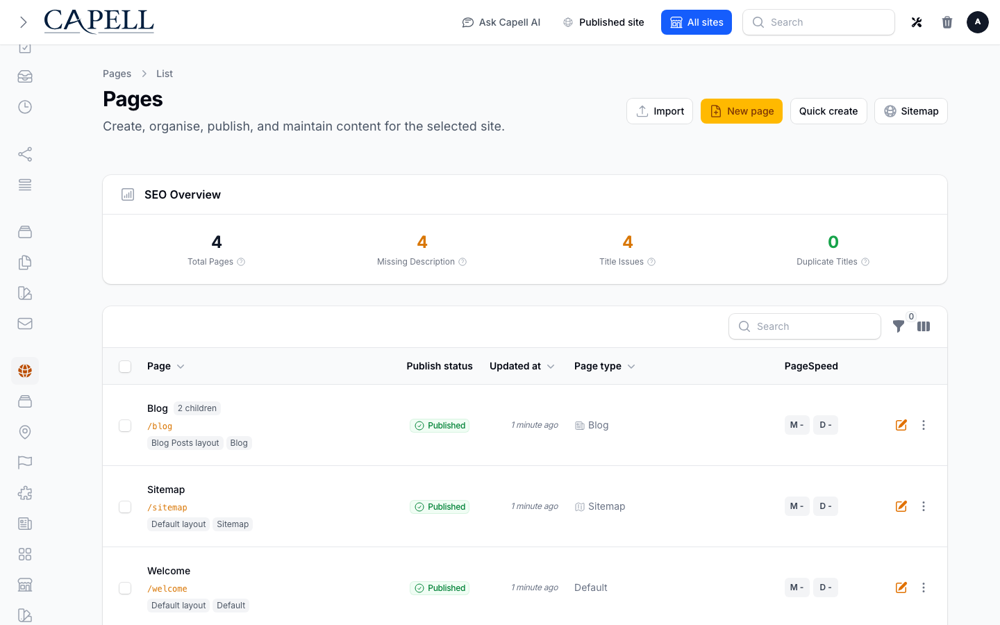
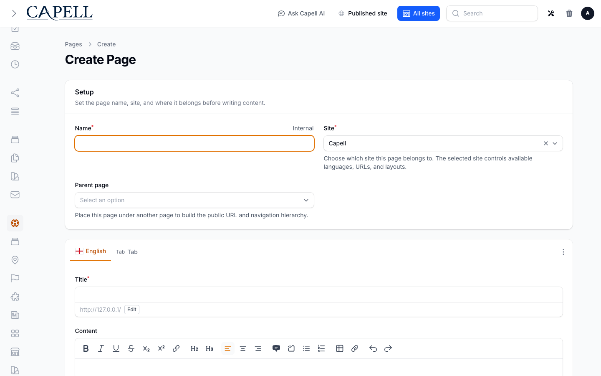

# Create your first page

Create a useful About or Contact page, save a draft, check it, then publish it. Start after a successful install, with an account that can log in to `/admin`. The expected result is your new content at the page’s canonical public URL, visible to a visitor who is not signed in.

If you have not installed Capell yet, start with the [quickstart](quickstart.md) or the full [install guide](install.md).

## Start from Pages

Open **Pages** from the sidebar. Pages are the main routable content records in Capell: they belong to a [Site](../reference/glossary.md#editing-terms), can sit inside a page tree, and publish to frontend URLs.

<picture><source media="(prefers-color-scheme: dark)" srcset="../images/generated/admin/first-page-pages-list-dark.png"></picture>

[Light](../images/generated/admin/first-page-pages-list.png) · [Dark](../images/generated/admin/first-page-pages-list-dark.png)

Check the selected site, then click **New page** and choose a page type from those offered. Its blueprint determines the content fields you will see. You can also open an existing page from the list to practise with seeded content.

<picture><source media="(prefers-color-scheme: dark)" srcset="../images/generated/admin/first-page-new-page-action-dark.png"></picture>

[Light](../images/generated/admin/first-page-new-page-action.png) · [Dark](../images/generated/admin/first-page-new-page-action-dark.png)

## Choose the page context

The first fields decide where the page lives before you write content.

<picture><source media="(prefers-color-scheme: dark)" srcset="../images/generated/admin/first-page-create-top-fields-dark.png"></picture>

[Light](../images/generated/admin/first-page-create-top-fields.png) · [Dark](../images/generated/admin/first-page-create-top-fields-dark.png)

**Site** — which public website owns the page. Even on a single-site install, the Site carries the domain, languages, default pages, related sites, and brand-level details the frontend uses.

**Parent Page** — where the page sits in the tree.

- Leave it empty for a top-level page such as `/about`.
- Choose a parent when the page belongs under another, such as `/about/team`.

**Internal name** — the admin-facing name for the page record. It normally follows the page title, but you can keep the admin list clear when the frontend title is long or marketing-led.

<picture><source media="(prefers-color-scheme: dark)" srcset="../images/generated/admin/first-page-parent-selector-dark.png"></picture>

[Light](../images/generated/admin/first-page-parent-selector.png) · [Dark](../images/generated/admin/first-page-parent-selector-dark.png)

## Understand parents and URLs

Capell builds URLs from the page tree.

| Page setup                                   | Resulting URL    |
| -------------------------------------------- | ---------------- |
| Top-level page with slug `about`             | `/about`         |
| Child page with slug `team` under `about`    | `/about/team`    |
| Child page with slug `careers` under `about` | `/about/careers` |

Moving a page to a different parent changes the URL path. Capell creates automatic redirect [Page URLs](../../packages/core/docs/page-management.md) when a published page's slug or parent path changes, so old URLs keep pointing at the current page. Use the Redirects or URL Manager package when you need manual redirects, imports, hit counts, or deeper redirect reporting.

For more background, read [How Capell works](how-capell-works.md#the-core-model).

## Add the title and slug

**Title** — the main human-readable page title. It usually appears in the browser title, search snippets, social previews, and any frontend template that prints the page heading.

**Slug** — the URL segment. Capell fills it from the title, so `About Our Team` becomes `about-our-team`. Edit it when you need a shorter or clearer URL.

**URL preview** — shows the Site domain and parent path before the slug. Use it as a quick check before saving.

Good first-page examples:

| Page          | Title      | Slug       |
| ------------- | ---------- | ---------- |
| About page    | `About`    | `about`    |
| Contact page  | `Contact`  | `contact`  |
| Services page | `Services` | `services` |

Keep slugs short, lowercase, and stable. Changing a slug after publishing changes the public URL.

## Optionally add an image

If your page needs a photo or illustration, prepare it before attaching it to the page:

1. Open **Media** in the sidebar and choose **Upload files**. Choose an image within your configured upload limits, select the intended site in **Attach to site**, and submit the action. Wait for the upload success notification.
2. Open the uploaded item using **Manage media**. In **Localized metadata**, use **Add locale metadata** if needed, select the page’s **Language**, and fill **Alt text** with a short description of the meaningful image content. Repeat for the other languages you will publish, then save. Use **Decorative image** only for an image that adds no information.
3. Return to your page. If its configured image field offers a media-library picker, select the uploaded item there; if it offers upload only, use that field’s upload control, then check the resulting attached media item’s language-specific alt text before publishing. Some page types place images in blocks or widgets instead of a page-level field. Use the fields supplied by that blueprint rather than assuming every page has a featured-image field.
4. Save the page and check the image in the preview before publishing. Uploading a file to **Media** alone does not place it on the page.

See [Upload a file](../admin/media-management.md#upload-a-file), [language-specific alt text and captions](../admin/media-management.md#add-alt-text-and-captions-per-language), and [upload limits](../admin/media-management.md#limits). If your page type has no image field or media control, publish the text first and use [Build a page](building-pages.md) to choose an appropriate content structure.

## Write the content

Use the content fields provided by the selected page type. A plain text page normally has a **Content** editor for headings, paragraphs, links, tables, lists, and simple formatting. When the page needs typed blocks or approved section composition, choose the supported path in [Build a page](building-pages.md): page-type blocks with a page-specific `content_structure_override`, or the optional Layout Builder package for containers, widgets, and widget assets.

For your first page, keep it simple:

1. Add a short heading or opening sentence.
2. Add one paragraph of useful body copy.
3. Choose **Save as draft**.
4. Follow [Preview and publish](#preview-and-publish) below.

## Fill useful extra content

Open **Extra Content** when the page needs supporting fields.

The exact fields can vary by blueprint and installed packages, but the common ideas are:

| Field                | What it is for                                                  |
| -------------------- | --------------------------------------------------------------- |
| Summary              | A short description for cards, listings, and fallback metadata. |
| Label                | Alternate text used by some themes or navigation surfaces.      |
| Link text / CTA text | Button or link copy when another page links to this one.        |

You do not need to fill every field on the first pass. Add the content that helps the frontend theme render the page well.

## Pick a layout and publish timing

**Layout** — which frontend template renders the page. A normal content page can use the default layout; a landing page, article, product page, or campaign page may use a different one if your project has registered it.

**Visible From** — scheduled availability. Leave it empty when the page should be available as soon as it is published.

Page **Blueprint** is closely related to layout, but it is not the same thing. Blueprints define reusable editing, rendering, and behaviour rules:

| Concept   | Practical meaning                                       |
| --------- | ------------------------------------------------------- |
| Blueprint | Reusable editing, rendering, and behaviour rules.       |
| Layout    | Controls how the frontend renders the page.             |
| Content   | The text, media, and structured fields the editor adds. |

Developers can register custom blueprints through Capell extension points. Read [Blueprints](types.md) for examples and screenshots, or [How Capell works](how-capell-works.md#extension-points) when you are ready for the deeper model.

## Save as draft first

Choose **Save as draft** on the new-page form. The page is stored in Admin, but it is not available to anonymous visitors yet. The other create action is **Save and Publish**, so use the draft action for this first review.

On an already published page, the save action is labelled **Save**. If workflow packages are installed, draft changes and publishing may move through [approvals](../../packages/admin/docs/permissions-and-approval.md), Publishing Studio, or scheduled publishing; follow the actions and checks your installation presents.

## Preview and publish

1. Open your saved draft for editing from **Pages**. Choose **Preview draft** to open its signed preview in another tab. When editing an existing published page, use the preview action your configured workflow provides and remember that **Save** can update the live page. Check the text, links, and any image. This preview lets you review unpublished content; it does not make the page public.
2. Return to the editor and inspect the **Publish** panel. For an immediate first publication, review its URL and publishing blockers, and avoid a deliberate future **Visible From** or expired **Visible until** date. A saved draft is expected to remain unavailable until you publish it.
3. Choose **Save and Publish** on the draft editor, or the **Publish** action provided by your workflow. Resolve any validation or approval message rather than assuming the save made the page live.
4. Copy the canonical public URL for the page and open it in a private browser window with no Admin session. Use the ordinary site URL, not the signed preview link. For a top-level page with slug `about`, this is normally the selected site’s domain followed by `/about`.
5. Confirm that the page loads and shows the text you just wrote, plus the image if you attached one. Reload after any later change to prove it reaches visitors.

The [published public-page example](../frontend/guide.md) shows the kind of frontend result to check. Your page’s appearance depends on its theme and layout. A draft, a future schedule, “Not visible now”, or a successful preview is not a successful immediate publication.

If the public URL returns a 404 or the page stays unavailable, check the selected site, URL, publishing blockers and dates, then use [Troubleshooting](../operations/troubleshooting.md). For a queued page that never generates, follow [Published pages never generate](../operations/troubleshooting.md#published-pages-never-generate).

Use **Unpublish** from the edit page when the page should come down. To schedule a removal, set **Visible until** in the Publish Dates section. Use **Cancel scheduled unpublish** if the page should stay live after a removal date was set.

If the frontend still shows old content, use the admin **Clear Cache** action. Ask a developer to run the cache commands below only when the admin action does not clear the stale output:

<!-- capell-docs-commands: optional-package -->

```bash
php artisan capell:html-cache:clear
```

If the project uses `capell-app/html-cache`, a developer can also run `php artisan capell:static-site` to warm the [generated public cache](../architecture/page-cache.md).

If the project uses a queue connection such as `database` or `redis`, a developer should keep a worker running while testing publishes:

```bash
php artisan queue:work
```

See [Troubleshooting](../operations/troubleshooting.md) if the page shows a 404, stale content, or a blank frontend screen.

## Adjust settings after the page exists

On edit screens, Capell shows additional page settings and package-provided fields. These can include SEO settings, canonical URL choices, cache behaviour, featured images, and other fields added by extensions.

<picture><source media="(prefers-color-scheme: dark)" srcset="../images/generated/admin/first-page-edit-settings-tab-dark.png"></picture>

[Light](../images/generated/admin/first-page-edit-settings-tab.png) · [Dark](../images/generated/admin/first-page-edit-settings-tab-dark.png)

For a first page, avoid tuning everything at once. Confirm the page renders first, then come back for SEO and sharing details.

## Configure the Site once

A **Site** is bigger than one page. It represents the public web property that all its pages belong to.

Site-level details can apply across every page for that site:

| Site detail                | Where it is used                                             |
| -------------------------- | ------------------------------------------------------------ |
| Company or business name   | Footer, contact blocks, schema, and theme copy.              |
| Logo and inverted logo     | Header, footer, dark backgrounds, and theme components.      |
| Favicon and icon           | Browser tabs, saved shortcuts, and app-like surfaces.        |
| Brand color                | Theme accents, buttons, and package-aware UI choices.        |
| Email, phone, contact page | Footer, contact cards, schema, and reusable widgets.         |
| Domains and languages      | URL generation, language tabs, canonical links, and routing. |

Site records live in the **Settings** area of the admin sidebar. Open **Sites** when you need to update the company, logo, favicon, brand, domain, language, or related site details behind the pages.

Change Site details when the same value should affect the whole website. Change Page details when the value only belongs to one page.

For the full admin map, see the [Admin interface guide](../admin/interface.md).

## Useful next extensions

Do not install every package on day one. Add the next package when the page you are building clearly needs it.

| Extension                                                      | Add it when you need                                                                                       |
| -------------------------------------------------------------- | ---------------------------------------------------------------------------------------------------------- |
| [ContentSections](../packages/catalog.md#capell-foundation)    | Custom rows, columns, widgets, reusable content blocks, and richer page layouts.                           |
| [Navigation](../packages/catalog.md#capell-foundation)         | Header, footer, sidebar, or utility menus that link your pages together.                                   |
| [Redirects](../packages/catalog.md#capell-foundation)          | Manual redirects or safer URL changes after pages have been published.                                     |
| Built-in Default Theme                                         | A practical frontend starting point provided by `capell-app/frontend` without installing a theme package.  |
| [Frontend Authoring](../packages/catalog.md#capell-foundation) | Edit page title, description, or content from the public page after the admin-only beacon confirms access. |
| [Media Library](../packages/catalog.md#capell-foundation)      | The Curator media backend and picker, instead of the default Spatie MediaLibrary backend.                  |
| [SEO Suite](../packages/catalog.md#capell-search--seo)         | Audits, structured data, robots controls, and stronger social metadata.                                    |
| [Site Discovery](../packages/catalog.md#capell-foundation)     | HTML/XML sitemaps and discoverability files.                                                               |

That order keeps the learning curve sane: create pages first, add structured blocks or Layout Builder when the content needs it, connect pages with Navigation, protect URLs with Redirects, then add SEO or richer operational tooling when the site is real enough to benefit.

## Next

- [Your first session](first-session.md) for the broader admin tour.
- [Build a page](building-pages.md) to choose HTML, blocks, Layout Builder, or a dedicated Blade layout.
- [How Capell works](how-capell-works.md) for Sites, Pages, Blueprints, Layouts, and extension points.
- [Packages and extensions](../packages/catalog.md) for host package boundaries and extension documentation links.
- [Glossary](../reference/glossary.md) for quick definitions.
