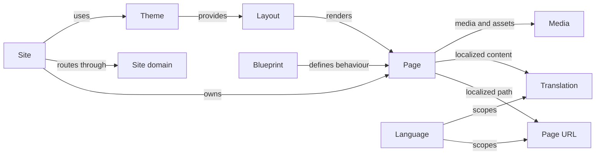
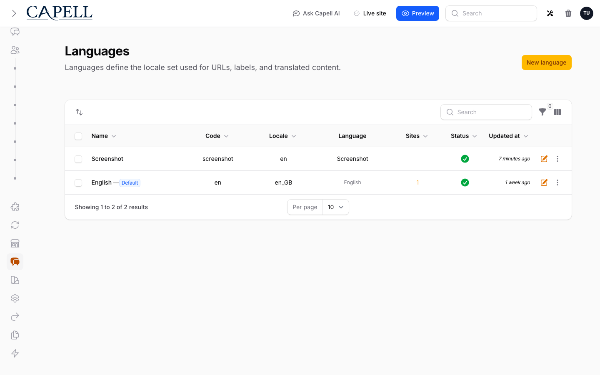
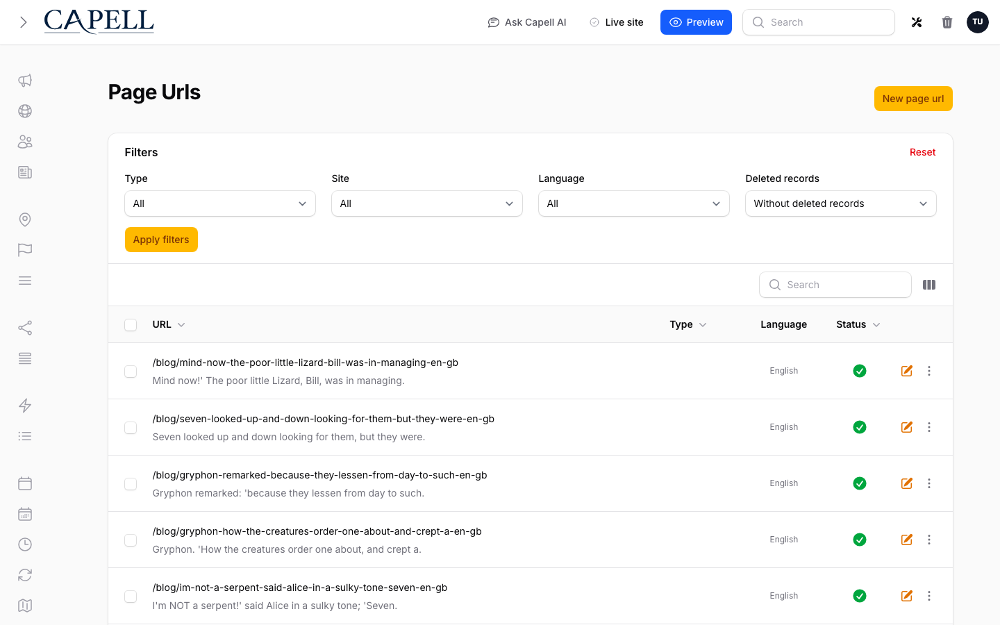

# How Capell Works


Capell is built as a package-based CMS foundation for Laravel. The host packages in this repository own the main schema, admin surface, frontend surface, and plugin lifecycle support, while larger features ship as optional add-on packages.

## The Core Model

Most Capell work follows this path:

`Site -> Language -> Page URL -> Page -> Blueprint/Layout/Theme -> Rendered frontend page`



The main concepts map to one idea each:

| Concept   | One-line meaning                                                                                                                                                                                      |
| --------- | ----------------------------------------------------------------------------------------------------------------------------------------------------------------------------------------------------- |
| Site      | A public web property. It can have one domain or several, one language or several, and its own pages, settings, and theme choices.                                                                    |
| Page      | A structured record in a hierarchy. It owns translated URLs, type-specific fields, publishing state, media, and layout relationships.                                                                 |
| Page URL  | A site-scoped, language-aware path and slug. Each page can have several, including automatic [redirects](../../packages/core/docs/page-management.md) when slugs or parents change.                   |
| Layout    | Connects content to frontend rendering. This is the core [`Layout`](../reference/glossary.md#developer-terms) template model, not the ContentSections Layout Builder blocks editors drag onto a page. |
| Blueprint | Reusable editing, rendering, and behaviour rules shared across pages, widgets, layouts, and package-owned content models.                                                                             |
| Theme     | The active theme path and identity a site renders through.                                                                                                                                            |

The important product detail is that one visible page is not just one content record. It is a site-scoped, language-aware URL, a page record, type/blueprint rules, layout selection, media, settings, package contributions, cache dependencies, and public output safety checks working together.

The main content records are deliberately small and composable:



| Model         | Practical job                                                                 |
| ------------- | ----------------------------------------------------------------------------- |
| `Site`        | Owns domains, languages, settings, pages, and theme choices                   |
| `Language`    | Defines locale and default-language behaviour for a site                      |
| `Page`        | Stores the page tree, publishing state, assigned blueprint, and relationships |
| `PageUrl`     | Stores localized URLs and slugs for each page                                 |
| `Blueprint`   | Stores reusable editing, rendering, and behaviour rules                       |
| `Layout`      | Connects structured content to frontend templates                             |
| `Theme`       | Records the active theme path and identity                                    |
| `Media`       | Stores media library records and relationships                                |
| `Translation` | Stores translated field values across models                                  |

Pages use a nested tree, so moving a parent page can affect child URLs, navigation, breadcrumbs, cache keys, and frontend rendering. That is why writes should go through Capell actions instead of model methods with hidden side effects.



For a fuller visual reference, see the [Core relationship map](../reference/core-erd.md).

## Request And Editing Flow

Capell keeps the editing surface, domain behaviour, and frontend rendering separate.

```text
Admin form or HTTP request
    -> Data object
    -> Action::run()
    -> Core model write
    -> Events, subscribers, and cache invalidation
    -> Frontend request resolves the updated page
```

Data objects carry structured state across package, HTTP, Livewire, and Filament boundaries. Actions own the domain behaviour. Filament resources, Livewire components, controllers, and commands should call actions rather than duplicating CMS rules inline.

On the public side, frontend requests resolve the site, language, page, layout, and render context before returning a Blade response. When caching is enabled, the frontend middleware can serve cached HTML and rely on model events or registered cache dependencies to invalidate affected pages after content changes.

In-page editing sits outside that rendered HTML. Frontend Authoring waits until the page has loaded, calls the beacon, and only then decorates the page for an authenticated admin. Anonymous users and non-admin users get the same ordinary page HTML: no editor scripts, no hidden region markers, no model IDs, and no signed edit URLs.

## Host Packages

These packages make up the normal product in this repository:

| Package     | Composer name            | Status      | What it owns                                                                                                                  |
| ----------- | ------------------------ | ----------- | ----------------------------------------------------------------------------------------------------------------------------- |
| Core        | `capell-app/core`        | `Available` | Main schema, models, registries, settings orchestration, install and upgrade flow                                             |
| Admin       | `capell-app/admin`       | `Available` | Filament admin surface, resources, settings UI, dashboards, and admin extension points                                        |
| Frontend    | `capell-app/frontend`    | `Available` | Public routing, rendering, cache-aware middleware, asset aggregation, and frontend extension points                           |
| Installer   | `capell-app/installer`   | `Available` | Installer guidance and cleanup flow                                                                                           |
| Marketplace | `capell-app/marketplace` | `Available` | [Extension marketplace](../../packages/marketplace/docs/overview.md) browsing, acquisition, and install authorization support |

## Host Features Vs Package Features

Capell uses host packages for shared contracts and optional packages for product depth. Keep this split clear when you build or document a feature.

| Capability         | Host package responsibility                                                                                                               | Optional package responsibility                                                                                                                                       |
| ------------------ | ----------------------------------------------------------------------------------------------------------------------------------------- | --------------------------------------------------------------------------------------------------------------------------------------------------------------------- |
| Page and URL model | `Core` owns sites, languages, pages, Page URLs, layouts, blueprints, themes, redirects, and shared settings.                              | Blog, ContentSections, URL Manager, and other packages add specialist content types or richer workflows.                                                              |
| Admin workspace    | `Admin` owns the Filament panel, core resources, policies, settings shell, extension surfaces, and dashboard slots.                       | Packages register resources, pages, widgets, settings, reports, schema extenders, and workflow actions.                                                               |
| Public rendering   | `Frontend` owns request resolution, render context, public Blade/Livewire output, hooks, assets, cache headers, and public-output safety. | Themes, [HTML Cache](../architecture/page-cache.md), Frontend Authoring, SEO Suite, Site Discovery, Inertia, and widget packages add runtime behaviour.               |
| Publishing         | Host pages have publishing dates, visibility checks, policies, and cache invalidation hooks.                                              | Publishing Studio adds workspaces, [approvals](../../packages/admin/docs/permissions-and-approval.md), scheduling, revisions, preview links, and workflow dashboards. |
| Recovery           | `Admin` provides the Recovery Center shell and contracts.                                                                                 | Migration Assistant owns export, import, media ingest, rollback reports, and package archive workflows.                                                               |
| SEO and discovery  | Host models provide site/language URL foundations and canonical relationships.                                                            | SEO Suite, Site Discovery, URL Manager, and Search add metadata, sitemaps, robots, redirects, audits, and search.                                                     |

## Optional Packages

Optional packages extend the host surfaces rather than replacing them.

Examples:

- `Capell Foundation`: ContentSections, blog, navigation, frontend authoring, the built-in Frontend default theme, HTML Cache, and Site Discovery
- `Capell Publishing Pro`: Publishing Studio and preview tooling
- `Capell Operations`: Migration Assistant, Diagnostics, Exception Reports, and Login Audit
- `Capell Search & SEO`: SEO operations and site search

Use [Approved packages](../packages/catalog.md) for the package registry.

## Developer Deep Dive Example

Imagine a package that adds an `Article` content type. A non-technical description is simple: editors can create articles, show latest articles on pages, and publish them safely. The developer implementation should stay split across the Capell surfaces.

| Surface  | What the package registers                                                                                                                         | Why it belongs there                                                       |
| -------- | -------------------------------------------------------------------------------------------------------------------------------------------------- | -------------------------------------------------------------------------- |
| Core     | Article model, migrations, page subject contract, article blueprint, settings class, and any lifecycle subscribers.                                | Core owns structured records and package contracts.                        |
| Admin    | Article resource, dashboard Filament widget, settings schema, and page form extenders.                                                             | Admin owns Filament surfaces and editor controls.                          |
| Frontend | Article widget, [render hooks](../../packages/frontend/docs/extending-render-hooks.md), reserved routes if needed, assets, and cache dependencies. | Frontend owns public rendering and safe output.                            |
| Package  | Actions and Data objects such as `PublishArticleAction` and `ArticleData`.                                                                         | The package owns product behaviour; host packages expose extension points. |

### Provider Wiring

The provider wiring should be boring and explicit:

```php
use Capell\Admin\Facades\CapellAdmin;
use Capell\Core\Data\PageTypeData;
use Capell\LayoutBuilder\Data\LayoutWidgets\LayoutWidgetDefinitionData;
use Capell\Core\Facades\CapellCore;
use Capell\LayoutBuilder\Support\LayoutWidgets\LayoutWidgetRegistry;
use Capell\Frontend\Enums\RenderHookLocation;
use Capell\Frontend\Support\Cache\CacheInvalidationRegistry;
use Capell\Frontend\Support\Render\RenderHookRegistry;
use Vendor\Articles\Admin\ArticleAdminBridge;
use Vendor\Articles\Models\Article;

public function boot(
    LayoutWidgetRegistry $widgets,
    RenderHookRegistry $renderHooks,
    CacheInvalidationRegistry $cacheInvalidation,
): void {
    CapellCore::registerPageType(new PageTypeData(
        name: 'article',
        model: Article::class,
        label: __('capell-articles::pages.article'),
    ));

    CapellAdmin::registerAdminBridge('capell-app/articles', ArticleAdminBridge::class);

    $widgets->registerDefinition(LayoutWidgetDefinitionData::frontendBlade(
        key: 'latest-articles',
        component: 'capell-articles::widgets.latest-articles',
        resourceGroups: ['capell-articles.listing'],
    ));

    $renderHooks->register(
        RenderHookLocation::HeadClose,
        fn (): string => view('capell-articles::frontend.metadata')->render(),
    );

    $cacheInvalidation->registerDependency(Article::class, ['articles-index', 'home']);
}
```

### Admin Bridge

The admin bridge then contributes the Filament pieces without putting those concerns in the host Admin package:

```php
use Capell\Admin\Contracts\Bridges\AdminBridge;
use Capell\Admin\Data\Bridges\AdminBridgeContextData;
use Capell\Admin\Support\Bridges\AdminBridgeRegistrar;

final class ArticleAdminBridge implements AdminBridge
{
    public function register(AdminBridgeRegistrar $registrar, AdminBridgeContextData $context): void
    {
        $registrar->resource(ArticleResource::class, group: 'content', name: 'articles');
        $registrar->filamentDashboardWidget(RecentArticlesWidget::class);
        $registrar->settingsClass('articles', ArticleSettings::class);
        $registrar->settingsSchema('articles', ArticleSettingsSchema::class);
    }
}
```

### Actions And Data Boundary

The Actions/Data boundary keeps product rules out of UI code:

```php
use Lorisleiva\Actions\Concerns\AsObject;

final class PublishArticleAction
{
    use AsObject;

    public function handle(ArticleData $data): Article
    {
        return Article::query()->updateOrCreate(
            ['slug' => $data->slug],
            $data->toArray(),
        );
    }
}
```

Filament pages, commands, queued jobs, controllers, and Livewire components call `PublishArticleAction::run($data)`. They should not repeat slug rules, cache invalidation, permission checks, or publishing rules inline.

## Deep Dive Checklist

Use this checklist when deciding whether a documented feature is complete:

| Question                                 | Good answer                                                                                                                   |
| ---------------------------------------- | ----------------------------------------------------------------------------------------------------------------------------- |
| Who owns the data?                       | Host model, package model, or app model is named clearly.                                                                     |
| Where are writes handled?                | An Action owns the behaviour and receives a Data object or explicit typed arguments.                                          |
| How does the admin see it?               | Admin bridge, resource, page, widget, settings schema, or tagged extender is named.                                           |
| How does public output render?           | Frontend component, widget, theme view, render hook, or renderer is named.                                                    |
| What happens when the package is absent? | The selector, field, route, widget, hook, or dashboard surface is simply absent.                                              |
| How is cached output invalidated?        | The package registers model dependencies or documents why the content is not cache-affecting.                                 |
| Is public HTML safe?                     | Anonymous and non-admin responses expose no editor controls, model IDs, field paths, package internals, or signed admin URLs. |

## Service Provider Responsibilities

Each host package boots a different part of the platform.

| Provider                  | Responsibility                                                                                                                         |
| ------------------------- | -------------------------------------------------------------------------------------------------------------------------------------- |
| Core service provider     | Registers migrations, config, morph map requirements, commands, policies, translation listeners, and shared macros                     |
| Admin service provider    | Registers Filament resources, admin commands, schema extenders, event subscribers, type interceptors, and Filament macros              |
| Frontend service provider | Registers public routes, frontend middleware, Livewire components, HTML caching, minification, navigation helpers, and frontend assets |

Add-on packages should plug into these surfaces through registries, tagged services, contracts, and service providers. They should not patch host package classes directly.

## What Editors See

Editors mainly work through the Admin package:

- pages and page URLs
- sites and languages
- layouts, themes, and media
- settings, dashboards, and package-backed screens

Some screens only appear when the relevant optional package is installed. Admin should describe those as `Optional`, not built-in.

## What Frontend Owns

Frontend resolves the request, identifies the site and page, builds the render context, and returns the response. When caching is enabled, it also participates in static HTML cache reads, writes, invalidation, and related middleware.

See [Frontend](../frontend/index.md) for the operational flow.

## Extension Points

Capell is meant to be extended through package-safe hooks.

| Need                            | Extension point                                                    |
| ------------------------------- | ------------------------------------------------------------------ |
| Register a page subject         | `CapellCore::registerPageType()` with `PageTypeData`               |
| Register package admin concerns | `AdminBridge` and `AdminBridgeRegistrar`                           |
| Add admin pages or resources    | `CapellAdmin::contributeToAdminSurface(...)`                       |
| Add dashboard Filament widgets  | `CapellAdmin::registerDashboardFilamentWidget()`                   |
| Add settings UI                 | `SettingsSchemaRegistry::register()` and `registerSettingsClass()` |
| Add admin widgets               | `CapellAdmin::registerWidget()` or `registerDiscoverableWidgets()` |
| Add frontend widgets            | `LayoutWidgetRegistry::register()`                                 |
| Add frontend HTML               | `RenderHookRegistry::register()`                                   |
| Add Tailwind sources or imports | `TailwindAssetsRegistry::registerSource()` and `registerImport()`  |
| Wire cache invalidation         | `CacheInvalidationRegistry::registerDependency()`                  |

## Practical Reading Order

1. [Install guide](install.md)
2. [Admin docs](../admin/index.md)
3. [Frontend docs](../frontend/index.md)
4. [Creating Capell packages](../packages/README.md)
5. [Package authoring](../platform/package-authoring.md)

Blueprints affect editor fields, frontend components, widgets, layouts, cache behavior, and reuse. Use package extension points instead of editing host models directly.
