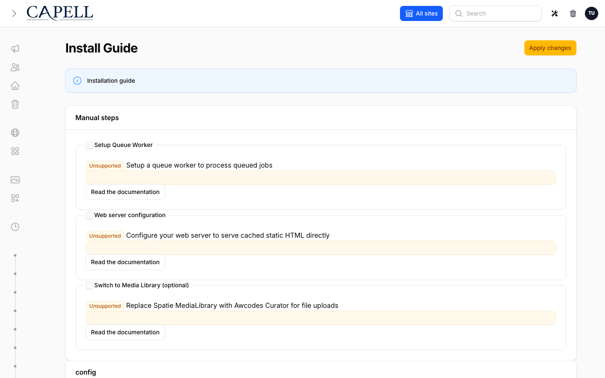
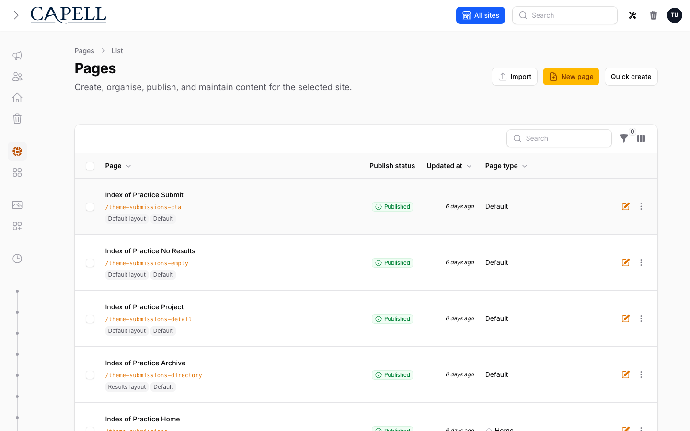

# Install Capell

This guide installs the current 1.x Capell foundation into a Laravel application. Use the Installer package for the normal path: it selects and requires the public packages, runs their lifecycle commands, configures Admin and Frontend, creates the first site and user, and refuses to report success when required health checks fail.



Use the [Quickstart](quickstart.md) for a disposable demo. For an existing application, start at [Existing Laravel applications](#existing-laravel-applications).

## Requirements

| Requirement | Supported value                                                     |
| ----------- | ------------------------------------------------------------------- |
| PHP         | 8.4+                                                                |
| Laravel     | 12.41.1+ or 13.x                                                    |
| Filament    | `~5.6.8`, installed by the selected Admin package                   |
| Database    | MySQL 8+, MariaDB 10.3+, SQLite, or the configured Laravel database |
| Node.js     | 20+                                                                 |
| Composer    | 2.7+                                                                |

Required PHP extensions: `fileinfo`, `intl`, `mbstring`, `openssl`, `curl`, `simplexml`, and either `gd` or `imagick`.

Before changing an existing application, back up its database and media and confirm that the backup can be read. Capell page history is not a substitute for that backup.

## Fresh Laravel application

### 1. Create and configure Laravel

```bash
composer create-project laravel/laravel capell-site
cd capell-site
cp .env.example .env
php artisan key:generate
```

Set `APP_URL`, database credentials, cache, session, and queue values in `.env`, then confirm the application can boot and reach its database:

```bash
php artisan about
php artisan migrate:status
```

### 2. Install the public foundation

Core, Admin, Frontend, Installer, and Marketplace are public Composer packages under the Capell licence. They do not require marketplace credentials.

Paid marketplace packages use authenticated Composer access. The credentials supplied for an entitled customer organisation are scoped to protected packages and are not needed for the public foundation.

```bash
composer require capell-app/installer
```

Do not run `filament:install --panels` first. The Installer requires and configures the selected Admin package in the correct lifecycle order.

### 3. Run the CLI installer

```bash
php artisan capell:install
```

For a fresh full-foundation install, select:

- all foundation packages;
- the default theme, or no theme when the host application already owns presentation;
- the public site URL;
- a new first administrator;
- cache clearing after installation;
- welcome-route replacement only when Capell should own `/`.

The installer may change `composer.json`, `composer.lock`, `app/Models/User.php`, the Filament Admin panel provider, `routes/web.php`, configuration, migrations, and generated frontend assets. Review the printed plan before accepting changes in an established repository.

For a demo:

```bash
php artisan capell:install --demo --url=http://localhost:8000
```

For an unattended disposable smoke install:

```bash
php artisan capell:install \
  --fresh=force \
  --demo \
  --package-mode=all \
  --theme=default \
  --seed \
  --url=http://localhost:8000 \
  --name="Capell owner" \
  --email=owner@example.test \
  --password='replace-this-local-password' \
  --clear-cache \
  --install-welcome-route \
  --no-interaction
```

`--fresh=force` deletes existing database data. Keep it out of real environments.

### 4. Read the result correctly

A successful install ends in this order:

```text
Capell Install Health Summary
All checks passed.
✓ Installation complete!
```

Required lifecycle, asset, permission, and health failures stop the command with a non-zero exit code. The installer prints a separate `Fix:` line for actionable failures and does not print the final success message.

Rerunning `capell:install` is supported after correcting a failed step. Keep the Installer package present until the health summary is green.

### 5. Open Admin and the public page

Run the Laravel application with your normal local workflow, then open:

- `/admin` for the Filament editor workspace;
- `/` for the Capell-owned public page when the welcome route was replaced.



Sign in with the created administrator, open **Pages**, save and publish a small change, and confirm the public URL updates. Continue with [Create your first page](create-your-first-page.md).

## Browser installer

After requiring `capell-app/installer`, the temporary `/install` route offers the same guided setup in a browser. Use it when the web process has permission to write the application files that the selected plan changes.

The browser path is not a way around server permissions or Composer restrictions. On immutable deployments, shared hosting, or containers where PHP-FPM cannot change the release, use the CLI during the build/deploy phase instead.

Remove the Installer only after a green review. The CLI can do that at the end of a successful run:

```bash
php artisan capell:install --remove-installer
```

If an install fails, removal is skipped so the report and retry path remain available.

## Existing Laravel applications

An existing application requires an ownership review before installation:

1. Back up the database and media and record the restore command.
2. Identify routes that must remain ahead of Capell's public routes, especially `/`.
3. Identify the existing user model, authentication, Filament panels, roles, and policies.
4. Decide whether Capell Frontend should own public page delivery or whether the app will integrate Core/Admin only.
5. Run the install plan without changing the application.

```bash
composer require capell-app/installer
php artisan capell:install --plan
```

Then run the guided installer and select only the required foundation packages. Point `--user` at an existing user when that account should be the default author:

```bash
php artisan capell:install \
  --user=admin@example.com \
  --url=https://your-site.test
```

`--user` does not create an account. To create a new administrator non-interactively, pass `--name`, `--email`, and `--password` together.

Review the Installer's changes to the user model and Filament panel provider before committing them. Preserve host authentication, existing routes, policies, middleware, and frontend assets that Capell does not own.

## Manual package selection

Use this path when a build pipeline must pin the package set before Artisan runs. Core is the foundation dependency; Admin, Frontend, and Marketplace are separate responsibilities.

```bash
# Full public foundation without the temporary Installer package
composer require \
  capell-app/core \
  capell-app/admin \
  capell-app/frontend \
  capell-app/marketplace \
  -W

php artisan capell:install --package-mode=all
```

For an internal application that deliberately has no Capell public delivery layer:

```bash
composer require capell-app/core capell-app/admin -W
php artisan capell:install --packages=capell-app/admin --theme=none
```

This is a Core/Admin installation, not a headless CMS product and not a public content API. The host application owns any content integration it builds around Core.

## Useful installer options

| Option                             | Purpose                                                          |
| ---------------------------------- | ---------------------------------------------------------------- |
| `--plan`                           | Print the resolved install plan without changing the application |
| `--demo`                           | Seed the verified evaluation content                             |
| `--package-mode=core\|all\|custom` | Select the distribution scope                                    |
| `--packages=...`                   | Select installed Capell package names explicitly                 |
| `--all-packages`                   | Run lifecycle setup for every Composer-installed Capell package  |
| `--theme=default`                  | Use the verified default theme                                   |
| `--theme=none`                     | Install without activating a theme                               |
| `--url=https://...`                | Set the site URL without a prompt                                |
| `--name= --email= --password=`     | Create the first administrator; pass all three                   |
| `--user=email-or-id`               | Select an existing default author                                |
| `--seed`                           | Run the host application's database seeder                       |
| `--clear-cache`                    | Clear Laravel and Capell caches after installation               |
| `--install-welcome-route`          | Remove Laravel's stock welcome route so Capell can own `/`       |
| `--remove-installer`               | Remove the temporary Installer only after success                |
| `--fresh` / `--fresh=force`        | Rebuild the database; destructive                                |
| `--production`                     | Force unattended production-safe mode and refuse `--fresh`       |

Use `php artisan capell:install --help` for the authoritative option list in the installed release.

## Themes and frontend assets

The default install runs the Frontend lifecycle and generates Capell's Tailwind entry assets. If an existing application needs to regenerate them explicitly:

```bash
php artisan capell:frontend-install
```

Then run the host application's normal asset build when required:

```bash
npm install
npm run build
```

Do not copy package-specific Tailwind paths from an unrelated project. Use the generated entry file and the installed package's documented integration.

Choose optional themes only from a listing that states a released Composer path, compatible Capell line, screenshots, install command, support boundary, and removal path. Source-only examples and Labs packages are not part of this installation guide.

## File permissions

The install user needs write access to the paths selected by the plan. Common paths are:

- `.env`;
- `composer.json` and `composer.lock` when packages are added or removed;
- `app/Models/User.php`;
- `app/Providers/Filament/AdminPanelProvider.php`;
- `config/`, `routes/web.php`, and `database/migrations/`;
- `resources/css/filament/admin/` and generated frontend CSS;
- `storage/`, `bootstrap/cache/`, and `public/` asset links.

Prefer running Composer and Artisan as the deployment user that owns the release. Do not make the whole application writable by the web process. After installation, retain only normal Laravel runtime write access to `storage/`, `bootstrap/cache/`, and any configured generated-output directories.

## Production verification

Before sending traffic to the installation:

```bash
php artisan optimize:clear
php artisan capell:doctor
php artisan capell:upgrade --dry-run
```

Also verify:

- the administrator can sign in and the Pages workspace is styled;
- a published page returns 200 on the canonical domain;
- the queue worker and scheduler are running when the selected packages need them;
- database and media backups are enabled, offsite, monitored, and restorable;
- no optional package reports an unresolved health, compatibility, or removal issue.

Read [Site Health](../operations/site-health.md), [Upgrading](../operations/upgrading.md), and [Backups](../operations/backups.md) before launch.

## Troubleshooting

| Symptom                                         | First action                                                        |
| ----------------------------------------------- | ------------------------------------------------------------------- |
| Installer cannot write a file                   | Correct ownership for the specific path, then rerun the installer   |
| Admin command or page is missing after Composer | `composer dump-autoload && php artisan optimize:clear`              |
| Frontend CSS is missing                         | `php artisan capell:frontend-install`, then the host npm build      |
| Public content is stale                         | Use Admin **Clear Cache**, then inspect the installed cache package |
| A queued task never finishes                    | Start the queue worker and inspect failed jobs                      |
| Install health remains red                      | Run the printed `Fix:` command and `php artisan capell:doctor`      |

Continue with [Operations troubleshooting](../operations/troubleshooting.md) when the first action does not resolve the cause.
