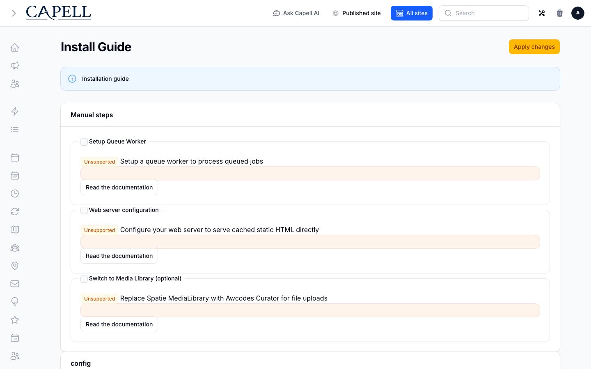

# Install Capell

This guide installs the current 1.x Capell foundation into a Laravel application. Use the Installer package for the normal path: it selects and requires the public packages, runs their lifecycle commands, configures Admin and Frontend, creates the first site and user, and refuses to report success when required health checks fail.

[](../images/generated/package-surfaces/install-guide-page.png)

Use the [Quickstart](quickstart.md) for a disposable demo. For an existing application, start at [Existing Laravel applications](#existing-laravel-applications).

## Requirements

| Requirement | Supported value                                    |
| ----------- | -------------------------------------------------- |
| PHP         | 8.4+                                               |
| Laravel     | 13.x                                               |
| Filament    | `^5.7.6`, installed by the selected Admin package  |
| Database    | MySQL 8+, MariaDB 10.5+, PostgreSQL 16+, or SQLite |
| Node.js     | 20+                                                |
| Composer    | 2.7+                                               |

Required PHP extensions: `fileinfo`, `intl`, `mbstring`, `openssl`, `curl`, `simplexml`, and either `gd` or `imagick`.

Before changing an existing application, back up its database and media and confirm that the backup can be read. Capell page history is not a substitute for that backup.

### Hosting checklist

- Capell supports immutable 128 MB shared-hosting limits by running bounded, resumable install steps. It does not inspect or change PHP's `memory_limit`.
- Browser requests can time out during Composer or package setup on managed hosting. Reopen the installer to resume the interrupted step, or use `php artisan capell:install` from the terminal.
- A non-`sync` queue needs a persistent queue worker. Laravel's scheduler is separate and needs `php artisan schedule:run` every minute in production.
- Keep `storage/` and `bootstrap/cache/` writable by the web and worker users, and know where the host records PHP and web-server errors.
- Process execution (`proc_open`) is required for local automated Composer and package lifecycle work. Marketplace readiness reports this before confirmation and changes the call to action to deployment/manual instructions when the limitation is deliberate. Do not bypass the check or increase browser timeouts; enable the process API, use a deployment publisher, or apply the recorded commands during deployment. Database backup commands have their own binary checks.
- Database backups shell out to `mysqldump` or `pg_dump`. Slim containers usually ship neither — install them, point `backup.binaries.*` at them, or use SQLite, which needs no external binary.
- Installing extensions from the admin UI runs Composer against the application root, so it cannot work on a read-only or immutable deployment. Install extensions during your build instead. Paid packages need a Capell-issued Composer credential that expires 30 minutes after issue (and, when issued for an installation, is bound to that instance and domain), so request it immediately before the build and never bake it into a reusable image or long-lived CI secret. See [Paid package access](#paid-package-access).
- Rebuilding frontend assets from the admin UI needs Node and npm on the server. If your image has neither, build assets in CI and deploy the output.
- Marketplace installs use their own queue. A plain `php artisan queue:work` will not process them — see [configuration](../development/configuration.md#marketplace-config).
- Host-specific Marketplace capability tiers and every readiness remediation are documented in [Marketplace hosting](../operations/marketplace-hosting.md).
- Running more than one application node adds requirements of its own, including a shared cache store. Read [web server configuration](../operations/web-server.md#multiple-nodes) first.

Run `php artisan capell:doctor` after installing to confirm the environment.

See [hosting and installation troubleshooting](../operations/troubleshooting.md#install-and-hosting) for the exact errors, checks, worker setup, scheduler command, and log locations.

## Fresh Laravel application

### 1. Create and configure Laravel

```bash
composer create-project laravel/laravel capell-site
cd capell-site
cp .env.example .env
php artisan key:generate
```

Set `APP_URL`, database credentials, cache, session, and queue values in `.env`, then confirm the application can boot and reach its database:

```bash
php artisan about
php artisan migrate:status
```

### 2. Install the public foundation

Capell Foundation is MIT-licensed. Core, Admin, Frontend, Installer, and Marketplace install from public Packagist repositories without a Capell account or marketplace credentials.

Paid marketplace packages use separate commercial terms and entitlement-scoped Composer access. The credentials supplied for an entitled customer organisation are scoped to protected packages and are not needed for Foundation.

```bash
composer require capell-app/installer
```

#### Paid package access

Paid packages are served from `https://capell.app/composer` with a short-lived bearer credential that Capell issues for a purchase. The customer account does not reveal one: its **Packages** page lists the credentials already issued to an organisation (package, creation date, last use, expiry) and lets you revoke them. That section is shown to Owners, Billing members, and members with private Composer access. Credentials are issued by one of two flows:

- **Site builder handoff.** After purchase, the handoff for the site build lists the commands to run in order: `composer config repositories.capell composer <repository-url>`, `composer config bearer.<host> <token>`, `composer require` for the purchased packages at exact versions, then `php artisan capell:install --spec=<file> --theme=<theme>`. Run those commands as given rather than assembling repository credentials by hand.
- **Marketplace in Admin.** Installing a paid package from Marketplace requests a credential for that installation and passes it to Composer for you, so there is nothing to copy.

To install a purchased package by hand, require that package, not the root package, then run its install step:

```bash
composer require <vendor>/<purchased-package>
php artisan capell:extension-install <vendor>/<purchased-package>
```

Themes need one further step in Admin: open **Sites**, edit the site, choose the installed theme in the **Theme** field, and save.

The credential expires 30 minutes after it is issued and is stored only as a hash by Capell. A credential issued for a single package installation is also bound to that installation's instance and domain, so it cannot be reused for another site. Composer may retain the supplied credential in its local authentication configuration, so keep that file out of source control and replace the credential when it expires. Never put the token in deployment output, support requests, queue payloads, or application logs.

Do not run `filament:install --panels` first. The Installer requires and configures the selected Admin package in the correct lifecycle order.

### 3. Run the CLI installer

```bash
php artisan capell:install
```

The default interactive flow installs the basic Admin/Frontend foundation and default
theme. It asks for the site address and missing administrator details, then offers
**Confirm all basics and install**, **Customise settings**, or **Cancel**. The basic
flow keeps existing data and homepage routes, skips demo/application seeders and
installer removal, and refreshes Capell caches without clearing application data.
Existing installations do not offer a database reset in this flow.

Customisation lets you change the site or administrator, choose packages and a theme,
opt into frontend dependency installation/building, choose whether to update `APP_URL`,
or save a reusable profile. Changes return to the review with previous answers retained.
Choose the full questionnaire or pass `--customise` for every setting. Explicit package,
profile, demo, fresh-install and other advanced flags retain their detailed flow;
`--fresh` always requires its destructive confirmation unless explicitly forced.

When the first-site URL differs from `APP_URL`, the review shows that the application
URL will remain unchanged. Opt into `--update-app-url` or its customisation choice to
update it after confirmation. Profiles saved with `--save-profile=my-settings` go into
`capell-install-profiles.json`, can be reused with `--profile=my-settings`, and exclude
administrator credentials, URL credentials, query strings and fragments. Config/PHP
profiles retain precedence over JSON profiles; existing named profiles are never replaced.

Frontend builds use the existing frontend installation workflow to detect npm, pnpm,
Yarn or Bun, install required dependencies and build assets. Failed installation steps
report completed work and a read-only inspection command. An asset failure gives a
frontend-only retry command, without repeating package or demo setup. Where Frontend
is unavailable, the existing npm build fallback retains its npm recovery command.

Interactive installation asks for the first site's full URL when `--url` is omitted,
using `APP_URL` as the default. Include any port and mount path, for example
`https://example.test:8443/blog`; site creation stores the scheme, hostname, port and
path separately. Plan previews and unattended installs use `APP_URL` without a prompt.

Extension choices show explicit catalogue states: **Free**, **Capell licence required**,
**Licence status unavailable**, or **Currently unavailable**. **Already downloaded**
is a separate status and does not imply that an extension is free. Recommended free
or already downloaded extensions are selected by default; other downloads require a
deliberate choice. For selected paid downloads, an available account connection checks
licence coverage for the chosen hostname. An unverified connection can fall back to
the Composer access check; a confirmed denial offers retry or deselection. Purchase
links are shown for reference, without starting a purchase.

The final review separates selected packages from already downloaded dependencies,
counts requested downloads, and lists database, administrator and application changes.
**Install Capell with these settings?** defaults to **Yes**; choosing **No** exits
without applying the installation. Composer checks downloads before application
preparation or database changes, with its diagnostic output retained below actionable
access, licence, compatibility or connectivity guidance. For a local Core path
repository, targeted downloads explicitly include Core with the application's
existing constraint so Composer can resolve the path package during its partial update.

For a fresh full-foundation install, select:

- all foundation packages;
- the default theme, or no theme when the host application already owns presentation;
- the public site URL;
- a new first administrator;
- cache clearing after installation;
- welcome-route replacement only when Capell should own `/`.

The installer may change `composer.json`, `composer.lock`, `app/Models/User.php`, the Filament Admin panel provider, `routes/web.php`, configuration, migrations, and generated frontend assets. Review the printed plan before accepting changes in an established repository.

For a demo:

```bash
php artisan capell:install --demo --url=http://localhost:8000
```

For an unattended disposable smoke install:

```bash
php artisan capell:install \
  --fresh=force \
  --demo \
  --package-mode=all \
  --theme=default \
  --seed \
  --url=http://localhost:8000 \
  --name="Capell owner" \
  --email=owner@example.test \
  --password='replace-this-local-password' \
  --clear-cache \
  --install-welcome-route \
  --no-interaction
```

`--fresh=force` deletes existing database data. Keep it out of real environments.

### 4. Read the result correctly

A successful install ends in this order:

```text
Capell Install Health Summary
All checks passed.
✓ Installation complete!
Capell Install Handoff
```

The extension selector uses the current marketplace catalogue, including package names, licence tiers and advertised versions. Selected packages that are absent from Composer are required before fresh-install data deletion, migrations or account creation. The Composer preflight and download use the same constraints; a published beta is requested explicitly for that package rather than lowering the application’s minimum stability. Custom catalogues remain configurable with `CAPELL_PLUGINS_SOURCE_URL`; changing the source invalidates the old catalogue cache.

Required lifecycle, asset, permission, and health failures stop the command with a non-zero exit code. The installer prints a separate `Fix:` line for actionable failures and does not print the final success message.

Rerunning `capell:install` is supported after correcting a failed step. Keep the Installer package present until the health summary is green.

### 5. Open Admin and the public page

Before opening either page, apply the Frontend dependency plan and build production assets unless the installer recorded a successful resource rebuild:

```bash
php artisan capell:frontend-after-install --apply --no-interaction
```

This supported command installs registered dependencies using the application's detected package manager, prepares the asset inputs, and builds once. It works with the current preparation hook and earlier releases. After it succeeds, start the application; a second npm build is unnecessary. If the installer already recorded a successful rebuild, start the application directly.

Run the Laravel application with your normal local workflow, then open:

- `/admin` for the admin where editors work;
- `/` for the Capell-owned public page when the welcome route was replaced.

<picture>
  <source media="(prefers-color-scheme: dark)" srcset="../images/admin-pages-list-dark.png">
  
</picture>

[Light](../images/admin-pages-list.png) · [Dark](../images/admin-pages-list-dark.png)

_A healthy install reaches the styled Pages resource with the expected records, state, and actions; this is separate from command success alone._

Sign in with the created administrator, then:

1. Select the intended site and open **Pages**. Open a seeded page to edit, or choose **New page** to create an About or Contact page.
2. Follow [Create your first page](create-your-first-page.md) to add useful content, optionally add an image, and save a draft.
3. [Preview and publish](create-your-first-page.md#preview-and-publish), then open the canonical public URL in a private browser window. Your new text should appear without needing an Admin login.

Reaching `/admin` or seeing a draft preview confirms only that part of the journey. The anonymous public page is the publication check. If it does not appear, follow the recovery links in the first-page guide.

## Browser installer

Before using the browser installer, generate an operator secret on the server:

```bash
php -r 'echo bin2hex(random_bytes(32)), PHP_EOL; echo time() + 1800, PHP_EOL;'
```

Set the first line as `CAPELL_INSTALLER_BOOTSTRAP_SECRET` and the second line as `CAPELL_INSTALLER_BOOTSTRAP_EXPIRES_AT` in the host environment or `.env`, and rebuild any cached configuration. Open `/install` over HTTPS and enter the secret in the operator bootstrap field. Each state-changing request requires the proof; the browser session retains its hash, and the server checks expiry and rotation on every request. A missing grant, a secret shorter than 32 characters, an expired grant, or an expiry more than 30 minutes away is refused. Renew both values to resume after expiry, and clear them after setup. Keep the secret out of URLs, logs, reports and source control.

Browser setup preserves existing database data. A destructive refresh is available only through `php artisan capell:install --fresh` with explicit confirmation (or `--fresh=force` for a deliberate disposable CLI install).

After requiring `capell-app/installer`, the temporary `/install` route offers the same guided setup in a browser. Use it when the web process has permission to write the application files that the selected plan changes.

The browser path is not a way around server permissions or Composer restrictions. On immutable deployments, shared hosting, or containers where PHP-FPM cannot change the release, use the CLI during the build/deploy phase instead.

Remove the Installer only after a green review. The CLI can do that at the end of a successful run:

```bash
php artisan capell:install --remove-installer
```

If an install fails, removal is skipped so the report and retry path remain available.

## Existing Laravel applications

An existing application requires an ownership review before installation:

1. Back up the database and media and record the restore command.
2. Identify routes that must remain ahead of Capell's public routes, especially `/`.
3. Identify the existing user model, authentication, Filament panels, roles, and policies.
4. Decide whether Capell Frontend should own public page delivery or whether the app will integrate Core/Admin only.
5. Run the install plan without changing the application.

```bash
composer require capell-app/installer
php artisan capell:install --plan
```

Then run the guided installer and select only the required foundation packages. Point `--user` at an existing user when that account should be the default author:

```bash
php artisan capell:install \
  --user=admin@example.com \
  --url=https://your-site.test
```

`--user` does not create an account. To create a new administrator non-interactively, pass `--name`, `--email`, and `--password` together.

Review the Installer's changes to the user model and Filament panel provider before committing them. Preserve host authentication, existing routes, policies, middleware, and frontend assets that Capell does not own.

## Manual package selection

Use this path when a build pipeline must pin the package set before Artisan runs. Core is the foundation dependency; Admin, Frontend, and Marketplace are separate responsibilities.

```bash
# Full public foundation without the temporary Installer package
composer require \
  capell-app/core \
  capell-app/admin \
  capell-app/frontend \
  capell-app/marketplace \
  -W

php artisan capell:install --package-mode=all
```

For an internal application that deliberately has no Capell public delivery layer:

```bash
composer require capell-app/core capell-app/admin -W
php artisan capell:install --packages=capell-app/admin --theme=none
```

This is a Core/Admin installation, not a headless CMS product and not a public content API. The host application owns any content integration it builds around Core.

## Useful installer options

| Option                             | Purpose                                                          |
| ---------------------------------- | ---------------------------------------------------------------- |
| `--customise`                      | Open the full installation questionnaire                          |
| `--build-assets`                   | Install frontend dependencies and build with the detected manager |
| `--update-app-url`                 | Update APP_URL to the reviewed site URL after confirmation         |
| `--save-profile=name`              | Save reusable settings without administrator credentials          |
| `--plan`                           | Print the resolved install plan without changing the application |
| `--demo`                           | Seed the verified evaluation content                             |
| `--package-mode=core\|all\|custom` | Select the distribution scope                                    |
| `--packages=...`                   | Select installed Capell package names explicitly                 |
| `--all-packages`                   | Run lifecycle setup for every Composer-installed Capell package  |
| `--theme=default`                  | Use the verified default theme                                   |
| `--theme=none`                     | Install without activating a theme                               |
| `--url=https://...`                | Set the site URL without a prompt                                |
| `--name= --email= --password=`     | Create the first administrator; pass all three                   |
| `--user=email-or-id`               | Select an existing default author                                |
| `--seed`                           | Run the host application's database seeder                       |
| `--clear-cache`                    | Clear Laravel and Capell caches after installation               |
| `--install-welcome-route`          | Remove Laravel's stock welcome route so Capell can own `/`       |
| `--remove-installer`               | Remove the temporary Installer only after success                |
| `--handoff-json=path`              | Write a redacted machine-readable install handoff                |
| `--fresh` / `--fresh=force`        | Rebuild the database; destructive                                |
| `--production`                     | Force unattended production-safe mode and refuse `--fresh`       |

Use `php artisan capell:install --help` for the authoritative option list in the installed release.

A successful run also prints a `Capell Install Handoff` with the selected packages, verified outcomes, safe Admin/public URLs, first-page state, warnings, and one next action. For release automation, pass `--handoff-json=storage/app/capell-install-handoff.json`; the JSON uses the same versioned, redacted contract and does not connect a Capell account or submit a telemetry identity.

## Themes and frontend assets

The default install runs the Frontend lifecycle and generates Capell's Tailwind entry assets. If an existing application needs to regenerate them explicitly:

```bash
php artisan capell:frontend-install
```

The Frontend after-install lifecycle prepares registered dependencies in `package.json`, generated CSS, and the Vite input manifest. Preparation does not install Node dependencies or build assets. For an optional prepared CI or host asset pipeline, first ensure that the registered dependency plan has been written to `package.json` and the generated CSS/Vite input manifest is present. Then run the application's package manager install and production build. For npm:

```bash
npm install
npm run build
```

When preparation has not already completed, explicitly run `php artisan capell:frontend-after-install --apply --no-interaction`. This applies registered dependencies and builds assets; without `--apply`, non-interactive use is report-only. Browser installation runs Node only when **Rebuild resources** is selected. That installer build path supports npm; pnpm, Yarn, and Bun hosts should leave it unselected and use the explicit Frontend command or their normal package manager install/build after preparation. A completed setup/doctor handoff alone does not verify built assets.

Do not copy package-specific Tailwind paths from an unrelated project. Use the generated entry file and the installed package's documented integration.

Choose optional themes only from a listing that states a released Composer path, compatible Capell line, screenshots, install command, support boundary, and removal path. Source-only examples and Labs packages are not part of this installation guide.

<a id="file-permissions"></a>

## Install-time write permissions

The install user needs write access to the paths selected by the plan. Common paths are:

- `.env`;
- `composer.json` and `composer.lock` when packages are added or removed;
- `app/Models/User.php`;
- `app/Providers/Filament/AdminPanelProvider.php`;
- `config/`, `routes/web.php`, and `database/migrations/`;
- `resources/css/filament/admin/` and generated frontend CSS;
- `storage/`, `bootstrap/cache/`, and `public/` asset links.

Prefer running Composer and Artisan as the deployment user that owns the release. Do not make the whole application writable by the web process. After installation, retain only normal Laravel runtime write access to `storage/`, `bootstrap/cache/`, and any configured generated-output directories.

Set `CAPELL_RELEASE_ROOT_MODE` to match the deployed layout:

- `mutable` accepts a directly addressed checkout or build root when every target path is writable. Set `CAPELL_SERVER_SIDE_TOOLING=true` as well only when the running server is deliberately allowed to install Marketplace extensions itself.
- `immutable` covers read-only containers and serverless-style releases. Runtime Composer and migration publication are blocked; apply them while building the next image or release.
- `atomic` covers a `current` symlink pointing at versioned releases. Runtime release-root writes are blocked even when the target directory is writable, preventing a long-running request from modifying the old release after promotion.

Capell also detects symlink components in a root declared `mutable` and blocks the write. Do not work around this protection by making versioned release directories writable.

## Production verification

Putting the installation on a public domain — DNS records, TLS, trusted proxies behind a CDN, and the queue worker and scheduler as supervised processes — is covered in [Going live](../operations/going-live.md). Work through that page first; the checks below assume it is done.

Before sending traffic to the installation:

```bash
php artisan optimize:clear
php artisan capell:doctor
php artisan capell:upgrade --dry-run
```

Also verify:

- the administrator can sign in and the Pages workspace is styled;
- a published page returns 200 on the canonical domain;
- the queue worker and scheduler are running when the selected packages need them;
- database and media backups are enabled, offsite, monitored, and restorable;
- no optional package reports an unresolved health, compatibility, or removal issue.

Read [Site Health](../operations/site-health.md), [Upgrading](../operations/upgrading.md), and [Backups](../operations/backups.md) before launch.

## Troubleshooting

| Symptom                                         | First action                                                                                      |
| ----------------------------------------------- | ------------------------------------------------------------------------------------------------- |
| Installer cannot write a file                   | Correct ownership for the specific path, then rerun the installer                                 |
| Admin command or page is missing after Composer | `composer dump-autoload && php artisan optimize:clear`                                            |
| Frontend CSS is missing                         | `php artisan capell:frontend-install`, then the host npm build                                    |
| Public content is stale                         | Use Admin **Clear Cache**, then inspect the installed cache package                               |
| A queued task never finishes                    | Follow the [queue worker checks](../operations/troubleshooting.md#queue-worker)                   |
| Scheduled work never runs                       | Configure the [Laravel scheduler](../operations/troubleshooting.md#scheduler)                     |
| PHP reports `Allowed memory size ... exhausted` | Reopen the installer, identify the failing step in its report, and report it as a batching defect |
| Install health remains red                      | Run the printed `Fix:` command and `php artisan capell:doctor`                                    |

Continue with [Operations troubleshooting](../operations/troubleshooting.md) when the first action does not resolve the cause.

## Next

- [Your first session](first-session.md)
- [Create your first page](create-your-first-page.md)
