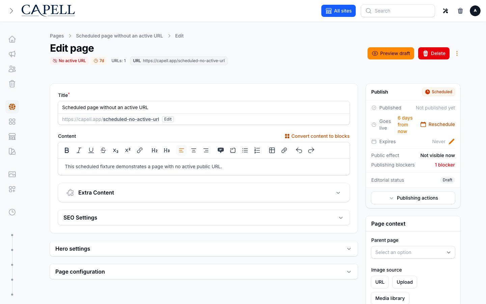
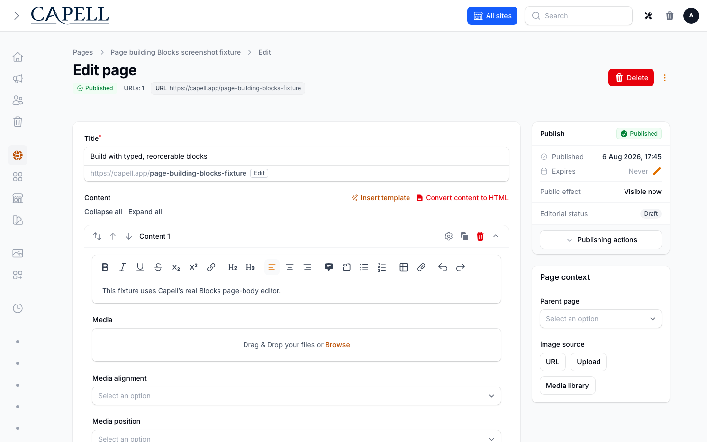

# Capell quickstart

Use this path to evaluate the current 1.x foundation in a fresh Laravel application. It installs Core, Admin, Frontend, Installer, and Marketplace, creates a site and administrator, seeds demo content, generates frontend assets, and runs the install health summary.

The current 1.x Capell Foundation release is MIT-licensed and available through public Packagist packages without a Capell account. Paid marketplace packages use separate commercial terms and entitlement-scoped Composer access.

For an existing application, use the [Install guide](install.md#existing-laravel-applications) and take a database and media backup before running migrations.

## Before you start

Allow about ten minutes for the first Composer install.

| Requirement | Supported value                                                         |
| ----------- | ----------------------------------------------------------------------- |
| PHP         | 8.4+                                                                    |
| Laravel     | 13.x                                                                    |
| Filament    | Installed by the selected Capell Admin package; supported line `^5.7.6` |
| Node.js     | 20+                                                                     |
| Composer    | 2.7+                                                                    |
| Database    | MySQL 8+, MariaDB 10.5+, PostgreSQL 16+, or SQLite                      |

Required PHP extensions: `fileinfo`, `intl`, `mbstring`, `openssl`, `curl`, `simplexml`, and either `gd` or `imagick`.

Capell renders through this Laravel application. This quickstart does not create a hosted Capell account or a public content-delivery API.

## 1. Create the Laravel application

```bash
composer create-project laravel/laravel capell-site
cd capell-site
cp .env.example .env
php artisan key:generate
```

Configure `APP_URL` and a database in `.env`. SQLite is enough for a disposable local evaluation:

```bash
touch database/database.sqlite
```

```env
APP_URL=http://localhost:8000
DB_CONNECTION=sqlite
QUEUE_CONNECTION=sync
```

## 2. Run the guided installer

Require the public Installer package first. Do not run `filament:install --panels` separately: Admin is one of the packages selected and configured by `capell:install`.

```bash
composer require capell-app/installer
php artisan capell:install --demo --url=http://localhost:8000
```

For a normal evaluation, accept the full foundation selection and the default theme. The installer asks for:

| Prompt                                | Local evaluation answer                             |
| ------------------------------------- | --------------------------------------------------- |
| What are you building?                | Pick the closest suite, or choose your own packages |
| Theme                                 | Default                                             |
| Site URL                              | `http://localhost:8000`                             |
| Administrator                         | Create one with an email and strong local password  |
| Which caches would you like to clear? | Accept the preselected defaults                     |
| Let Capell handle the homepage?       | Yes for a fresh demo application                    |
| Install Capell with these settings?   | Review the complete summary, then confirm           |

The cache prompt is a multiselect of individual cache keys, not a yes/no question. Passing `--clear-cache` skips the prompt, runs Laravel’s optimisation cache clear, and refreshes the Capell HTML and package discovery caches. This also clears application data in the default cache store.

The first question, **What are you building?**, offers install suites such as a blog, marketing site, help centre or client site. A suite fixes the foundation packages, keeping the defaults the plain checklist pre-ticks (such as the Marketplace) whenever the suite installs what they need, then offers its recommended extensions (ticked) and optional ones (unticked), each with a one-line reason, and an autocomplete search for anything else. Extensions that are not installed yet join the Composer downloads; a download the catalogue does not mark free is never pre-ticked and is labelled as possibly needing a Capell licence, because Composer cannot fetch a paid extension without licensed access and the install would stop at its preflight. The browser installer and `--recommendation` install only the suite's own `packages` list (without the checklist defaults or any extensions), so they show its plain `description`; the CLI suite question shows the richer `suite_description`. Choosing "I'll choose my own packages", or passing `--packages`, `--package-mode`, `--all-packages`, `--recommendation` or `--profile`, skips the question; `--recommendation` then installs the suite's `packages` list and the others use the plain package checklist or the packages you named. Hosts can replace the suites with `capell.install.recommendations`, `config/capell-install-recommendations.php` or `capell-install-recommendations.json`.

Before applying changes, the CLI prints **Review your installation**: first what you are setting up (site, database, packages, theme, content, administrator), then the Composer downloads, host-file changes and final operations as a bullet list. An interactive run summarises the execution plan as a step count; add `-v` to list every step. The final confirmation defaults to No. Declining it applies no installation changes, including Filament panel creation and homepage configuration.

`--plan` prints the same redacted summary and execution steps without applying changes. It uses supplied options and defaults; choices made in a later interactive run can change its final review. `--no-interaction` and `--production` print the review before execution and retain their existing unattended behaviour. Fresh unattended installs still require `--fresh=force`.

The browser installer also shows a server-generated review before starting a run. Confirm the reviewed settings to continue; editing settings requires another review. Acceptance expires after 30 minutes and is checked against the resolved settings and browser session before execution.

The final output is part of the install contract. A healthy run ends in this order:

```text
Capell Install Health Summary
All checks passed.
✓ Installation complete!
Capell Install Handoff
```

If a required package lifecycle, asset build, permission sync, or health check fails, the command exits non-zero and withholds the success message. Follow the printed `Fix:` instruction, then rerun the installer; do not treat a partial run as production-ready.

The handoff names the installed packages, safe Admin and public URLs, first-page state, warnings, and the next verified action. It does not require a Capell account or send a telemetry identity. CI can persist the same redacted result with `--handoff-json=storage/app/capell-install-handoff.json`.

### Reproducible non-interactive smoke command

CI and release verification can use the same public path without prompts:

```bash
php artisan capell:install \
  --fresh=force \
  --demo \
  --package-mode=all \
  --theme=default \
  --seed \
  --url=http://localhost:8000 \
  --name="Capell evaluation" \
  --email=owner@example.test \
  --password='replace-this-local-password' \
  --clear-cache \
  --install-welcome-route \
  --no-interaction
```

This command is destructive because `--fresh=force` rebuilds the database. Use it only in a disposable application or isolated CI database.

## 3. Start the application

Before opening Admin or the public page, apply the Frontend dependency plan and build the production assets unless the installer recorded a successful resource rebuild:

```bash
php artisan capell:frontend-after-install --apply --no-interaction
php artisan serve
```

The Frontend command installs registered dependencies using the application's detected package manager, prepares generated CSS and Vite inputs, and builds once. It works with the current preparation hook and releases that do not yet declare that hook. Its default without `--apply` only prints the plan. After a successful installer rebuild, skip the Frontend command and start the application.

Browser **Rebuild resources** runs the existing npm-only build path. pnpm, Yarn, and Bun hosts leave that option unselected and use the explicit Frontend command. For a prepared CI asset pipeline, see [Themes and frontend assets](install.md#themes-and-frontend-assets).

Open:

- `http://localhost:8000/admin` and sign in with the administrator created by the installer;
- `http://localhost:8000` to see the seeded public page.

The Admin package should present a styled Pages workspace—not an unstyled Laravel or Filament shell:

<picture>
  <source media="(prefers-color-scheme: dark)" srcset="../images/admin-pages-list-dark.png">
  
</picture>

[Light](../images/admin-pages-list.png) · [Dark](../images/admin-pages-list-dark.png)

_The seeded Pages workspace proves the Admin package, demo records, permissions, and Filament styling are working together._

## 4. Publish and recover one change

1. Select the intended site, open **Pages**, and open a seeded page to edit.
2. Change a short piece of text in the content fields provided by its page type. Use the [first-page guide](create-your-first-page.md) if you prefer to create a new page or [add an image](create-your-first-page.md#optionally-add-an-image).
3. Follow [Preview and publish](create-your-first-page.md#preview-and-publish), then reload the canonical public URL in a private browser window. The changed text should appear without an Admin login.

[](../images/generated/admin/admin-page-edit-form.png)

[](../images/generated/admin/first-page-edit-settings-tab.png)

_Check the Publish panel before expecting a public change. This existing fixture capture deliberately shows a scheduled page with no active URL and “Not visible now”; it is not the expected result of a successful publication._

Compare it with the [published public-page example](../frontend/guide.md). For your own page, success means the new text appears at its public URL now; a signed preview or a scheduled state does not establish that.

Open the page's history relation after the save. Inspect the before/after change, preview a rollback, and cancel it unless you deliberately want to test page-only recovery. Page rollback restores the page and its owned content relationships; it does not restore the application database, media store, analytics counters, or infrastructure.

Continue with [Create your first page](create-your-first-page.md) for the full field-by-field walkthrough.

## 5. Confirm health

```bash
php artisan capell:doctor
```

If you switch from `QUEUE_CONNECTION=sync` to `database` or `redis`, keep a worker running:

```bash
php artisan queue:work
```

Before production, also configure and prove the separate [database and media backup](../operations/backups.md) path. Page history is not disaster recovery.

## First-run fixes

| Symptom                                                | Action                                                                                                          | Read next                                                                                                         |
| ------------------------------------------------------ | --------------------------------------------------------------------------------------------------------------- | ----------------------------------------------------------------------------------------------------------------- |
| `php artisan` is not executable or writable paths fail | `chmod +x artisan && chmod -R u+rwX storage bootstrap/cache`                                                    | [Permissions troubleshooting](../operations/troubleshooting.md#php-artisan-says-permission-denied)                |
| A queued publish never finishes                        | Start `php artisan queue:work`                                                                                  | [Published pages never generate](../operations/troubleshooting.md#published-pages-never-generate)                 |
| The public page remains stale                          | Use Admin **Clear Cache**, then inspect the response/cache path                                                 | [Published pages still show old content](../operations/troubleshooting.md#published-pages-still-show-old-content) |
| A package class is missing after Composer              | `composer dump-autoload && php artisan optimize:clear`                                                          | [Package discovery](../packages/debugging-package-discovery.md)                                                   |
| Frontend CSS is missing                                | `php artisan capell:frontend-install`, then run the application's normal npm build if the installer requests it | [Themes and frontend assets](install.md#themes-and-frontend-assets)                                               |
| The installer stops at health review                   | Run the exact `Fix:` command shown, then rerun `php artisan capell:doctor`                                      | [Site Health](../operations/site-health.md)                                                                       |

## Next

- [First editor session](first-session.md)
- [Create your first page](create-your-first-page.md)
- [Theme Library](../admin/theme-library.md)
- [Package catalogue and maturity](../packages/catalog.md)
- [Upgrading and rollback](../operations/upgrading.md)
- [Backups and scratch restores](../operations/backups.md)
