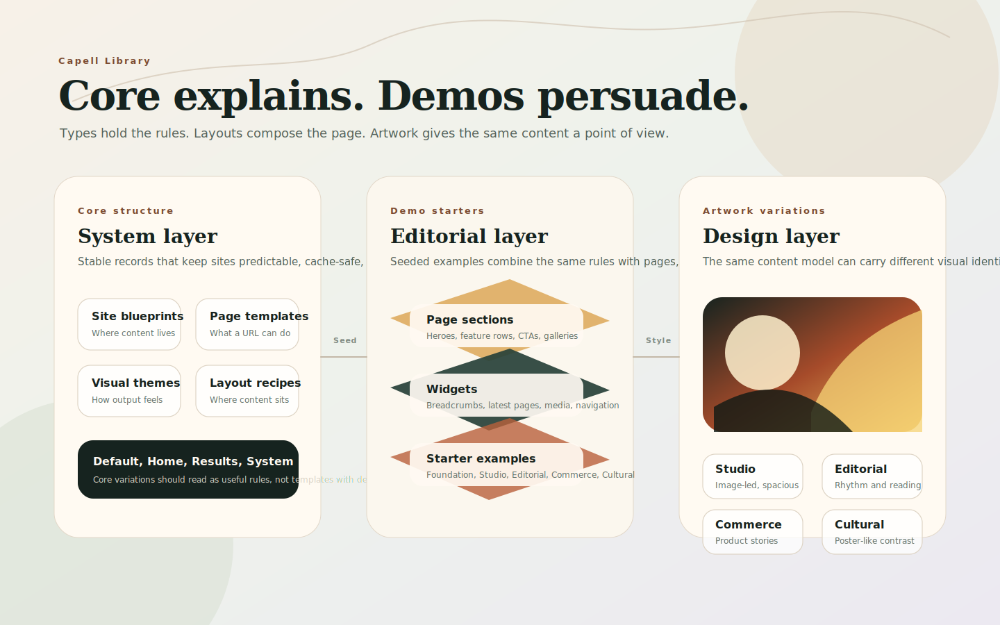

# Blueprints

Blueprints define reusable editing, rendering, and behaviour rules for content.

Think of them as the cards in the Capell Library. A card has a name, a short description, a family, and a set of rules. The editor sees the plain name and description. Capell keeps the schema, renderer, cache settings, package hooks, and permissions behind it.

## Better Names

The database stores reusable behaviour in `blueprints` and related layout, widget, section, and package records. Some compatibility APIs still use type terminology, but in the product and current docs clearer names help people choose the right thing:

| Product name    | Developer/API term           | What it means                                                                     |
| --------------- | ---------------------------- | --------------------------------------------------------------------------------- |
| Site blueprint  | Site blueprint               | The high-level setup for a site: domains, languages, pages, settings, theme.      |
| Page template   | Page blueprint               | The rules for a page URL: editor fields, rendering, listing, sitemap, cache.      |
| Visual theme    | Theme blueprint              | The visual system: typography, colour, spacing, components, and artwork style.    |
| Layout recipe   | Layout                       | The page composition shell used by one or many pages.                             |
| Page section    | Section blueprint            | A large content band, such as a hero, feature row, gallery, or CTA.               |
| Widget          | Element blueprint            | A reusable component placed inside a layout, such as breadcrumbs or latest pages. |
| Content block   | ContentSections content type | Editable content used by sections and widgets.                                    |
| Starter example | Demo package content         | Seeded pages, layouts, widgets, images, and copy for learning or previews.        |
| Visual style    | Artwork or demo variation    | A design treatment applied to the same content model.                             |

That vocabulary keeps the editor-facing model simple without hiding the fact that developers still register real Capell extension points underneath.

## Core Variations

Core blueprints are quiet by design. They define structure and behaviour, not a finished brand.

| Variation      | Family         | Short description                                                            |
| -------------- | -------------- | ---------------------------------------------------------------------------- |
| Default        | Page blueprint | A flexible page for ordinary content, landing pages, and simple publishing.  |
| Home           | Page blueprint | The main entry page for a site, usually excluded from listings.              |
| Page not found | Page blueprint | A fixed system page for missing URLs and not-found responses.                |
| Maintenance    | Page blueprint | A fixed system page shown while a site or route is unavailable.              |
| System         | Page blueprint | A protected page for internal, generated, or non-editorial output.           |
| Default        | Site blueprint | The baseline site setup for domains, languages, pages, settings, and theme.  |
| Default        | Theme blueprint| The baseline theme record used when a site has no specialist theme.          |
| Default        | Layout         | A general-purpose layout for standard pages and content-led views.           |
| Home           | Layout         | A homepage layout for the main site entry point and high-level content.      |
| Results        | Layout         | A listing layout for search results, indexes, and grouped content.           |
| System page    | Layout         | A locked layout for fixed system pages that should not use the page builder. |

The important difference: a page blueprint controls what a page is allowed to do. A layout controls where page content appears. A theme blueprint controls how the finished page looks. (Here "layout" means the core [`Layout`](../reference/glossary.md#developer-terms) template a page renders into, not the ContentSections Layout Builder blocks.)

## Demo And Artwork Variations

Demo variations should prove range without changing the core mental model. They combine the same site blueprints, page blueprints, layouts, sections, and widgets with stronger visual direction.

Good demo families:

| Demo family | Use it for                                | Artwork direction                                                  |
| ----------- | ----------------------------------------- | ------------------------------------------------------------------ |
| Foundation  | Plain CMS evaluation and product docs     | Calm grids, neutral surfaces, clear type, low decoration.          |
| Studio      | Agencies, portfolios, architecture        | Large image crops, measured whitespace, editorial serif accents.   |
| Editorial   | Blogs, magazines, publishing teams        | Strong rhythm, article cards, pull quotes, collection-led artwork. |
| Commerce    | Lifestyle, product storytelling, services | Warm product imagery, rounded details, clear CTAs, polished cards. |
| Cultural    | Events, museums, exhibitions, programmes  | High-contrast typography, poster-like crops, bold colour blocks.   |

Core explains. Demos persuade. Artwork gives the same content a point of view.

## What Blueprints Control

A blueprint can change several parts of the system at once:

| Area               | What the blueprint can change                                                                                             |
| ------------------ | ------------------------------------------------------------------------------------------------------------------------- |
| Editor shape       | Which configurator, required fields, asset choices, role restrictions, and package fields appear in admin.                |
| Frontend rendering | Which Blade component, display component, cache time, cache frequency, and output behaviour should be used.               |
| Content behaviour  | Whether pages are accessible by URL, included in listings, included in sitemaps, or linked with previous/next navigation. |
| Reuse              | Which widgets, page models, content structures, or content-sections surfaces can share the same setup.                    |

Choosing or creating a blueprint changes the editing experience and the runtime behaviour for every record assigned to it.

## What Changes In The Editor

The page create form is the clearest first example. Changing the page blueprint can change the editor fields and page behaviour. Changing the layout controls the frontend composition used by that page.

Blueprint-specific fields can also appear in expandable sections or package-provided areas. A standard page might show summary and CTA fields. A specialist page blueprint can expose richer structured fields through its configurator or package extenders.

## Blueprint Configuration

The Blueprints screen groups records by model family, such as pages, sites, themes, sections, and widgets. Each blueprint has a unique key used by configuration, templates, URL generation, and package integrations.

For page blueprints, the frontend tab controls rendering and public behaviour. This is where a blueprint can choose the page component, cache behaviour, URL accessibility, listing visibility, sitemap inclusion, previous/next linking, and whether editors may change the layout on pages using that blueprint.

The admin tab controls the editor-facing side: configurator selection, icon, short description, allowed asset types, required fields, and role restrictions. Packages can add more fields through schema extenders without replacing the whole blueprint form.

## Extension Points

Developers and packages register blueprints through Capell extension points. Core page blueprints, package page blueprints, widgets, page sections, and content blocks all use the same idea: give a model a reusable named configuration that can be discovered, edited, and rendered consistently.

Use [How Capell works](how-capell-works.md#extension-points) for the high-level map, and [Extending Capell](../../packages/core/docs/extending-capell.md#2-page-types-and-component-registration) for developer registration details. That lower-level guide still uses `PageTypeData` because the public extension API names the page subject contract rather than an individual blueprint record.

## Next

- [Build a page](building-pages.md)
