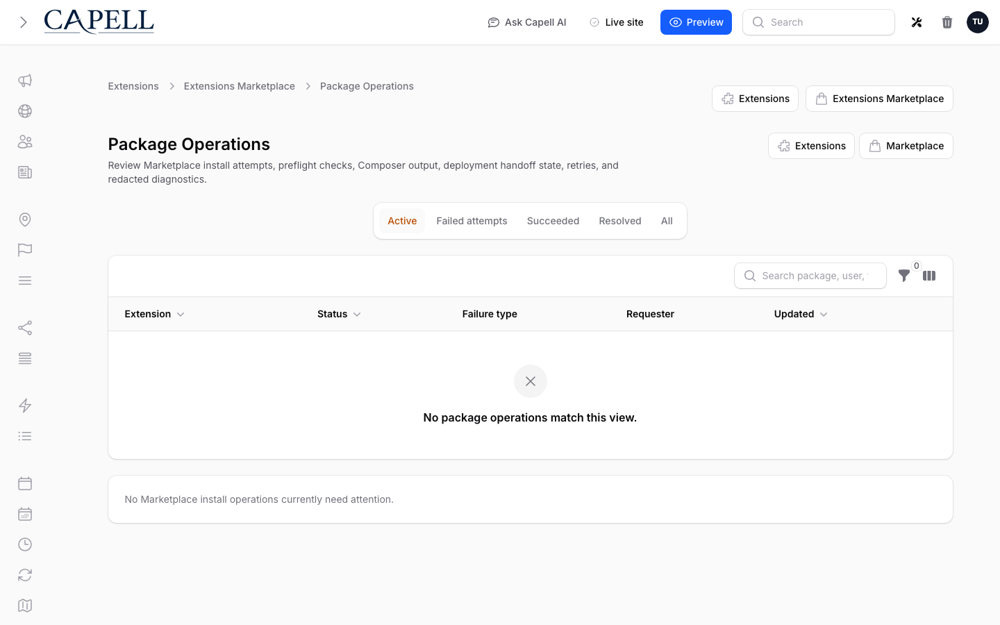
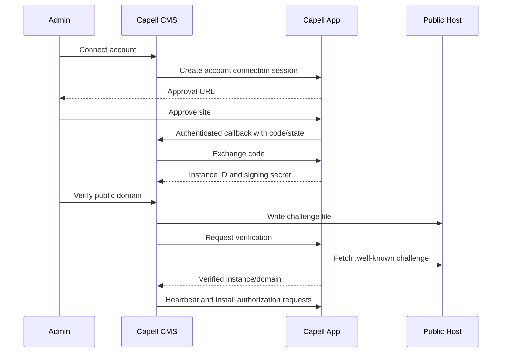

# Debugging Marketplace



Use this when [Marketplace](../../packages/marketplace/docs/overview.md) account linking, public domain verification, catalogue browsing, install authorization, heartbeat, diagnostics, or update notices fail.


## Flow Diagram



Account linking is the normal setup path. Public domain verification is a stronger production signal and requires a real public hostname.

Premium grouped installs add a second hosted flow: CMS creates a local `marketplace_install_flow_sessions` row, Capell App handles login/checkout/entitlement work, then CMS exchanges the return code and queues local Package Operations only after final install authorization succeeds.

## First Checks

```bash
php artisan config:show app.url
php artisan config:show capell-marketplace.marketplace.base_url
php artisan config:show capell-marketplace.marketplace.webhook_url
php artisan route:list --name=capell-marketplace
```

The default API URL is:

```env
CAPELL_MARKETPLACE_URL=https://capell.app/api/v1
```

## Account Connection


```sql
select connection_session_id, claimed_domain, app_url, callback_url, status, expires_at, completed_at, last_error
from marketplace_account_connection_sessions
order by id desc
limit 5;
```

| Status       | Meaning                                             | Fix                                                  |
| ------------ | --------------------------------------------------- | ---------------------------------------------------- |
| `pending`    | Admin has not returned from Capell App yet          | Complete the current approval URL before it expires. |
| `completing` | Callback reserved the session while exchanging code | Wait briefly; if stuck, start a new connection.      |
| `failed`     | Remote request or validation failed                 | Read `last_error`, fix config/session, retry.        |
| `expired`    | 10-minute window passed                             | Start a fresh connection.                            |
| `completed`  | Instance should exist                               | Check `marketplace_instances`.                       |

Do not reuse old approval URLs after starting a newer account connection.

## Premium Install Flow

```sql
select remote_flow_id, status, expires_at, redirected_at, returned_at, queued_at, completed_at, last_error
from marketplace_install_flow_sessions
order by id desc
limit 5;
```

For v2 hosted flows, inspect the locked quote, entitlement map, exchange payload, and transition log:

```sql
select remote_flow_id, contract_version, quoted_price_cents, quoted_currency,
       remote_entitlement_ids, failure_reason, transition_log
from marketplace_install_flow_sessions
order by id desc
limit 5;
```

| Status        | Meaning                                                                 | Fix                                                                           |
| ------------- | ----------------------------------------------------------------------- | ----------------------------------------------------------------------------- |
| `pending`     | Local intent was created but Capell App flow creation has not completed | Check logs for remote create failures.                                        |
| `redirected`  | Admin was sent to Capell App                                            | Complete the hosted flow before expiry.                                       |
| `returned`    | CMS exchanged the code and stored verified account credentials          | Resume should immediately authorize and queue installs.                       |
| `authorizing` | Callback reserved the session while exchanging the code                 | Wait briefly; if stuck, read `last_error` and start a new flow.               |
| `queued`      | Local Composer operations were queued                                   | Check Package Operations for per-package progress.                            |
| `completed`   | Flow orchestration finished                                             | Package Operations remains the source of truth for Composer/lifecycle status. |
| `expired`     | Return window passed                                                    | Start a fresh Marketplace review.                                             |
| `failed`      | Checkout, entitlement, email verification, state, or exchange failed    | Read `last_error`; fix account/checkout/entitlement state and retry.          |

Package Operations are separate:

```sql
select composer_name, status, failure_reason, queued_at, started_at, completed_at
from marketplace_install_attempts
order by id desc
limit 10;
```

If a premium flow returns successfully but no package operation is queued, check:

- the flow `last_error`;
- whether Capell App returned `can_install: true`;
- whether `remote_entitlement_ids` contains one entitlement ID for each paid package in `quoted_extensions`;
- the final `/extensions/{slug}/install-authorization` response;
- duplicate active attempts for the same `composer_name`;
- blocked or missing dependencies in the grouped review.

Direct `purchase_url` links are fallback-only for grouped installs. If the hosted flow API is unavailable, the UI may open a Marketplace purchase URL, but the admin must retry the Marketplace review after account/checkout work completes.

The Package Operations modal includes hosted flow recovery rows. `Resume` re-runs the local final authorization and Composer queueing step for returned or recoverable failed sessions. `Expire` marks the flow session expired only; it does not cancel or edit existing Composer attempts.

For repeatable local lifecycle checks, use the Marketplace QA command:

```bash
php artisan marketplace:qa:extensions-lifecycle --dry-run --json
php artisan marketplace:qa:extensions-lifecycle --only=vendor/package --stop-on-failure
```

Dry runs only resolve catalogue scope. Non-dry runs install each selected Marketplace extension, run the local package operation, uninstall it, and delete extension-owned data unless `--skip-delete` is set. The command returns a pass/fail table or JSON report with the extension name, Composer package, install, uninstall, delete, and failure reason columns.

The browser smoke path is opt-in and expects prepared local CMS/App accounts plus local checkout auto-approval:

```bash
npm run test:marketplace-install-flow
```

Useful environment overrides: `CAPELL_MARKETPLACE_SMOKE_CMS_URL`, `CAPELL_MARKETPLACE_SMOKE_APP_URL`, `CAPELL_MARKETPLACE_SMOKE_ADMIN_EMAIL`, `CAPELL_MARKETPLACE_SMOKE_ADMIN_PASSWORD`, `CAPELL_MARKETPLACE_SMOKE_APP_EMAIL`, `CAPELL_MARKETPLACE_SMOKE_APP_PASSWORD`, and `CAPELL_MARKETPLACE_SMOKE_EXTENSION`.

## Public Domain Verification

```sql
select domain, challenge_id, challenge_path, status, expires_at, last_error
from marketplace_registration_sessions
order by id desc
limit 5;
```

Fetch the exact public challenge URL:

```bash
curl -i https://your-domain/.well-known/capell/marketplace/chal_EXAMPLE
```

Expected result: `200 OK`, `Content-Type: text/plain`, and the stored challenge token body.

Common blockers:

- `www.example.com` was entered but `example.com` is being fetched, or the reverse.
- The challenge route is behind auth, maintenance mode, or a CDN rule.
- Static file handling bypasses Laravel/public files incorrectly.
- The session expired.
- The domain is local-only, such as `.test`, `.localhost`, `localhost`, `127.*`, or an IP address.

## Catalogue And Install Authorization

```sql
select instance_id, connection_mode, account_email, verified_domains, last_heartbeat_at
from marketplace_instances
order by last_heartbeat_at desc
limit 5;
```

Browsing the catalogue only proves the catalogue endpoint works. Installing also needs a connected instance, entitlement/licence state, domain policy, and local platform compatibility.

Check local package versions:

```bash
composer show capell-app/core filament/filament livewire/livewire laravel/framework
```

If the catalogue appears stale in local debugging:

```bash
php artisan cache:clear
```

Use targeted browser refresh controls in production rather than broad cache clears.

## Heartbeat And Update Notices

```sql
select instance_id, last_heartbeat_at
from marketplace_instances
order by last_heartbeat_at desc
limit 5;

select source, checked_at, capell_version, metadata
from marketplace_update_advisory_snapshots
order by checked_at desc
limit 5;
```

Heartbeat needs:

- Marketplace API base URL;
- public webhook/callback URL from `CAPELL_MARKETPLACE_WEBHOOK_URL` or `APP_URL`;
- known instance ID;
- outbound network access to the Marketplace API.

## Test Recipes

### Account Connection

```php
it('fails account connection when app url has no host', function (): void {
    config(['app.url' => '']);

    StartMarketplaceAccountConnectionAction::run();
})->throws(RuntimeException::class, 'APP_URL must include a valid host');
```

### Challenge Route

```php
it('serves only matching pending challenge domains', function (): void {
    MarketplaceRegistrationSession::factory()->create([
        'domain' => 'example.com',
        'challenge_id' => 'chal_TEST',
        'challenge_token' => 'secret-token',
    ]);

    $this->get('https://example.com/.well-known/capell/marketplace/chal_TEST')
        ->assertOk()
        ->assertSee('secret-token');
});
```

### Heartbeat

```php
it('does not phone home without a connected instance', function (): void {
    $result = resolve(PhoneHomeAction::class)->result();

    expect($result->successful)->toBeFalse()
        ->and($result->failureMessage)->toContain('not connected');
});
```

## Next

- [Marketplace package overview](../../packages/marketplace/docs/overview.md)
- [Operations troubleshooting](troubleshooting.md)
- [Extension troubleshooting](../packages/extension-troubleshooting.md)
