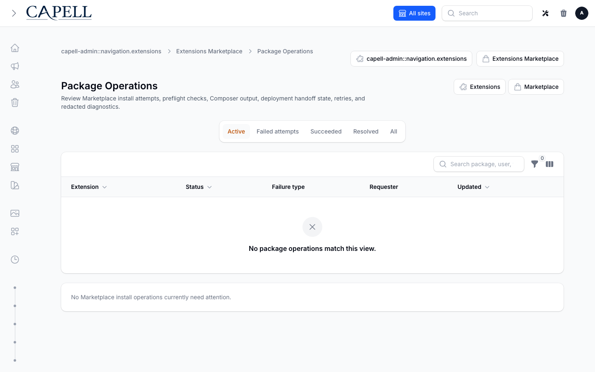
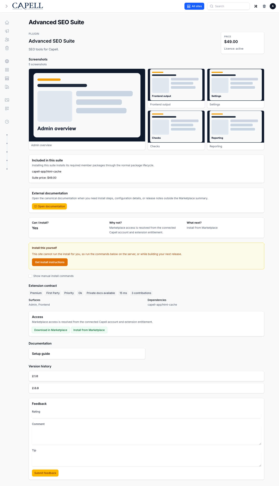
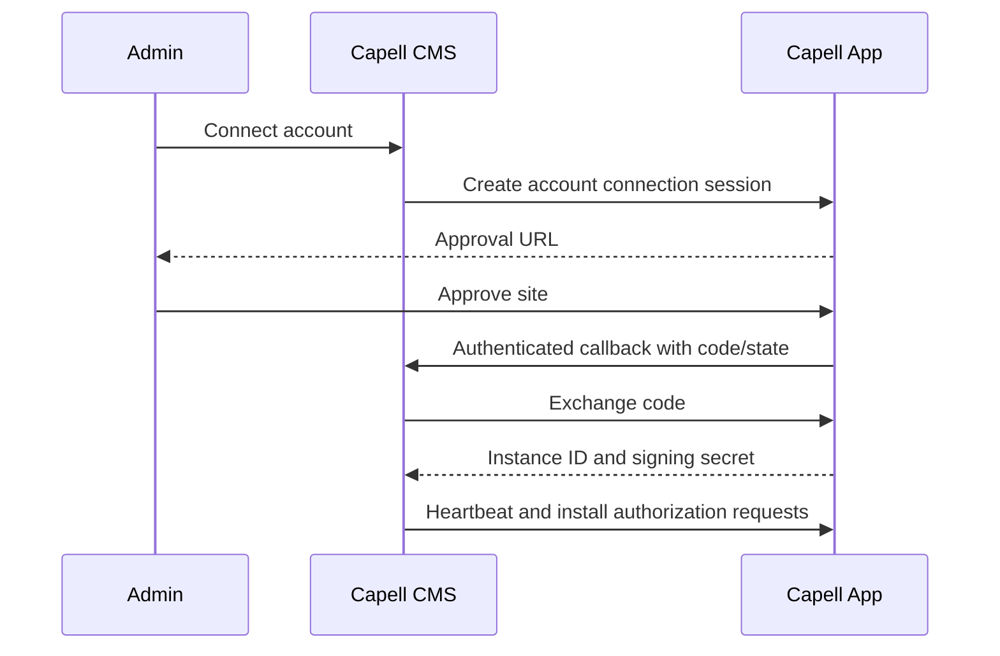

# Debugging Marketplace



Use this when [Marketplace](../../packages/marketplace/docs/overview.md) account linking, catalogue browsing, install authorization, heartbeat, diagnostics, or update notices fail.



## Flow Diagram


```mermaid
sequenceDiagram
    participant Admin
    participant CMS as Capell CMS
    participant App as Capell App

    Admin->>CMS: Connect account
    CMS->>App: Create account connection session
    App-->>Admin: Approval URL
    Admin->>App: Approve site
    App->>CMS: Authenticated callback with code/state
    CMS->>App: Exchange code
    App-->>CMS: Instance ID and signing secret
    CMS->>App: Heartbeat and install authorization requests
```

Premium grouped installs add a second hosted flow: CMS creates a local `marketplace_install_flow_sessions` row, Capell App handles login/checkout/entitlement work, then CMS exchanges the return code and queues local Package Operations only after final install authorization succeeds.

## First Checks

```bash
php artisan config:show app.url
php artisan config:show capell-marketplace.marketplace.base_url
php artisan config:show capell-marketplace.marketplace.webhook_url
php artisan route:list --name=capell-marketplace
```

The default API URL is:

```env
CAPELL_MARKETPLACE_URL=https://capell.app/api/v1
```

## Account Connection


```sql
select connection_session_id, claimed_domain, app_url, callback_url, status, expires_at, completed_at, last_error
from marketplace_account_connection_sessions
order by id desc
limit 5;
```

| Status       | Meaning                                             | Fix                                                  |
| ------------ | --------------------------------------------------- | ---------------------------------------------------- |
| `pending`    | Admin has not returned from Capell App yet          | Complete the current approval URL before it expires. |
| `completing` | Callback reserved the session while exchanging code | Wait briefly; if stuck, start a new connection.      |
| `failed`     | Remote request or validation failed                 | Read `last_error`, fix config/session, retry.        |
| `expired`    | 10-minute window passed                             | Start a fresh connection.                            |
| `completed`  | Instance should exist                               | Check `marketplace_instances`.                       |

Do not reuse old approval URLs after starting a newer account connection.

## Premium Install Flow

```sql
select remote_flow_id, status, expires_at, redirected_at, returned_at, queued_at, completed_at, last_error
from marketplace_install_flow_sessions
order by id desc
limit 5;
```

For v2 hosted flows, inspect the locked quote, entitlement map, exchange payload, and transition log:

```sql
select remote_flow_id, contract_version, quoted_price_cents, quoted_currency,
       remote_entitlement_ids, failure_reason, transition_log
from marketplace_install_flow_sessions
order by id desc
limit 5;
```

| Status        | Meaning                                                                 | Fix                                                                           |
| ------------- | ----------------------------------------------------------------------- | ----------------------------------------------------------------------------- |
| `pending`     | Local intent was created but Capell App flow creation has not completed | Check logs for remote create failures.                                        |
| `redirected`  | Admin was sent to Capell App                                            | Complete the hosted flow before expiry.                                       |
| `returned`    | CMS exchanged the code and stored verified account credentials          | Resume should immediately authorize and queue installs.                       |
| `authorizing` | Callback reserved the session while exchanging the code                 | Wait briefly; if stuck, read `last_error` and start a new flow.               |
| `queued`      | Local Composer operations were queued                                   | Check Package Operations for per-package progress.                            |
| `completed`   | Flow orchestration finished                                             | Package Operations remains the source of truth for Composer/lifecycle status. |
| `expired`     | Return window passed                                                    | Start a fresh Marketplace review.                                             |
| `failed`      | Checkout, entitlement, email verification, state, or exchange failed    | Read `last_error`; fix account/checkout/entitlement state and retry.          |

Package Operations are separate:

```sql
select composer_name, status, failure_reason, queued_at, started_at, completed_at
from marketplace_install_attempts
order by id desc
limit 10;
```

If a premium flow returns successfully but no package operation is queued, check:

- the flow `last_error`;
- whether Capell App returned `can_install: true`;
- whether `remote_entitlement_ids` contains one entitlement ID for each paid package in `quoted_extensions`;
- the final `/extensions/{slug}/install-authorization` response;
- duplicate active attempts for the same `composer_name`;
- blocked or missing dependencies in the grouped review.

Direct `purchase_url` links are fallback-only for grouped installs. If the hosted flow API is unavailable, the UI may open a Marketplace purchase URL, but the admin must retry the Marketplace review after account/checkout work completes.

The Package Operations modal includes hosted flow recovery rows. `Resume` re-runs the local final authorization and Composer queueing step for returned or recoverable failed sessions. `Expire` marks the flow session expired only; it does not cancel or edit existing Composer attempts.

## Package Operation Recovery

Start with the affected row in **Package Operations**. Copy its redacted diagnostics and record the operation, status, failure stage/type, Composer command, deployment reference, and last successful timeline event before changing anything.

### No Marketplace worker

Marketplace jobs use a named queue. Run the exact command reported by readiness; the default is:

```bash
php artisan queue:work --queue=capell-marketplace
```

Keep the worker supervised. Confirm its heartbeat appears and that the queue connection's `retry_after` is greater than the Marketplace job timeout. See [Marketplace hosting](marketplace-hosting.md#queue-worker).

### `proc_open` or Composer is unavailable

Do not extend the browser timeout or bypass readiness. Enable process execution and configure PHP/Composer for the worker, register a deployment publisher, or run the operation manually from the application root:

```bash
composer require vendor/package
php artisan package:discover
php artisan capell:extension-install vendor/package
php artisan capell:runtime-refresh
php artisan optimize:clear
```

For removal, use `composer remove vendor/package` after the extension's uninstall lifecycle has completed. On an immutable release, apply these Composer changes during the build and deploy a new artifact.

### Cancelled after Composer or lifecycle

`cancelled_after_composer` means the package files changed before cancellation was observed. For an install, inspect `composer show`, package discovery, and extension lifecycle state before retrying. For an uninstall, Composer may already have removed the package. `cancelled_after_lifecycle` means extension teardown already ran but package files remain; reinstall the extension to restore its registrations before deciding whether to uninstall again.

### Half-installed package

Compare all three sources of truth: Composer (`composer show vendor/package`), the Capell extension registry, and the operation timeline. If Composer succeeded but discovery/lifecycle did not, run:

```bash
php artisan package:discover
php artisan capell:extension-install vendor/package
php artisan capell:runtime-refresh
php artisan optimize:clear
```

Then run `php artisan capell:doctor` and retry only if the package state is coherent. Do not repeatedly queue Composer against an unknown partial state.

### Rollback and health checks

Failed operations restore Composer files where the failure boundary permits, reload package discovery, and run a fresh-process boot check plus the configured HTTP probe. A rollback does **not** undo a database migration that already ran. A `schema_ahead_of_code` result requires package-specific database recovery or a compatible code release; never assume restoring `composer.lock` restored the schema.

If the rollback or health check fails, keep the site in maintenance/incident handling, inspect the recorded excerpts and application logs, and deploy a known compatible release before marking the operation resolved.

### Stale Composer authentication files

Marketplace uses temporary Composer authentication directories and sweeps abandoned ones before later installs. Doctor reports stale files. If no install will run soon, confirm no package operation is active, then remove only the reported abandoned Marketplace auth directories. Never delete the application's normal Composer credentials.

For repeatable local lifecycle checks, use the Marketplace QA command:

```bash
php artisan marketplace:qa:extensions-lifecycle --dry-run --json
php artisan marketplace:qa:extensions-lifecycle --only=vendor/package --stop-on-failure
```

Dry runs only resolve catalogue scope. Non-dry runs install each selected Marketplace extension, run the local package operation, uninstall it, and delete extension-owned data unless `--skip-delete` is set. The command returns a pass/fail table or JSON report with the extension name, Composer package, install, uninstall, delete, and failure reason columns.

The browser smoke path is opt-in and expects prepared local CMS/App accounts plus local checkout auto-approval:

```bash
npm run test:marketplace-install-flow
```

Useful environment overrides: `CAPELL_MARKETPLACE_SMOKE_CMS_URL`, `CAPELL_MARKETPLACE_SMOKE_APP_URL`, `CAPELL_MARKETPLACE_SMOKE_ADMIN_EMAIL`, `CAPELL_MARKETPLACE_SMOKE_ADMIN_PASSWORD`, `CAPELL_MARKETPLACE_SMOKE_APP_EMAIL`, `CAPELL_MARKETPLACE_SMOKE_APP_PASSWORD`, and `CAPELL_MARKETPLACE_SMOKE_EXTENSION`.

## Catalogue And Install Authorization

```sql
select instance_id, connection_mode, account_email, last_heartbeat_at
from marketplace_instances
order by last_heartbeat_at desc
limit 5;
```

Browsing the catalogue only proves the catalogue endpoint works. Installing also needs a connected instance, entitlement/licence state, and local platform compatibility.

Check local package versions:

```bash
composer show capell-app/core filament/filament livewire/livewire laravel/framework
```

If the catalogue appears stale in local debugging:

```bash
php artisan cache:clear
```

Use targeted browser refresh controls in production rather than broad cache clears.

## Heartbeat And Update Notices

```sql
select instance_id, last_heartbeat_at
from marketplace_instances
order by last_heartbeat_at desc
limit 5;

select source, checked_at, capell_version, metadata
from marketplace_update_advisory_snapshots
order by checked_at desc
limit 5;
```

Heartbeat needs:

- Marketplace API base URL;
- public webhook/callback URL from `CAPELL_MARKETPLACE_WEBHOOK_URL` or `APP_URL`;
- known instance ID;
- outbound network access to the Marketplace API.

## Test Recipes

### Account Connection

```php
it('fails account connection when app url has no host', function (): void {
    config(['app.url' => '']);

    StartMarketplaceAccountConnectionAction::run();
})->throws(RuntimeException::class, 'APP_URL must include a valid host');
```

### Heartbeat

```php
it('does not phone home without a connected instance', function (): void {
    $result = RunMarketplaceHeartbeatAction::run();

    expect($result->successful)->toBeFalse()
        ->and($result->failureMessage)->toContain('not connected');
});
```

## Next

- [Marketplace package overview](../../packages/marketplace/docs/overview.md)
- [Marketplace hosting](marketplace-hosting.md)
- [Operations troubleshooting](troubleshooting.md)
- [Extension troubleshooting](../packages/extension-troubleshooting.md)
