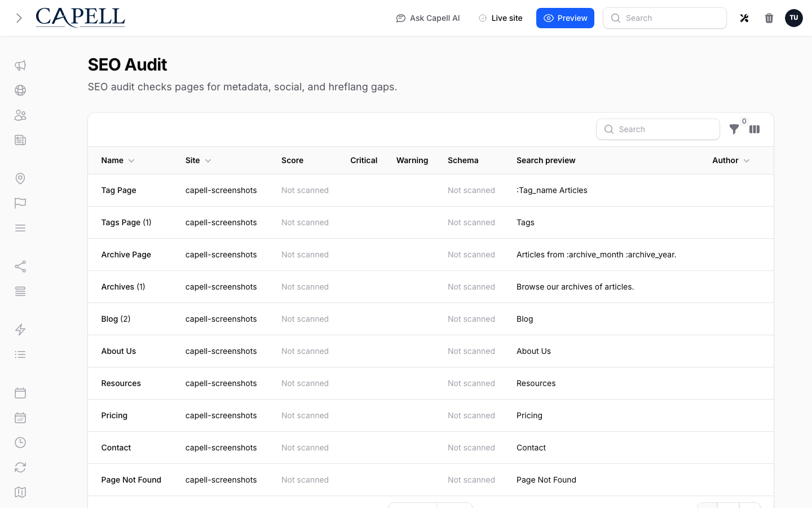

# Site Health

Use Site Health before serving a Capell site from production domains and after any deployment that changes frontend rendering, cache behaviour, static output, optimizer jobs, queues, or server configuration.

## Admin diagnostics

Open **System → Site Health** in the Capell admin before launch and after deployments that change public rendering, queues, cache, static output, or frontend assets.

The page aggregates operational checks that affect whether public traffic can be served safely:

- Public HTML cache status for each cacheable page URL: `HIT`, `MISS`, or `BYPASS`, with the cache file path and generated timestamp where available.
- Public-output safety checks for cached HTML that contains authoring markers or signed admin URLs.
- Static generation checks, including the current generation lock, the latest generated cache timestamp, and failed static generation jobs.
- Optimizer readiness for Node, Playwright, generated optimizer artifacts, and failed critical CSS jobs.
- Server checks for Laravel runtime basics: `APP_URL`, `APP_KEY`, `APP_ENV`, `APP_DEBUG`, cache/session/queue drivers, database-backed cache and queue tables, scheduler visibility, failed-jobs table, trusted proxy config, and writable paths.

Treat red checks as release blockers. Treat amber checks as deployment risks that need either remediation or an explicit operational decision.

## Status meanings

| Status            | Meaning                                                                                                                         | Action                                                                 |
| ----------------- | ------------------------------------------------------------------------------------------------------------------------------- | ---------------------------------------------------------------------- |
| `GREEN` or `HIT`  | The check is healthy or the cache file exists.                                                                                  | No action needed beyond normal release verification.                   |
| `AMBER` or `MISS` | The site can usually keep serving traffic, but a dependency, cache file, generated artifact, or runtime signal needs attention. | Review the remediation text and decide whether to fix before release.  |
| `RED` or `BYPASS` | A safety guard, failed job, writable path, or cacheability issue can affect public delivery.                                    | Treat as a blocker unless there is a deliberate operational exception. |

## Feature areas

**Cache status** lists every enabled, non-redirect page URL with its site, layout, public URL, cache status, cache file path, and generated timestamp. Use it to spot URLs that are expected to be cacheable but are missing files, bypassing cache, or tied to an uncached domain.

**Public-output safety** scans cached public HTML for authoring markers and signed admin URLs. A red result means unsafe admin/editor details reached cacheable output and the affected cache file should be cleared after the source leak is fixed.



**Static generation** reports the static-site generation lock, newest generated public cache timestamp, and failed jobs related to static generation. Use it after cache clears, full static builds, or failed deployment jobs.

**Optimizer readiness** checks Node, Playwright, optimizer artifacts, and failed critical CSS jobs. Missing optimizer tooling is amber when the site can still serve normal CSS and JavaScript, but failed critical CSS jobs should be investigated before relying on generated assets.

**Server checks** cover the Laravel and filesystem basics Site Health can inspect locally: `APP_URL`, `APP_KEY`, `APP_ENV`, `APP_DEBUG`, cache store, session driver, queue connection, scheduler visibility, database-backed cache and queue tables, failed-jobs table, trusted proxy config, writable `storage`, and writable `bootstrap/cache`.

## Screenshot coverage

The Site Health page is included in the admin screenshot manifest as `site-health-page`. Regenerate admin screenshots after UI changes so the operations docs show the current cache table and health sections:

```sh
npm run screenshots
```

## Public frontend safety

- Keep frontend authoring as a post-load admin feature. Public Blade, theme output, cached HTML, and static-site output must not contain edit controls, editor JavaScript, signed admin URLs, model IDs, field paths, permission names, package names, or authoring selectors.
- Capell blocks static HTML cache writes when a rendered HTML response contains explicit authoring markers such as `data-capell-authoring`, `data-field-path`, `data-model-id`, `data-capell-editor-url`, or a signed `/admin/...signature=` URL.
- Responses blocked by that guard are returned with `Cache-Control: private, no-store` and `X-Frontend-Cache: BYPASS`, so a CDN or browser should not store the unsafe output.
- If a package adds its own authoring attributes, append them to `capell-frontend.public_html_authoring_markers`.

## Cache and static output

- Set `CAPELL_HTML_CACHE=true` and `CAPELL_WRITE_HTML_CACHE=true` only when the installed HTML-cache/static package owns and documents a writable cache disk.
- Configure the web server to serve generated static HTML only after the installed cache package documents the path and the safety tests pass for the site and installed packages.
- Run `php artisan capell:html-cache:clear` after deploys that change public Blade, themes, layouts, or frontend assets.
- If `capell-app/html-cache` is installed, run `php artisan capell:static-site` after a full cache clear when you want the public cache warmed before traffic arrives.
- Keep queues running for package jobs that purge CDN cache, generate assets, or refresh static output.

## Optimizer and assets

- Treat frontend optimization failures as job failures. Public pages should continue to load normal CSS and JavaScript rather than falling back to generated critical CSS.
- Install the Node and Playwright runtime required by the frontend optimizer on workers that generate critical CSS.
- Prefer small, relevant CSS and JavaScript files for HTTP/3. Add profile bundling only when production metrics show it is necessary.

## Verification

Run the narrow safety checks before release:

```sh
vendor/bin/pest packages/frontend/tests/Unit/Security/PublicHtmlSafetyInspectorTest.php packages/frontend/tests/Unit/PageCacheTest.php packages/frontend/tests/Feature/Middleware/HtmlCacheMiddlewareTest.php --configuration=phpunit.xml
```

Then run package-level or full-suite checks based on the release scope:

```sh
vendor/bin/pest packages/frontend/tests --configuration=phpunit.xml
composer preflight
```
