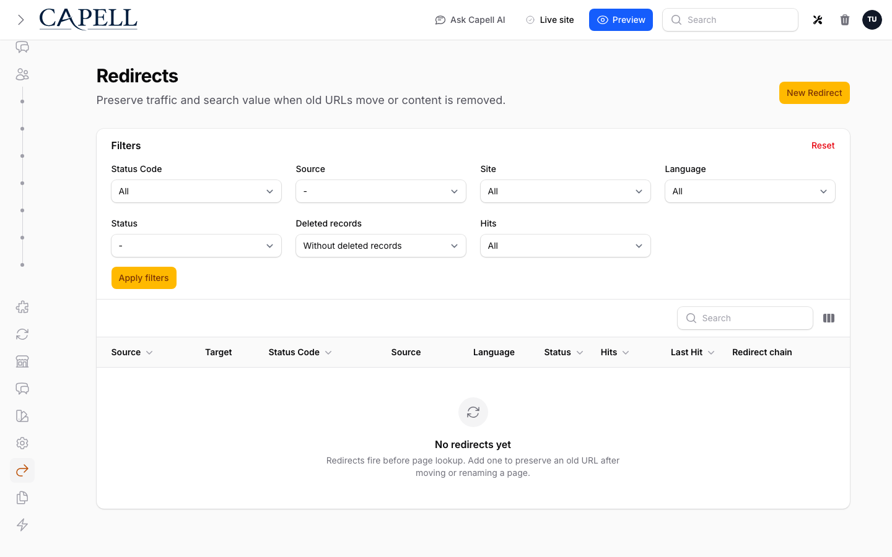

# Troubleshooting



Use this page when something breaks during install, first login, publishing, or frontend builds. Each entry starts with the thing you are likely to see, then gives the shortest useful fix.

Deeper runbooks:

| Area              | Runbook                                                                   |
| ----------------- | ------------------------------------------------------------------------- |
| Package discovery | [Debugging package discovery](../packages/debugging-package-discovery.md) |
| Admin extensions  | [Debugging admin extensions](../admin/debugging-admin-extensions.md)      |
| Public output     | [Debugging public output](../frontend/debugging-public-output.md)         |
| Marketplace       | [Debugging Marketplace](debugging-marketplace.md)                         |

## `php artisan` says permission denied

**When it happens:** You cloned the project, copied files from another machine, or unpacked a deployment artifact.

**Run:**

```bash
chmod +x artisan
chmod -R u+rwX storage bootstrap/cache
```

**You should see:** `php artisan about` prints the Laravel environment summary.

## `composer require capell-app/installer` cannot find the package

**Why:** Your app cannot see the private Capell repositories or Packagist credentials.

**Check:**

```bash
composer config repositories
composer show capell-app/installer --available
```

If you install from VCS repositories, add the repository entries from the [install guide](../getting-started/install.md#2-add-capell-repositories). Then run:

```bash
composer clear-cache
composer require capell-app/installer
```

**You should see:** Composer resolves `capell-app/installer` and its `capell-app/core` dependency. The admin and frontend packages are added later by `php artisan capell:install`.

## `/admin` returns 403 or will not let you log in

**Why:** The user exists, but Filament access or Capell roles were not assigned.

**Run:**

```bash
php artisan capell:install --user=you@example.com
php artisan optimize:clear
```

Replace `you@example.com` with the admin user email.

**You should see:** The user can open `/admin` and reach the dashboard.

## The dashboard loads, but Pages or Settings are missing

**Why:** Package resources, permissions, or Filament navigation were not registered.

**Run:**

```bash
php artisan optimize:clear
php artisan capell:admin-install
```

**You should see:** The sidebar includes Capell resources such as Pages, Media, and Settings.

## Published pages still show old content

**Why:** You are looking at cached static HTML from the installed cache/static package.

**Run:**

```bash
php artisan capell:html-cache:clear
```

Only run commands that exist in the installed package set. Check with `php artisan list capell`. If `capell-app/html-cache` is installed, also run `php artisan capell:static-site` to rebuild generated public HTML.

If your queue is not `sync`, keep a worker running:

```bash
php artisan queue:work
```

**You should see:** The frontend updates after refresh.

## Published pages never generate

**Why:** The installed cache/static package dispatches static HTML generation through Laravel queues.

**For local development, set:**

```env
QUEUE_CONNECTION=sync
```

**For database or Redis queues, run:**

```bash
php artisan queue:work
```

**You should see:** New or changed pages appear in the cache package's configured static artifact path.

## The frontend shows Laravel's default welcome page

**Why:** The default `/` route is still taking priority.

**Fix:** Remove the default route from `routes/web.php`:

```php
Route::get('/', function () {
    return view('welcome');
});
```

Then run:

```bash
php artisan optimize:clear
```

**You should see:** Capell handles the homepage route.

## `Can't resolve 'swiper/...'` during `npm run build`

**Why:** A symlinked package imports Swiper through an export path that your Tailwind/Vite setup cannot resolve.

**Run:**

```bash
php artisan capell:frontend-tailwind-assets --report
npm install
npm run build
```

`capell:frontend-tailwind-assets` is provided by `capell-app/frontend`; check `php artisan list capell` if the command is not present.

If it still fails, add Vite aliases as described in [Tailwind vendor CSS](../frontend/tailwind-vendor-css.md).

**You should see:** Vite finishes without unresolved Swiper imports.

## Tailwind misses Capell admin styles

**Why:** Your Filament theme is not scanning Capell's Blade views.

**Fix:** Add the Capell sources from [theme compilation](../getting-started/install.md#7-theme-compilation) to `resources/css/filament/admin/theme.css`, then run:

```bash
npm run build
php artisan optimize:clear
```

**You should see:** Capell admin fields, tables, and widgets render with the expected styling.

## `Laravel\Prompts\Exceptions\NonInteractiveValidationException: Required.`

**Why:** A Capell command asked for interactive input while running in CI, Docker, or `--no-interaction`.

**Fix:** Pass the missing values as flags. A full non-interactive install needs a site URL and either an existing user or new user details:

```bash
php artisan capell:install --no-interaction --url=https://example.com --user=admin@example.com
```

For a fresh app with no users yet, use:

```bash
php artisan capell:install \
  --no-interaction \
  --url=https://example.com \
  --name="Admin User" \
  --email=admin@example.com \
  --password="change-this-password"
```

**You should see:** The command either completes or prints the next missing option explicitly.

## Browser installer reports `Preflight checks failed.`

**Why:** The `/install` browser flow runs `InstallerPreflight` before install steps. Blocking failures usually mean the web PHP runtime cannot do something the CLI can: load a required extension, run subprocesses, write to `storage` or `bootstrap/cache`, connect to the database, store cache state, or resolve selected Composer packages.

**Check the installer report first.** It includes the failed check key and remediation text. Then compare the configured binaries:

```bash
php artisan config:show capell-installer.php_binary
php artisan config:show capell-installer.composer_binary
php artisan config:show cache.default
php artisan config:show queue.default
```

If optional packages were selected, run the Composer checks from the same app:

```bash
composer show capell-app/filamentors --available
composer config repositories
```

**Fix:** Set `CAPELL_SETUP_PHP_BINARY` to CLI PHP, set `CAPELL_SETUP_COMPOSER_BINARY` when Composer is not on the web user's path, fix permissions, or repair Composer repository/auth access. For a fresh app using database cache before migrations exist, temporarily use file cache or create the cache table before retrying.

**You should see:** The preflight status changes from `fail` to `pass` or `warning`, and the browser installer can advance to install steps.

## Browser installer progress says the install session expired

**Why:** The browser installer stores progress under cache keys named `capell.install.{installId}.*` and protects concurrent installs with `capell.install.lock`. If cache is cleared, a volatile cache store restarts, or the install takes longer than the lock TTL, the progress route no longer has enough state to continue.

**Check:**

```bash
php artisan config:show cache.default
php artisan config:show session.driver
php artisan optimize:clear
```

If this happened after a long queued install, check that a worker is running:

```bash
php artisan queue:work
```

**Fix:** Restart the browser installer. For repeat failures, use a persistent cache store, avoid clearing cache mid-install, and keep the queue worker alive. On local/dev only, clear the stale installer lock if you know no install job is running.

**You should see:** A new install ID and fresh progress page.

## `/install` says Capell is already installed

**Why:** `EnsureNotInstalled` treats Capell as installed when the Admin package is installed, the `sites` table exists, and at least one site row exists. This protects real sites from exposing setup forms.

**Check:**

```bash
php artisan route:list --name=capell-installer
php artisan tinker
```

In Tinker:

```php
Capell\Installer\Support\InstallerInstallationState::capellIsInstalled();
```

**Fix:** Use the admin panel for a normal installed app. For a controlled local reinstall only, set:

```env
CAPELL_SETUP_ALLOW_REINSTALL=true
```

Then clear cached config:

```bash
php artisan config:clear
```

**You should see:** `/install` opens the setup form again only in that controlled environment.

## `capell:install --developer-tooling` fails while cloning a Capell GitHub repository

**Why:** The installer reached Composer, but Composer cannot access one of the configured Capell repositories. This is separate from installer option validation. It usually means the app is configured with private `vcs` repositories but the current machine does not have valid GitHub credentials, or local path repositories were removed from `composer.json`.

**Check:**

```bash
composer config repositories
composer show capell-app/access-gate
composer show capell-app/agent-bridge --available
```

For local Capell development, prefer path repositories for locally checked-out packages. For production or CI installs from VCS, make sure Composer auth can access the private repositories before running:

```bash
php artisan capell:install \
  --no-interaction \
  --url=https://example.com \
  --user=admin@example.com \
  --all-packages \
  --developer-tooling
```

**You should see:** Composer installs `capell-app/agent-bridge` and then the installer continues to package setup.

## Marketplace connect account fails or returns an invalid session

**Why:** Marketplace account linking creates a short-lived session, sends the admin to Capell App, then validates the returned `state` and code on the admin callback route. Failures usually come from a missing `APP_URL` host, a stale approval URL, expired session, wrong Marketplace API URL, or an admin session that is no longer authenticated.

**Check config:**

```bash
php artisan config:show app.url
php artisan config:show capell-marketplace.marketplace.base_url
php artisan route:list --name=capell-marketplace
```

**Check the latest account session:**

```sql
select connection_session_id, claimed_domain, app_url, callback_url, status, expires_at, completed_at, last_error
from marketplace_account_connection_sessions
order by id desc
limit 5;
```

**Fix:** Set `APP_URL` to a URL with a host, use `https://capell.app/api/v1` unless you are intentionally testing another API, clear config cache, then start a new connection from the Marketplace page. Do not reuse old approval URLs after starting a newer connection.

**You should see:** A `marketplace_instances` row with an `instance_id`, account email, and `last_heartbeat_at`.

## Marketplace domain verification cannot fetch the challenge

**Why:** Capell App must fetch the exact public host and path recorded in `marketplace_registration_sessions`. A challenge can exist locally but still fail publicly because of host mismatch, auth middleware, redirects, CDN rules, maintenance mode, static-file routing, expired sessions, or page-cache rewrites.

**Check:**

```sql
select domain, challenge_id, challenge_path, status, expires_at, last_error
from marketplace_registration_sessions
order by id desc
limit 5;
```

Then fetch the public URL from outside the server:

```bash
curl -i https://your-domain/.well-known/capell/marketplace/chal_EXAMPLE
```

**Fix:** Use the exact domain shown in the session row, make `.well-known/capell/marketplace/*` reachable without admin auth, and start a fresh verification if the session expired. Local hosts, IP addresses, `.test`, and `.localhost` can be account-linked but not publicly verified.

**You should see:** `200 OK`, `Content-Type: text/plain`, and the challenge token body.

## Marketplace catalogue loads but install is blocked

**Why:** Browsing the catalogue only proves `/extensions` is reachable. Install authorization also needs the connected instance, licence/domain state, local compatibility checks, and any Marketplace policy required for that extension.

**Check:**

```sql
select instance_id, connection_mode, account_email, verified_domains, last_heartbeat_at
from marketplace_instances
order by last_heartbeat_at desc
limit 5;
```

Check the local package platform versions:

```bash
composer show capell-app/core filament/filament livewire/livewire laravel/framework
```

**Fix:** Connect a Capell account, resolve any diagnostics, activate or purchase the licence when requested, and follow the Marketplace action reason. If the browser looks stale during local debugging, clear local cache:

```bash
php artisan cache:clear
```

**You should see:** The Marketplace primary action changes to the next valid state, such as activate licence, install, installed, or incompatible with a clear reason.

## Marketplace heartbeat or update check fails

**Why:** `PhoneHomeAction` requires a Marketplace API URL, a public callback URL, a known instance ID, and network access to `/instances/heartbeat`.

**Check:**

```bash
php artisan config:show capell-marketplace.marketplace.base_url
php artisan config:show app.url
php artisan config:show capell-marketplace.marketplace.webhook_url
```

Then inspect local state:

```sql
select instance_id, last_heartbeat_at
from marketplace_instances
order by last_heartbeat_at desc
limit 5;

select source, checked_at, capell_version, metadata
from marketplace_update_advisory_snapshots
order by checked_at desc
limit 5;
```

**Fix:** Connect the account if no instance exists. Set `CAPELL_MARKETPLACE_WEBHOOK_URL` when `APP_URL` is local, private, or not the URL Capell App should call. Confirm the server can reach the configured Marketplace API.

**You should see:** `last_heartbeat_at` updates and a new `marketplace_update_advisory_snapshots` row appears.

## `TypeError: ... __PHP_Incomplete_Class returned` from `SiteLoader::languages()`

**Why:** Older Capell builds could read a cached Eloquent collection before the Language model was loaded.

**Fix:**

```bash
composer update capell-app/core -W
php artisan optimize:clear
php artisan cache:clear
```

**You should see:** The second request after cache warmup works normally.

## `UrlMissingSiteDomainException: Site domain not found for page ID ...`

**When it happens:** `/admin` or a Livewire admin update fails while rendering a page table, dashboard Filament widget, relation manager, or URL column. The stack usually ends in `PageUrl::getFullUrlAttribute()` after a table column calls `$pageUrl->full_url`.

Example trace:

```text
Capell\Core\Models\PageUrl::getFullUrlAttribute()
Illuminate\Database\Eloquent\Concerns\HasAttributes
Awobaz\Compoships\Compoships
Capell\Admin\Filament\Components\Tables\Columns\Page\PageNameColumn
Filament\Tables\Columns\TextColumn
Livewire\Mechanisms\HandleRequests\HandleRequests@handleUpdate
```

**Why it occurs:** `PageUrl::siteDomain()` is a composite relation. It matches `page_urls.site_id` and `page_urls.language_id` to `site_domains.site_id` and `site_domains.language_id`.

That relation cannot resolve if either of these is true:

1. The data is incomplete: the `page_urls` row points at a `(site_id, language_id)` pair with no matching `site_domains` row.
2. The model was under-selected: an eager load selected only columns like `id` and `url`, so Eloquent has a `PageUrl` instance but not the `site_id` and `language_id` attributes needed by Compoships to build the relation query.

The second case is easy to spot in query logs. A broken lazy-load often looks like this:

```sql
select *
from site_domains
where site_domains.site_id is null
  and site_domains.site_id is not null
  and site_domains.language_id is not null
limit 1;
```

That contradictory `site_id is null` / `site_id is not null` condition means the relation was evaluated from a `PageUrl` model that did not have its composite key attributes loaded.

**How this incident was traced:** The failing stack pointed from `PageUrl::getFullUrlAttribute()` back to `PageNameColumn::urlDescription()`. That column rendered `$page->pageUrl->full_url` for the dashboard page list. The query log then showed Compoships trying to load `siteDomain` with `site_id = null`, which proved the accessor was not the source of the bad value; the admin rendering path was reaching `full_url` with a missing, incomplete, or non-renderable `pageUrl` relation.

**How it was fixed:** Admin display code now treats visit links as optional. `PageNameColumn::urlDescription()` resolves a renderable URL first:

- no persisted `pageUrl`: do not render a link
- under-selected `PageUrl`: reload it with `siteDomain`
- no matching `siteDomain`: do not render a link
- valid `PageUrl` and `siteDomain`: render the short URL linked to `full_url`

This keeps the admin panel available while preserving the stricter `PageUrl::full_url` behaviour for places where a real public URL must exist.

**Check:**

```sql
select id, pageable_id, site_id, language_id, url
from page_urls
where pageable_id = 195 and pageable_type = 'page';

select id, site_id, language_id, scheme, domain, path
from site_domains
where site_id = 4;
```

**Fix the data if needed:** Add or repair the missing `site_domains` row for the page URL's site and language. A `page_urls` row should not advertise a public URL for a site/language pair that cannot produce a host.

**Fix the query if it was under-selected:** Include every key used by downstream relations:

```php
$query->select(['id', 'site_id', 'language_id', 'pageable_id', 'pageable_type', 'url']);
```

Then eager-load `siteDomain` before rendering `full_url`:

```php
$query->with('siteDomain');
```

For page list surfaces, prefer loading enough relation data up front:

```php
$query->with([
    'pageUrl.siteDomain',
    'pageUrls' => fn ($query) => $query->with('siteDomain')->ordered(),
]);
```

**Regression coverage:** Keep a focused Livewire/Filament test that renders the affected admin surface with a page URL whose `(site_id, language_id)` has no matching `site_domains` row. The expected behaviour is that the table still renders the page and simply omits the broken visit link.

**You should see:** Admin tables and widgets render normally, and public/frontend URL generation still fails loudly if a real page URL has no matching domain.

## `php artisan test` fails with `plugins table not found` or `RouteNotFoundException`

**Why:** Tests booted routes before Capell migrations had created the expected tables.

**Run:**

```bash
php artisan migrate
php artisan test
```

If this happens in package tests, update to the latest Capell 4.x packages and clear Testbench state:

```bash
composer update capell-app/core capell-app/admin capell-app/frontend -W
composer clear
composer prepare
composer test
```

**You should see:** Routes register, and tests fail only on real assertions rather than missing install tables.

## Add a new troubleshooting entry

Use this shape:

1. Put the exact error string in the heading.
2. Explain the cause in plain language.
3. Give the command or edit to make.
4. Say what the user should see after the fix.
