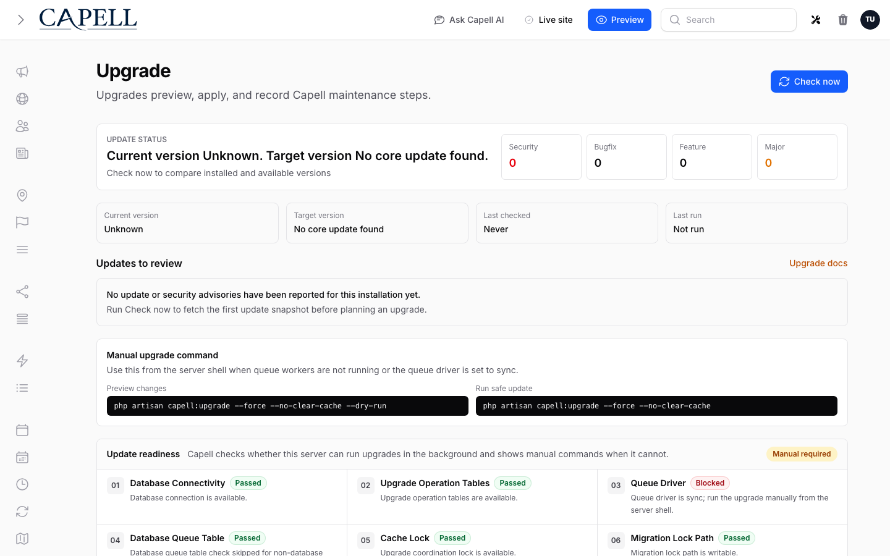

# Upgrading Capell

## Frontend resource graph breaking change

The legacy asset manifest, Mix adapter, build-asset/npm vendor subtypes, loose resource builders, contributor contract, and renderer contract have been removed. Follow the [Frontend Resources upgrade guide](../../packages/frontend/docs/frontend-resources.md), add `capellViteInputs()` to the application Vite input array, run `php artisan capell:frontend-after-install`, and apply the reviewed plan explicitly.



Capell ships with a single upgrade entry point: `php artisan capell:upgrade`. Every operation is idempotent — re-running it is always safe.

Capell 1.x treats upgrades as durable operations. The CLI command remains the stable contract, but admin-triggered upgrades are tracked in the database, run through the queue when safe, and fall back to exact manual server commands when background work is not available.

## Admin Upgrades

Open **Administration → Upgrades** in the Capell admin when you want the most visible upgrade path. The page shows the installed Capell version, links to these docs, explains the upgrade safety rails, and exposes two actions:

- **Check for updates** sends the installed Capell package snapshot to the Capell Marketplace heartbeat API and stores the returned update/security advisory snapshot locally.
- **Preview changes** creates a dry-run upgrade operation. If the server can run queue jobs safely, Capell queues it. If not, Capell records a manual-required operation and shows the exact command.
- **Run safe update** creates a production upgrade operation. It follows the same queue-first/manual-fallback path.

Manual commands stay visible at all times:

```bash
php artisan capell:upgrade --force --no-clear-cache --dry-run
php artisan capell:upgrade --force --no-clear-cache
```

The dashboard Capell info widget also links to the Upgrades page so the upgrade path is visible immediately after signing in.

## Durable Operation Tracking

Upgrade state is split between two responsibilities:

| Table                       | Purpose                                                                                                                                                                                                    |
| --------------------------- | ---------------------------------------------------------------------------------------------------------------------------------------------------------------------------------------------------------- |
| `capell_upgrade_runs`       | One row per upgrade operation: queued, running, succeeded, failed, or manual-required. Stores user, options, stage, failure reason, manual commands, readiness warnings/errors, and a safe output excerpt. |
| `capell_upgrade_run_events` | Append-only timeline for readiness checks, queue decisions, phase changes, warnings, errors, success events, and safe output excerpts.                                                                     |
| `capell_upgrade_log`        | Step/version ledger only. Keeps `UpgradeStepContract` outcomes and package version snapshots.                                                                                                              |
| `capell_upgrade_locks`      | Database-backed mutual exclusion for upgrades and rollbacks. Expired rows can be replaced safely after a hard process kill.                                                                                |

Do not use `capell_upgrade_log` for queue state or admin operation status. A run can fail before a step writes to the ledger, and an admin needs to see that failure even when no upgrade step reached the log.

CLI/manual runs also write durable runs when the run tables exist. That gives operators a consistent history whether an upgrade was started from the admin panel, a queue worker, a deployment script, or an SSH session.

## Readiness Checks

Admin upgrades never execute inline in a web request. Before queueing, Capell checks:

- queue driver is not `sync`;
- upgrade operation tables exist;
- database queue table exists when the database queue driver is active;
- the upgrade coordination lock is available;
- migration lock path is writable;
- database connection is available;
- legacy package upgrade commands exist when installed packages still declare `commands.upgrade`.

If any blocking check fails, Capell creates a `manual_required` run. The admin page shows the warnings/errors, keeps the manual commands visible, and does not try to run the upgrade through the web process.

If the new operation tables are not installed yet, the admin cannot record a durable run. In that bootstrap case it shows manual fallback and the CLI remains the source of truth:

```bash
php artisan capell:upgrade --force --no-clear-cache
```

## Update And Security Notices

Capell shows WordPress-style notices without letting the browser run Composer. The installed site phones home to the marketplace, stores the latest response in `capell_update_advisory_snapshots`, and renders that local snapshot in the Upgrades page.

The heartbeat sends:

- the verified marketplace `instance_id`;
- the local `webhook_url` and `app_url`;
- the installed Capell version;
- official `capell-app/*` Composer package names, slugs, and versions.

The marketplace returns:

- normal update notices for latest safe releases;
- bug advisories that match installed package constraints;
- security advisories that match installed package constraints;
- release notes and upgrade guide links where available.

Security advisories appear before bug advisories and normal updates. High and critical security advisories also surface as a persistent dashboard notice until the next successful check shows the affected package is no longer vulnerable.

Normal update notices may be dismissed temporarily. High and critical security notices cannot be permanently dismissed while the installed version remains affected.

Composer remains manual in Capell 1.x on purpose. Capell tells owners what needs upgrading and gives the suggested Composer command, but package updates still happen through your normal deploy workflow:

```bash
composer update capell-app/blog
php artisan capell:upgrade
```

## Standard flow

```bash
composer update capell-app/capell                  # core
composer update 'capell-app/*'                     # core + every approved package
php artisan capell:upgrade --dry-run               # interactive CLI preview
php artisan capell:upgrade                         # interactive CLI apply
```

The admin/manual fallback commands are deliberately non-interactive and match what the Upgrades page shows:

```bash
php artisan capell:upgrade --force --no-clear-cache --dry-run
php artisan capell:upgrade --force --no-clear-cache
```

The upgrade pipeline runs once and walks every installed package — core and approved add-ons alike. You don't need a separate command per package.

## Why this future-proofs installs

Capell treats upgrades as part of the product, not a pile of release-note errands. Composer remains the source of truth for installed versions, while `capell:upgrade` provides one repeatable operation that packages can plug into.

- **One visible entry point.** Admins can use the Upgrades page; deploy scripts can use the same command.
- **Package-aware by default.** Core and approved packages publish their migrations, run their upgrade commands, and record their versions through the same pipeline.
- **Safe to retry.** Upgrade steps are idempotent, logged, and only considered applied after their data changes and success row commit together.
- **Auditable later.** The ledger records step outcomes and version snapshots, so future maintainers can see what happened without reverse-engineering deploy logs.

## What `capell:upgrade` does

`capell:upgrade` takes the database-backed `capell:upgrade` coordination lock for its
entire duration, so concurrent runs against the same database fail fast even when
application nodes do not share a cache. During the first upgrade from a version that
predates `capell_upgrade_locks`, it falls back to the configured cache lock until the
new table has been migrated. It then executes four phases:

1. **Version audit.** Compares Composer's installed versions against the last-known values in the `capell_upgrade_log` table. Flags new packages, removed packages, and downgrades. Downgrades abort unless `--force-downgrade` is passed.
2. **Migrations.** Publishes pending schema migrations into `database/migrations/` and settings migrations into `database/settings/`, then runs `migrate --force` and `settings:migrate --force`. Already-applied migrations are skipped by Laravel's and Spatie's own tracking.
3. **Upgrade steps.** Each registered `UpgradeStepContract` is evaluated against the current `UpgradeContext`. Pending steps (not yet successfully applied, `shouldRun()` true, dependencies satisfied) run in priority order. Step body + log write happen atomically in one DB transaction.
4. **Per-package commands.** Each `$package->getUpgradeCommand()` (e.g. asset publishing) is invoked for backward compatibility. These legacy manifest commands still run, but Capell records warnings and operation events so packages can migrate to tagged upgrade steps.

Finally, the current Composer versions are recorded as `type=version_snapshot` rows in the log for audit.

## Ledger table

Upgrade step and version ledger state lives in `capell_upgrade_log`. Each row has:

- `type` = `step` or `version_snapshot`
- `key` = step id, or composer package name
- `status` = `success` | `failed` | `skipped` | `rolled_back` | `superseded` | `recorded`
- `meta` (JSON) = duration, output, versions, dependencies, etc.

You can audit upgrades with plain SQL — no joins required.

## Flags

| Flag                           | Purpose                                             |
| ------------------------------ | --------------------------------------------------- |
| `--dry-run`                    | Print the plan; make no changes                     |
| `--force`                      | Skip interactive confirmations                      |
| `--force-downgrade`            | Proceed even if Composer is older than the log says |
| `--force-step=ID` (repeatable) | Re-run a specific step                              |
| `--skip-migrations`            | Don't publish/run migrations                        |
| `--skip-steps`                 | Don't run upgrade steps                             |
| `--only-migrations`            | Run only the migrations phase                       |
| `--only-steps`                 | Run only the upgrade-steps phase                    |
| `--no-clear-cache`             | Skip the cache-clear menu                           |

## Rollback

Steps that implement `rollback()` can be reverted:

```bash
php artisan capell:rollback --step=<step-id>
```

Writes a `rolled_back` row, then marks the original `success` row as `superseded`. Re-running `capell:upgrade` will re-apply the step.

## Source of truth

- **Composer** is authoritative for "what version is installed right now" (`Composer\InstalledVersions::getPrettyVersion()`).
- **`capell_upgrade_runs`** answers "what happened to this operation?"
- **`capell_upgrade_run_events`** answers "what did Capell report while the operation moved through readiness, queue, migration, step, legacy-command, version-ledger, and cache-clear stages?"
- **`capell_upgrade_log`** (type `version_snapshot`, status `recorded`) is an audit trail — written at the end of each successful upgrade. Use it to answer "what version did we upgrade from?"
- **`capell_upgrade_log`** (type `step`, status `success` and not `superseded`) answers "which steps are currently applied?"

## Retention

`capell_upgrade_runs` and `capell_upgrade_run_events` are append-only operational records. Capell v1 does not prune them automatically. Keep successful dry-run records for at least 30 days, successful production records for at least 180 days, and failed/manual-required records until an operator has reviewed or exported them.

## CI / automated deploys

```bash
php artisan capell:upgrade --force --force-downgrade --no-clear-cache
php artisan optimize
```

Exit code is `0` on success, `1` on failure (including lock contention and downgrade without `--force-downgrade`).

## Pre-upgrade checklist

- Back up the database, `.env`, and `storage/`. See [Backups and restore](backups.md).
- `php artisan down` if users could be affected.
- Run in staging first.
- Use `--dry-run` in CI before applying.

## Troubleshooting

**"Another upgrade is running"** — another upgrade or rollback holds the coordination
lock. A database-backed lock expires automatically within 25 minutes after a hard
process kill. On the one-time legacy fallback path, inspect the configured cache lock;
do not delete a lock while an upgrade could still be active.

**Admin shows manual required** — check the readiness timeline on the Upgrades page. Common causes are `QUEUE_CONNECTION=sync`, a missing `jobs` table for the database queue driver, an unwritable `storage/framework/cache` directory, or a legacy package command that is no longer registered.

**A step failed mid-run** — find it with `SELECT * FROM capell_upgrade_log WHERE type='step' AND status='failed';`. Re-running `capell:upgrade` retries it — failures are not considered "applied".

**"Downgrade detected"** — Composer has an older version than the log. Usually a deployment mistake. Restore the newer version, or pass `--force-downgrade` if truly intentional.
