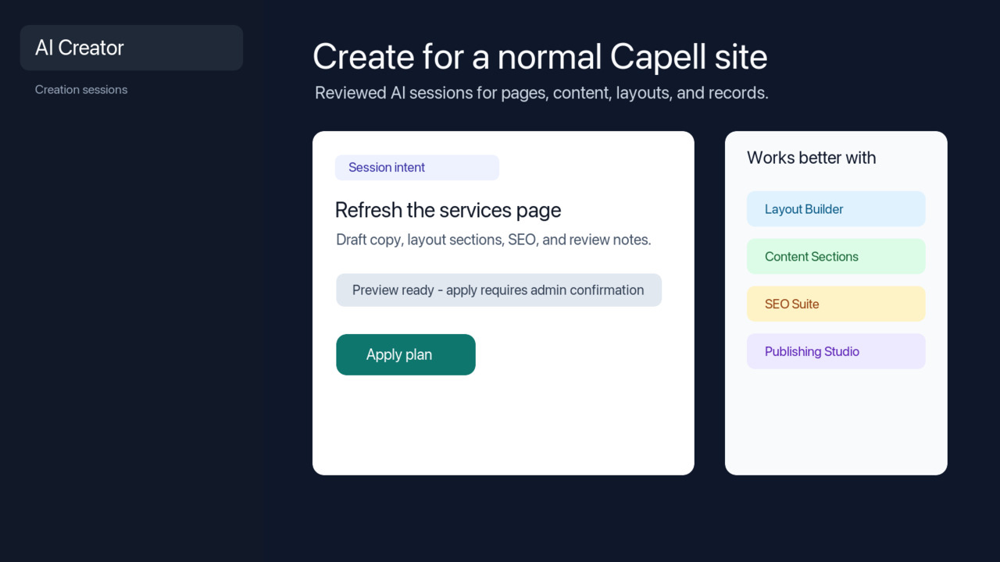

# AI Creator



> **Heads up:** AI Creator is a planned first-party **Capell Commercial** package. It is a Composer package you add to an existing Capell app, not a standalone site builder.

AI Creator helps editors and admins turn a plain-language intent into reviewed Capell work: page drafts, layout plans, reusable content sections, structured records, navigation suggestions, SEO drafts, and package recommendations. It is designed for normal Capell sites where deterministic Actions apply changes after review.

## What It Adds

- Reviewed AI Creator sessions for content, page, layout, and record planning.
- Agent Bridge capabilities for starting, previewing, and applying sessions with confirmation.
- Package recommendations that explain what should be installed before applying a plan.
- Admin-owned persisted session state that keeps public rendering and cached HTML safe.

## Works Better With

AI Creator should upsell and recommend packages based on the requested outcome:

| Package | Why AI Creator recommends it |
| ------- | ---------------------------- |
| [Layout Builder](layout-builder.md) | Complex page composition, reusable layouts, widgets, and scoped assets. |
| [Content Sections](content-sections.md) | Ready-made service blocks, testimonials, FAQs, feature rows, and landing sections. |
| `capell-app/structured-content-library` | Reusable services, locations, team members, case studies, and resource records. |
| `capell-app/media-library` and `capell-app/media-ai` | Managed assets, alt text, metadata, image cleanup, and media selection. |
| `capell-app/seo-suite` | Metadata, structured data, content briefs, publish checks, and AI discovery support. |
| `capell-app/publishing-studio` | Approvals, scheduling, release workspaces, and controlled publishing. |
| `capell-app/insights`, `capell-app/ga4-reports`, and `capell-app/site-monitor` | Post-launch visibility, analytics, and operational confidence. |

AI Creator does not silently install optional packages. Recommendations are marked required, recommended, or optional so an admin can decide before applying the plan.

## Install Shape

```bash
composer require capell-app/ai-creator
php artisan migrate
```

Required packages:

- `capell-app/admin`
- `capell-app/core`
- `capell-app/agent-bridge`
- `capell-app/ai-orchestrator`

Full package docs live in the package repository at `packages/ai-creator/README.md` and `packages/ai-creator/docs/overview.md`.

## Safety

AI Creator output is planning input. Package-owned Actions must own persistence and apply behavior, and no raw AI-generated PHP or Blade should execute directly. Public Blade, cached HTML, and anonymous responses must not expose authoring metadata, model IDs, signed URLs, selectors, package internals, or editor controls.

## Next

- [Package product groups](product-groups.md) - where AI Creator fits commercially.
- [Packages and extensions](catalog.md) - host package boundaries and catalogue links.
- [Packages](README.md) - package authoring and extension points.
