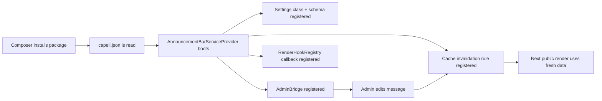

# Build An Extension End To End

This tutorial builds a small `capell-app/announcement-bar` package. It adds one settings group, one admin control page, one frontend render hook, cache invalidation for public output, and focused tests.

Use this shape for real packages: keep package logic in Actions/Data, register through Capell extension points, and prove the public output is safe.

Before copying code, make sure the job and package surfaces are clear. [Package authoring jobs](package-authoring-jobs.md) covers common extension jobs, and [Extension surface vocabulary](extension-surface-vocabulary.md) defines the surface, contribution, capability, install-impact, and marketplace terms used in this tutorial.

## Target Behavior

The package should:

- store an announcement message and enabled flag;
- expose those settings in Admin;
- render a small public banner above the page content;
- avoid exposing admin/editor state in anonymous HTML;
- invalidate public pages when the announcement changes;
- be installable through Composer or Marketplace metadata.

## Files

```text
announcement-bar/
├── composer.json
├── capell.json
├── README.md
├── config/announcement-bar.php
├── database/settings/create_announcement_bar_settings.php
├── resources/lang/en/announcement-bar.php
├── resources/views/frontend/banner.blade.php
├── src/Actions/ResolveAnnouncementBarAction.php
├── src/Admin/AnnouncementBarAdminBridge.php
├── src/Data/AnnouncementBarData.php
├── src/Filament/Pages/AnnouncementBarSettingsPage.php
├── src/Providers/AnnouncementBarServiceProvider.php
├── src/Settings/AnnouncementBarSettings.php
└── tests/Feature/AnnouncementBarFrontendTest.php
```

Keep the package small until this works. Add migrations, jobs, widgets, or Marketplace metadata only when the package really needs them.

## Boot Flow



## Composer Metadata

```json
{
    "name": "capell-app/announcement-bar",
    "type": "library",
    "autoload": {
        "psr-4": {
            "Capell\\AnnouncementBar\\": "src/"
        }
    },
    "extra": {
        "laravel": {
            "providers": [
                "Capell\\AnnouncementBar\\Providers\\AnnouncementBarServiceProvider"
            ]
        }
    }
}
```

The namespace should match the package. Do not place app-specific models or host project classes in reusable packages.

## `capell.json`

```json
{
    "manifest-version": 3,
    "name": "capell-app/announcement-bar",
    "slug": "announcement-bar",
    "displayName": "Announcement Bar",
    "kind": "package",
    "capellApiVersion": "^4.0",
    "version": "1.0.0",
    "description": "Adds a site-wide public announcement banner.",
    "product": {
        "group": "Marketing",
        "tier": "standard",
        "bundle": "content-tools"
    },
    "surfaces": ["admin", "frontend"],
    "dependencies": {
        "requires": [
            "capell-app/core",
            "capell-app/admin",
            "capell-app/frontend"
        ],
        "supports": [],
        "conflicts": []
    },
    "providers": {
        "metadata": [],
        "install": [],
        "runtime": [
            "Capell\\AnnouncementBar\\Providers\\AnnouncementBarServiceProvider"
        ],
        "admin": [],
        "frontend": []
    },
    "contributes": [],
    "database": {
        "migrations": false,
        "settings": true,
        "requiredTables": []
    },
    "commands": {
        "install": null,
        "setup": null,
        "demo": null
    },
    "settings": ["announcement-bar"],
    "permissions": [],
    "capabilities": ["render-hook", "cache-invalidation"],
    "performance": {
        "cacheTags": ["announcement-bar"],
        "cacheSafety": {
            "cacheable": false,
            "sensitiveOutput": false,
            "queueInvalidation": true,
            "variesBy": [],
            "invalidationSources": []
        }
    },
    "healthChecks": [],
    "commercial": {
        "proposedLicense": "standard",
        "requestedCertification": "community",
        "supportPolicy": "community",
        "privateDocsRequested": false
    },
    "marketplace": {
        "summary": "Adds a site-wide public announcement banner.",
        "screenshots": [],
        "categories": ["marketing"]
    }
}
```

The manifest is package metadata, not runtime logic. Runtime registration belongs in providers.

This tutorial registers the render hook directly in the provider below. For a Marketplace-ready package, extract that hook into a class and declare it in `contributes` with `type`, `class`, and `surface` so manifest audits can trace the shipped runtime surface.

## Settings Data

Use a settings class for persistent state and a Data object for the value passed to views.

```php
<?php

declare(strict_types=1);

namespace Capell\AnnouncementBar\Data;

use Spatie\LaravelData\Data;

final class AnnouncementBarData extends Data
{
    public function __construct(
        public bool $enabled,
        public string $message,
    ) {}
}
```

```php
<?php

declare(strict_types=1);

namespace Capell\AnnouncementBar\Actions;

use Capell\AnnouncementBar\Data\AnnouncementBarData;
use Capell\AnnouncementBar\Settings\AnnouncementBarSettings;
use Lorisleiva\Actions\Concerns\AsObject;

final class ResolveAnnouncementBarAction
{
    use AsObject;

    public function handle(): AnnouncementBarData
    {
        $settings = app(AnnouncementBarSettings::class);

        return new AnnouncementBarData(
            enabled: (bool) $settings->enabled,
            message: trim((string) $settings->message),
        );
    }
}
```

The Blade view receives `AnnouncementBarData`. It should not read settings, query models, or inspect the current admin user.

## Provider Registration

```php
<?php

declare(strict_types=1);

namespace Capell\AnnouncementBar\Providers;

use Capell\Admin\Facades\CapellAdmin;
use Capell\AnnouncementBar\Actions\ResolveAnnouncementBarAction;
use Capell\AnnouncementBar\Admin\AnnouncementBarAdminBridge;
use Capell\AnnouncementBar\Settings\AnnouncementBarSettings;
use Capell\Core\Support\Packages\AbstractPackageServiceProvider;
use Capell\Core\Support\Settings\SettingsSchemaRegistry;
use Capell\Frontend\Enums\RenderHookLocation;
use Capell\Frontend\Support\Render\RenderHookRegistry;
use Illuminate\Contracts\View\View;
use Spatie\LaravelPackageTools\Package;

final class AnnouncementBarServiceProvider extends AbstractPackageServiceProvider
{
    public static string $name = 'announcement-bar';

    public static string $packageName = 'capell-app/announcement-bar';

    public function configurePackage(Package $package): void
    {
        $package
            ->name(self::$name)
            ->hasConfigFile('announcement-bar')
            ->hasViews('announcement-bar')
            ->hasTranslations()
            ->hasMigration('create_announcement_bar_settings');
    }

    public function packageBooted(): void
    {
        $this->registerSettings();
        $this->registerAdmin();
        $this->registerFrontend();
    }

    private function registerSettings(): void
    {
        app(SettingsSchemaRegistry::class)
            ->registerSettingsClass('announcement-bar', AnnouncementBarSettings::class);
    }

    private function registerAdmin(): void
    {
        CapellAdmin::registerAdminBridge(self::$packageName, AnnouncementBarAdminBridge::class);
    }

    private function registerFrontend(): void
    {
        app(RenderHookRegistry::class)->registerCallable(
            RenderHookLocation::BodyStart,
            function (): View|string|null {
                $announcement = ResolveAnnouncementBarAction::run();

                if (! $announcement->enabled || $announcement->message === '') {
                    return null;
                }

                return view('announcement-bar::frontend.banner', [
                    'announcement' => $announcement,
                ]);
            },
        );
    }
}
```

If a package has separate install/runtime/admin/frontend providers, keep provider buckets in `capell.json` aligned with those responsibilities. Do not register Filament resources from a frontend-only provider.

Use `registerView()` for view-name hooks, `registerInlineBlade()` for inline Blade snippets, `registerCallable()` for closures that resolve hydrated state before rendering, and `registerExtension()` for class-based render hooks. Package-owned keyed hooks should use `RenderHookContributionData::view()`, `inlineBlade()`, or `extension()` when they need diagnostics, stable dedupe keys, and cache-safety metadata.

## Admin Bridge

```php
<?php

declare(strict_types=1);

namespace Capell\AnnouncementBar\Admin;

use Capell\Admin\Contracts\Bridges\AdminBridge;
use Capell\Admin\Data\AdminBridgeContextData;
use Capell\Admin\Facades\CapellAdmin;
use Capell\Admin\Support\Bridges\AdminBridgeRegistrar;
use Capell\AnnouncementBar\Filament\Pages\AnnouncementBarSettingsPage;

final class AnnouncementBarAdminBridge implements AdminBridge
{
    public function register(AdminBridgeRegistrar $registrar, AdminBridgeContextData $context): void
    {
        CapellAdmin::registerExtensionPage($context->packageName, AnnouncementBarSettingsPage::class);
    }
}
```

Use an AdminBridge when a package contributes more than one admin surface or needs a predictable package-owned registration point.

## Public Blade

```blade
@if ($announcement->enabled && $announcement->message !== '')
    <aside class="announcement-bar">
        {{ $announcement->message }}
    </aside>
@endif
```

This view is intentionally boring. It renders public copy only. It must not include model IDs, field paths, admin URLs, authoring selectors, permissions, or package diagnostics.

## Cache Invalidation

If settings changes affect every public page, invalidate the public page cache from the settings save Action or package settings page. Prefer an Action that updates settings and clears the exact cache scope it owns.

For model-owned output, register model dependencies through `CacheInvalidationRegistry::registerDependency(ModelClass::class, ...)`. Do not build ad hoc cache keys in Blade.

## Test Recipes

### Provider Registration

```php
it('registers the admin bridge', function (): void {
    CapellCore::forcePackageInstalled('capell-app/announcement-bar');

    expect(CapellAdmin::getAdminBridgeRegistry()->classes('capell-app/announcement-bar'))
        ->toContain(AnnouncementBarAdminBridge::class);
});
```

### Frontend Output Safety

```php
it('renders only public announcement markup', function (): void {
    app(AnnouncementBarSettings::class)->fill([
        'enabled' => true,
        'message' => 'Open weekend hours',
    ])->save();

    $html = $this->get('/')->getContent();

    expect($html)->toContain('Open weekend hours')
        ->not->toContain('filament')
        ->not->toContain('signed')
        ->not->toContain('field_path')
        ->not->toContain('data-capell-editor');
});
```

### Action Boundary

```php
it('returns disabled data when message is empty', function (): void {
    app(AnnouncementBarSettings::class)->fill([
        'enabled' => true,
        'message' => '   ',
    ])->save();

    $data = ResolveAnnouncementBarAction::run();

    expect($data->enabled)->toBeTrue()
        ->and($data->message)->toBe('');
});
```

Run the narrow package suite first:

```bash
vendor/bin/pest packages/announcement-bar/tests --configuration=phpunit.xml
```

## Release Checks

- Package appears in `composer show capell-app/announcement-bar`.
- `capell.json` validates and uses manifest version 3.
- Provider registers package-owned settings, admin, frontend, and cache behavior only.
- Admin UI strings use translations.
- Public output passes anonymous and non-admin safety tests.
- README links to package docs, extension points, config, tests, and troubleshooting.

## Next

- [Extension point API reference](extension-point-api-reference.md)
- [Package boot lifecycle](package-boot-lifecycle.md)
- [Testing packages](testing-packages.md)
- [Do not do this](../development/do-not-do-this.md)
