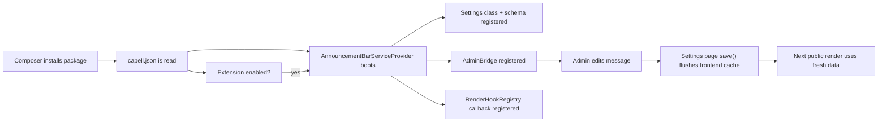
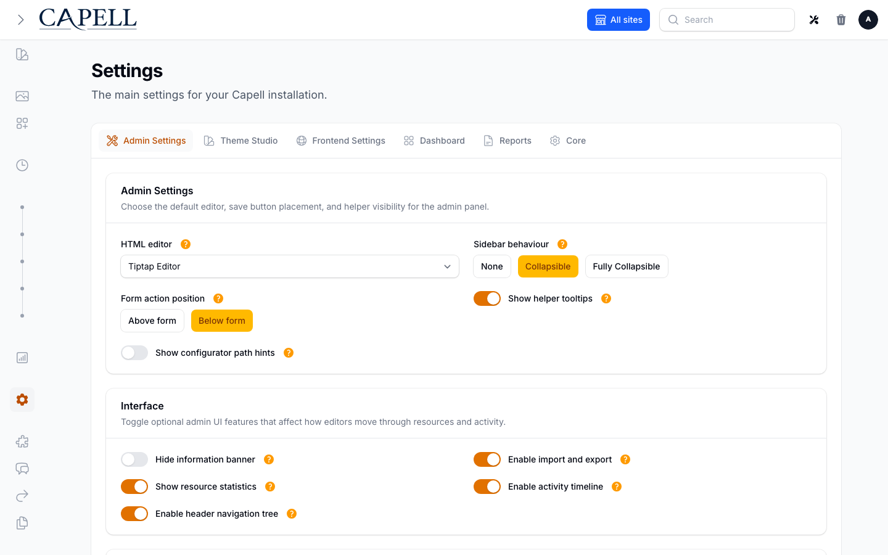

# Build An Extension End To End

This tutorial builds a small `acme/announcement-bar` package. It adds one settings group, one admin control page, one frontend render hook, cache invalidation for public output, and focused tests.

Use this shape for real packages: keep package logic in Actions/Data, register through Capell extension points, and prove the public output is safe.

Before copying code, make sure the job and package surfaces are clear. [Package authoring jobs](package-authoring-jobs.md) covers common extension jobs, and [Extension surface vocabulary](extension-surface-vocabulary.md) defines the surface, contribution, capability, install-impact, and marketplace terms used in this tutorial.

## Target Behavior

The package should:

- store an announcement message and enabled flag;
- expose those settings in Admin;
- render a small public banner above the page content;
- avoid exposing admin/editor state in anonymous HTML;
- invalidate public pages when the announcement changes;
- be installable through Composer or Marketplace metadata.

## Files

```text
announcement-bar/
├── composer.json
├── capell.json
├── README.md
├── config/announcement-bar.php
├── database/settings/2026_01_15_000001_create_announcement_bar_settings.php
├── resources/lang/en/form.php
├── resources/lang/en/settings.php
├── resources/views/frontend/banner.blade.php
├── src/Actions/ResolveAnnouncementBarAction.php
├── src/Actions/FlushAnnouncementBarCacheAction.php
├── src/Admin/AnnouncementBarAdminBridge.php
├── src/Data/AnnouncementBarData.php
├── src/Filament/Pages/AnnouncementBarSettingsPage.php
├── src/Filament/Settings/AnnouncementBarSettingsSchema.php
├── src/Providers/AnnouncementBarServiceProvider.php
├── src/Settings/AnnouncementBarSettings.php
├── phpunit.xml.dist
├── tests/TestCase.php
├── tests/Pest.php
└── tests/Feature/AnnouncementBarFrontendTest.php
```

Every file in this tree is written out below. Settings migrations are timestamped like Laravel migrations (`YYYY_MM_DD_HHMMSS_*`); the settings migrator resolves them by name, so an untimestamped filename will not be published.

Keep the package small until this works. Add migrations, jobs, widgets, or Marketplace metadata only when the package really needs them.

To scaffold this layout instead of writing each file by hand, use `php artisan capell:make-extension`. [Package authoring](../platform/package-authoring.md) covers the scaffold profiles and install commands.

## Boot Flow


```mermaid
flowchart LR
    Composer["Composer installs package"] --> Manifest["capell.json is read"]
    Manifest --> Provider["AnnouncementBarServiceProvider boots"]
    Manifest --> Enabled["Extension enabled?"]
    Enabled -->|"yes"| Provider
    Provider --> Settings["Settings class + schema registered"]
    Provider --> Admin["AdminBridge registered"]
    Provider --> Frontend["RenderHookRegistry callback registered"]
    Admin --> Editor["Admin edits message"]
    Editor --> Save["Settings page save() flushes frontend cache"]
    Save --> Public["Next public render uses fresh data"]
```

## Composer Metadata

```json
{
    "name": "acme/announcement-bar",
    "type": "library",
    "autoload": {
        "psr-4": {
            "Acme\\AnnouncementBar\\": "src/"
        }
    },
    "extra": {
        "laravel": {
            "providers": [
                "Acme\\AnnouncementBar\\Providers\\AnnouncementBarServiceProvider"
            ]
        }
    }
}
```

The namespace should match the package. Do not place app-specific models or host project classes in reusable packages.

<a id="provider-placement"></a>

### Provider placement

Declare the bootstrap provider **here only**, and leave the `capell.json` provider buckets empty. Capell Core, Admin, and Frontend all do this.

Listing the same class in both places defeats the gating you want: Laravel's package discovery boots a composer-declared provider unconditionally, while the manifest buckets are gated on the extension being enabled. A provider named in both runs even when the extension is disabled.

Installer and Marketplace do declare buckets, and both name a class that also appears in their `extra.laravel.providers`. They are deliberate exceptions: the installer must be reachable before anything is enabled, and both packages are part of the platform rather than optional extensions. Do not copy that shape into a new package.

Use the manifest buckets only for *additional* providers that must be gated — an install-only provider in `install`, or a second admin provider in `admin`. The bucket a provider sits in controls whether it loads at all; it does not filter by request context, so an `admin` provider still loads on frontend requests once the package is enabled. Keep admin-only work out of constructors and guard it inside the provider.

## Config And Translations

`->hasConfigFile('announcement-bar')` merges this file at boot, so it must exist even if it is nearly empty:

```php
<?php

declare(strict_types=1);

return [
    'max_message_length' => 255,
];
```

Translation keys are namespaced `announcement-bar::<file>.<key>`, so `announcement-bar::form.enabled` resolves to `resources/lang/en/form.php`:

```php
<?php

declare(strict_types=1);

return [
    'announcement' => 'Announcement',
    'enabled' => 'Show the announcement bar',
    'message' => 'Message',
];
```

```php
<?php

declare(strict_types=1);

// resources/lang/en/settings.php
return [
    'title' => 'Announcement Bar',
];
```

## `capell.json`

```json
{
    "manifest-version": 3,
    "name": "acme/announcement-bar",
    "slug": "announcement-bar",
    "displayName": "Announcement Bar",
    "kind": "package",
    "capellApiVersion": "^1.0",
    "version": "1.0.0",
    "description": "Adds a site-wide public announcement banner.",
    "product": {
        "group": "Marketing",
        "tier": "standard",
        "bundle": "content-tools"
    },
    "surfaces": ["admin", "frontend"],
    "dependencies": {
        "requires": [
            "capell-app/core",
            "capell-app/admin",
            "capell-app/frontend"
        ],
        "supports": [],
        "conflicts": []
    },
    "providers": {
        "metadata": [],
        "install": [],
        "runtime": [],
        "admin": [],
        "frontend": []
    },
    "contributes": [],
    "database": {
        "migrations": false,
        "settings": true,
        "requiredTables": []
    },
    "actions": {
        "install": null,
        "setup": null,
        "uninstall": null,
        "afterInstall": null
    },
    "settings": ["Acme\\AnnouncementBar\\Settings\\AnnouncementBarSettings"],
    "permissions": [],
    "capabilities": ["render-hook", "cache-invalidation"],
    "performance": {
        "cacheTags": ["announcement-bar"],
        "cacheSafety": {
            "cacheable": false,
            "sensitiveOutput": false,
            "queueInvalidation": true,
            "variesBy": [],
            "invalidationSources": []
        }
    },
    "healthChecks": [],
    "commercial": {
        "proposedLicense": "standard",
        "requestedCertification": "community",
        "supportPolicy": "community",
        "privateDocsRequested": false
    },
    "marketplace": {
        "summary": "Adds a site-wide public announcement banner.",
        "screenshots": [],
        "categories": ["marketing"]
    }
}
```

The manifest is package metadata, not runtime logic. Runtime registration belongs in providers.

Three details are easy to get wrong:

- **`settings` holds class-strings, not group names.** The first entry is pushed into `config('settings.settings')` during boot, so a group name such as `"announcement-bar"` produces a fatal error when Spatie tries to call `announcement-bar::repository()`. Every shipped Capell manifest uses the fully-qualified settings class.
- **`database.settings: true` is what publishes and runs your settings migrations.** `InstallPackageAction` publishes the whole `database/settings` directory and then runs it. You do not need an install Action for this.
- **Declare the bootstrap provider in `composer.json` only.** The buckets stay empty here, as in Capell Core, Admin, and Frontend — see [Provider placement](#provider-placement) below.

Keep `dependencies.requires` honest. This package registers admin and frontend surfaces, so it requires `capell-app/admin` and `capell-app/frontend`. Any package that registers an admin page, an Extensions page action, a Filament resource, or admin translations must require `capell-app/admin`.

This tutorial registers the render hook directly in the provider below. For a Marketplace-ready package, extract that hook into a class and declare it in `contributes` with `type`, `class`, and `surface` so manifest audits can trace the shipped runtime surface.

<a id="lifecycle-actions-and-commands"></a>

### Lifecycle: `actions` and `commands`

The manifest has two different lifecycle blocks, and new packages should use only one of them.

| Block      | Value                                                | Status                                          |
| ---------- | ---------------------------------------------------- | ----------------------------------------------- |
| `actions`  | Class-strings implementing `PackageLifecycleAction`  | Current. Use this.                              |
| `commands` | Artisan command names such as `capell:blog-install`  | Legacy. CLI-only, and rejected by web installs. |

Recognised keys are `actions.install`, `actions.uninstall`, `actions.setup`, and `actions.afterInstall`. `commands` mirrors them with `install`, `setup`, `demo`, `afterInstall`, each with an optional `*Params` string list, plus `doctor`.

`PackageLifecycleRunner` prefers the Action whenever both are declared. When a lifecycle runs from a web-triggered install, legacy commands are refused outright:

```text
Package %s declares legacy install command "%s", but web-triggered package lifecycle work
must use a lifecycle Action. Add actions.install to capell.json with a class implementing
Capell\Core\Contracts\PackageLifecycleAction.
```

So a `commands`-only package installs from the CLI but fails in the admin Marketplace flow. That is the single most common reason a package works locally and cannot be installed by a site owner.

The five Foundation packages still ship `commands` because they predate the Action contract and are only ever installed by the CLI installer. Do not copy that pattern into a new package.

A class-string that does not resolve fails the lifecycle loudly rather than being skipped:

```text
Install lifecycle action Acme\AnnouncementBar\Actions\InstallAnnouncementBarAction
for acme/announcement-bar does not exist.
```

A class that exists but does not implement `PackageLifecycleAction` throws a similar error. Both surface at install time, not at boot, and `capell:extension-audit` does not check them — so cover the wiring with a test.

## Settings Data

Use a settings class for persistent state and a Data object for the value passed to views.

```php
<?php

declare(strict_types=1);

namespace Acme\AnnouncementBar\Data;

use Spatie\LaravelData\Data;

final class AnnouncementBarData extends Data
{
    public function __construct(
        public bool $enabled,
        public string $message,
    ) {}
}
```

```php
<?php

declare(strict_types=1);

namespace Acme\AnnouncementBar\Actions;

use Acme\AnnouncementBar\Data\AnnouncementBarData;
use Acme\AnnouncementBar\Settings\AnnouncementBarSettings;
use Lorisleiva\Actions\Concerns\AsObject;

final class ResolveAnnouncementBarAction
{
    use AsObject;

    public function handle(): AnnouncementBarData
    {
        $settings = app(AnnouncementBarSettings::class);

        return new AnnouncementBarData(
            enabled: (bool) $settings->enabled,
            message: trim((string) $settings->message),
        );
    }
}
```

The Blade view receives `AnnouncementBarData`. It should not read settings, query models, or inspect the current admin user.

## Settings Class

Persistent state extends `Spatie\LaravelSettings\Settings`. Capell requires `SettingsContract` so the group name is discoverable, and `SettingsSchemaContract` when the group should render through a Capell-generated admin form.

```php
<?php

declare(strict_types=1);

namespace Acme\AnnouncementBar\Settings;

use Acme\AnnouncementBar\Filament\Settings\AnnouncementBarSettingsSchema;
use Capell\Core\Contracts\SettingsContract;
use Capell\Core\Contracts\SettingsSchemaContract;
use Spatie\LaravelSettings\Settings;

class AnnouncementBarSettings extends Settings implements SettingsContract, SettingsSchemaContract
{
    public bool $enabled = false;

    public string $message = '';

    public static function group(): string
    {
        return 'announcement-bar';
    }

    public static function schema(): string
    {
        return AnnouncementBarSettingsSchema::class;
    }
}
```

Property names are snake_case in shipped Capell settings groups. Every property needs a default: the settings migration writes the initial row, and a property without a default throws during group hydration if the migration has not run.

Do not type a property as a backed enum unless every persisted value is guaranteed valid. Capell's own `FrontendSettings` deliberately stores `visitor_language_detection` as a `string` because an unrecognised persisted value would otherwise throw while the whole group hydrates.

## Settings Migration

Settings migrations are Spatie settings migrations, not Laravel schema migrations. They live in `database/settings/`, return an **anonymous class**, and are keyed `group.property`:

```php
<?php

declare(strict_types=1);

use Spatie\LaravelSettings\Migrations\SettingsMigration;

return new class extends SettingsMigration
{
    public function up(): void
    {
        if (! $this->migrator->exists('announcement-bar.enabled')) {
            $this->migrator->add('announcement-bar.enabled', false);
        }

        if (! $this->migrator->exists('announcement-bar.message')) {
            $this->migrator->add('announcement-bar.message', '');
        }
    }
};
```

Guard every `add()` with `exists()`. Reruns are normal — installs, upgrades, and repaired environments all replay these files — and an unguarded `add()` throws on the second run.

### Publishing them from the package

You do not write any code for this. Setting `"database": { "settings": true }` in `capell.json` is the whole mechanism: `InstallPackageAction` publishes every file in your `database/settings` directory and then runs the settings migrator.

Two things it does that hand-rolled publishing usually gets wrong: it publishes with edit protection, so a migration the site owner has already customised is not silently overwritten, and it runs the settings migrator itself rather than leaving the group unmigrated.

`->hasMigration()` in `configurePackage()` is not the mechanism either. That is for Laravel schema migrations: spatie-package-tools resolves those names against `database/migrations` and publishes them to the application's `database/migrations`, where the settings migrator never looks.

Never renumber or rename a shipped settings migration. Published files are tracked by name, so a rename republishes as a new migration and re-adds keys that already exist.

A lifecycle Action is for install work that Capell cannot infer from the manifest — seeding demo content, calling an external service, writing a non-settings config. Publishing your own settings migrations is not one of those cases.

## Filament Settings Page

Extend `AbstractPackageSettingsPage`. It builds the form from the registered settings schema, so the page itself only declares which group it edits:

```php
<?php

declare(strict_types=1);

namespace Acme\AnnouncementBar\Filament\Pages;

use Acme\AnnouncementBar\Actions\FlushAnnouncementBarCacheAction;
use Acme\AnnouncementBar\Settings\AnnouncementBarSettings;
use BackedEnum;
use Capell\Admin\Filament\Pages\AbstractPackageSettingsPage;
use Filament\Support\Icons\Heroicon;
use Illuminate\Contracts\Support\Htmlable;
use Override;

class AnnouncementBarSettingsPage extends AbstractPackageSettingsPage
{
    protected static string $settings = AnnouncementBarSettings::class;

    protected static string $settingsGroup = 'announcement-bar';

    protected static string|BackedEnum|null $navigationIcon = Heroicon::OutlinedMegaphone;

    protected static ?string $slug = 'announcement-bar';

    #[Override]
    public function getTitle(): string|Htmlable
    {
        return __('announcement-bar::settings.title');
    }

    #[Override]
    public function save(): void
    {
        parent::save();

        FlushAnnouncementBarCacheAction::run();
    }
}
```

The `save()` override is what connects the settings form to cache invalidation — see [Cache invalidation](#cache-invalidation). Without it, the base class persists the settings and cached public HTML keeps serving the old message.

Signature details that differ from older Filament releases:

- Filament 5 uses `form(Schema $schema): Schema` with `Filament\Schemas\Schema`, not `form(Form $form): Form`. `AbstractPackageSettingsPage` already implements it; override it only to depart from the generated form.
- `protected static string $settings` is non-nullable — no `?`.
- `$navigationIcon` is typed `string|BackedEnum|null` and takes a `Filament\Support\Icons\Heroicon` case, not an icon-name string.
- Layout components come from `Filament\Schemas\Components\*`; inputs still come from `Filament\Forms\Components\*`.

The matching schema class supplies the fields:

```php
<?php

declare(strict_types=1);

namespace Acme\AnnouncementBar\Filament\Settings;

use Capell\Core\Contracts\SettingsSchema;
use Filament\Forms\Components\Checkbox;
use Filament\Forms\Components\TextInput;
use Filament\Schemas\Components\Section;
use Filament\Schemas\Schema;

class AnnouncementBarSettingsSchema implements SettingsSchema
{
    /**
     * @return array<int, mixed>
     */
    public static function make(Schema $schema): array
    {
        return [
            Section::make(__('announcement-bar::form.announcement'))
                ->columnSpanFull()
                ->schema([
                    Checkbox::make('enabled')
                        ->label(__('announcement-bar::form.enabled')),
                    TextInput::make('message')
                        ->label(__('announcement-bar::form.message'))
                        ->maxLength(255),
                ]),
        ];
    }
}
```

`Capell\Core\Contracts\SettingsSchema` is a **marker interface** with no declared methods. The contract is enforced at call time instead: Capell invokes `YourSchema::make($schema)` and throws `InvalidArgumentException` with one of two messages —

- missing or non-callable `make()`: "Settings schema %s must implement %s and define a callable static make method to render in the admin panel."
- `make()` returns a non-array: "Settings schema %s::make() must return an array."

Because the interface cannot enforce the method, PHPStan will not catch a wrong signature here; the failure surfaces when the settings page renders.

Field names must match the settings property names exactly (`enabled`, `message`), since the generated form hydrates and saves straight onto the settings class.

All labels go through translations. Do not inline user-facing English in a Filament component.



## Provider Registration

```php
<?php

declare(strict_types=1);

namespace Acme\AnnouncementBar\Providers;

use Acme\AnnouncementBar\Actions\ResolveAnnouncementBarAction;
use Acme\AnnouncementBar\Admin\AnnouncementBarAdminBridge;
use Acme\AnnouncementBar\Settings\AnnouncementBarSettings;
use Capell\Admin\Facades\CapellAdmin;
use Capell\Core\Support\Packages\AbstractPackageServiceProvider;
use Capell\Core\Support\Settings\SettingsSchemaRegistry;
use Capell\Frontend\Enums\RenderHookLocation;
use Capell\Frontend\Support\Render\RenderHookRegistry;
use Illuminate\Contracts\View\View;
use Spatie\LaravelPackageTools\Package;

final class AnnouncementBarServiceProvider extends AbstractPackageServiceProvider
{
    public static string $name = 'announcement-bar';

    public static string $packageName = 'acme/announcement-bar';

    public function configurePackage(Package $package): void
    {
        $package
            ->name(self::$name)
            ->hasConfigFile('announcement-bar')
            // No hasMigration() call: settings migrations are published from
            // `database.settings` in capell.json, and hasMigration() is for
            // Laravel schema migrations only.
            ->hasViews('announcement-bar')
            ->hasTranslations();
    }

    protected function bootInstalledPackage(): self
    {
        $this->registerSettings();
        $this->registerAdmin();
        $this->registerFrontend();

        return $this;
    }

    private function registerSettings(): void
    {
        app(SettingsSchemaRegistry::class)
            ->registerSettingsClass('announcement-bar', AnnouncementBarSettings::class);
    }

    private function registerAdmin(): void
    {
        CapellAdmin::registerAdminBridge(self::$packageName, AnnouncementBarAdminBridge::class);
    }

    private function registerFrontend(): void
    {
        app(RenderHookRegistry::class)->registerCallable(
            RenderHookLocation::HeaderAfter,
            function (): View|string|null {
                $announcement = ResolveAnnouncementBarAction::run();

                if (! $announcement->enabled || $announcement->message === '') {
                    return null;
                }

                return view('announcement-bar::frontend.banner', [
                    'announcement' => $announcement,
                ]);
            },
        );
    }
}
```

`bootInstalledPackage()` — not spatie-package-tools' `packageBooted()` — is where package registration belongs. `AbstractPackageServiceProvider` calls it only when the extension record is installed, which is what makes "required but not enabled" mean "renders nothing". Registering in `packageBooted()` runs unconditionally, so a disabled package would still add its admin page and render hook.

The base class offers three boot hooks:

| Hook | Runs |
| ---- | ---- |
| `bootPackage()` | Always, including during `package:discover`. Metadata only. |
| `bootInstalledPackage()` | Only when the package is installed. Normal registration. |
| `bootWhenInstalled(callable)` | Same gate, for one-off blocks. |

If a package has separate install/runtime/admin/frontend providers, keep provider buckets in `capell.json` aligned with those responsibilities. Do not register Filament resources from a frontend-only provider.

**Pick a location that the theme actually emits.** `RenderHookLocation` declares more cases than the shipped Foundation templates render. These are emitted today:

`HeadClose`, `HeaderAfter`, `MainContent`, `BeforeContent`, `AfterContent`, `BeforeTitle`, `AfterTitle`, `BeforeResult`, `AfterResult`, `Footer`, `FooterBefore`, `FooterAfter`, `BodyEnd`.

`HeadOpen`, `BodyStart`, `HeaderBefore`, and `ArticleMeta` are declared but have no emit site in the Foundation templates, so a hook registered there is silently never called. There is no post-render injector that would rescue it. This tutorial uses `HeaderAfter` to put the banner directly below the site header.

A custom or third-party theme may emit a different subset. If a hook does not appear, confirm the theme renders that location before debugging your provider — see [Debugging public output](../frontend/debugging-public-output.md).

Use `registerView()` for view-name hooks, `registerInlineBlade()` for inline Blade snippets, `registerCallable()` for closures that resolve hydrated state before rendering, and `registerExtension()` for class-based render hooks. Package-owned keyed hooks should use `RenderHookContributionData::view()`, `inlineBlade()`, or `extension()` when they need diagnostics, stable dedupe keys, and cache-safety metadata.

## Admin Bridge

```php
<?php

declare(strict_types=1);

namespace Acme\AnnouncementBar\Admin;

use Acme\AnnouncementBar\Filament\Pages\AnnouncementBarSettingsPage;
use Capell\Admin\Data\Bridges\AdminBridgeContextData;
use Capell\Admin\Facades\CapellAdmin;
use Capell\Admin\Support\Bridges\AbstractAdminBridge;
use Capell\Admin\Support\Bridges\AdminBridgeRegistrar;

final class AnnouncementBarAdminBridge extends AbstractAdminBridge
{
    public function register(AdminBridgeRegistrar $registrar, AdminBridgeContextData $context): void
    {
        CapellAdmin::registerExtensionPage($context->packageName, AnnouncementBarSettingsPage::class);
    }
}
```

Extend `AbstractAdminBridge` rather than implementing the `AdminBridge` interface directly. The interface declares **two** methods — `isEnabled(AdminBridgeContextData $context): bool` and `register(...)` — so implementing it directly without `isEnabled()` is a fatal error. `AbstractAdminBridge` supplies `isEnabled()` returning `true`; override it when the bridge should register conditionally.

Note the namespace: the context object is `Capell\Admin\Data\Bridges\AdminBridgeContextData`, under `Data\Bridges`.

Use an AdminBridge when a package contributes more than one admin surface or needs a predictable package-owned registration point.

## Public Blade

```blade
@if ($announcement->enabled && $announcement->message !== '')
    <aside class="announcement-bar">
        {{ $announcement->message }}
    </aside>
@endif
```

This view is intentionally boring. It renders public copy only. It must not include model IDs, field paths, admin URLs, authoring selectors, permissions, or package diagnostics.

## Cache Invalidation

The banner renders on every page, so changing the setting must invalidate cached public HTML. Otherwise editors save a new message and the old one keeps being served.

`CacheInvalidationRegistry::registerDependency(string $modelClass, string|array $cachePatterns)` is keyed on an Eloquent model and driven by model saves, so it **cannot** be used here: this package owns no model. A settings-driven change needs an explicit flush instead.

Add an Action that flushes the frontend cache:

```php
<?php

declare(strict_types=1);

namespace Acme\AnnouncementBar\Actions;

use Capell\Frontend\Data\CacheInvalidationPlanData;
use Capell\Frontend\Data\CacheInvalidationRule;
use Capell\Frontend\Support\Cache\CacheInvalidationExecutor;
use Lorisleiva\Actions\Concerns\AsObject;

final class FlushAnnouncementBarCacheAction
{
    use AsObject;

    public function handle(): void
    {
        resolve(CacheInvalidationExecutor::class)->execute(
            new CacheInvalidationPlanData([CacheInvalidationRule::flushFrontendTag()]),
        );
    }
}
```

`flushFrontendTag()` clears the whole frontend cache. That is the honest choice for output that appears on every page; use the narrower `forgetKey()`, `invalidatePattern()`, or `pageModel()` rules when a change affects a known subset.

Nothing calls this Action automatically. It is wired in by the `save()` override on [the settings page](#filament-settings-page) — that override is the only thing standing between an editor's save and stale cached HTML.

Frontend cache classes come from `capell-app/frontend`. Guard the call (or move it behind an interface) if your package supports installations that do not include the Frontend package.

Do not build ad hoc cache keys in Blade.

## Test Recipes

### Provider Registration

```php
use Capell\Admin\Support\Bridges\AdminBridgeRegistry;
use Acme\AnnouncementBar\Admin\AnnouncementBarAdminBridge;
use Capell\Core\Facades\CapellCore;

it('registers the admin bridge', function (): void {
    CapellCore::forcePackageInstalled('acme/announcement-bar');

    expect(resolve(AdminBridgeRegistry::class)->classes('acme/announcement-bar'))
        ->toContain(AnnouncementBarAdminBridge::class);
});
```

The bridge registry is a container singleton, not a facade method: resolve `AdminBridgeRegistry` directly. `classes()` takes the package name and returns `list<class-string<AdminBridge>>` for that package only — it has no zero-argument form.

### Frontend Output Safety

```php
it('renders only public announcement markup', function (): void {
    app(AnnouncementBarSettings::class)->fill([
        'enabled' => true,
        'message' => 'Open weekend hours',
    ])->save();

    $html = $this->get('/')->getContent();

    expect($html)->toContain('Open weekend hours')
        ->not->toContain('filament')
        ->not->toContain('signed')
        ->not->toContain('field_path')
        ->not->toContain('data-capell-editor');
});
```

### Action Boundary

```php
it('returns disabled data when message is empty', function (): void {
    app(AnnouncementBarSettings::class)->fill([
        'enabled' => true,
        'message' => '   ',
    ])->save();

    $data = ResolveAnnouncementBarAction::run();

    expect($data->enabled)->toBeTrue()
        ->and($data->message)->toBe('');
});
```

These recipes assume a working test harness. A package developed in its own repository needs Orchestra Testbench, a base `TestCase` that boots Capell, and a package-local `phpunit.xml` — see [Testing packages → Standalone package harness](testing-packages.md#standalone-package-harness) for the exact files. Run them from the package root:

```bash
vendor/bin/pest
```

Inside this monorepo, run the narrow package suite against the root configuration instead:

```bash
vendor/bin/pest packages/announcement-bar/tests --configuration=phpunit.xml
```

## Install And Enable It

Composer alone is not enough. Providers in the `runtime`, `admin`, and `frontend` buckets load only once the package's extension record is **enabled**, so a package that is merely required renders nothing and shows no admin page.

From the application root:

```bash
composer require acme/announcement-bar
php artisan capell:package-cache:clear
php artisan capell:package-cache
php artisan capell:extension-install acme/announcement-bar --dry-run
php artisan capell:extension-install acme/announcement-bar
```

`capell:extension-install` publishes and runs this package's settings migrations (because `database.settings` is `true`), runs any declared `actions.install` — this package declares none — and enables the extension. Run `--dry-run` first on a new package to see the plan without changing anything.

Site owners do the same thing from the admin Marketplace, which is why the lifecycle must be an Action and not a legacy command.

Then confirm the package is actually live:

- the package is listed on the admin **Extensions** page, and its settings page opens from there;
- enabling the toggle and saving a message renders the banner on a public page;
- `php artisan capell:doctor` reports no package health failures.

**Extension settings pages do not appear in the normal Settings navigation.** `registerExtensionPage()` deliberately turns off the page's native Filament navigation and registers it in the extension page registry instead, so the page is reached from the Extensions management list. This is intended behaviour, not a misconfiguration — do not add `$shouldRegisterNavigation = true` to force it into the sidebar.

If the package is not on the Extensions page at all, it is required but not enabled — rerun `capell:extension-install`. [Extension troubleshooting](extension-troubleshooting.md) covers the rest.

## Release Checks

- Package appears in `composer show acme/announcement-bar`.
- `capell.json` validates and uses manifest version 3.
- `php artisan capell:extension-audit packages/announcement-bar` passes.
- Provider registers package-owned settings, admin, frontend, and cache behavior only.
- Admin UI strings use translations.
- Public output passes anonymous and non-admin safety tests.
- README links to package docs, extension points, config, tests, and troubleshooting.

## Next

- [Extension point API reference](extension-point-api-reference.md)
- [Package boot lifecycle](package-boot-lifecycle.md)
- [Testing packages](testing-packages.md)
- [Do not do this](../development/do-not-do-this.md)
