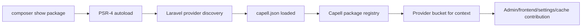

# Debugging Package Discovery

Use this when a package is installed with Composer but Capell cannot see its commands, settings, admin surfaces, frontend output, or Marketplace metadata.

## Discovery Flow



Debug left to right. Do not start by editing UI code until Composer, autoload, provider discovery, and manifest state are proven.

## First Checks

```bash
composer show capell-app/example
composer dump-autoload -o
php artisan optimize:clear
php artisan capell:package-cache:clear
php artisan list capell
```

If the package comes from a private repository or local path repository:

```bash
composer config repositories
composer show capell-app/example --available
```

## Symptom Table

| Symptom                                    | Likely cause                                             | Check                                                            | Fix                                                                      |
| ------------------------------------------ | -------------------------------------------------------- | ---------------------------------------------------------------- | ------------------------------------------------------------------------ |
| Composer cannot find package               | Repository/auth/path config missing                      | `composer config repositories`                                   | Add repository/auth or local path repo, then `composer clear-cache`.     |
| Composer installs package but classes fail | PSR-4 namespace mismatch                                 | `composer dump-autoload -o` output                               | Fix `composer.json` autoload namespace/path.                             |
| Laravel never boots provider               | Provider discovery missing/disabled                      | `composer show -a package` and package `extra.laravel.providers` | Add provider discovery or register provider in host app.                 |
| Capell package state missing               | `capell.json` invalid or package cache stale             | Inspect manifest and clear package cache                         | Fix manifest v3 fields and run `php artisan capell:package-cache:clear`. |
| Admin surface missing only in browser      | Admin provider not in admin bucket or config cache stale | Check `capell.json` providers and `php artisan optimize:clear`   | Move Filament code to admin provider/AdminBridge.                        |
| Frontend output missing                    | Frontend provider not loaded or path not reserved        | `php artisan route:list` and frontend registry tests             | Register frontend provider, render hook, component, or reserved path.    |
| Settings missing                           | Settings class/schema not registered                     | Inspect `SettingsSchemaRegistry` registrations                   | Register settings class and schema; run settings migration.              |

## Composer Drift

Composer drift means `capell_extensions` and the current Composer/package registry no longer agree. The Extensions dashboard reports drift as a health alert, but it is read-only: loading `/admin/extensions` must never run `composer require`.

Capell classifies drift into four reasons:

| Reason                       | What it means                                                                   | Repair path                                                                                              |
| ---------------------------- | ------------------------------------------------------------------------------- | -------------------------------------------------------------------------------------------------------- |
| Missing registry manifest    | A `capell_extensions` row exists, but the current registry has no manifest      | Review the record manually. The package may have been removed, renamed, or stopped registering metadata. |
| Composer unavailable         | The registry manifest exists, but Composer does not expose the package          | Run `php artisan capell:extensions:repair-composer-drift vendor/example`.                                |
| Version mismatch             | Composer exposes a different version than the Capell extension record           | Run the repair command, then verify the extension install/upgrade path if metadata still disagrees.      |
| Disabled or failed in Capell | Composer exposes the package, but `capell_extensions.status` blocks runtime use | Review status, runtime gate, and recent install/upgrade failures before re-enabling the extension.       |

For bulk repair, the `CAPELL_EXTENSIONS_COMPOSER_DRIFT_AUTO_FIX` gate, `--force`, and the recorded repair metadata, see [`capell:extensions:repair-composer-drift`](../development/artisan-commands.md#capellextensionsrepair-composer-drift).

## Manifest Checklist

The package manifest should answer:

- What is the Composer package name?
- What kind of package is it?
- Which provider buckets should load in install/runtime/admin/frontend contexts?
- Which settings group does it own?
- Which product group/tier/bundle should Marketplace and docs show?
- Which scopes does it require?

Older manifest fields such as `capell-version` are not supported. Use manifest version 3.

## Test Recipe

```php
it('registers package metadata and providers', function (): void {
    $package = CapellCore::getPackage('capell-app/example');

    expect($package->name)->toBe('capell-app/example')
        ->and($package->getLabel())->toBe('Example')
        ->and($package->hasAdminScope())->toBeTrue();
});
```

```php
it('boots the package provider without writing host state', function (): void {
    expect(fn (): array => $this->app->getLoadedProviders())
        ->not->toThrow(Throwable::class);
});
```

## Next

- [Package boot lifecycle](package-boot-lifecycle.md)
- [Extension troubleshooting](extension-troubleshooting.md)
- [Package checklist](package-checklist.md)
