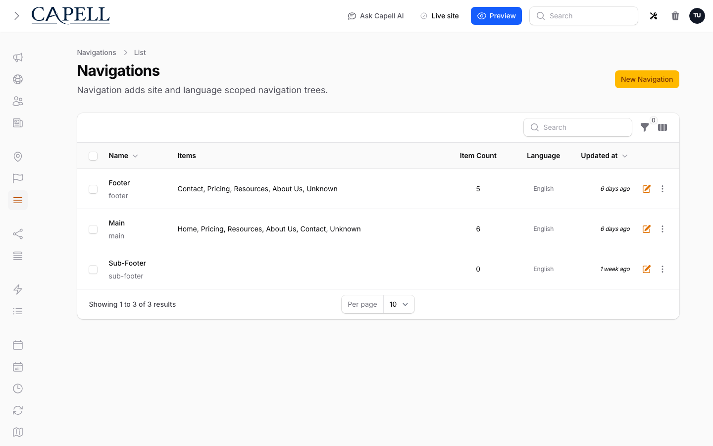

# Frontend Extensions



Frontend packages should register behaviour through [render hooks](../../packages/frontend/docs/extending-render-hooks.md), route/path registries, Blade components, Livewire components, Inertia components, vendor assets, cache dependencies, and explicit package registries.

If the package needs in-page editing, do not put editor metadata in its views. Register editable regions with `capell-app/frontend-authoring` so the admin-only beacon can add controls after the page has loaded.

## Render Hooks

Use `RenderHookRegistry` for injected HTML:

```php
use Capell\Frontend\Enums\RenderHookLocation;
use Capell\Frontend\Support\Render\RenderHookRegistry;

resolve(RenderHookRegistry::class)->register(
    RenderHookLocation::HeadClose,
    fn (): string => view('capell-example::head.tags')->render(),
);
```

Use render hooks for SEO tags, consent-aware analytics snippets, public theme fragments, and other output that genuinely belongs in the rendered page.

Do not use render hooks to add authoring buttons, hidden model IDs, field paths, selectors, signed edit URLs, or other editor state to public HTML. Cached HTML must stay safe for anonymous and non-admin visitors.

## Assets

Register package Tailwind sources or imports through Capell asset registries when package views contain classes that must be compiled.

Use `TailwindAssetsRegistry` for source files, imports, plugins, and theme colors. Use `FrontendResourceRegistry` groups or tagged `FrontendAssetContributor` implementations for runtime CSS, JavaScript, preload, and lazy asset delivery.

```php
use Capell\Core\Support\Tailwind\TailwindAssetsRegistry;

public function boot(TailwindAssetsRegistry $assets): void
{
    $assets->registerSource(__DIR__ . '/../resources/views/**/*.blade.php', 'capell-example');
    $assets->registerImport('@source "../../vendor/capell-app/example/resources/views/**/*.blade.php";', 'capell-example');
}
```

## Widget Resources, Presentation, And Interactions

Frontend widgets can register runtime resource groups, type-level presentation defaults, and default interaction triggers through `LayoutWidgetRegistry::registerDefinition()`.

Use this split when building package widgets:

| Data                         | Purpose                                                               |
| ---------------------------- | --------------------------------------------------------------------- |
| Normal widget `data`         | Content props the widget component needs.                             |
| `data.__capell.presentation` | Instance-level delivery and display overrides.                        |
| `data.__capell.interactions` | Public trigger definitions.                                           |
| Widget definition defaults   | Package-owned defaults for presentation, resources, and interactions. |

Public rendering strips `__capell` before passing props to the widget component. Keep component data focused on what the widget displays; keep runtime behaviour in Capell metadata. For [Inertia widgets](../getting-started/inertia-widgets.md), register `LayoutWidgetDefinitionData::frontendInertia()` with a stable public server component name that the active Vue or React adapter can resolve.

Use `FrontendResourceRegistry` for widget CSS and JavaScript that should only load when a widget appears on the page:

```php
use Capell\LayoutBuilder\Data\LayoutWidgets\LayoutWidgetDefinitionData;
use Capell\Core\Enums\PresentationLoadingStrategy;
use Capell\LayoutBuilder\Support\LayoutWidgets\LayoutWidgetRegistry;
use Capell\Frontend\Support\Assets\FrontendResourceRegistry;

public function boot(FrontendResourceRegistry $resources, LayoutWidgetRegistry $widgets): void
{
    $resources
        ->group('example.carousel')
        ->css('resources/css/carousel.css', buildPath: 'vendor/example')
        ->js('resources/js/carousel.js', buildPath: 'vendor/example', loading: PresentationLoadingStrategy::Visible);

    $widgets->registerDefinition(LayoutWidgetDefinitionData::frontendBlade(
        key: 'carousel',
        component: 'example::widgets.carousel',
        resourceGroups: ['example.carousel'],
        defaultPresentationSettings: [
            'width_mode' => 'container',
            'loading_strategy' => 'visible',
        ],
        defaultInteractionTriggers: [
            [
                'label' => 'Open gallery',
                'target_type' => 'widget',
                'behavior' => 'modal',
                'target_widget' => [
                    ['type' => 'carousel', 'data' => ['mode' => 'gallery']],
                ],
            ],
        ],
    ));
}
```

Packages that want admin diagnostics, labels, descriptions, and default group discovery should register the group metadata directly:

```php
$resources->register(
    key: 'example.carousel',
    label: 'Carousel',
    assets: [
        ['source' => 'resources/css/carousel.css'],
        [
            'source' => 'resources/js/carousel.js',
            'loadingStrategy' => PresentationLoadingStrategy::Visible->value,
            'defer' => true,
        ],
    ],
    description: 'Carousel widget CSS and JavaScript.',
    package: 'capell-app/example',
    defaultBuildPath: 'vendor/example',
);
```

Theme metadata can still define `editor.resources` or legacy `resources`. Capell normalizes those definitions through the same resolver used for package defaults. Resolution prefers theme metadata, then the loaded theme blueprint/type metadata, then registered package defaults.

The public asset manifest exposes generated resource IDs, not package keys or component names. Keep package names, model IDs, field paths, signed URLs, and editor metadata out of widget placeholders and rendered HTML.

## Interactions

Interactions are public triggers that can open lazy widgets, lazy [Layout Builder](layout-builder.md) fragments, safe URLs, or public-action fallbacks. They are designed for editor-managed video modals, form slide-overs, galleries, calculators, comparison panels, and optional content.

Every interaction has a trigger, behaviour, and target:

| Piece     | Package responsibility                                                                               |
| --------- | ---------------------------------------------------------------------------------------------------- |
| Trigger   | Provide sensible labels/icons/defaults where the widget type has an obvious action.                  |
| Behaviour | Use the shared runtime behaviours: `modal`, `slide_over`, `inline_reveal`, `replace_region`.         |
| Target    | Register widgets or integrate with Layout Builder fragments instead of adding bespoke public routes. |

Use these storage paths:

| Surface                           | Path                                                      |
| --------------------------------- | --------------------------------------------------------- |
| Widget instance                   | `data.__capell.interactions`                              |
| Widget type default               | `LayoutWidgetDefinitionData::$defaultInteractionTriggers` |
| Layout Builder block instance     | layout block `meta.interactions`                          |
| Layout Builder block type default | type `meta.interactions`                                  |

Lazy widget targets render through `/_capell/widgets/{reference}`. Lazy Layout Builder fragments render through `/_capell/fragments/{reference}`. Both use encrypted opaque references and generic failures.

Valid interaction behaviours are `modal`, `slide_over`, `inline_reveal`, and `replace_region`. Package JavaScript should not implement its own modal shell for normal widget interactions; register widget assets and let the frontend runtime fetch and mount the target.

Public triggers may include labels, style hints, generated URLs, analytics keys, and generic runtime attributes. They must not include target widget content, widget keys, component names, package names, model IDs, block keys, field paths, signed URLs, or editor metadata.

Use widget targets when the package owns a reusable experience, such as a video player or calculator. Use fragment targets when the content already exists as a public Layout Builder block and should be fetched later.

## Components

Blade components can be registered from the package provider:

```php
Blade::componentNamespace('Capell\\Example\\View\\Components', 'capell-example');
```

Livewire components should use a package prefix:

```php
Livewire::component('capell-example::preview', PreviewComponent::class);
```

When a package needs a stable component alias that other Capell code can resolve, register it with `FrontendComponentRegistry`:

```php
use Capell\Frontend\Contracts\FrontendComponentRegistryInterface;

resolve(FrontendComponentRegistryInterface::class)->register(
    key: 'capell-example.preview',
    component: 'capell-example::preview',
    aliases: ['example-preview'],
    props: ['title', 'items'],
);
```

Use the registry when content or layout state needs a stable component key. Direct Blade/Livewire registration is enough when the component is only referenced by package-owned views.

## Routes And Reserved Paths

Register package-owned public routes from the package provider and reserve their paths so the frontend page fallback does not treat them as CMS pages.

```php
use Capell\Frontend\Support\Routing\ReservedFrontendPathRegistry;

resolve(ReservedFrontendPathRegistry::class)->reservePrefix('example-api');
resolve(ReservedFrontendPathRegistry::class)->reserveExact('example-webhook');
```

`reservePrefix('example-api')` reserves `example-api` and every path below it. `reserveExact('example-webhook')` reserves only that path. Paths are normalized, so leading/trailing slashes do not matter.

Use `FrontendRouteMiddlewareRegistry` only when the package needs to add middleware to the public page route itself. Most packages should add their own route middleware instead.

```php
use Capell\Frontend\Http\Middleware\RejectReservedFrontendPaths;
use Capell\Frontend\Support\Routing\FrontendRouteMiddlewareRegistry;

resolve(FrontendRouteMiddlewareRegistry::class)->insertAfter(
    RejectReservedFrontendPaths::class,
    [ExampleFrontendMiddleware::class],
);
```

The default public page middleware order starts with reserved-path rejection, then `web`, maintenance, workspace context, frontend resolution, and anonymous cacheability checks. Put package middleware as late as possible so it has the resolved context it needs without bypassing reserved-path and maintenance behavior.

Frontend registers `/_capell/widgets/{reference}` for lazy widget targets and reserves `_capell`. Layout Builder registers `/_capell/fragments/{reference}` for lazy public block fragments. Do not add plain-ID fragment routes such as `/fragments/page/12/block/hero`. Widget and fragment references must be encrypted and self-contained, and fragment/widget responses must use their own cache headers rather than the normal page HTML cache.

## Runtime Rules And Renderers

Use `FrontendRuleConditionRegistry` when package settings or runtime manifests need named boolean conditions:

```php
use Capell\Frontend\Contracts\FrontendRuleCondition;
use Capell\Frontend\Data\FrontendRuleContextData;
use Capell\Frontend\Support\Rules\FrontendRuleConditionRegistry;

final class ExampleCampaignCondition implements FrontendRuleCondition
{
    public function key(): string
    {
        return 'example-campaign';
    }

    public function evaluate(array $parameters, FrontendRuleContextData $context): bool
    {
        return (bool) ($parameters['enabled'] ?? false);
    }
}

resolve(FrontendRuleConditionRegistry::class)->register(ExampleCampaignCondition::class);
```

Use `FrontendResponseRendererRegistry` only when a package owns response rendering for a frontend runtime. The renderer receives the resolved `FrontendRenderContextData` and returns a Symfony response or Laravel `Responsable`.

```php
use Capell\Core\Enums\FrontendRuntime;
use Capell\Frontend\Support\Render\FrontendResponseRendererRegistry;

resolve(FrontendResponseRendererRegistry::class)->registerClass(
    FrontendRuntime::Blade,
    ExampleBladeRenderer::class,
);
```

Do not replace the default renderer for small markup changes. Use render hooks, components, or theme views first.

`capell-app/inertia` registers the renderer for `FrontendRuntime::Inertia`, the frontend middleware, and the Capell Inertia root view. Package-owned public routes that need Inertia should call `CapellInertia::render($component, $props)` so they use the shared root view and public shared props. Read [Capell Inertia runtime](../getting-started/inertia-runtime.md) before adding an Inertia renderer or adapter package.

## Cache Invalidation

If a package model affects public output, register model-to-cache dependencies during provider boot:

```php
use Capell\Frontend\Support\Cache\CacheInvalidationRegistry;
use Vendor\Example\Models\ExampleBanner;

public function boot(CacheInvalidationRegistry $cacheInvalidation): void
{
    $cacheInvalidation->registerDependency(
        ExampleBanner::class,
        ['example-banners', 'homepage'],
    );
}
```

Prefer exact keys. A pattern containing `*` intentionally flushes the whole `capell-frontend` cache tag because wildcard matching is not portable across cache drivers.

## Content Sections Areas

Use Content Sections areas when a frontend package or theme needs editor-managed elements outside the standard page body. Areas keep the normal Content Sections storage model: elements live in containers, and containers set `meta.area`. Missing `meta.area` values render as `main`.

An optional chrome or Layout Builder package can register `header` and render it from its theme view:

```blade
<x-capell::layout.area area="header" />
```

A package can register another area through `Capell\ContentSections\Support\LayoutAreas\LayoutAreaRegistry`:

```php
use Capell\ContentSections\Support\LayoutAreas\LayoutAreaRegistry;

$this->app->afterResolving(
    LayoutAreaRegistry::class,
    function (LayoutAreaRegistry $registry): void {
        $registry->register(
            key: 'announcement',
            label: __('capell-example::layout_areas.announcement'),
            themeKey: 'client',
        );
    },
);
```

Use areas for header, footer, announcement, campaign, or product chrome slots that should contain normal Content Sections elements. Do not fake this with hidden containers in the main loop. Public area Blade must not query the database, lazy-load relationships, or emit editor markers, model IDs, field paths, package metadata, signed admin URLs, or other authoring state.

## Themes

Theme packages use `kind: "theme"` in `capell.json`. First-party child themes use runtime inheritance (`extends: "default"` in their theme definition) and depend on `capell-app/frontend` for the built-in fallback.

Themes own presentation. Shared rendering infrastructure and the minimal `default` theme key belong in `capell-app/frontend`. Premium or client themes can override any section while inheriting the built-in default views when a section is missing.

Use a stable `themeKey` in the manifest:

```json
{
    "name": "vendor/theme-client",
    "kind": "theme",
    "themeKey": "client",
    "extends": null,
    "requires": ["capell-app/frontend"]
}
```

At install time, Capell only accepts a theme key that belongs to an installed theme package or a theme package selected for installation. The CLI option is `--theme=client`; the browser installer uses the same value in its theme selector.

Themes may expose stable presentation selectors that Frontend Authoring can target later, but those selectors should already make sense as normal HTML. Avoid hidden authoring-only attributes.

## Debugging Frontend Extensions

If frontend output is missing or stale, start with [Extension Troubleshooting](extension-troubleshooting.md). The common checks are:

- `php artisan route:list` to confirm package routes are registered before the frontend fallback;
- check `ReservedFrontendPathRegistry::exactPaths()` and `prefixes()` in a focused test when package paths fall through to page rendering;
- inspect `FrontendRouteMiddlewareRegistry::all()` in a test when middleware order matters;
- assert `FrontendComponentRegistryInterface::has()` or `hasReference()` when component aliases are not resolving;
- `php artisan optimize:clear` after changing route, config, or provider registration;
- `php artisan capell:html-cache:clear` when static output is stale;
- `php artisan queue:work` when invalidation or static generation is queued;
- the package asset report or `TailwindAssetsRegistry::toReport()` when CSS is missing;
- anonymous HTML inspection when cache writes are bypassed by public-output safety checks.
