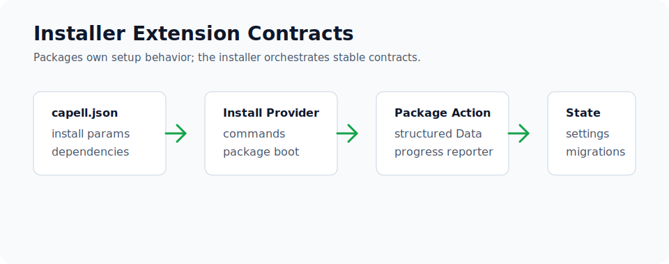

# Installer Extension Contracts

Use installer-facing contracts when a package needs setup choices, install-time parameters, package selection, settings migrations, or cleanup behavior during a Capell install. Keep feature behavior in the package; the installer should orchestrate package-owned Actions rather than duplicate them.



## Config And Manifest Keys

Declare installer-visible metadata in `capell.json`:

- `providers.install` for providers that must load before the package is enabled.
- `install.params` for values the installer or `capell:extension-install` forwards to package setup.
- `dependencies.requires` for packages that must be installed first.
- `dependencies.supports` for support packages the installer may add when applicable.
- `visibility: support` for support packages that should not appear as standalone catalogue choices.
- `product.group` and `product.tier` so installer grouping matches Marketplace and docs.

Settings migrations belong in `database/settings/` and must be registered by the package install/setup command with table and column existence guards.

## Extension Points

Installer work should be package-owned:

- Use `providers.install` for install-only service providers and commands.
- Put install, setup, and after-install writes in Actions.
- Accept forwarded values through structured Data objects where the setup has more than a couple of scalar parameters.
- Report progress through the install reporter passed to the package Action or command.
- Clear package discovery with `php artisan capell:package-cache:clear` after manifest changes.

Do not publish host resources or schemas to customize installer behavior. Use the manifest, package lifecycle Actions, and package-owned commands.

## Testing

Test the package in three layers:

- Manifest/boot tests prove `capell.json` is valid and install providers load.
- Action tests prove setup writes the expected state and handles missing optional inputs.
- Command or installer-flow tests prove forwarded params reach the package Action without re-testing all Action internals.

Run the smallest package check first, then a host integration check when touching installer contracts:

```bash
vendor/bin/pest packages/<package>/tests --configuration=phpunit.xml
vendor/bin/pest packages/installer/tests --configuration=phpunit.xml
```

## Next

- [Package anatomy](package-anatomy.md)
- [Database and migrations](database-and-migrations.md)
- [Testing packages](testing-packages.md)
