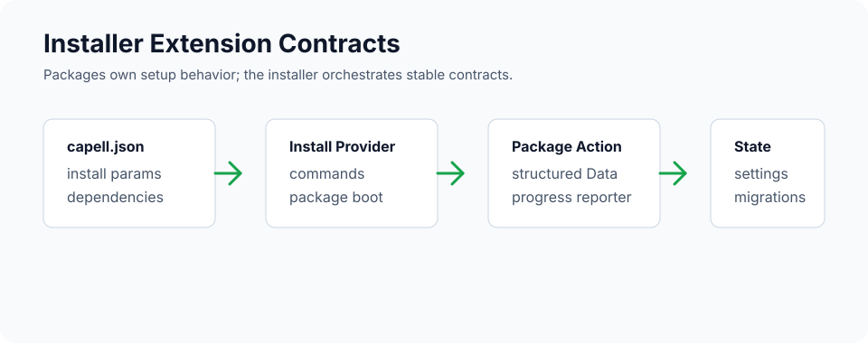

# Installer Extension Contracts

Use installer-facing contracts when a package needs setup choices, install-time parameters, package selection, settings migrations, or cleanup behavior during a Capell install. Keep feature behavior in the package; the installer should orchestrate package-owned Actions rather than duplicate them.



## Config And Manifest Keys

Declare installer-visible metadata in `capell.json`:

- `providers.install` for providers that must load before the package is enabled.
- `dependencies.requires` for packages that must be installed first.
- `dependencies.supports` for support packages the installer may add when applicable.
- `visibility: support` for support packages that should not appear as standalone catalogue choices.
- `product.group` and `product.tier` so installer grouping matches Marketplace and docs.

There is no `install` root key. `manifest-version: 3` validates against a strict allow-list, and an unrecognised root field throws `InvalidManifestException` — "Capell manifest has invalid field install: is not part of manifest v3" — so the whole package fails to load.

Install-time values are declared alongside the legacy command that consumes them, as `commands.installParams`, `commands.setupParams`, `commands.afterInstallParams`, or `commands.demoParams` — each a string list.

Lifecycle Actions receive their values differently: the runner passes an `array<string, mixed> $arguments` into `handle()`, supplied by whatever triggers the lifecycle rather than declared in the manifest. An Action-only package should read what it needs from `$arguments`, fall back to its own config defaults, and never require a manifest-declared param list.

Settings migrations belong in `database/settings/` and are published by Capell, not by your lifecycle Action: declare `"database": { "settings": true }` and `InstallPackageAction` publishes the directory with edit protection and then runs the settings migrator. Guard each migration with an existence check so reruns are safe. See [Settings migration](build-extension-end-to-end.md#settings-migration).

## Extension Points

Installer work should be package-owned:

- Use `providers.install` for install-only service providers and commands.
- Put install, setup, and after-install writes in Actions.
- Accept forwarded values through structured Data objects where the setup has more than a couple of scalar parameters.
- Report progress through the install reporter passed to the package Action or command.
- Clear package discovery with `php artisan capell:package-cache:clear` after manifest changes.

Do not publish host resources or schemas to customize installer behavior. Use the manifest, package lifecycle Actions, and package-owned commands.

## The Lifecycle Action Contract

A package's install, setup, uninstall, and after-install work implements one interface:

```php
namespace Capell\Core\Contracts;

interface PackageLifecycleAction
{
    /**
     * @param  array<string, mixed>  $arguments
     */
    public function handle(
        PackageData $package,
        array $arguments = [],
        ?ProgressReporter $reporter = null,
    ): void;
}
```

Declare the class-string in `capell.json` under `actions.install`, `actions.setup`, `actions.uninstall`, or `actions.afterInstall`. `PackageLifecycleRunner` prefers an Action over a legacy `commands` entry, and a web-triggered install **refuses** a legacy command outright — see [Lifecycle: actions and commands](build-extension-end-to-end.md#lifecycle-actions-and-commands).

`PackageLifecycleRunner` throws when the declared class-string does not exist ("Install lifecycle action X for Y does not exist.") or exists but does not implement `PackageLifecycleAction`. Both fail the install rather than being skipped, and `capell:extension-audit` does not check either — cover the wiring with a test.

## The Install Reporter

The third argument is the reporter. It is the full interface — there is nothing else on it:

```php
namespace Capell\Core\Contracts;

interface ProgressReporter
{
    public function step(string $label): void;

    public function report(string $line): void;

    public function error(string $line): void;
}
```

- `step()` names the unit of work now starting. The browser installer renders these as progress items.
- `report()` records an informational line.
- `error()` records a failure line. It does **not** throw or abort — throw from the Action when the install must stop.

The reporter is nullable because a lifecycle Action can run in contexts with nowhere to report. Always call it null-safely (`$reporter?->step(...)`) rather than requiring an instance.

Capell selects the implementation for the context: `ConsoleProgressReporter` for CLI installs, `CacheProgressReporter` and `FileLogProgressReporter` for web installs (these add `markRunning()`, `markComplete()`, and `markFailed()`, and the file logger exposes `logPath()`), and `NullProgressReporter` where output is discarded. Write against the interface only; do not type-hint a concrete reporter.

Anything passed to the reporter can surface in install output and support bundles. Never report credentials, tokens, or customer data.

## Testing

Test the package in three layers:

- Manifest/boot tests prove `capell.json` is valid and install providers load.
- Action tests prove setup writes the expected state and handles missing optional inputs.
- Command or installer-flow tests prove forwarded params reach the package Action without re-testing all Action internals.

Run the smallest package check first, then a host integration check when touching installer contracts:

```bash
vendor/bin/pest packages/<package>/tests --configuration=phpunit.xml
vendor/bin/pest packages/installer/tests --configuration=phpunit.xml
```

## Next

- [Package anatomy](package-anatomy.md)
- [Database and migrations](database-and-migrations.md)
- [Testing packages](testing-packages.md)
