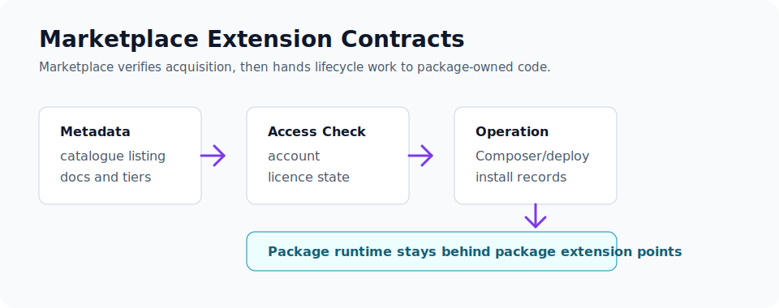

# Marketplace Extension Contracts

Use Marketplace-facing contracts when a package should appear in catalogue surfaces, participate in account/licence checks, or hand off installation to Composer/deployment operations. Marketplace proves acquisition and authorization; package runtime still belongs to the package and host extension points.



## Config And Manifest Keys

Declare Marketplace-visible metadata in `capell.json`:

- `marketplace` for listing, documentation, access, and acquisition metadata.
- `product.group` and `product.tier` for catalogue grouping.
- `dependencies.requires` for hard package requirements.
- `dependencies.supports` plus `visibility: support` for support packages.
- `providers.metadata` for safe metadata-only discovery.
- `providers.install` for install operations available before enablement.
- `providers.runtime`, `providers.admin`, and `providers.frontend` for enabled package behavior.

Keep package docs and Marketplace metadata aligned with the generated extension catalogue. Do not describe optional package behavior as a built-in host feature.

## Extension Points

Marketplace-aware packages should use existing host contracts:

- `capell.json` for catalogue and install metadata.
- Package install/uninstall Actions for lifecycle behavior.
- Settings schema registration for package configuration after install.
- `CapellAdmin::registerExtensionPage(...)` for package-owned admin control pages.
- `CacheInvalidationRegistry::registerDependency(...)` when Marketplace-installed features render cached frontend output.

Marketplace callbacks and operation records should not reach into package internals. They should authorize, record, and hand off to Composer/deployment or package lifecycle Actions.

## Testing

Test Marketplace integration with real package metadata:

- Manifest tests assert Marketplace fields and provider buckets.
- Catalogue/action tests prove listing state, access state, and install operation data.
- Lifecycle tests prove install and uninstall Actions can run through package operation flow.
- Public rendering tests are required if the package outputs frontend HTML.

For host Marketplace changes, start narrow:

```bash
vendor/bin/pest packages/marketplace/tests --configuration=phpunit.xml
```

Use `php artisan marketplace:qa:extensions-lifecycle --dry-run --only=vendor/package` in a consuming app when validating a real package catalogue entry.

## Next

- [Package anatomy](package-anatomy.md)
- [Package product groups](product-groups.md)
- [Extension troubleshooting](extension-troubleshooting.md)
