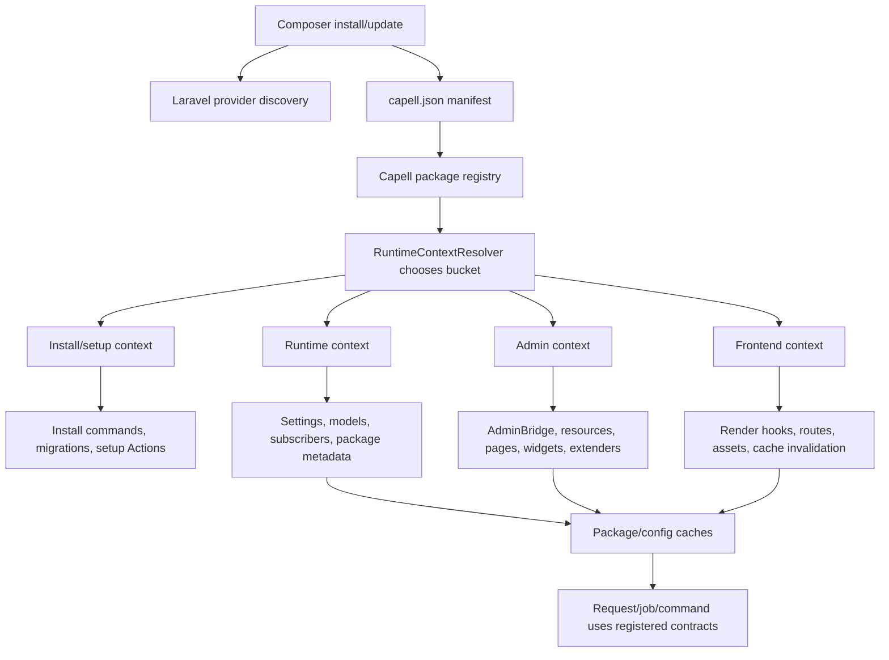

# Package Boot Lifecycle


Capell package boot is deliberately split into metadata, install-time work, admin/runtime registration, and frontend rendering. Most extension bugs happen when code runs in the wrong bucket.

## Lifecycle Diagram



## What Each Phase Owns

| Phase         | Owns                                                                                           | Must not do                                   |
| ------------- | ---------------------------------------------------------------------------------------------- | --------------------------------------------- |
| Composer      | Autoload, provider discovery, dependency constraints                                           | Runtime writes or package enablement.         |
| Manifest      | Package name, provider buckets, scopes, settings ownership, product/Marketplace metadata       | Execute code.                                 |
| Install/setup | Migrations, settings migrations, one-time setup Actions, optional package install commands     | Register admin UI needed only after install.  |
| Runtime       | Package metadata, settings classes, model aliases/interceptors, subscribers, commands          | Query public request data or render Filament. |
| Admin         | AdminBridge, Filament pages/resources/widgets, schema/table/action extenders, settings schemas | Leak admin state into public output.          |
| Frontend      | Public routes, render hooks, component aliases, frontend assets, cache invalidation            | Query in Blade or render authoring markers.   |

## Provider Bucket Rules

Use one provider only when the package is small and safe in every context. Split providers when a package has install-only work, admin UI, or public rendering.

```json
{
    "providers": {
        "runtime": ["Capell\\Example\\Providers\\ExampleServiceProvider"],
        "admin": ["Capell\\Example\\Providers\\ExampleAdminServiceProvider"],
        "frontend": [
            "Capell\\Example\\Providers\\ExampleFrontendServiceProvider"
        ],
        "install": ["Capell\\Example\\Providers\\ExampleInstallServiceProvider"]
    }
}
```

Install providers should be safe before every package table exists. Admin providers can assume Filament/Admin is present. Frontend providers must be safe for anonymous requests and cached HTML.

## Cache Boundaries

| Cache                           | Clear when                                                                          |
| ------------------------------- | ----------------------------------------------------------------------------------- |
| Laravel config/routes/views     | Env, provider, route, config, or Blade changes.                                     |
| Capell package cache            | `capell.json`, package install state, provider bucket, or package metadata changes. |
| Admin configurator/widget cache | Admin schema/configurator/widget registration changes.                              |
| Frontend/page cache             | Public render data, route fallback, render hook, or invalidation changes.           |

Useful commands:

```bash
php artisan optimize:clear
php artisan capell:package-cache:clear
php artisan capell:admin-clear-cache
php artisan capell:html-cache:clear
```

Only use the commands that exist in the installed package set. Check with `php artisan list capell`.

## Failure Modes

| Symptom                                   | Likely bucket mistake                             | Fix                                                                    |
| ----------------------------------------- | ------------------------------------------------- | ---------------------------------------------------------------------- |
| Package exists in Composer but not Capell | Manifest missing/invalid or package cache stale   | Fix `capell.json`, run `composer dump-autoload`, clear package cache.  |
| Admin resource loads on public requests   | Admin provider listed as runtime/frontend         | Move Filament registration into admin provider or AdminBridge.         |
| Install command fails before tables exist | Runtime provider queries tables during install    | Move writes into install Actions and guard migrations.                 |
| Public page exposes package internals     | Frontend provider/render hook outputs admin state | Pass only public render data and add safety tests.                     |
| Extension works in tests but not browser  | Provider boot order/cache differs                 | Register through documented registries/tags and clear relevant caches. |

## Test Recipes

```php
it('loads package metadata from the manifest', function (): void {
    $package = CapellCore::getPackage('capell-app/example');

    expect($package->name)->toBe('capell-app/example')
        ->and($package->hasFrontendScope())->toBeTrue();
});
```

```php
it('does not register admin surfaces when the package is unavailable', function (): void {
    CapellCore::forcePackageInstalled('capell-app/example', false);

    expect(resolve(ExtensionPageRegistry::class)->get('capell-app/example'))->toBeNull();
});
```

## Next

- [Package anatomy](package-anatomy.md)
- [Service providers](service-providers.md)
- [Extension point API reference](extension-point-api-reference.md)
- [Debugging package discovery](debugging-package-discovery.md)
