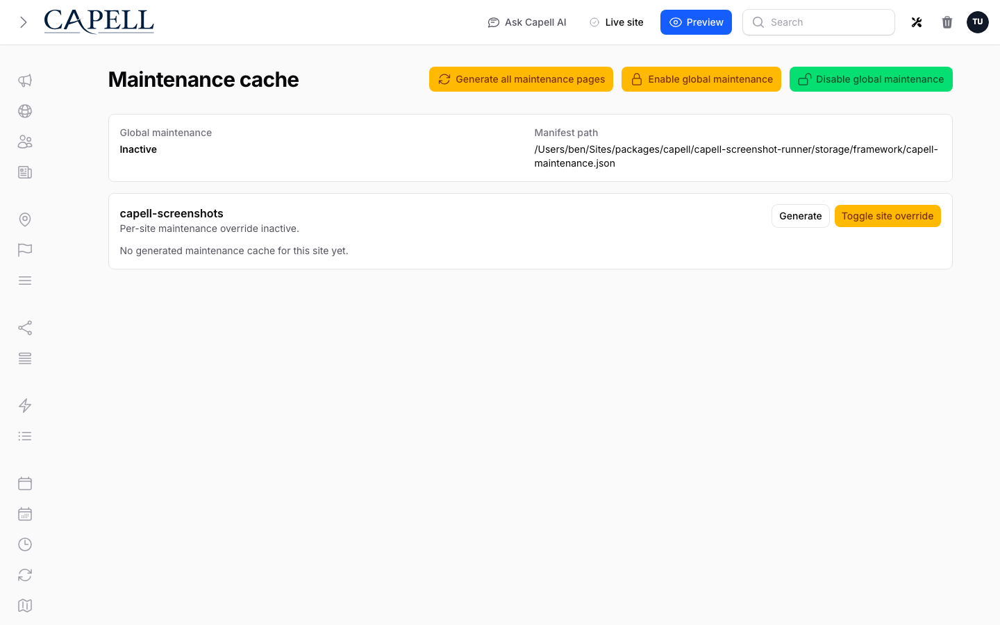

# Performance & Caching

> **Who's this for?** Developers tuning an installed site. Page/fragment cache, ETags, assets, and hydration.

Capell ships several layered performance features. Pick the guide for the layer you're working with:

| Layer                      | Guide                                                             | Use when                                                     |
| -------------------------- | ----------------------------------------------------------------- | ------------------------------------------------------------ |
| Page-level HTTP cache      | [Page cache architecture](../architecture/page-cache.md)          | Tuning the static-HTML cache                                 |
| Model URL cache index      | [Model URL cache](model-url-cache.md)                             | Understanding URL-to-model cache dependencies                |
| HTTP conditional responses | [ETag & conditional responses](etag-and-conditional-responses.md) | Reducing bandwidth on unchanged pages                        |
| In-template fragments      | [Fragment caching](fragment-caching.md)                           | Caching expensive Blade partials                             |
| Asset delivery             | [Critical asset optimization](critical-asset-optimization.md)     | Tuning render-blocking CSS / preloads                        |
| Cache busting              | [Cache invalidation](cache-invalidation.md)                       | Wiring model changes to cache flushes                        |
| Page rendering             | [Lazy page hydration](lazy-page-hydration.md)                     | Avoiding eager loads on cold cache hits                      |
| HTML output size           | `capell-app/frontend`                                             | Conservatively minifying rendered HTML and page-cache writes |

Frontend Authoring uses the model URL cache to find every cached URL touched by an edited record. The editor itself is never baked into cached HTML; admin-only edit controls are added later by the beacon.

See also: [`packages/core/docs/cache.md`](../../packages/core/docs/cache.md), [`packages/core/docs/extending-capell.md`](../../packages/core/docs/extending-capell.md).
