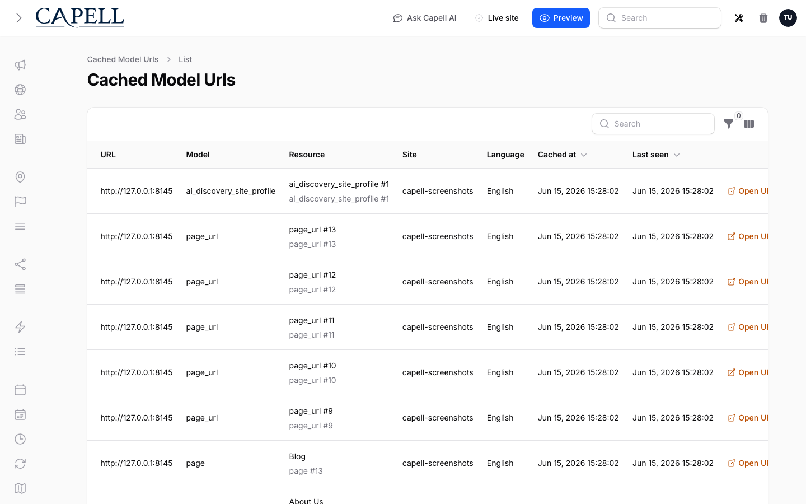
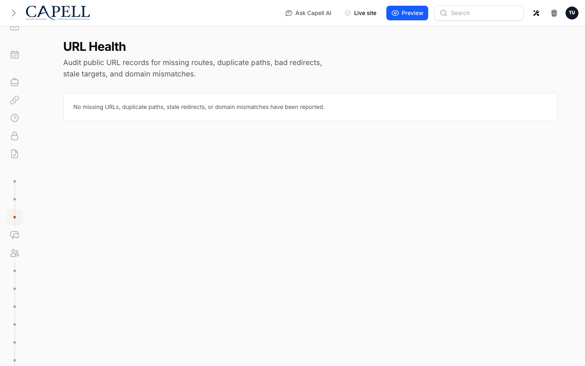

# Model URL Cache



`CacheEnum::modelUrlCacheKey()` returns the cache key for Capell's rendered-page dependency index:

```php
CacheEnum::modelUrlCacheKey(); // model-url-cache
```

The value stored at that key is a URL-to-model map:

```php
[
    'https://example.com/about' => [
        'Page' => [12],
        'Translation' => [44],
        'Site' => [1],
        'Theme' => [3],
    ],
]
```

## How It Is Written

During frontend rendering, `EnsureModelEventsRegistered` registers retrieved-model listeners for models that implement `PageCacheable`. `RetrievedModelStore` collects those models during the request and flushes them to the current URL through `RegisterModelEventJob`.

The job stores model short names and IDs under the current full URL. This keeps the HTML cache independent from database state while still recording which records were used to render each URL.

## How It Is Used

When a cacheable model changes, admin actions scan the map for matching model short name and ID. Every matching URL has its cached HTML file deleted through the installed cache package's invalidator, and the URL entry is removed from the map.



Site records also get a URL-domain fallback. If a site setting changes, Capell treats cached URLs under that site's configured domains as affected, even when the retrieved-model index does not explicitly contain a `Site` entry.

This catches important root URLs such as the homepage, where global site title, metadata, theme, language, logo, and contact settings often shape the rendered HTML.

Frontend Authoring uses the same map before saving an in-page edit. It collects all URLs that recorded the edited model, saves the field, clears those cached files, and refreshes the current URL. Other affected URLs can be warmed when auto-refresh is enabled.

## Authoring And HTML Cache Safety

Authoring metadata must not be rendered into cached Blade output. Public HTML cache files must never contain authoring HTML, authoring JavaScript, editable markers, model IDs, field paths, labels, selectors, permissions, package names, or signed edit URLs.

Non-admin visitors must be completely unaware that a page editor exists. The page cache must be safe to serve to anonymous users, normal authenticated users, admins, crawlers, and static exports because the cached HTML contains no authoring-specific state.

The authoring package decorates the page after load:

1. The cached page loads normally.
2. The browser posts the current URL to the beacon.
3. The beacon verifies the user is authenticated and has admin access.
4. Only for admins, the beacon returns selector-based editable regions and signed edit URLs.
5. Saving clears every cached URL recorded in `model-url-cache` for the edited record.

Anonymous and non-admin beacon responses may include normal beacon data such as CSRF refresh information, but they must not include `editable_regions`, editor URLs, authoring labels, selectors, model class names, record IDs, or field paths.
