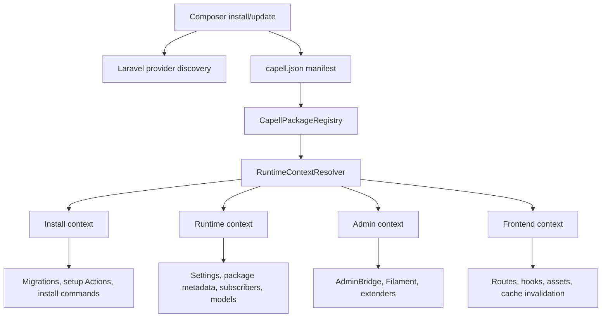
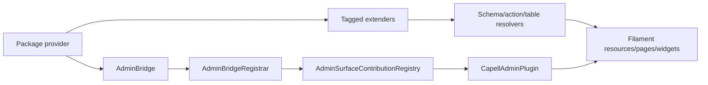
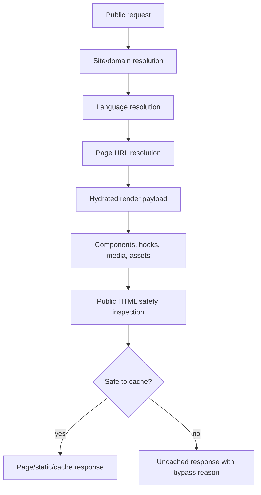
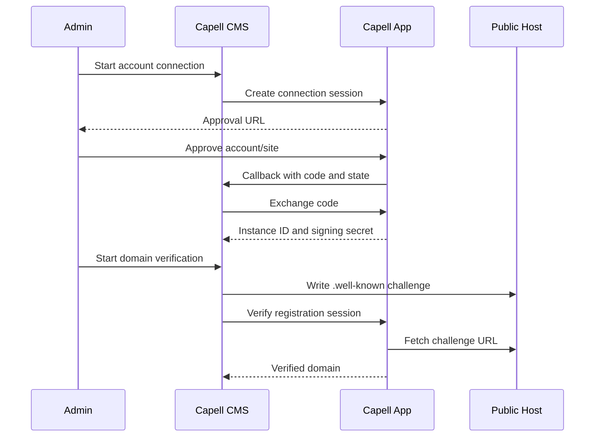
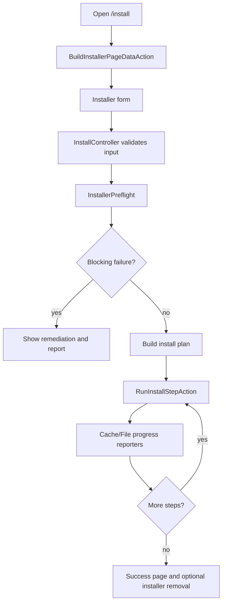
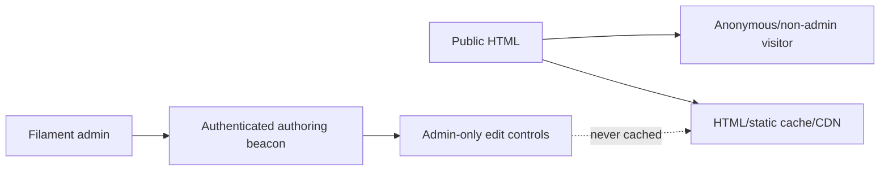

# Architecture Diagrams

These diagrams are the source-of-truth architecture views for docs. Keep them exact and update them with code changes. Flux-generated companion images can sit near these diagrams, but Mermaid should remain the precise reference.

## Package Boot Lifecycle

## Admin Extender Resolution

## Frontend Public Render And Cache

## Marketplace Trust Flow

## Installer Browser Flow

## Public Output Safety Boundary

## Flux Companion Asset Plan

The FLUX.2 connector is intended for visual companion diagrams, not exact API references. Generate assets under `docs/images/diagrams/` when the FLUX connector is authenticated:

| Asset                              | Use beside                                                      |
| ---------------------------------- | --------------------------------------------------------------- |
| `package-boot-lifecycle.png`       | [Package boot lifecycle](../packages/package-boot-lifecycle.md) |
| `admin-extender-resolution.png`    | [Admin debugging](../admin/debugging-admin-extensions.md)       |
| `frontend-public-render-cache.png` | [Frontend debugging](../frontend/debugging-public-output.md)    |
| `marketplace-trust-flow.png`       | [Marketplace debugging](../operations/debugging-marketplace.md) |
| `installer-browser-flow.png`       | [Installer overview](../../packages/installer/docs/overview.md) |

Keep generated text minimal. Use the Mermaid diagrams for exact symbols.
