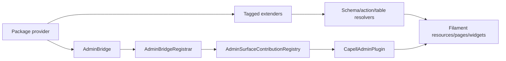
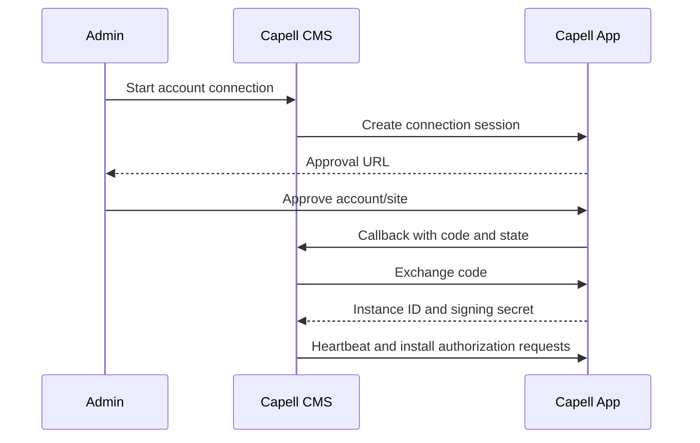
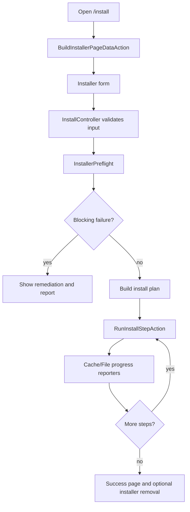

# Architecture Diagrams

These diagrams are the source-of-truth architecture views for docs. Keep them exact and update them with code changes. The composition export is generated from [`capell-core-composition-erd.mmd`](../images/capell-core-composition-erd.mmd). Flux-generated companion images can sit near these diagrams, but Mermaid should remain the precise reference.

## Package Boot Lifecycle

The provider-bucket distinction is included in the canonical [Core composition
diagram](../images/capell-core-composition-erd.svg), generated from
[`capell-core-composition-erd.mmd`](../images/capell-core-composition-erd.mmd).

The manifest buckets answer which provider code is available to the lifecycle;
`RuntimeContextResolver` answers which resolved context is active for the current
request or command. They are related stages, not interchangeable names.

## Admin Extender Resolution

```mermaid
flowchart LR
    PackageProvider["Package provider"] --> AdminBridge["AdminBridge"]
    PackageProvider --> TaggedExtenders["Tagged extenders"]
    AdminBridge --> Registrar["AdminBridgeRegistrar"]
    Registrar --> SurfaceRegistry["AdminSurfaceContributionRegistry"]
    TaggedExtenders --> Resolvers["Schema/action/table resolvers"]
    SurfaceRegistry --> Panel["CapellAdminPlugin"]
    Resolvers --> Filament["Filament resources/pages/widgets"]
    Panel --> Filament
```

## Frontend Public Render And Cache

The public/cache and authenticated authoring paths are maintained as the
canonical [public authoring/cache boundary diagram](../images/capell-public-authoring-cache-boundary.svg),
generated from [`capell-public-authoring-cache-boundary.mmd`](../images/capell-public-authoring-cache-boundary.mmd).

## Marketplace Trust Flow

```mermaid
sequenceDiagram
    participant Admin
    participant CMS as Capell CMS
    participant App as Capell App

    Admin->>CMS: Start account connection
    CMS->>App: Create connection session
    App-->>Admin: Approval URL
    Admin->>App: Approve account/site
    App->>CMS: Callback with code and state
    CMS->>App: Exchange code
    App-->>CMS: Instance ID and signing secret
    CMS->>App: Heartbeat and install authorization requests
```

## Installer Browser Flow

```mermaid
flowchart TD
    Open["Open /install"] --> PageData["BuildInstallerPageDataAction"]
    PageData --> Form["Installer form"]
    Form --> Validate["InstallController validates input"]
    Validate --> Preflight["InstallerPreflight"]
    Preflight --> Decision{"Blocking failure?"}
    Decision -->|yes| Report["Show remediation and report"]
    Decision -->|no| Plan["Build install plan"]
    Plan --> Step["RunInstallStepAction"]
    Step --> Progress["Cache/File progress reporters"]
    Progress --> More{"More steps?"}
    More -->|yes| Step
    More -->|no| Success["Success page and optional installer removal"]
```

## Public Output Safety Boundary

The public and authoring paths are deliberately separate. The canonical source
and export are [`capell-public-authoring-cache-boundary.mmd`](../images/capell-public-authoring-cache-boundary.mmd)
and [`capell-public-authoring-cache-boundary.svg`](../images/capell-public-authoring-cache-boundary.svg).

## Flux Companion Asset Plan

The FLUX.2 connector is intended for visual companion diagrams, not exact API references. Generate assets under `docs/images/diagrams/` when the FLUX connector is authenticated:

| Asset                              | Use beside                                                      |
| ---------------------------------- | --------------------------------------------------------------- |
| `package-boot-lifecycle.png`       | [Package boot lifecycle](../packages/package-boot-lifecycle.md) |
| `admin-extender-resolution.png`    | [Admin debugging](../admin/debugging-admin-extensions.md)       |
| `frontend-public-render-cache.png` | [Frontend debugging](../frontend/debugging-public-output.md)    |
| `marketplace-trust-flow.png`       | [Marketplace debugging](../operations/debugging-marketplace.md) |
| `installer-browser-flow.png`       | [Installer overview](../../packages/installer/docs/overview.md) |

Keep generated text minimal. Use the Mermaid diagrams for exact symbols.
