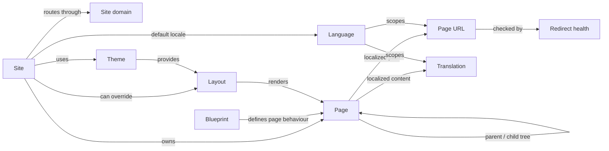
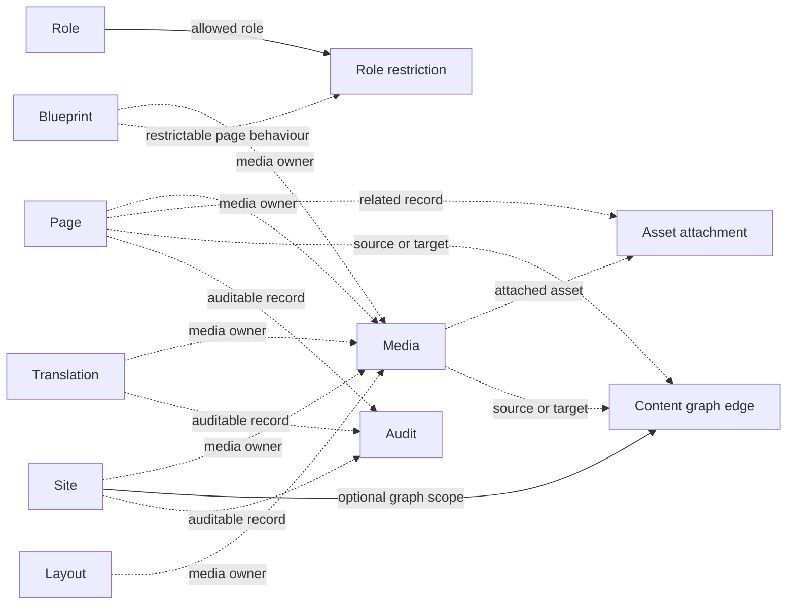
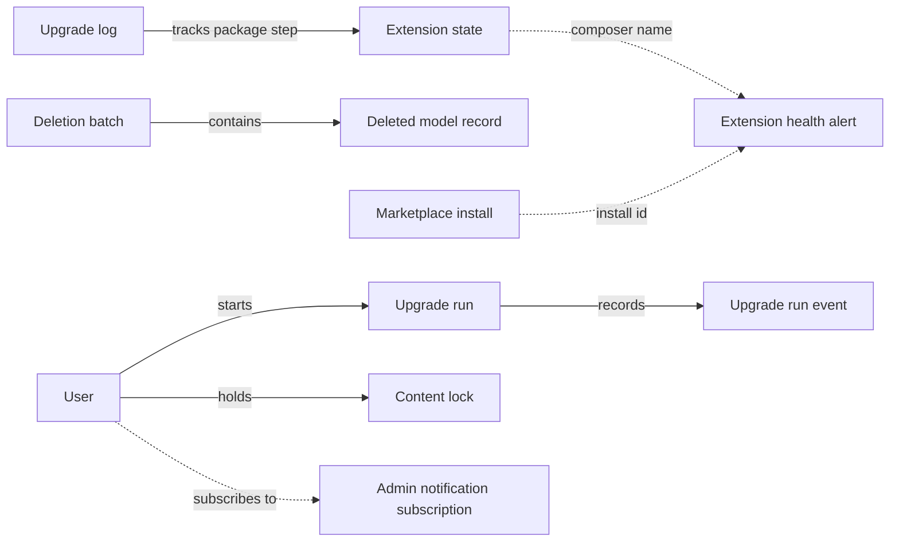

# Core Relationship Map

This page maps the core Capell model relationships without listing every schema column. Use it when you need the shape of the system before reading migrations or model classes.

`blueprints` is the current type registry for pages, sites, themes, and other blueprint-backed records. The legacy `Type` model is a deprecated alias over `blueprints`; there is no separate core `types` table.

## Page Delivery

Start at `Site`. A site has one default language and one active theme. It owns domains, pages, site-specific layouts, and localized URLs.

`Page` is the main content record. It belongs to a site, layout, and blueprint, and it sits inside a nested tree. Its public path lives in `PageUrl`; its translated title, content, and metadata live in `Translation`.

## Assets, Access, And Impact

Dashed lines are polymorphic or logical relationships. They are real application relationships, but they are not always hard foreign keys because packages can add more content models later.

`media` is owned by Spatie Media Library and extended by Capell's `Media` model. `asset_attachments` lets content records point at reusable assets without hard-coding one asset table. `content_graph_edges` stores derived references for impact analysis.

## Operations And Lifecycle

The extension and marketplace tables intentionally use stable string keys such as `composer_name`, `install_id`, `extension_slug`, and `affected_install_id` instead of foreign keys. This lets Capell record package health and marketplace state even when an extension is missing, disabled, or no longer installed.

## External Tables Referenced By Core

| Table    | Source                  | How core uses it                                                                            |
| -------- | ----------------------- | ------------------------------------------------------------------------------------------- |
| `users`  | Host Laravel app        | Userstamps, content locks, upgrade runs, admin notification subscriptions, and audit users. |
| `roles`  | Spatie Permission       | Page-type access restrictions through `page_role_restrictions.role_id`.                     |
| `media`  | Spatie Media Library    | Capell media collections and media metadata.                                                |
| `audits` | OwenIt Laravel Auditing | Activity/audit trail for auditable core models.                                             |

## Relationship Notes

| Relationship                                                 | Type                | Notes                                                                                       |
| ------------------------------------------------------------ | ------------------- | ------------------------------------------------------------------------------------------- |
| `pages.parent_id -> pages.id`                                | Self-reference      | Backed by nested set columns for hierarchy.                                                 |
| `page_urls.pageable_*`                                       | Polymorphic         | Routes page-like records; core primarily uses `Page`.                                       |
| `translations.translatable_*`                                | Polymorphic         | Localizes records; core primarily uses `Page`, `Site`, `Media`, and related content models. |
| `media.model_*`                                              | Polymorphic         | Spatie Media Library ownership for Capell media collections.                                |
| `asset_attachments.related_*` / `asset_*`                    | Polymorphic         | Joins an owning record to an attached asset record.                                         |
| `content_graph_edges.source_*` / `target_*`                  | Logical polymorphic | Derived graph edges for impact analysis, scoped optionally by site/language.                |
| `content_locks.model_*`                                      | Logical polymorphic | One active lock per model record.                                                           |
| `deletion_batches.root_*` / `deletion_batch_records.model_*` | Logical polymorphic | Tracks restore groups without coupling to package tables.                                   |
