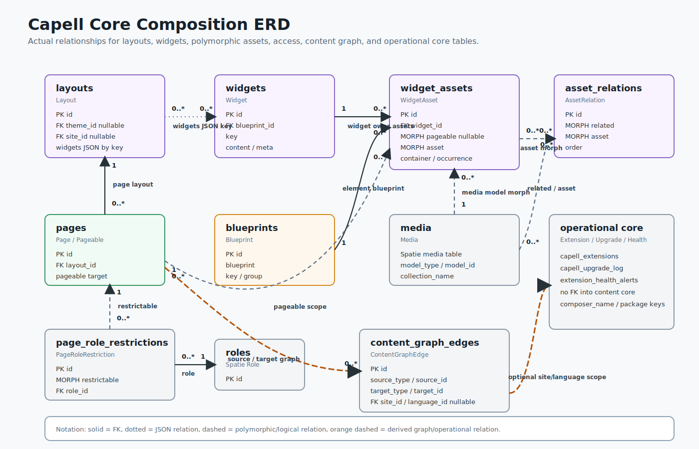

# Reference

This section keeps compact lookup material separate from task-based guides.

> **Who's this for?** Anyone needing a quick lookup. Glossary, ERDs, diagrams, and credits.

| Page                                                       | Use it for                                                                              |
| ---------------------------------------------------------- | --------------------------------------------------------------------------------------- |
| [Glossary](glossary.md)                                    | Product and architecture terms used across the docs.                                    |
| [Core relationship map](core-erd.md)                       | Readable relationship diagrams for core delivery, assets, access, and operations.       |
| [Architecture diagrams](architecture-diagrams.md)          | Package boot, admin extender, frontend cache, Marketplace, and installer flow diagrams. |
| [Credits](credits.md)                                      | Major frameworks, packages, authors, and services Capell builds on.                     |
| [Packages and extensions](../packages/catalog.md)          | Host package boundaries and extension documentation entry points.                       |
| [Package product groups](../packages/product-groups.md)    | Which packages are free Foundation packages and which belong to premium product groups. |
| [CLI command index](../development/commands.md)            | Short grouped command reference.                                                        |
| [Configuration reference](../development/configuration.md) | Config files, environment variables, disks, logging.                                    |
| [Docs ownership rules](../development/docs-ownership.md)   | Where docs belong and how to avoid orphaned or duplicate pages.                         |
