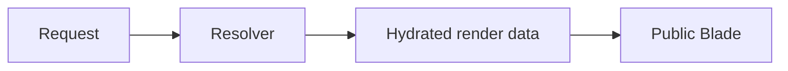

# Documentation visuals

Use a visual only when it explains the task, state, or contract better than prose, code, or a focused diagram. A screenshot is evidence of the screen it shows, not generic decoration for a related API.

## Choose the pattern

### One task screenshot

Use one linked image when a single screen proves the behaviour. Put it beside the instruction and explain what the reader should notice.

```md
[](../images/pages-list.png)

_The hierarchy and status badges confirm which page will be affected before the editor publishes it._
```

### Two-column linked gallery

Use a two-column gallery for comparable states or a short workflow. Keep labels outside the images and make every thumbnail open its original.

```md
| Before                                                                                | After                                                                                               |
| ------------------------------------------------------------------------------------- | --------------------------------------------------------------------------------------------------- |
| [](../images/page-draft.png) | [](../images/page-published.png) |
```

Do not use more than two columns. Split an overview into named workflows before it exceeds six screenshots.

### Ordered vertical stack

Use a vertical stack when the order matters and each screen needs the full page width.

```md
1. Choose the page context.

    [](../images/page-context.png)

2. Verify the generated URL.

    [](../images/page-url.png)
```

### Theme-aware image

Use a light/dark pair only when both files come from the same capture contract, have matching dimensions, and show the same state. Keep explicit links to both originals.

```html
<picture>
    <source
        media="(prefers-color-scheme: dark)"
        srcset="../images/pages-dark.png"
    />
    
</picture>

[Light](../images/pages.png) · [Dark](../images/pages-dark.png)
```

Do not infer equivalence from filenames alone. If only one authentic state exists, use the single-screenshot pattern.

### Architecture or data-flow diagram

Use a focused diagram when UI chrome would obscure the contract. Keep node labels in domain language and explain the failure boundary in the surrounding text.

````md

````

Prefer an executable example or small configuration table when sequence or structure does not need a diagram.

## Writing and accessibility

- Use sentence-case labels and descriptive alt text. Describe the useful state, not the filename or the words "screenshot of".
- Put gallery labels outside the image so sighted and screen-reader users receive the same structure.
- Write captions as evidence statements: what the screen proves, what healthy looks like, or what the reader should verify.
- Do not open an API or reference page with a screenshot unless the screen itself is the subject. Start with the contract, inputs and outputs, failure modes, or an executable example.
- Keep optional-package visuals with their owning package. Link to the package overview instead of copying its evidence into Core.
- Keep public-rendering examples free of authoring metadata, package internals, model IDs, signed editor URLs, and database work in Blade.

## Ownership and regeneration

Generated screenshot families must identify:

- the owning repository and package
- the `docs/screenshots.json` manifest entry
- the seeded or fixture state that makes the result deterministic
- the stable selector or interaction that proves the intended state
- the narrow regeneration command

Host-package captures are owned by the relevant `packages/<package>/docs/screenshots.json`. Root documentation captures are owned by `docs/screenshots.json`. Run `npm run screenshots` only in an isolated, known App/container/database environment; use `npm run screenshots:check` when a contract-only dry run is sufficient.

Generated fixtures, authentic installed-App captures, release evidence, and published documentation are separate evidence levels. A fixture can prove deterministic rendering without proving an installed route. A successful capture does not prove hosted CI, release, deployment, or publication.

## Maintenance checks

Run the screenshot coverage check after changing Markdown, manifests, or screenshot assets:

```sh
node scripts/check-doc-screenshot-coverage.js
```

Broken references, duplicate manifest IDs, and missing required outputs are failures. Unused raster assets, incomplete light/dark pairs, duplicate hashes, unlinked thumbnails, and manifest outputs unused by published Markdown are warnings for review. These relationship checks do not certify browser provenance and do not authorize deletion: confirm manifests, package metadata, tests, publication tooling, hashes, dimensions, and visible content first.

## Review checklist

- Does the visual prove the behaviour beside it?
- Does every thumbnail open the full-resolution original?
- Do alt text and captions explain the useful state?
- Are light and dark variants contract-equivalent?
- Is ownership and regeneration discoverable?
- Would prose, code, or a diagram explain the point more clearly?

## Next

- [Docs ownership rules](../development/docs-ownership.md)
- [Screenshot state guide](../development/screenshot-state-guide.md)
- [Docs route map](../README.md)
