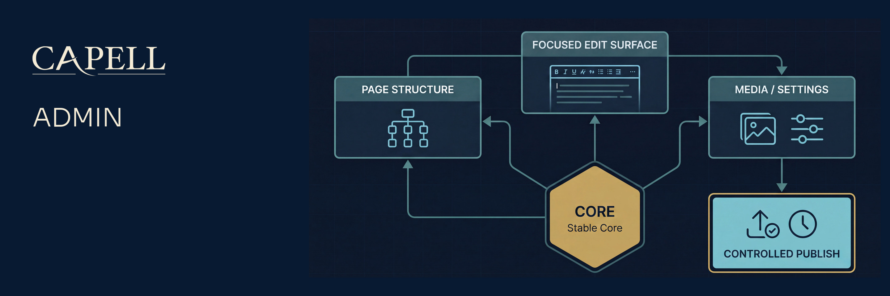

# Capell Admin



[](https://github.com/capell-app/admin/releases/latest)
[](https://packagist.org/packages/capell-app/admin)
[](https://github.com/capell-app/capell/actions/workflows/test-full.yml)
[](https://github.com/capell-app/capell/actions/workflows/code-quality-and-styling.yml)
[](#requirements-and-support-policy)
[](https://packagist.org/packages/capell-app/admin)
[](#requirements-and-support-policy)
[](https://docs.capell.app)

Capell Admin is the back-office for Capell CMS: a Filament panel where editors and operators manage pages, sites, media, users, settings, and upgrades. Reach for it when a Capell install needs an authenticated editing surface; it also carries the extension points that let your own packages add resources, form fields, and dashboard widgets to that surface. It depends on `capell-app/core`. Admin never renders public output; that is the frontend package's job.

## Package boundary

Admin owns:

- the Filament panel: resources, pages, dashboard widgets, actions, form and table components, policies, and admin routes
- editor workflows for content, sites, themes, media, users, roles, settings, and upgrades
- admin extension points for contributed resources, pages, widgets, header tools, form schemas, table queries, relation managers, and validation hooks
- admin settings migrations and admin-specific cache commands

Admin does not own:

- shared content records and migrations; those are Core records
- public request handling or public HTML safety; that is Frontend and frontend add-ons
- marketplace account linking and catalogue install authorisation; that is Marketplace
- migration/import execution; Admin can expose a recovery shell, but the recovery implementation is package-owned
- heavy import handlers; packages register visible import menu entries through `ImportEntryRegistry` and own the execution behind those entries

## Install

Admin depends on `capell-app/core` and is optional. The recommended path is the installer (`composer require capell-app/installer` → `php artisan capell:install`), which adds Admin when you select it. To add it manually to an existing Capell app:

```bash
composer require capell-app/admin
php artisan capell:admin-install
php artisan capell:admin-setup
```

The full foundation installer may call Admin setup for you. On existing apps, use:

```bash
php artisan capell:admin-upgrade
php artisan capell:admin-clear-cache
```

The admin entrypoint is controlled by `CAPELL_ADMIN_PATH`; `CAPELL_ADMIN_DOMAIN` can move the panel to a dedicated host. Clear config cache after changing either value.

## Quick example

To add your own Filament resource to the admin panel, contribute it from a service provider:

```php
use App\Filament\Resources\CustomResource;
use Capell\Admin\Data\AdminSurfaceContributionData;
use Capell\Admin\Facades\CapellAdmin;

public function boot(): void
{
    CapellAdmin::contributeToAdminSurface(
        AdminSurfaceContributionData::resource(CustomResource::class, group: 'Custom'),
    );
}
```

## Runtime surfaces

- Provider: `Capell\Admin\Providers\AdminServiceProvider`
- Config: `config/capell-admin.php`
- Entrypoint helper: `Capell\Admin\Support\AdminPanelEntrypoint`
- Routes: `routes/web.php`
- Main resources: `ActivityResource`, `BlueprintResource`, `LanguageResource`, `LayoutResource`, `MediaResource`, `PageResource`, `PageUrlResource`, `RedirectResource`, `SiteResource`, `ThemeResource`, `UserResource`
- Main pages: `ExtensionsPage`, `SettingsPage`, `SiteHealthPage`, `SitemapPage`, `UpgradePage`
- Main commands: `capell:admin-install`, `capell:admin-setup`, `capell:admin-upgrade`, `capell:admin-clear-cache`, `capell:admin-cache-widgets`, `capell:admin-cache-configurators`

`ActivityResource` includes a detail view that expands nested JSON changes into readable before-and-after rows for audit review.

Admin routes include a signed theme preview route and authenticated internal API routes under the configured admin path. Theme preview URLs are temporary admin URLs with `signed` middleware, site access checks, and `no-store` response headers; do not embed them into public output, cached HTML, or long-lived editor content.

## Extension points

Use the documented extension points instead of extending Filament resources directly:

| Need                                                     | Extension point                                              |
| -------------------------------------------------------- | ------------------------------------------------------------ |
| Contribute a resource or page                            | `CapellAdmin::contributeToAdminSurface(...)`                 |
| Register a dashboard Filament widget                     | `CapellAdmin::registerDashboardFilamentWidget(...)`          |
| Add page form fields                                     | `PageSchemaExtender::TAG`                                    |
| Add site form fields                                     | `SiteSchemaExtender::TAG`                                    |
| Add admin toolbar actions                                | `AdminToolItem::TAG`                                         |
| Adjust tables, edit pages, exports, or relation managers | the matching tagged extender interface                       |
| Add settings UI                                          | `SettingsSchemaRegistry::register()` from the owning package |

The extenders and registries above cover normal extension work. As an advanced escape hatch, `php artisan capell:admin-publish-resources [--type=<group>] [--resource=<label-or-class>] [--force]` publishes registered admin resources into the host application for direct customisation. Published copies become host-maintained and can drift from package updates.

## Data and permissions

Admin operates mostly on Core models. Admin-owned persistence is limited to settings migrations and admin-specific operational state.

Policy and permission behaviour must be registered globally, not only through a Filament resource. Marketplace contributes additional permission-aware surfaces when it is installed.

All editor-facing labels, notifications, and validation messages should use package translation files. Prefer Filament label method overrides over static label properties.

## Verification

Admin tests run from a checkout of the Capell monorepo, which supplies the Pest bootstrap and development dependencies this package needs. From the monorepo root, run the Admin tests after changing resources, policies, settings schemas, or panel registration:

```bash
vendor/bin/pest tests
```

For resource or schema changes, run the matching focused test file first. For UI behaviour, verify the real Filament panel with a disposable admin account rather than stopping at the login screen.

## Requirements and support policy

| Surface  | Supported versions               |
| -------- | -------------------------------- |
| PHP      | `^8.4`                           |
| Laravel  | `^12.41.1` or `^13.0`            |
| Filament | `~5.6.8`                         |
| Core     | The same release as this package |

Each Capell 1.x minor receives security fixes for 24 months from its release date, and the latest 1.x minor is always supported. Upgrade all installed Capell foundation packages together to the same supported release before requesting a fix. See the [Capell security policy](https://github.com/capell-app/capell/security/policy) for vulnerability reporting.

Support covers the dependency ranges above. When an upstream release reaches its own end of life earlier, upgrading that dependency may be required to receive a safe fix.

## Troubleshooting

- Missing navigation usually means the resource or page contribution was not registered, a permission blocks it, or the package cache is stale.
- Missing fields in an editor form should be checked at the tagged extender and settings schema level before editing first-party resources.
- If Admin appears on the wrong host or path, check `CAPELL_ADMIN_PATH`, `CAPELL_ADMIN_DOMAIN`, and cached config.
- If theme preview stops working after an entrypoint change, regenerate preview links against the current admin host and path; signed URLs are host- and path-sensitive.
- If cache commands do not affect newly added blocks or configurators, confirm the package registered its block or configurator classes and rerun the matching admin cache command.

## Development

Package development and coordinated verification happen in the [capell-app/capell monorepo](https://github.com/capell-app/capell). Split package repositories are release mirrors; use [docs.capell.app](https://docs.capell.app) for cross-package guidance. See the [contribution guide](https://github.com/capell-app/capell/blob/main/CONTRIBUTING.md), [security policy](https://github.com/capell-app/capell/security/policy), and [licence](https://github.com/capell-app/capell/blob/main/LICENSE.md).

## Further reading

| Page                                                                              | Covers                                                      |
| --------------------------------------------------------------------------------- | ----------------------------------------------------------- |
| [Admin overview](docs/overview.md)                                                | Admin responsibilities and the package docs index.          |
| [Admin multi-language](docs/admin-multi-language.md)                              | Admin language records, translations, and user preferences. |
| [Admin tool registry](docs/admin-tool-registry.md)                                | Header tools and admin utility actions.                     |
| [Dashboard Filament widget customization](docs/dashboard-widget-customization.md) | Registering and overriding dashboard Filament widgets.      |
| [Marketing Studio](docs/marketing-studio.md)                                      | Contributing editor-focused marketing actions and widgets.  |
| [Event registry](docs/event-registry.md)                                          | Admin lifecycle event subscriptions.                        |
| [Permissions and approval](docs/permissions-and-approval.md)                      | Role and approval rules around publishing.                  |
| [Resource registration](docs/resource-registration.md)                            | Contributed resources and admin surface lookup.             |
| [Schema hooks](docs/schemas/hooks.md)                                             | Extending admin form schemas.                               |
| [Settings schema registry](docs/settings-schema-registry.md)                      | Package settings in the admin settings surface.             |
| [User menu registry](docs/user-menu-registry.md)                                  | User menu item registration.                                |
| [User resource customization](docs/user-resource-customization.md)                | User form fields, panels, relation managers, and bridges.   |

The complete admin, extension, and troubleshooting guides are published at [docs.capell.app](https://docs.capell.app).
