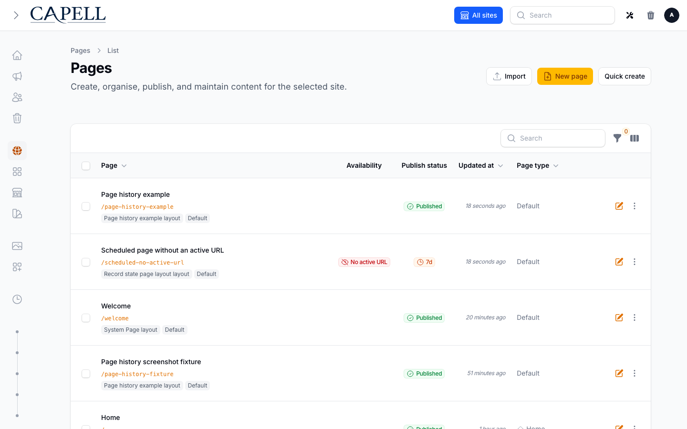

# Admin Multi-Language



Capell Admin can show the Filament admin panel in the language selected by each admin user. The language selector appears in the Filament user menu and the same preference can also be edited on the user resource.

This is an admin UI preference only. It does not change public frontend content language, site domains, page translations, or notification locale.

This document also covers the rest of the admin's language surfaces: the Languages resource, the right-to-left toggle, the site setup fan-out, and the translations repeater on translatable records. For the editor-facing walkthrough of adding a language to a site that is already public, see [Adding a language to a live site](adding-a-language-to-a-live-site.md).

> **Only English admin translations ship.**
>
> The language switcher is fully wired — the preference is stored, resolved and applied on every admin request — but Capell ships `en` language files and nothing else. There are no admin language packs. Adding a `Français` language record puts French in the menu; the admin will stay in English until someone supplies `fr` translation files for the Capell packages and for Filament. Plan for that work, or leave the switcher unused.

## How it works

Admin language preference uses three pieces:

1. **Capell language records** provide the selectable languages.
2. **Laravel translation files** provide the translated admin strings.
3. **User preference storage** stores the selected language on the user record.

The selector uses enabled `Capell\Core\Models\Language` records. When an admin chooses a language, Capell stores the selected record ID in `users.preferred_admin_language_id`.

On authenticated Filament admin requests, `SetAdminLocale` resolves that language to:

```php
$language->locale ?: $language->code
```

It then calls Laravel's locale APIs for the current request:

```php
app()->setLocale($locale);
app('translator')->setLocale($locale);
```

If the user has no preference, the language record is disabled, deleted, missing, or has an invalid locale value, Capell falls back to `config('app.locale')`.

## What the language record controls

The language record controls whether a language is available in the admin language selector.

The important fields are:

| Field    | Purpose                                                                 |
| -------- | ----------------------------------------------------------------------- |
| `name`   | Human label shown in the selector, for example `Français`               |
| `code`   | Short language code, usually ISO 639-1, for example `fr`                |
| `locale` | Laravel locale used for translations, for example `fr` or `pt_BR`       |
| `flag`   | Capell flag/icon identifier used by language UI                         |
| `status` | Must be enabled for the language to appear in the admin language select |
| `order`  | Sort order in language lists                                            |

Use `locale` for the exact Laravel translation directory name. If `locale` is blank, Capell falls back to `code`.

## Managing languages

Languages live at **Admin → Languages**, a single manage page with an inline create, edit, replicate and delete flow rather than separate resource pages.

The create and edit form is grouped into three sections:

**Details** — `Name`, `Code`, `Locale`, `Flag` and `Order`. `Code` and `Locale` are both unique across non-deleted records, and `Locale` is capped at 12 characters.

**Language availability** — the `Default` toggle, the `Status` toggle, and the right-to-left toggle described below. Exactly one language is the default; setting a new one clears the previous.

**Language site setup** — only shown when creating or replicating. See [Site setup fan-out](#site-setup-fan-out).

Deletion is guarded: the resource validates a delete before it runs and cancels it if the language is still in use. The list also carries a `LanguagesAlertsWidget` that surfaces language configuration problems above the table.

### The right-to-left toggle

The **Right to left** toggle in **Language availability** writes to the language record's `meta.rtl` field, and `Capell\Core\Models\Language::direction()` consumes it to produce the `dir` attribute on public pages.

You usually do not need it. When `meta.rtl` has never been set, Capell falls back to a built-in list of right-to-left root subtags (`ar`, `fa`, `he`, `ur`, `ku`, `ps`, `dv`, `yi` and others), matched on the root subtag so `ar-EG` resolves like `ar`.

The toggle is for the exceptions, and an explicit setting always wins over the built-in list — including an explicit **off** on a language the list would otherwise render right to left.

The toggle affects the **public frontend** direction. The Filament admin panel's own direction is governed by Filament, not by this field.

### Site setup fan-out

When creating or replicating a language, ticking **Set up this language** and selecting sites runs `SetupSiteLanguageAction` once per selected site. For each site it:

1. Creates the site's translation row for the new language — **as a copy of the default-language row**, not as a blank row.
2. Creates a site domain row for the new language, duplicating the site's existing domain with `path` set to `/{code}`, unless a domain for that language already exists.

If the site has no existing domain to copy, a bare site domain row is created for the language instead.

The copy in step 1 is the behaviour to communicate to editors: the new language's URLs go live immediately, serving default-language content. See [Adding a language to a live site](adding-a-language-to-a-live-site.md#what-visitors-see-immediately).

The site list offered is scoped to the sites the current actor may administer.

### Exporting content translations

The Languages page carries an **Export translations** header action, visible to users who can view pages. It takes a site and, optionally, a single target language — leaving the language blank exports all languages of the site.

The result is a streamed, BOM-prefixed CSV with one row per translatable record and target language, carrying the source and target `title`, `content` and `meta` side by side. Blueprint content is exported as the stored JSON document, not flattened into fields. Rows are emitted for target languages with no translation yet, with the target columns blank.

There is no matching import action.

## The translations repeater

Translatable records — pages in particular — carry their translations in `TranslationsRepeater`, rendered as one tab per language. Tabs are ordered default-language first, then by the language `order` and name, and each tab is labelled with the language name and flag icon.

Adding is capped at the number of existing languages, and the create menu only offers languages the record does not already have.

A blueprint can mark translations as required (`admin.require_translations`), in which case the repeater becomes required and validates against the site's own `admin.require_translations` list, failing with the names of the languages still missing.

### Completeness badges

Every non-default tab carries a badge. The default language never carries one.

`CheckTranslationCompletenessAction` compares each tracked field against the default-language row and returns the proportion that are filled, or `null` when there is nothing comparable to measure.

| Badge                   | Colour                                     | Condition                                                                      |
| ----------------------- | ------------------------------------------ | ------------------------------------------------------------------------------ |
| **Complete**            | success                                    | 100%, default language not edited since, and not byte-identical to the default |
| **Copied from default** | gray                                       | 100% and every tracked field matches the default language exactly              |
| `nn%`                   | info ≥75, warning ≥50, danger below        | Some tracked fields are still blank                                            |
| **May be outdated**     | warning (danger below 50% when incomplete) | The default-language row's `updated_at` is newer than this row's               |

Each badge carries a tooltip explaining what it does and does not mean.

**The percentage counts blanks.** Because a language added through the site setup fan-out starts as a full copy of the default language, a wholly untranslated row scores 100%. The **Copied from default** state exists to catch precisely that: it fires when every compared field is still byte-identical to the default. It stops firing after a single edit, so it detects the untouched clone, not a partially translated one.

### The staleness badge

**May be outdated** is a timestamp comparison and nothing more: the default-language translation row was saved more recently than this one.

Content is stored as **one JSON document per language**, so there are no per-field timestamps. Any edit to the default language flags every other language on that record, and the badge cannot identify which field changed. It is deliberately coarse — a prompt to review rather than a diagnosis — and false positives after trivial edits are expected.

### Clone

The tab-level **Clone** action duplicates a tab's state into a new tab, optionally reassigning the language. This is the intended copy-then-overwrite workflow for translating a finished page: the structure, blocks and media come across, and the editor replaces the text.

### Auto-translate

The **Auto translate language** action fills a tab from another language via `tanmuhittin/laravel-google-translate`.

It is **disabled when no translation API credentials are configured**, and its tooltip switches to name what is missing: `GOOGLE_TRANSLATE_API_KEY`, `YANDEX_TRANSLATE_API_KEY`, or a `custom_api_translator` entry in `config/laravel_google_translate.php`. Without a key the underlying package falls back to an unauthenticated scraper that fails at request time, so the button is disabled rather than left to error on click.

The action is additionally gated behind `config('capell-admin.auto_translate_language_text')`, which defaults to `true`.

## Finding untranslated content

The Pages table carries an **Untranslated into** filter. Selecting a language shows pages that have no translation row for it, or whose row for that language has both an empty title and empty content.

A row cloned from the default language has both, so it counts as translated and does not appear in this filter. The **Copied from default** badge covers that case instead.

## Where the frontend detection setting lives

`visitor_language_detection` is a **frontend** setting, not an admin one. It appears under **Settings → Frontend** as **Visitor language detection**, a required select with three options — do nothing (the default), suggest with a dismissible banner, or redirect to the same page in the visitor's language.

It governs the public site only and has no effect on the admin panel. Its behaviour, and the SEO and CDN caveats on redirect mode, are documented in [Multi-site and Multi-lingual](../../core/docs/multi-site-multi-lingual.md#visitor-language-detection).

## Creating a new admin language

1. Add the language record in **Admin → Languages**.
2. Set `Name`, `Code`, `Locale`, `Flag`, and `Order`.
3. Enable the language.
4. Add Laravel translation files for the same locale. **This step is not optional** — no admin translations ship with Capell beyond English, so without it the panel stays in English.
5. Open the Filament user menu and choose the new language.

For example, to add French:

| Field    | Value      |
| -------- | ---------- |
| `name`   | `Français` |
| `code`   | `fr`       |
| `locale` | `fr`       |
| `flag`   | `fr`       |
| `status` | enabled    |

Then add translation files under the app's package override path:

```text
lang/vendor/capell-admin/fr/form.php
lang/vendor/capell-admin/fr/navigation.php
lang/vendor/capell-admin/fr/generic.php
lang/vendor/capell-admin/fr/notification.php
```

You do not need to copy every file at once. Laravel falls back through normal translation behaviour, but any missing Capell admin key will display in the fallback language or as the key depending on Laravel's fallback configuration.

## Translation file source

The built-in English files live in:

```text
packages/admin/resources/lang/en
```

In an application, override package translations in:

```text
lang/vendor/capell-admin/{locale}
```

For package development inside Capell itself, add translated files beside English:

```text
packages/admin/resources/lang/{locale}
```

Use the same file names and array keys as the English files. Keep user-facing strings behind translation keys rather than hard-coded in PHP, Blade, or Filament labels.

## Filament translation files

Capell Admin also renders Filament's own UI strings, such as login, table, form, and layout text. Filament ships translations for many locales. If a locale is not complete in Filament, Capell package strings may translate while Filament chrome falls back.

For host app overrides, use Laravel's vendor translation paths for the relevant Filament packages, for example:

```text
lang/vendor/filament-panels/{locale}
lang/vendor/filament-actions/{locale}
lang/vendor/filament-forms/{locale}
lang/vendor/filament-tables/{locale}
```

Only add these when the installed Filament packages do not already provide the locale or when the project needs custom wording.

## User preference controls

Admins can change their own language from the Filament user menu. The selector posts to:

```text
POST /admin/profile/language
```

The user resource also includes an **Admin Language** field when `users.preferred_admin_language_id` exists. Admins who can edit a user can set that user's admin language there.

Both controls use the same persistence action, so the preference behaves consistently.

## Troubleshooting

If a language does not appear in the menu:

- Confirm the `Language` record is enabled.
- Confirm it has a valid `locale` or `code`.
- Confirm the Capell migration added `users.preferred_admin_language_id`.

If the menu changes but the UI stays in English:

- Confirm the translation files exist for the language's `locale`.
- Confirm the file names and keys match the English files.
- Confirm Laravel's config/cache has been cleared after adding files.

If only some text changes:

- Capell admin translation files may be present, but Filament vendor translation files may be missing.
- Some optional packages may have their own translation namespace and need their own `{locale}` files.

## Interface strings versus page content

These are two separate systems with no shared storage and no shared code path:

- **Language files** — everything on this page: admin labels, buttons, theme strings, error page wording. Edited as files on disk, or through the free `capell-app/translation-manager` package, which provides a side-by-side file editor and writes package strings to Laravel's vendor override paths.
- **Page content** — translated per record in the [translations repeater](#the-translations-repeater), stored in the database.

Translating every page does not translate a single interface string, and vice versa.

## Further Reading

- [Adding a language to a live site](adding-a-language-to-a-live-site.md) — the editor-facing walkthrough
- [Multi-site and Multi-lingual](../../core/docs/multi-site-multi-lingual.md) — frontend locale, direction, hreflang, sitemaps, visitor language detection
