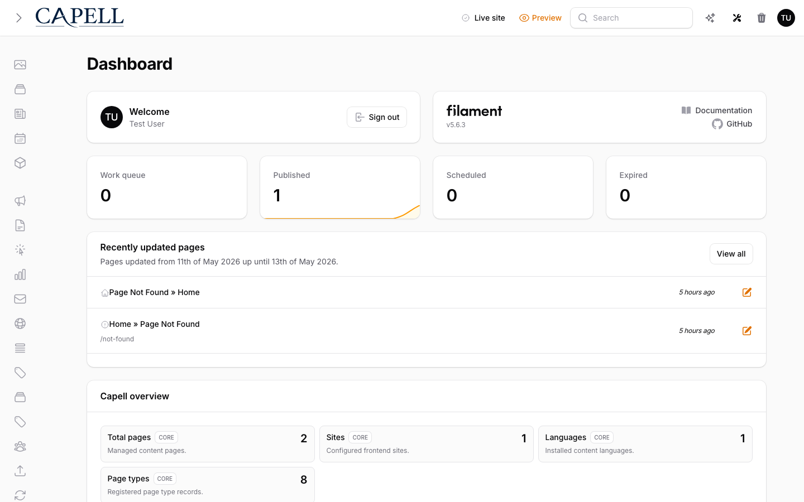

# Admin Tool Registry



> **Who is this for?**
> Package developers adding custom quick-action items to the Capell admin header toolbar.

> **TL;DR:** The `AdminToolRegistry` reads tagged tool classes from the container and renders them into the admin header dropdown. Register a tool by implementing `AdminToolItem` and tagging it with `AdminToolItem::TAG` in your service provider.

---

## When to use this

The Admin Tool Registry is for adding custom dropdown items to the admin header's tools menu (wrench icon, top-right). Use it when you want to:

- Add a quick-action button (e.g., "Flush cache", "Open dashboard")
- Contribute a custom tool alongside core actions (rebuild site, upgrade, etc.)
- Keep the tool accessible without requiring a full Filament resource or page

Contrast with **Filament resources** or **dashboard Filament widgets**, which have their own registration mechanisms and are discovery-friendly on their own.

The header navigation tree is also separate from this registry. It is a
stateful Livewire dropdown (`capell-admin::header.navigation-tree`) with its own
lazy loading, branch pagination, search, and permission checks. Do not implement
tree-style tools as `AdminToolItem` entries.

## How it's wired

1. **Container tagging:** Tools are tagged into Laravel's service container with the key `AdminToolItem::TAG` (`'capell-admin:admin-tool-items'`)
2. **Registry lookup:** The `AdminToolRegistry` singleton resolves all tagged tools via `app()->tagged(AdminToolItem::TAG)`
3. **Render hook:** `CapellAdminPlugin` injects the tools Livewire component into Filament's topbar via `PanelsRenderHook::GLOBAL_SEARCH_AFTER`
4. **Livewire component:** The `AdminTools` Livewire component calls `AdminToolRegistry::all()` to fetch tools
5. **Blade rendering:** The template iterates tools and calls `$tool->render()` to output each one

**Key files:**

- Registry: `packages/admin/src/Support/AdminTools/AdminToolRegistry.php`
- Contract: `packages/admin/src/Contracts/AdminTools/AdminToolItem.php`
- Topbar hook: `packages/admin/src/Filament/Plugin/CapellAdminPlugin.php`
- Livewire component: `packages/admin/src/Livewire/Header/AdminTools.php`
- View: `packages/admin/resources/views/livewire/header/admin-tools.blade.php` (lines 97–99 loop over tools)

## The AdminToolItem contract

```php
namespace Capell\Admin\Contracts\AdminTools;

interface AdminToolItem
{
    /** @var string */
    public const TAG = 'capell-admin:admin-tool-items';

    /**
     * Render the tool as an HTML snippet (typically a button).
     * Called from the Blade template; output is unescaped via {!! $tool->render() !!}.
     */
    public function render(): string;
}
```

Your tool class **must** implement this interface with a `render()` method that returns HTML. The output is injected directly into the dropdown, so you can include a button, link, or any other Filament component.

## Public API (AdminToolRegistry)

| Method  | Returns                   | Purpose                                   |
| ------- | ------------------------- | ----------------------------------------- |
| `all()` | `iterable<AdminToolItem>` | Fetch all tagged tools from the container |

The registry has a single public method: `all()` returns an iterable of all tools tagged with `AdminToolItem::TAG`. It is typically resolved via the service container and called from the `AdminTools` Livewire component.

## Example — registering a custom tool

### Step 1: Create your tool class

```php
<?php

declare(strict_types=1);

namespace App\Admin\Tools;

use Capell\Admin\Contracts\AdminTools\AdminToolItem;

final class FlushCacheTool implements AdminToolItem
{
    public function render(): string
    {
        return <<<'HTML'
            <button
                class="fi-dropdown-list-item fi-dropdown-list-item-color-gray flex w-full items-center gap-2 whitespace-nowrap rounded-md p-2 text-sm outline-none transition-colors duration-75 hover:bg-gray-50 focus:bg-gray-50 dark:hover:bg-white/5 dark:focus:bg-white/5"
                type="button"
                wire:click="flushApplicationCache"
            >
                {{-- Icon SVG or Filament icon component --}}
                <span>Flush Cache</span>
            </button>
        HTML;
    }

    private function flushApplicationCache(): void
    {
        // Logic here (called via Livewire if you add a public method)
    }
}
```

### Step 2: Register in your service provider

```php
<?php

declare(strict_types=1);

namespace App\Providers;

use App\Admin\Tools\FlushCacheTool;
use Capell\Admin\Contracts\AdminTools\AdminToolItem;
use Illuminate\Support\ServiceProvider;

final class AppServiceProvider extends ServiceProvider
{
    public function register(): void
    {
        // Tag the tool during registration, before admin boot
        $this->app->tag(
            [FlushCacheTool::class],
            AdminToolItem::TAG
        );
    }
}
```

### Step 3: Verify

When the admin panel loads, your tool will appear in the dropdown between the built-in actions. The `render()` method is called once per page load (in the Livewire view render lifecycle) and rendered unescaped into the dropdown.

## Gotchas

- **Register in `register()`, not `boot()`:** The admin panel boots early and resolves tagged services during its own setup. Tagging in `register()` ensures the tool is available when the container builds. If you tag in `boot()`, the tool may be missed.
- **Render must return a string:** The Blade template uses `{!! $tool->render() !!}`, so `render()` must return a complete HTML string. Fragments are fine as long as they're valid in a dropdown context.
- **Styling:** To match Capell's admin UI, use the `fi-dropdown-list-item` classes shown in the example. See `admin-tools.blade.php` for the exact class structure.
- **Interactivity:** For Livewire actions (e.g., `wire:click`), route them through the `AdminTools` Livewire component. Custom tools cannot directly define their own Livewire methods — they must delegate to the parent component or use plain JavaScript.

## Related

- [Resource registration](resource-registration.md)
- [Settings schema registry](settings-schema-registry.md)
- [Event registry](event-registry.md)
