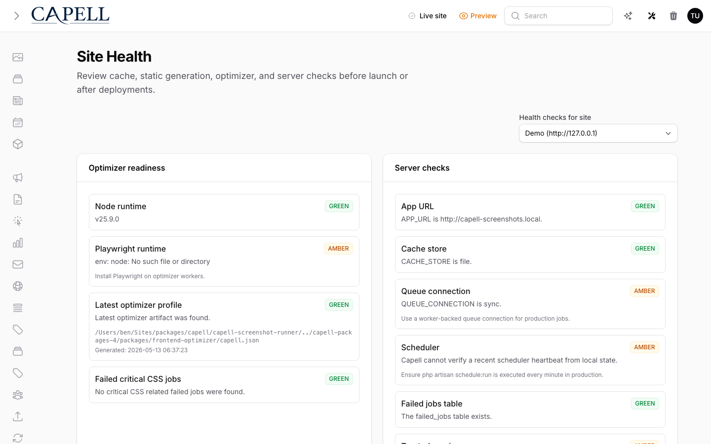

# Admin Reports



Capell Admin exposes reports as individual Filament pages registered through a report registry. Reports are navigation items under the existing `Reports` group; they are not a permissions system.

Core reports ship incrementally. Some reports still return empty-state snapshots, while Publishing Readiness now returns page-level metrics and findings. Report Actions are the right place for query work. Keep the Filament page thin: it should render filters, tables, summary metrics, and explicit remediation actions, not perform the database work itself.

## Report Catalog

Each report should answer a practical editor question first, then expose enough detail for a developer or support user to understand why an item appears. Query work belongs in the report Action or a dedicated query object. Scope queries by site and language where the data supports it, and prefer `withCount()`, `exists` subqueries, and selected columns over loading whole relationship graphs.

### Content Integrity

Use this as the "why did this page break?" report. It is for content that looks present in the admin tree but fails later in previews, publishing, exports, or frontend rendering. Typical findings are missing layouts, missing blueprints, broken canonical links, invalid media references, empty required translations, and content blocks that no longer match the component they claim to render.

Developer query shape: start from `Page::query()` with `site_id`, `layout_id`, `blueprint_id`, publish-date fields, and translation counts. Use `whereDoesntHave('layout')`, `whereDoesntHave('blueprint')`, `whereDoesntHave('translations')`, and targeted JSON checks on `meta`, `admin`, and content fields rather than decoding every page in PHP. Return severity, page id, site id, language id where applicable, and the failing field/path so the page can link straight to the fix.

### Site & Language Coverage

This is the localisation readiness report. It should tell an editor whether each site can genuinely support the languages it claims to support, not just whether a language record exists. Useful plain-English findings include "French is enabled but has no default domain" and "The About page exists in English but not in Welsh."

Developer query shape: use `Site`, `Language`, `SiteDomain`, `Page`, and page translations. Build a site-language matrix from configured site languages/domains, then compare it with page translation availability using aggregate counts. Avoid per-site loops that lazy-load pages; use grouped counts by `site_id` and `language_id`, with separate buckets for missing domains, missing homepage/default pages, and missing translations.

### URL Health

URL Health is the public routing audit. It should catch records that make visitors, crawlers, or editors land somewhere unexpected: pages without active URLs, duplicate paths inside the same site/language scope, redirects with missing targets, redirect chains, stale redirect hits, and URL rows that no longer match a valid site domain.

Developer query shape: start with `PageUrl::query()` and join or constrain through `Site`, `Language`, `SiteDomain`, and `RedirectHealthSnapshot` where available. Use grouped duplicate detection on `site_id`, `language_id`, and `url`. Use `whereDoesntHave('siteDomain')` style checks for domain coverage, and keep redirect-chain detection in a small query object so it can be tested without Filament.

### Layout & Widget Usage

This is the change-impact report for layouts and widgets. It is less about "bad data" and more about "what will break if we rename this widget, remove this slot, or change this layout?" It should show heavily used layouts, unused layouts, widget distribution, layout element usage, and whether a layout is global, default, site-specific, or theme-specific.

Developer query shape: query `Layout` with `withCount('pages')`, selected layout metadata, and the JSON columns that hold containers/elements/widgets. Parse layout container JSON after narrowing rows to the relevant site/theme scope. Keep widget counting deterministic: flatten the registered layout structure once per layout, count by widget key/class, then return totals and examples rather than every occurrence.

### Blueprint / Schema Drift

Blueprint drift is an upgrade and package-compatibility warning system. A blueprint may still exist in the database while the package, component, configurator, or schema contract it depends on has changed. The report should call out stale subject types, missing components, removed configurators, invalid schema metadata, and view/component references that no package still registers.

Developer query shape: start from `Blueprint::query()` with key, type, component, component_item, view_file, admin, and meta. Compare rows to registered Capell schemas/page types/configurators in memory after fetching the minimal blueprint dataset. Do not query package registries from Blade. The Action should classify drift as missing registration, changed component, unsupported type, or invalid schema metadata.

### Publishing Readiness

Publishing Readiness is the pre-flight checklist for launch work. It focuses editors on pages that are close to publishable but still blocked by missing page type/layout dependencies, expired publish windows, missing required translations, missing URL records, or disabled public URLs. Future publish windows are warnings rather than blockers, so scheduled pages stay visible without being counted as broken.

The current MVP lives in `BuildPublishingReadinessReportAction`. It scans `Page` records with selected columns and eager-loaded `layout`, `type`, `site`, `site.siteDomains`, `pageUrls`, and `translations`, then returns a `ReportSnapshotData` containing summary metrics and `ReportFindingData` rows. The shared report Blade view renders findings for admin users only; public frontend rendering and HTML cache output are not touched.

Current metrics:

- pages checked
- ready pages
- blocked pages with at least one critical finding
- scheduled pages with a future publish window

Current findings:

- missing page type
- missing layout
- expired publish window
- future publish window
- missing required translation
- missing URL record
- disabled or redirect-only URL where an active public URL is required

Developer query shape: keep the Action responsible for loaded data and classification. Preserve the existing translation requirement semantics: the default site language is always required, and additional languages come from the site's `admin.require_translations` only when the page type's `admin.require_translations` is enabled. Keep future additions, such as approval state or required field completeness, behind the same `ReportFindingData` contract so extension-owned report pages can reuse the rendering surface.

### Cache Freshness

Cache Freshness is for answering "is the public site serving yesterday's truth?" It should flag stale HTML or optimizer state, invalidation gaps, pages changed after their cache profile was generated, layouts whose dependants need refresh, and URLs that should be treated as volatile instead of stable.

Developer query shape: compare content timestamps (`updated_at` on pages, layouts, blueprints, relevant dependencies) with optimizer/cache profile state when the frontend optimizer package is present. Do not make optimizer tables mandatory in core admin; absence should produce an "optimizer state unavailable" bucket rather than an exception. Use layout/page dependency keys and cache surrogate keys where those are available.

### Navigation Coverage

Navigation Coverage is a discoverability report. A page can be published, translated, and URL-backed but still effectively invisible if no navigation surface links to it. This report should find live pages missing from expected navigation and the inverse problem: navigation entries that point to disabled, missing, or no-longer-public content.

Developer query shape: query published/listable `Page` rows with active `PageUrl` records, then compare them with navigation blueprints, site navigation data, or theme navigation structures that are registered for the install. Because navigation can be theme/package-owned, the core Action should delegate package-specific extraction to contributors when available and keep the final comparison keyed by page id and site id.

### Permissions & Access Surface

This is the admin exposure map. It should help a platform owner see which roles can reach which admin pages, resources, and reports, and where presentation settings do not line up with real permissions. A useful finding might be "visible in navigation but missing Shield permission" or "direct access allowed, hidden from menu by role preference."

Developer query shape: use Spatie Permission models (`Role`, `Permission`) plus registered admin pages/resources/reports. Keep the security boundary explicit: report visibility settings are presentation only. Query registered report definitions from `CapellAdmin::getReports()`, compare them with `AdminSettings::enabled_reports_by_role`, and separately list Shield permission coverage.

### Demo / Install Health

Demo / Install Health is the first-run confidence check. It should tell someone setting up Capell whether the install has the records and defaults a demo or fresh project needs: default site, language, domain, pages, layout, theme, settings rows, and package surfaces that match the selected install mode.

Developer query shape: query `Site`, `Language`, `SiteDomain`, `Page`, `Layout`, package metadata, and settings rows. Keep install checks small and independent so a missing table or optional package does not hide every other diagnostic. This report should be especially careful to use `Schema::hasTable()` before querying optional or recently added tables.

## Extension-Owned Reports

Extension reports follow the same registry contract, but their query code should live in the owning package. Core admin only stores the definition, navigation visibility, and page class.

### SEO Suite

SEO reports should translate discovery risk into editor work queues. They are not just "SEO score" panels; each finding should tell the editor what page is affected and what field, relationship, or redirect would improve search, social previews, structured data, or AI answer visibility.

Developer query shape: use the SEO package's metadata tables/config first, then join back to `Page`, `PageUrl`, `Site`, and `Language` for scope and links. Split this family into separate report keys such as `seo.schema_coverage`, `seo.metadata`, `seo.ai_discoverability`, `seo.internal_links`, and `seo.redirect_opportunities`; each query should return page-level findings and the exact metadata field or relationship that caused the flag.

### Search

Search reports should show the gap between what users ask for and what Capell can return. Zero-result searches help editors spot content vocabulary problems; stale indexes and missing indexed pages help developers spot sync or queue failures.

Developer query shape: query the search package's query log and index records, then compare indexed document ids with public `Page`/`PageUrl` candidates. Use grouped zero-result counts by normalized search term, and compare `indexed_at` with content `updated_at` for stale index detection.

### Media Library

Media reports should make the asset library maintainable at scale. They should identify orphaned assets, duplicate files, images missing alt text, files missing rights metadata, and media attached to records that no longer exist, without leaking authoring-only details into public output.

Developer query shape: start from the package's media model or Spatie media rows, then left join or constrain to owning models. Duplicate detection should group by disk, size, checksum/path where available, not just filename. Missing metadata checks should be collection-aware because decorative images and downloadable documents have different requirements.

### Forms / Public Actions

Forms and public action reports should make visitor interactions auditable after submission. They should show useful volume, failure, spam, and destination-health signals without turning the admin into a raw inbox of personal data.

Developer query shape: query submission, dispatch, spam, and destination log tables in the forms package. Keep personally identifiable data out of summary metrics unless the user opens a permitted detail view. Use status, failure_reason, destination key, and created_at ranges as the main filters.

### Comments

Comment reports should help moderators spend time where it matters. The report should separate ordinary backlog from risk patterns such as repeatedly flagged authors, comment bursts on sensitive pages, and unanswered questions on content that expects staff follow-up.

Developer query shape: query comments grouped by status, author identifier, page/content id, and moderation flags. Use aggregates for backlog counts, then fetch a small latest sample for each bucket. If author reputation lives in a separate table, join by stable author id rather than email strings.

### Newsletter / Email

Newsletter and email reports should explain why subscribers are not receiving what the site expects them to receive. The report should distinguish between provider sync failures, suppressed addresses, failed sends, stale segments, and site/language list mismatches.

Developer query shape: query email provider sync logs, subscriber state, suppression tables, send attempts, and segment membership. Use provider message ids and local subscriber ids as the join boundary. Segment freshness should compare `updated_at`/`synced_at` against the package's configured sync interval.

### Shopify / Payments

Shopify and payment reports should catch commerce drift before the public site advertises the wrong thing. Product status, pricing, variants, inventory hints, stale product pages, and failed webhooks all belong here.

Developer query shape: compare local product/page state with package sync snapshots and webhook logs. Keep external API calls out of the report request; query the latest stored sync snapshot instead. Flag stale data by product id, variant id, page id, and last successful sync time.

### Events / Bookings

Events and bookings reports should keep time-sensitive content honest. Editors should be able to spot promoted events that have already expired, registrations approaching capacity, and events missing the venue/date data users need before booking.

Developer query shape: query event records by date window, promotion flags, venue/date fields, booking counts, and registration status. Use database date predicates for upcoming/past buckets and aggregate registrations by event id. Treat missing venue and missing date as separate reasons so editors know which field to fix.

### Migration / WordPress Import

Migration reports should make import debt visible while it is still fixable. They should show which imported records need human review, which media failed reassignment, which authors/categories/taxonomies could not be mapped, and whether the batch can still be rolled back safely.

Developer query shape: query import batches, source ids, mapping tables, media transfer logs, and rollback checkpoints. Results should be grouped by batch and source type. Never infer rollback readiness from counts alone; require the package's explicit rollback state or checkpoint marker.

### Theme Packages

Theme reports should protect the contract between stored layouts and the active theme package. They should find token drift, unsupported sections, missing required slots, and layouts that still reference sections a theme no longer ships.

Developer query shape: compare active theme definitions, token presets, layout containers/elements, and theme-declared required slots. Keep theme package specifics in theme contributors. Core/admin should consume normalized findings keyed by theme key, layout id, section key, and missing/unsupported capability.

## Registering a Report

Core and extension packages register reports with `CapellAdmin::registerReport()`:

```php
use Capell\Admin\Data\Reports\ReportDefinitionData;
use Capell\Admin\Facades\CapellAdmin;

CapellAdmin::registerReport(new ReportDefinitionData(
    key: 'seo.schema_coverage',
    label: 'SEO schema coverage',
    description: 'Review pages missing structured metadata.',
    package: 'capell-app/seo-suite',
    category: 'SEO',
    pageClass: SchemaCoverageReport::class,
    defaultEnabled: true,
    navigationSort: 10,
    capabilityTags: ['seo', 'schema'],
));
```

Admin bridges can register the same definition with the registrar helper:

```php
$registrar->report(new ReportDefinitionData(
    key: 'search.zero_results',
    label: 'Zero-result searches',
    description: 'Review searches that returned no public content.',
    package: 'capell-app/search',
    category: 'Search',
    pageClass: ZeroResultSearchesReport::class,
));
```

Report keys must be stable and package-prefixed. Core uses keys such as `core.content_integrity`; extensions should use keys such as `seo.schema_coverage` or `media.orphan_media`.

## Page Contract

Report pages implement `CapellReportPage`. Most pages should extend `AbstractReportPage` or use the `HasCapellReportPage` trait so labels, navigation group, navigation sort, and role-scoped navigation visibility all come from the registry.

Keep report data work in an Action or query object. The Filament page should compose the table, filters, summaries, and explicit remediation actions only.

## Role Visibility

`AdminSettings::enabled_reports_by_role` stores navigation visibility as:

```php
[
    'editor' => [
        'core.content_integrity' => false,
    ],
]
```

Missing report keys default to the report definition's `defaultEnabled` value. This setting only hides navigation items for a role. Direct URL access remains controlled by Filament Shield permissions, policies, and the report page's own access rules.
