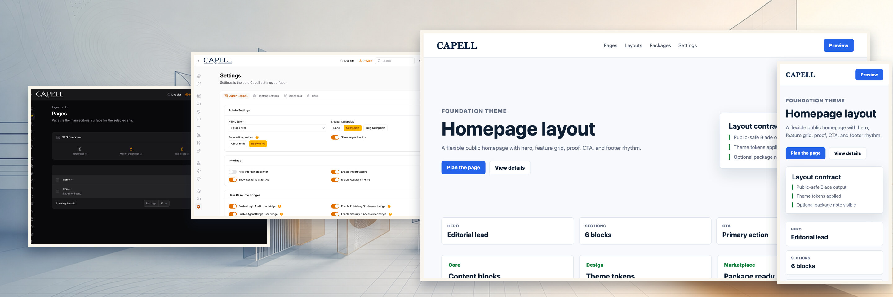

# Capell Frontend



[](https://github.com/capell-app/frontend/releases/latest)
[](https://packagist.org/packages/capell-app/frontend)
[](https://github.com/capell-app/capell/actions/workflows/test-full.yml)
[](https://github.com/capell-app/capell/actions/workflows/code-quality-and-styling.yml)
[](#requirements-and-support-policy)
[](https://packagist.org/packages/capell-app/frontend)
[](https://packagist.org/packages/capell-app/frontend)
[](https://docs.capell.app)

Capell Frontend turns the pages, sites, languages, layouts, and themes stored by Capell Core into public Laravel responses. Reach for it when your Capell install serves public pages; skip it entirely for headless setups. It ships a minimal built-in `default` theme so a fresh install renders something sensible, and it exposes the extension points that themes and frontend add-ons build on. Theme galleries and in-page editing live in separate packages.

## Package boundary

Frontend owns:

- public page routes, frontend middleware, context resolution, and page rendering actions
- Blade components, Livewire page integration, render hooks, and cache invalidation registries
- frontend asset manifests and Tailwind source aggregation
- the built-in `default` Blade theme fallback and its static views
- the frontend install, upgrade, and static HTML generation commands, plus public render performance reporting

Frontend does not own:

- editor UI, settings pages, or admin dashboards; those are Admin surfaces
- opinionated theme demos, interactive widgets, or vertical-specific templates; those belong in optional theme and widget packages
- generated static HTML cache packages; those are optional cache packages layered on top
- in-page authoring controls; those must load after page load from an authenticated admin-only beacon package

## Install

Frontend depends on `capell-app/core`. The recommended path is the installer (`composer require capell-app/installer` → `php artisan capell:install`), which adds Frontend when you select it. To add it manually to an existing Capell app:

```bash
composer require capell-app/frontend
php artisan capell:frontend-install
php artisan capell:frontend-after-install
```

For Vite development builds, both install commands accept `--dev`.

On existing apps, use:

```bash
php artisan capell:frontend-upgrade
```

Public routing depends on the host app's web server sending unmatched public page requests to Laravel. See the server configuration docs before debugging route fall-through issues.

## Quick example

To inject markup into public page output from your own package, register a render hook:

```php
use Capell\Frontend\Data\RenderHookContext;
use Capell\Frontend\Enums\RenderHookLocation;
use Capell\Frontend\Support\Render\RenderHookRegistry;

// In your package's service provider:
app(RenderHookRegistry::class)->register(
    RenderHookLocation::AfterTitle,
    function (RenderHookContext $context) {
        return view('your-package::partials.asset-badge', ['context' => $context])->render();
    },
    10,      // priority
    'asset', // scenario
);
```

## Runtime surfaces

- Provider: `Capell\Frontend\Providers\FrontendServiceProvider`
- Config: `config/capell-frontend.php`
- Routes: `routes/web.php`
- Controller: `Capell\Frontend\Http\Controllers\PageController`
- Middleware aliases: `frontend.resolve`, `frontend.etag`, `frontend.asset-optimization`, `frontend.anonymous_cacheable_render`, `frontend.rendering_strategy`, `frontend.maintenance`, `workspace.context`
- Main commands: `capell:frontend-install`, `capell:frontend-after-install`, `capell:frontend-upgrade`, `capell:generate-html`
- Main extension registries: `RenderHookRegistry`, `FrontendResourceRegistry`, `CacheInvalidationRegistry`, `ReservedFrontendPathRegistry`, `FrontendRouteMiddlewareRegistry`, `FrontendComponentRegistry`, `FrontendRuleConditionRegistry`, `FrontendResponseRendererRegistry`, `TailwindAssetsRegistry`

The package always registers `index.php` and a fallback page route. `/` is only registered when `CAPELL_FRONTEND_REGISTER_HOME_ROUTE=true`. Reserved paths stop internal or package-owned routes falling through to public theme rendering.

## Public output safety

Public frontend responses must not expose admin or editor implementation details. Blade views, cached HTML, theme output, and public assets should not include authoring JavaScript, editable markers, model IDs, field paths, package names, signed editor URLs, or permission hints.

Frontend authoring is a post-load admin feature. The public page loads as ordinary HTML; only an authenticated admin beacon response may add edit controls.

When you change public rendering, cache behaviour, themes, or beacon integration, keep or add tests that prove anonymous and non-admin responses contain no authoring surface.

Editor-authored rich text must cross a `SafeHtml` boundary before Blade renders it. Build the value with `SafeHtml::sanitize($html, $sanitizer)` (or use `RenderHtmlContentAction`) and output it with normal escaped Blade braces: `{{ $safeHtml }}`. The constructor is private, so an arbitrary string cannot be mislabelled as safe HTML.

## Data and cache behaviour

Frontend reads Core records and owns frontend settings. Its main persistence impact is settings state; generated page cache files belong to the optional cache and static packages.

The `capell:generate-html` command writes static artifact metadata to `storage/framework/capell-static-artifacts` by default. Set `CAPELL_FRONTEND_STATIC_ARTIFACTS_PATH` when a deployment needs those artifacts written to a separate writable directory.

Cache invalidation is model-event aware and can run through queues, depending on package configuration. If async invalidation is enabled, a queue worker must be running.

Tailwind source and import generation depends on installed packages declaring their frontend sources. Missing package sources usually show up as incomplete generated CSS, not as PHP exceptions.

## Verification

Frontend tests run from a checkout of the Capell monorepo, which supplies the Pest bootstrap and development dependencies this package needs. From the monorepo root, run the package tests after changing frontend routing, render actions, cache invalidation, or public safety checks:

```bash
vendor/bin/pest tests
```

For public output changes, include the safety-focused tests:

```bash
vendor/bin/pest tests/Feature/StaticBladeRenderingTest.php tests/Feature/MediaComponentMetadataTest.php
```

## Requirements and support policy

| Surface  | Supported versions               |
| -------- | -------------------------------- |
| PHP      | `^8.4`                           |
| Laravel  | `^12.41.1` or `^13.0`            |
| Livewire | `^3.0` or `^4.0`                 |
| Core     | The same release as this package |

Each Capell 1.x minor receives security fixes for 24 months from its release date, and the latest 1.x minor is always supported. Upgrade all installed Capell foundation packages together to the same supported release before requesting a fix. See the [Capell security policy](https://github.com/capell-app/capell/security/policy) for vulnerability reporting.

Support covers the dependency ranges above. When an upstream release reaches its own end of life earlier, upgrading that dependency may be required to receive a safe fix.

## Troubleshooting

- A Capell route catching admin or package URLs usually means the frontend route regex or reserved path registry needs checking.
- Debug published pages returning 404 through site, domain, language, page URL, and layout resolution before changing theme code.
- Stale public output usually means cache invalidation did not run, the queue worker is stopped, or the optional cache package has stale artifacts.
- Missing Tailwind styles usually mean a package did not register its source or import path, or frontend assets were not regenerated.
- If `/` does not resolve, check `CAPELL_FRONTEND_REGISTER_HOME_ROUTE`; the package does not register the home route by default.

## Development

Package development and coordinated verification happen in the [capell-app/capell monorepo](https://github.com/capell-app/capell). Split package repositories are release mirrors; use [docs.capell.app](https://docs.capell.app) for cross-package guidance. See the [contribution guide](https://github.com/capell-app/capell/blob/main/CONTRIBUTING.md), [security policy](https://github.com/capell-app/capell/security/policy), and [licence](https://github.com/capell-app/capell/blob/main/LICENSE.md).

## Further reading

| Page                                               | Covers                                                |
| -------------------------------------------------- | ----------------------------------------------------- |
| [Frontend overview](docs/overview.md)              | Frontend responsibilities and the package docs index. |
| [Page and site loading](docs/page-site-loading.md) | Site, page, language, theme, and layout resolution.   |
| [Security](docs/security.md)                       | Package-specific public rendering safety notes.       |
| [Server configuration](docs/server-config.md)      | Static-cache fallback and web server routing rules.   |
| [Tailwind assets](docs/tailwind-assets.md)         | Package Tailwind source and import registration.      |
| [Render hooks](docs/extending-render-hooks.md)     | Public render hook registration.                      |
| [Testing frontend](docs/testing-frontend.md)       | Frontend package test patterns.                       |

The complete frontend and public-output safety guides are published at [docs.capell.app](https://docs.capell.app).
